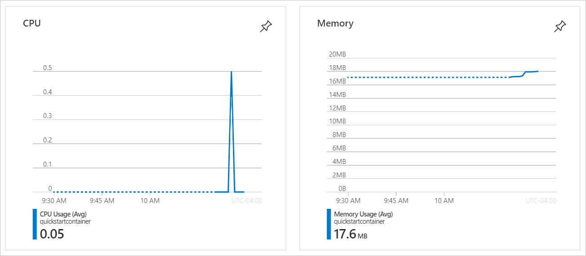
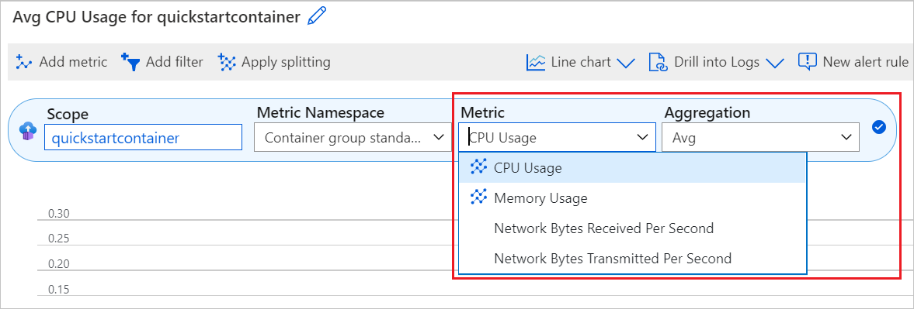

# Monitoring Azure Container Instances

When you have critical applications and business processes relying on Azure resources, you want to monitor those resources for their availability, performance, and operation.

This article describes the monitoring data generated by Azure Container Instances. Azure Container Instances includes built-in support for [Azure Monitor](/azure/azure-monitor/overview). If you are unfamiliar with the features of Azure Monitor common to all Azure services that use it, read [Monitoring Azure resources with Azure Monitor](/azure/azure-monitor/essentials/monitor-azure-resource).

## Monitoring overview page in Azure portal

The **Overview** page in the Azure portal for each container instance includes a brief view of resource usage and telemetry.

  

## Monitoring data

Azure Container Instances collects the same kinds of monitoring data as other Azure resources that are described in [Monitoring data from Azure resources](/azure/azure-monitor/essentials/monitor-azure-resource#monitoring-data-from-Azure-resources).

See [Monitoring *Azure Container Instances* data reference](monitor-azure-container-instances-reference.md) for detailed information on the metrics and logs metrics created by Azure Container Instances.

## Collection and routing

Platform metrics and the Activity log are collected and stored automatically, but can be routed to other locations by using a diagnostic setting.  

Resource Logs aren't collected and stored until you create a diagnostic setting and route them to one or more locations.

See [Create diagnostic setting to collect platform logs and metrics in Azure](/azure/azure-monitor/platform/diagnostic-settings) for the detailed process for creating a diagnostic setting using the Azure portal, CLI, or PowerShell. When you create a diagnostic setting, you specify which categories of logs to collect.

The metrics and logs you can collect are discussed in the following sections.

## Analyzing metrics

You can analyze metrics for *Azure Container Instances* with metrics from other Azure services using metrics explorer by opening **Metrics** from the **Azure Monitor** menu. See [Getting started with Azure Metrics Explorer](/azure/azure-monitor/essentials/metrics-getting-started) for details on using this tool.

For a list of the platform metrics collected for Azure Container Instances, see [Monitoring Azure Container Instances data reference metrics](monitor-azure-container-instances-reference.md#metrics).

All metrics for Azure Container Instances are in the namespace **Container group standard metrics**. In a container group with multiple containers, you can additionally filter on the [dimension](monitor-azure-container-instances-reference.md#metric-dimensions) **containerName** to acquire metrics from a specific container within the group.

For reference, you can see a list of [all resource metrics supported in Azure Monitor](/azure/azure-monitor/essentials/metrics-supported).

### View operation level metrics for Azure Container Instances

1. Sign in to the [Azure portal](https://portal.azure.com/).

1. Select **Monitor** from the left-hand navigation bar, and select **Metrics**.

  

1. On the **Select a scope** page, choose your **subscription** and **resource group**. Under **Refine scope**, choose **Container instances** for **Resource type**. Pick one of your container instances from the list and select **Apply**.

  

1. Next, you can pick a metric to view from the list of available metrics. Here, we choose **CPU Usage** and use **Avg** as the aggregation value.

  

### Add filters to metrics

In a scenario where you have a container group with multiple containers, you may find it useful to apply a filter on the metric dimension **containerName**. This will allow you to view metrics by container as opposed to an aggregate of the group as a whole.

  

## Analyzing logs

Data in Azure Monitor Logs is stored in tables where each table has its own set of unique properties.  

All resource logs in Azure Monitor have the same fields followed by service-specific fields. The common schema is outlined in [Azure Monitor resource log schema](/azure/azure-monitor/essentials/resource-logs-schema) The schema for Azure Container Instances resource logs is found in the [Azure Container Instances Data Reference](monitor-azure-container-instances-reference.md#schemas).

The [Activity log](/azure/azure-monitor/essentials/activity-log) is a type of platform log in Azure that provides insight into subscription-level events. You can view it independently or route it to Azure Monitor Logs, where you can do much more complex queries using Log Analytics. You can see a list of the kinds of operations that will be logged in the [Azure Container Instances Data Reference](monitor-azure-container-instances-reference.md#activity-log)

### Sample Kusto queries

Azure Monitor logs includes an extensive [query language][query_lang] for pulling information from potentially thousands of lines of log output.

The basic structure of a query is the source table (in this article, `ContainerInstanceLog_CL` or `ContainerEvent_CL`) followed by a series of operators separated by the pipe character (`|`). You can chain several operators to refine the results and perform advanced functions.

To see example query results, paste the following query into the query text box, and select the **Run** button to execute the query. This query displays all log entries whose "Message" field contains the word "warn":

```query
ContainerInstanceLog_CL
| where Message contains "warn"
```

More complex queries are also supported. For example, this query displays only those log entries for the "mycontainergroup001" container group generated within the last hour:

```query
ContainerInstanceLog_CL
| where (ContainerGroup_s == "mycontainergroup001")
| where (TimeGenerated > ago(1h))
```

> [!IMPORTANT]
> When you select **Logs** from the Azure Container Instances menu, Log Analytics is opened with the query scope set to the current Azure Container Instances. This means that log queries will only include data from that resource. If you want to run a query that includes data from other resources or data from other Azure services, select **Logs** from the **Azure Monitor** menu. See [Log query scope and time range in Azure Monitor Log Analytics](/azure/azure-monitor/logs/scope) for details.

For a list of common queries for Azure Container Instances, see the [Log Analytics queries interface](/azure/azure-monitor/logs/queries).

## Alerts

<!-- SUGGESTED: Include useful alerts on metrics, logs, log conditions or activity log. Ask your PMs if you don't know. 
This information is the BIGGEST request we get in Azure Monitor so do not avoid it long term. People don't know what to monitor for best results. Be prescriptive. You can delete this section and point to an article that discusses common alerts in detail.   
-->
Azure Monitor alerts proactively notify you when important conditions are found in your monitoring data. They allow you to identify and address issues in your system before your customers notice them. You can set alerts on [metrics](/azure/azure-monitor/alerts/alerts-metric-overview), [logs](/azure/azure-monitor/alerts/alerts-unified-log), and the [activity log](/azure/azure-monitor/alerts/activity-log-alerts). Different types of alerts have benefits and drawbacks.

The following table lists common and recommended alert rules for Azure Container Instances.

<!-- Fill in the table with metric and log alerts that would be valuable for your service. Change the format as necessary to make it more readable -->
| Alert type | Condition | Description  |
|:---|:---|:---|
| | | |
| | | |

## Next steps

- See [Monitoring Azure Container Instances data reference](monitor-azure-container-instances-reference.md) for a reference of the metrics, logs, and other important values created by Azure Container Instances.

- See [Monitoring Azure resources with Azure Monitor](/azure/azure-monitor/essentials/monitor-azure-resource) for details on monitoring Azure resources.
