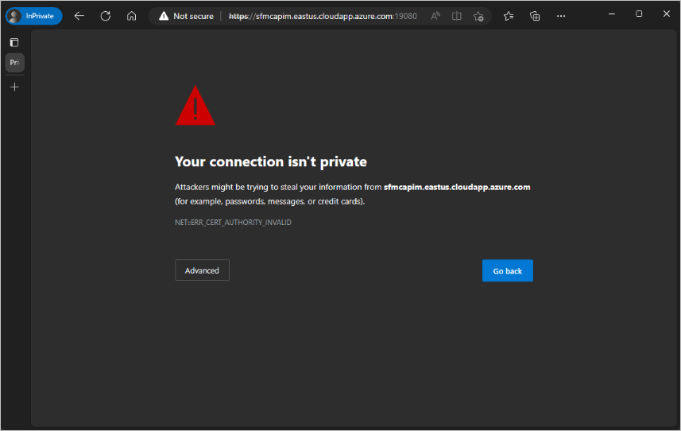

# Connect to a Service Fabric managed cluster

Once you have deployed a cluster via [Portal, Azure Resource Managed template](quickstart-managed-cluster-template.md), or [PowerShell](tutorial-managed-cluster-deploy.md) there are various ways to connect to and view your managed cluster. 

Connecting to a Service Fabric Explorer (SFX) endpoint on a managed cluster will result in a certificate error 'NET::ERR_CERT_AUTHORITY_INVALID' regardless of certificate being used or cluster configuration. This is because the cluster nodes are using the managed 'cluster' certificate when binding FabricGateway (19000) and FabricHttpGateway (19080) TCP ports and is by design.



## Use the Azure portal

To navigate to your managed cluster resource:

 1. Go to https://portal.azure.com/

 2. Navigate to your cluster resource by searching for Service Fabric and selecting "Service Fabric managed clusters"

 3. Select your cluster

 4. In this experience you can view and modify certain parameters. For more information see the [cluster configuration options](how-to-managed-cluster-configuration.md) available.

## Use Service Fabric Explorer

[Service Fabric Explorer](https://github.com/Microsoft/service-fabric-explorer) (SFX) is an application for inspecting and managing application and cluster health of a Microsoft Azure Service Fabric cluster. 

To navigate to SFX for your managed cluster:
 
 1. Sign in to the [Azure portal](https://portal.azure.com/).
 
 2. Navigate to your cluster resource by searching for Service Fabric and selecting "Service Fabric managed clusters".

 3. Select your cluster.

 4. Locate the `SF Explorer` located in the upper right, example: `https://mycluster.region.cloudapp.azure.com:19080/Explorer`.

## Use PowerShell Modules

The following PowerShell Modules are available to connect, view, and modify configurations for your cluster. 

* Install the [Service Fabric SDK and PowerShell module](service-fabric-get-started.md).

* Install [Azure PowerShell 4.7.0](/powershell/azure/release-notes-azureps#azservicefabric) (or later).

### Using the Service Fabric PowerShell Module
To use this module you'll need the cluster certificate thumbprint. You can find this value in the cluster properties output of your resource deployment or by querying the cluster properties on an existing resource.

The following command can be used to query your cluster resource for the cluster certificate thumbprint.

```powershell
$serverThumbprint = (Get-AzResource -ResourceId /subscriptions/00000000-0000-0000-0000-000000000000/resourceGroups/myResourceGroup/providers/Microsoft.ServiceFabric/managedclusters/mysfcluster).Properties.clusterCertificateThumbprints
```

With the cluster certificate thumbprint, you're ready to connect to your cluster.

```powershell
$connectionEndpoint = "mysfcluster.eastus2.cloudapp.azure.com:19000"
Connect-ServiceFabricCluster -ConnectionEndpoint $connectionEndpoint -KeepAliveIntervalInSec 10 `
      -X509Credential `
      -ServerCertThumbprint $serverThumbprint  `
      -FindType FindByThumbprint `
      -FindValue $clientThumbprint `
      -StoreLocation CurrentUser `
      -StoreName My

```

### Using the Azure Service Fabric PowerShell Module

Azure Service Fabric Module enables you to do operations like creating a managed cluster, scaling a node type, and viewing managed cluster resource information. The specific cmdlets supported for managed clusters are named `AzServiceFabricManagedCluster*` that you can reference on the [Az.ServiceFabric PowerShell Module](/powershell/module/az.servicefabric/) documentation.


The following example uses one of the cmdlets to view the details of a managed cluster.

```powershell
$rgName = "testResourceGroup"
$clusterName = "mycluster"
Get-AzServiceFabricManagedCluster -ResourceGroupName $rgName -Name $clusterName
```

## Next steps

* [Deploy an application to a managed cluster using Azure Resource Manager](how-to-managed-cluster-app-deployment-template.md)
* [Configure managed cluster options](how-to-managed-cluster-configuration.md)
