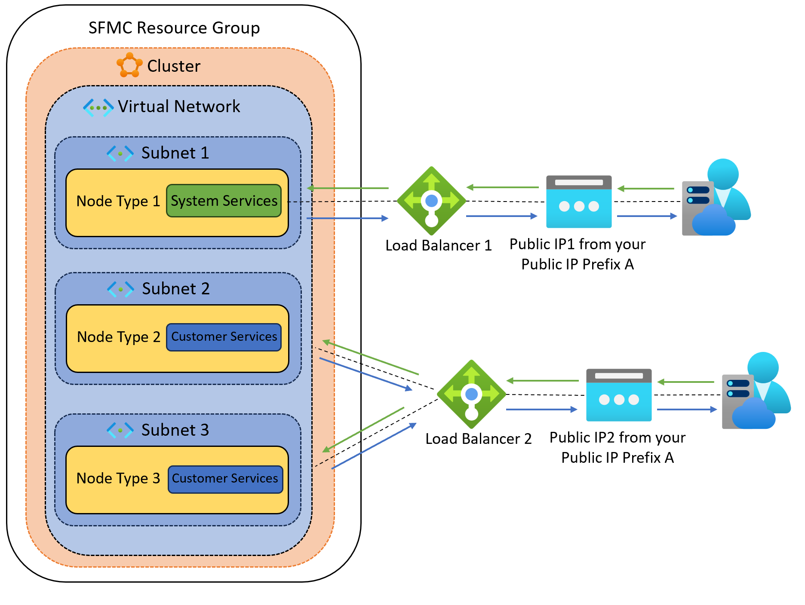

# Public IP address prefix

Public IP Prefix allows you to reserve a range of [public IP addresses](public-ip-addresses.md#public-ip-addresses) for your public endpoints in Azure. Public IP prefixes are assigned from a pool of addresses in each Azure region. You create a public IP address prefix in an Azure region and subscription by specifying a name and prefix size, which is the number of addresses available for use. For example, if you would like to configure VM Scale Sets, application gateways, or load balancers to be public facing, you need public IP addresses for them. A public IP prefix enables you to use one prefix to manage all IP addresses effectively.
Today, the public IP address prefix in Service Fabric managed cluster only supports IPv4 addresses  1 . In regions with Availability Zones, Public IP address prefixes can be created as zone-redundant or associated with a specific availability zone. If public IP prefix is created as zone-redundant, the IPs in the prefix are chosen from the pool that is replicated across SLB servers in all zones.

Here are some of the benefits of using a Public IP Prefix for your managed cluster:

- Improved fleet management: If you manage a fleet of Service Fabric managed clusters, associating each cluster with a public IP from the same prefix can simplify the management of the entire fleet and reduce management overhead. For example, you can add an entire prefix with a single firewall rule that will add all IP addresses of the prefix associated with the SF managed clusters to an allowlist in the firewall.

- Enhanced control and security: By associating a public IP from a prefix to Service Fabric managed cluster, you can simplify the control and security of your cluster's public IP address space. Since the cluster will always be assigned a public IP from the static reserved range of IPs within the IP prefix, you can easily assign network access control lists (ACLs) and other network rules specific to that range. This simplifies your control allowing you to easily manage which resources can access the cluster and vice versa.

- Effective resource management: A Public IP prefix enables you to use one prefix to manage all your public endpoints with predictable, contiguous IP range that doesn’t change as you scale. You can see which IP addresses are allocated and available within the prefix range. 

As seen in the diagram below, a service fabric managed cluster with three node types having their own subnets has all their inbound and outbound traffic routed through the two load balancers. If external services would like to communicate with SFMC cluster, they would use the public IP addresses (allocated from public IP prefix, let’s say A) associated with the front end of the load balancers.

## Prefix sizes

The following public IP prefix sizes are available:

-  /28 (IPv4) = 16 addresses

-  /29 (IPv4) = 8 addresses

-  /30 (IPv4) = 4 addresses

-  /31 (IPv4) = 2 addresses

Prefix size is specified as a Classless Inter-Domain Routing (CIDR) mask size.

There are no limits as to how many prefixes created in a subscription. The number of ranges created can't exceed more static public IP addresses than allowed in your subscription. For more information, see [Azure limits](../../azure-resource-manager/management/azure-subscription-service-limits.md?toc=%2fazure%2fvirtual-network%2ftoc.json#azure-resource-manager-virtual-networking-limits).
