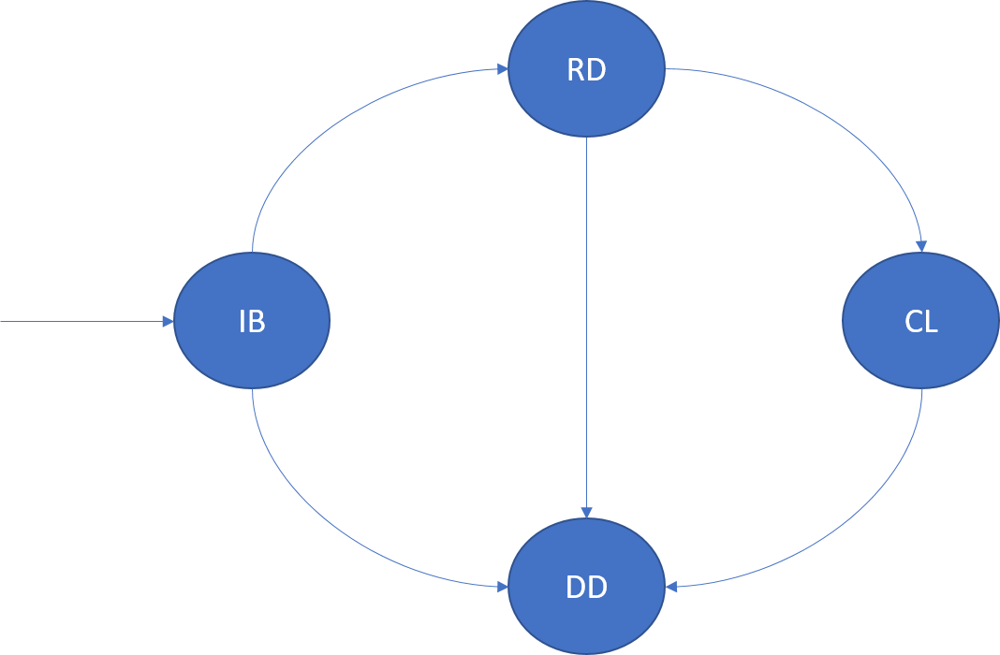
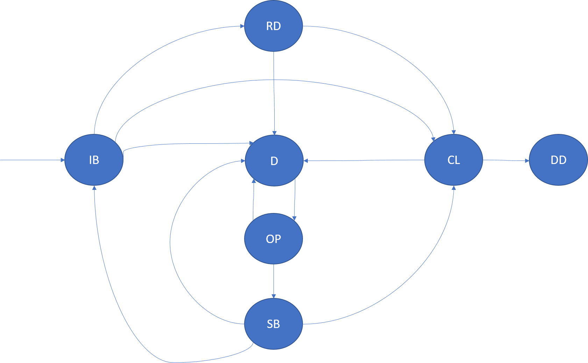
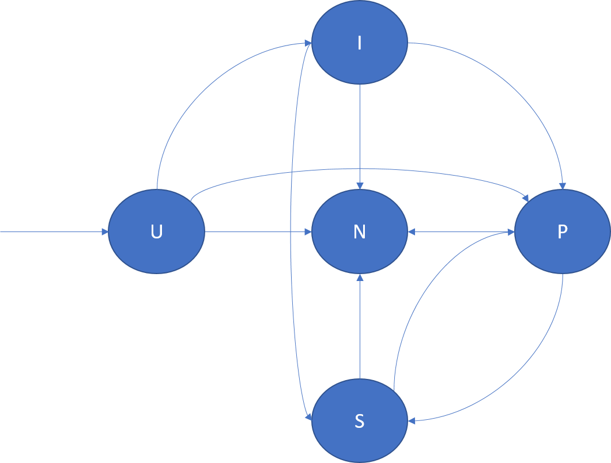

This article describes concepts around replicas of stateful services or instances of stateless services.

# Instances of Stateless Services
An instance of a stateless service is a copy of the service logic running on one of the nodes of the cluster. An instance within a partition is uniquely identified by its InstanceId. The lifecycle of an instance can be modeled by the following diagram:

## InBuild (IB)
Once the Cluster Resource Manager determines a placement for the instance, it enters this lifecycle state. At this time, the instance will be started on the node (the application host started, the instance created and then opened). After the startup is complete the instance transitions to the ready state. 

If the application host or node for this instance crashes, it transitions to the dropped state.

## Ready (RD)
In the ready state, the instance is up and running on the node. If this is a reliable service, RunAsync has been invoked. 

If the application host or node for this instance crashes, it transitions to the dropped state.

## Closing (CL)
In the closing state, service fabric is in the process of shutting down the instance on this node. This could be due to many reasons - for example, application upgrade, load balancing, or the service being deleted. Once shutdown completes, it transitions to the dropped state.

## Dropped (DD)
In the dropped state the instance is no longer running on the node. At this point, service fabric is maintaining metadata about this instance (which will be deleted lazily).

> [!NOTE]
> It is possible to transition from any state to the dropped state by using the ForceRemove option on `Remove-ServiceFabricReplica`
>

# Replicas of Stateful Services
A replica of a stateful service is a copy of the service logic running on one of the nodes of the cluster. In addition, the replica maintains a copy of the state of that service. There are two related concepts that describe the lifecycle and behavior of stateful replicas:
- Replica Lifecycle
- Replica Role

The following discussion describes persisted stateful services. For volatile (or in-memory) stateful services the down and dropped states are equivalent.

## InBuild (IB)
An InBuild replica is a replica that is being created or prepared for joining the replica set. Depending on the replica role, the IB has different semantics. 

If the application host or the node for an InBuild replica crashes it transitions to the down state.

###Primary InBuild replicas 
Primary InBuild are the first replicas for a partition. This usually happens when the partition is being created. Primary InBuild replicas also arise when all the replicas of a partition restart or are dropped.

###IdleSecondary InBuild replicas
These are either new replicas that are being created by the Cluster Resource Manager. They can also be existing replicas that went down and need to be added back into the set. These replicas are seeded or built by the primary before they can join the replica set as ActiveSecondary and participate in quorum acknowledgement of operations.

###ActiveSecondary InBuild replicas
This state may be observed in some queries. It is an optimization where the replica set is not changing but a replica needs to be built. The replica itself follows the normal state machine transitions (as described in the section on replica roles).

## Ready (RD)
A Ready replica is a replica that is participating in replication and quorum acknowledgement of operations. The ready state is applicable to primary and active secondary replicas.

If the application host or the node for a ready replica crashes it transitions to the down state.

## Closing (CL)
A replica enters the closing state in the following scenarios:

### Shutting down the code for the replica
Service fabric may need to shut down the running code for a replica. This could be for many reasons, e.g.,  application, fabric, or infrastructure upgrade or due to a fault reported by the replica etc. When the replica close completes the replica transitions to the down state. The persisted state associated with this replica that is stored on disk is not cleaned up.

### Removing the replica from the cluster
Service fabric may need to remove the persisted state and shut down the running code for a replica. This could be for many reasons, e.g.,  load balancing
- Shutting down the running code for the replica. After this, the replica will transition to the down state.
- Removing the persisted state and then closing the running code for the replica. After this, the replica will transition to the dropped state.

## Dropped (DD)
In the dropped state the instance is no longer running on the node. There is also no state left on the node. At this point, service fabric is maintaining metadata about this instance (which will eventually be deleted as well).

## Down (D)
In the down state, the replica code is not running but persisted state for that replica exists on that node. A replica can be down for many reasons, for example, the node being down, crashes in the replica code, application upgrade, replica faults etc.

A down replica is opened by service fabric as required, for instance when the upgrade is complete on the node etc.

The replica role is not relevant in the down state.

## Opening (OP)
A down replica enters the opening state when service fabric needs to bring the replica back up again. For example, this could be after a code upgrade for the application completes on a node etc. 

If the application host or the node for an opening replica crashes it transitions to the down state.

The replica role is not relevant in the opening state.

## StandBy (SB)
A StandBy replica is a replica of a persisted service that went down and was then opened. This replica could be used by service fabric if it needs to add another replica to the replica set (as it already has some portion of the state and the build process is faster). After the StandByReplicaKeepDuration expires the standby replica is discarded.

If the application host or the node for a standby replica crashes it transitions to the down state.

The replica role is not relevant in the standby state.

> [!NOTE]
> Any replica that is not down or dropped is considered to be *up*
>

> [!NOTE]
> It is possible to transition from any state to the dropped state by using the ForceRemove option on `Remove-ServiceFabricReplica`
>

# Replica Role 
The role of the replica determines its function in the replica set.

- **Primary (P)**: There is one primary in the replica set which is responsible for performing read and write operations. 
- **ActiveSecondary (S)**: These are replicas that receive state updates from the primary, apply them and send back acknowledgements. There are multiple active secondaries in the replica set and the number of these determines the number of faults the service can handle.
- **IdleSecondary (I)**: These replicas are being built by the primary that is, they are receiving state from the primary before they can be promoted to active secondary. 
- **None (N)**: These replicas do not have a responsibility in the replica set.
- **Unknown (U)**: This is the initial role of a replica before it receives any ChangeRole api call from service fabric.

The following section describes replica role transitions and some example scenarios in which they may occur:

- U -> P: Creation of a new primary replica
- U -> I: Creation of a new idle replica
- U -> N: Deletion of a standby replica
- I -> S: Promotion of idle secondary to active secondary so that its acknowledgements contribute towards quorum.
- I -> P: Promotion of idle secondary to primary. This can happen under special reconfigurations when the idle secondary is the correct candidate to be primary.
- I -> N: Deletion of idle secondary replica.
- S -> P: Promotion of active secondary to primary. This can be due to failover of the primary or a primary movement initiated by the cluster resource manager in response to application upgrade or load balancing etc.
- S -> N: Deletion of active secondary replica.
- P -> S: Demotion of primary replica. This can be due to a primary movement initiated by the cluster resource manager in response to application upgrade or load balancing etc.
- P -> N: Deletion of primary replica

> [!NOTE]
> Higher-level programming models such as [Reliable Actors](service-fabric-reliable-actors-introduction.md) and [Reliable Services](service-fabric-reliable-services-introduction.md) hide the concept of replica role from the developer. In Actors, the notion of role is unnecessary, while in Services it is largely simplified for most scenarios.
>

## Next steps
For more information on Service Fabric concepts, see the following articles:

- [Reliable Services lifecycle - C#](service-fabric-reliable-services-lifecycle.md)
