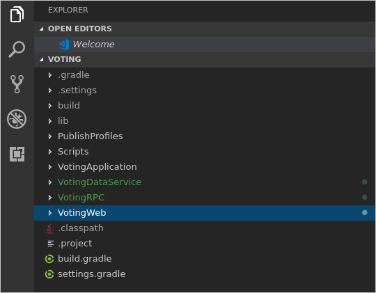
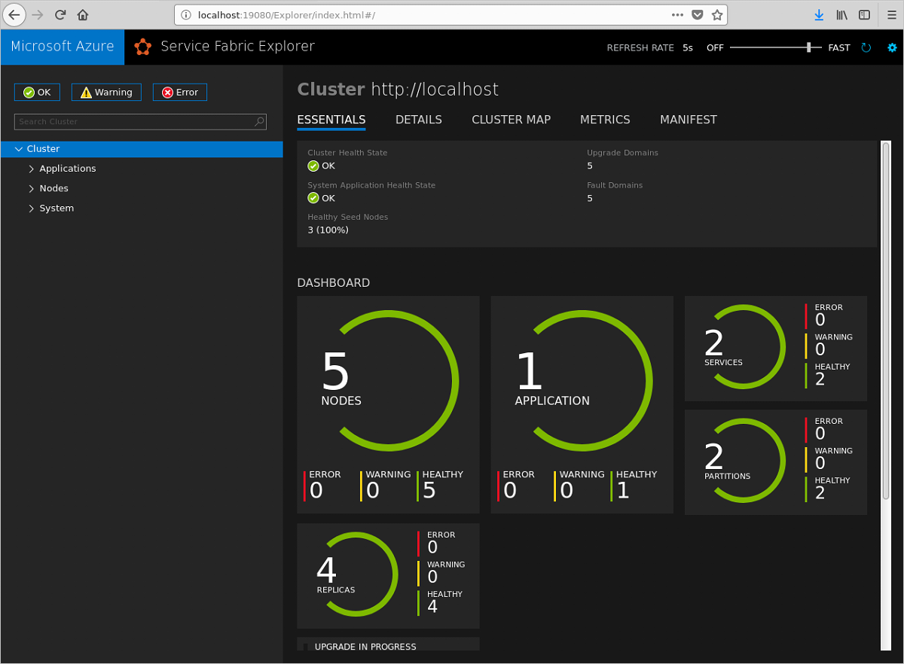
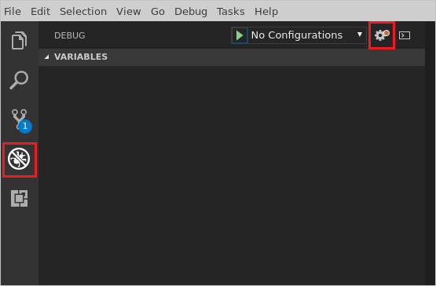
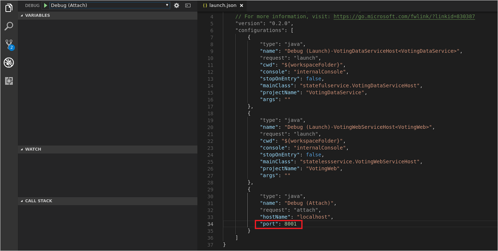
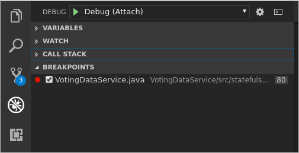
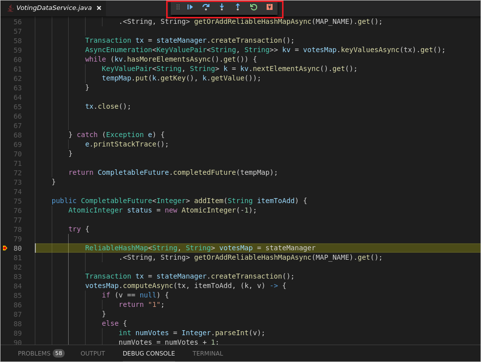

# Develop Java Service Fabric applications with Visual Studio Code

The [Service Fabric Reliable Services extension for VS Code](https://marketplace.visualstudio.com/items?itemName=ms-azuretools.vscode-service-fabric-reliable-services) makes it easy to build Java Service Fabric applications on Windows, Linux, and macOS operating systems.

This article shows you how to build, deploy, and debug a Java Service Fabric application using Visual Studio Code.

> [!IMPORTANT]
> Service Fabric Java applications can be developed on Windows machines, but can be deployed onto Azure Linux clusters only. Debugging Java applications is not supported on Windows.

## Prerequisites

This article assumes that you have already installed VS Code, the Service Fabric Reliable Services extension for VS Code, and any dependencies required for your development environment. To learn more, see [Getting Started](./service-fabric-get-started-vs-code.md#prerequisites).

## Download the sample
This article uses the Voting application in the [Service Fabric Java application quickstart sample GitHub repository](https://github.com/Azure-Samples/service-fabric-java-quickstart). 

To clone the repository to your development machine, run the following command from a terminal window (command window on Windows):

```sh
git clone https://github.com/Azure-Samples/service-fabric-java-quickstart.git
```

## Open the application in VS Code

Open VS Code.  Click the Explorer icon in the **Activity Bar** and click **Open Folder**, or click  **File -> Open Folder**. Navigate to the *./service-fabric-java-quickstart/Voting* directory in the folder where you cloned the repository then click **OK**. The workspace should contain the same files shown in the screenshot below.



## Build the application

1. Press (Ctrl + Shift + p) to open the **Command Palette** in VS Code.
2. Search for and select the **Service Fabric: Build Application** command. The build output is sent to the integrated terminal.

   

## Deploy the application to the local cluster
After you have built the application, you can deploy it to the local cluster. 

> [!IMPORTANT]
> Deploying Java applications to the local cluster is not supported on Windows machines.

1. From the **Command Palette**, select the **Service Fabric: Deploy Application (Localhost) command**. The output of the install process is sent to the integrated terminal.

   

4. When the deployment is complete, launch a browser and open Service Fabric Explorer: http://localhost:19080/Explorer. You should see that the application is running. This may take some time, so be patient. 

   

4. After you've verified that the application is running, launch a browser and open this page: http://localhost:8080. This is the web front-end of the application. You can add items and click on them to vote.

   

5. To remove the application from the cluster, select the **Service Fabric: Remove Application** command from the **Command Palette**. The output of the uninstall process is sent to the integrated terminal. You can use Service Fabric Explorer to verify that the application has been removed from the local cluster.

## Debug the application
When debugging applications in VS Code, the application must be running on a local cluster. Breakpoints can then be added to the code.

> [!IMPORTANT]
> Debugging Java applications is not supported on Windows machines.

To prepare the VotingDataService and the Voting application for debugging, complete the following steps:

1. Update the *Voting/VotingApplication/VotingDataServicePkg/Code/entryPoint.sh* file.
Comment out the command on line 6 (use '#') and add the following command to the bottom of the file:

   ```
   java -Xdebug -Xrunjdwp:transport=dt_socket,address=8001,server=y,suspend=n -Djava.library.path=$LD_LIBRARY_PATH -jar VotingDataService.jar
   ```

2. Update the *Voting/VotingApplication/ApplicationManifest.xml* file. Set the **MinReplicaSetSize** and the **TargetReplicaSetSize** attributes to "1" in the **StatefulService** element:
   
   ```xml
         <StatefulService MinReplicaSetSize="1" ServiceTypeName="VotingDataServiceType" TargetReplicaSetSize="1">
   ```

3. Click the Debug icon in the **Activity Bar** to open the debugger view in VS Code. Click the gear icon at the top of the debugger view and select **Java** from the dropdown environment menu. The launch.json file opens. 

   

3. In the launch.json file, set the port value in the configuration named **Debug (Attach)** to **8001**. Save the file.

   

4. Deploy the application to the local cluster by using the **Service Fabric: Deploy Application (Localhost)** command. Verify that the application is running in Service Fabric Explorer. Your application is now ready to be debugged.

To set a breakpoint, complete the following steps:

1. In Explorer, open the */Voting/VotingDataService/src/statefulservice/VotingDataService.java* file. Set a breakpoint on first line of code in the `try` block in the `addItem` method (line 80).
   
   

   > [!IMPORTANT]
   > Make sure you set breakpoints on executable lines of code. For example breakpoints set on method declarations, `try` statements, or `catch` statements will be missed by the debugger.
2. To begin debugging, click the Debug icon in the **Activity Bar**, select the **Debug (Attach)** configuration from the debug menu, and click the run button (green arrow).

   

3. In a web browser, go to http://localhost:8080. Type a new item in the text box and click **+ Add**. Your breakpoint should be hit. You can use the Debug toolbar at the top of VS Code to continue execution, step over lines, step into methods, or step out of the current method. 
   
   
       
4. To end the debugging session, click the plug icon on the Debug toolbar at the top of VS Code.
   
   
       
5. When you've finished debugging, you can use the **Service Fabric: Remove Application** command to remove the Voting application from your local cluster. 

