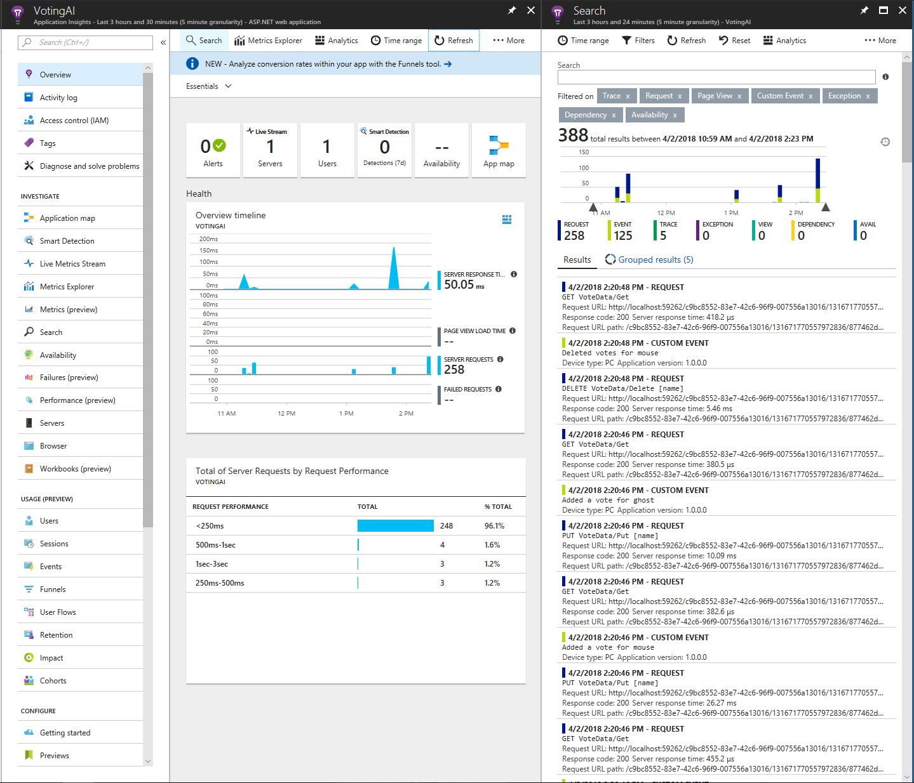
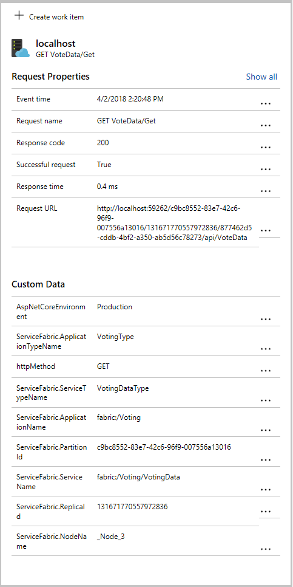
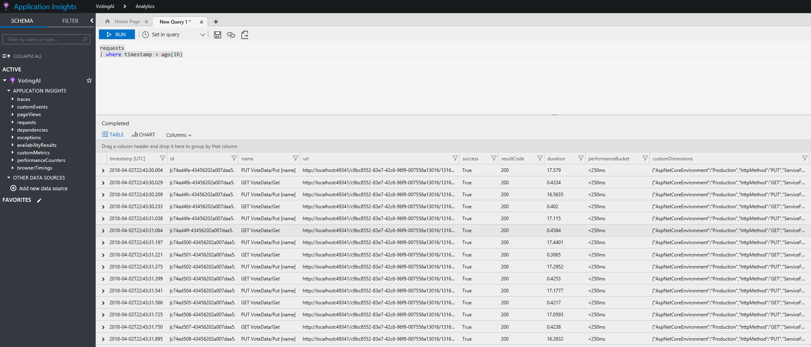

# Event analysis and visualization with Application Insights

Part of Azure Monitor, Application Insights is an extensible platform for application monitoring and diagnostics. It includes a powerful analytics and querying tool, customizable dashboard and visualizations, and further options including automated alerting. Application Insights's integration with Service Fabric includes tooling experiences for Visual Studio and Azure portal, as well as Service Fabric specific metrics, providing a comprehensive out-of-the-box logging experience. Though many logs are automatically created and collected for you with Application Insights, we recommend that you add further custom logging to your applications to create a richer diagnostics experience.

This article helps address the following common questions:

* How do I know what is going on inside my application and services and gather telemetry?
* How do I troubleshoot my application, especially services communicating with one another?
* How do I get metrics about how my services are performing, for example, page load time, HTTP requests?

The purpose of this article is to show how to gain insights and troubleshoot from within Application Insights. If you'd like to learn how to set up and configure Application Insights with Service Fabric, check out this [tutorial](service-fabric-tutorial-monitoring-aspnet.md).

## Monitoring in Application Insights

Application Insights has a rich out of the box experience when using Service Fabric. In the overview page, Application Insights provides key information about your service such as the response time and number of requests processed. By clicking the 'Search' button at the top, you can see a list of recent requests in your application. Additionally, you would be able to see failed requests here and diagnose what errors may have occurred.



On the right panel in the preceding image, there are two main types of entries in the list: requests and events. Requests are calls made to the app's API through HTTP requests in this case, and events are custom events, which act as telemetry you can add anywhere in your code. You can further explore instrumenting your applications in [Application Insights API for custom events and metrics](../azure-monitor/app/api-custom-events-metrics.md). Clicking on a request would display further details as shown in the following image, including data specific to Service Fabric, which is collected in the Application Insights Service Fabric NuGet package. This info is useful for troubleshooting and knowing what the state of your application is, and all of this information is searchable within Application Insights



Application Insights has a designated view for querying against all the data that comes in. Select "Metrics Explorer" on the top of the Overview page to navigate to the Application Insights portal. Here you can run queries against custom events mentioned before, requests, exceptions, performance counters, and other metrics using the Kusto query language. The following example shows all the requests in the last 1 hour.



To further explore the capabilities of the Application Insights portal, head over to the [Application Insights portal documentation](../azure-monitor/app/overview-dashboard.md).

### Configuring Application Insights with EventFlow

If you are using EventFlow to aggregate events, make sure to import the `Microsoft.Diagnostics.EventFlow.Outputs.ApplicationInsights`NuGet package. The following code is required in the *outputs* section of the *eventFlowConfig.json*:

```json
"outputs": [
    {
        "type": "ApplicationInsights",
        "instrumentationKey": "***ADD INSTRUMENTATION KEY HERE***"
    }
]
```

Make sure to make the required changes in your filters, as well as include any other inputs (along with their respective NuGet packages).

## Application Insights SDK

It is recommended to use EventFlow and WAD as aggregation solutions, because they allow for a more modular approach to diagnostics and monitoring, that is, if you want to change your outputs from EventFlow, it requires no change to your actual instrumentation, just a simple modification to your config file. If you decide to invest in using Application Insights and are not likely to change to a different platform, you should look into using Application Insights' new SDK for aggregating events and sending them to Application Insights. This means that you will no longer have to configure EventFlow to send your data to Application Insights, but instead will install the ApplicationInsight's Service Fabric NuGet package. Details on the package can be found [here](https://github.com/Microsoft/ApplicationInsights-ServiceFabric).

[Application Insights support for Microservices and Containers](https://azure.microsoft.com/blog/app-insights-microservices/) shows you some of the new features that are being worked on (currently still in beta), which allow you to have richer out-of-the-box monitoring options with Application Insights. These include dependency tracking (used in building an AppMap of all your services and applications in a cluster and the communication between them), and better correlation of traces coming from your services (helps in better pinpointing an issue in the workflow of an application or service).

If you are developing in .NET and will likely be using some of Service Fabric's programming models, and are willing to use Application Insights as your platform for visualizing and analyzing event and log data, then we recommend that you go via the Application Insights SDK route as your monitoring and diagnostics workflow. Read the [Application Insights documentation](../azure-monitor/app-insights-overview.md) and [trace logs documentation](../azure-monitor/app/asp-net-trace-logs.md) to get started with using Application Insights to collect and display your logs.

## Navigating the Application Insights resource in Azure portal

Once you have configured Application Insights as an output for your events and logs, information should start to show up in your Application Insights resource in a few minutes. Navigate to the Application Insights resource, which will take you to the Application Insights resource dashboard. Select **Search** in the Application Insights taskbar to see the latest traces that it has received, and to be able to filter through them.

*Metrics Explorer* is a useful tool for creating custom dashboards based on metrics that your applications, services, and cluster may be reporting. See [Exploring Metrics in Application Insights](../azure-monitor/essentials/metrics-charts.md) to set up a few charts for yourself based on the data you are collecting.

Clicking **Analytics** will take you to the Application Insights Analytics portal, where you can query events and traces with greater scope and optionality. Read more about this at [Analytics in Application Insights](../azure-monitor/logs/log-query-overview.md).

## Next steps

* [Set up Alerts in AI](../azure-monitor/alerts/alerts-log.md) to be notified about changes in performance or usage
* [Smart Detection in Application Insights](../azure-monitor/app/proactive-diagnostics.md) performs a proactive analysis of the telemetry being sent to Application Insights to warn you of potential performance problems
