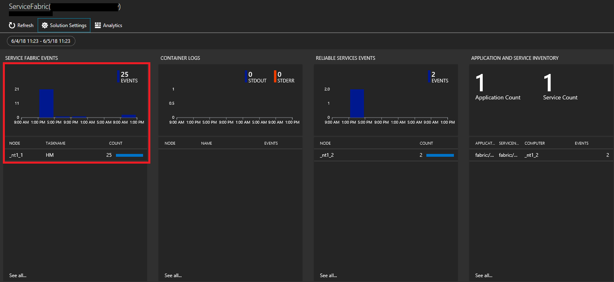
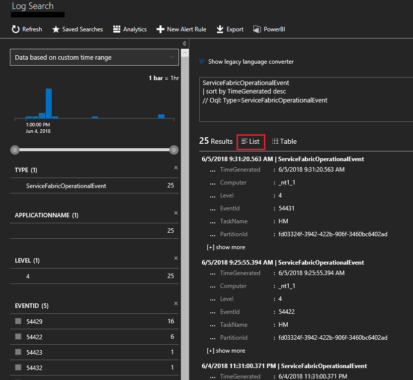
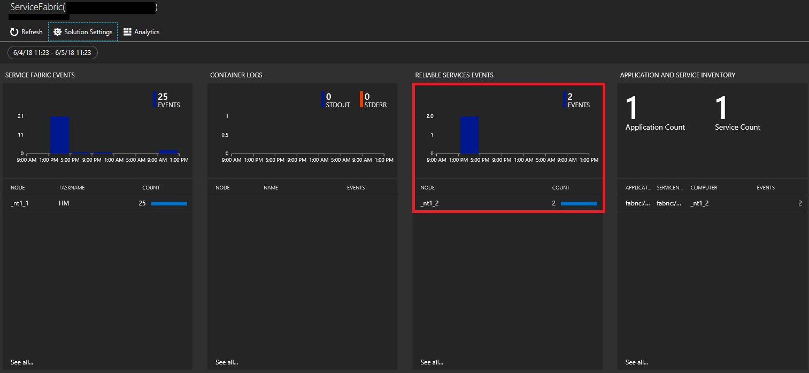
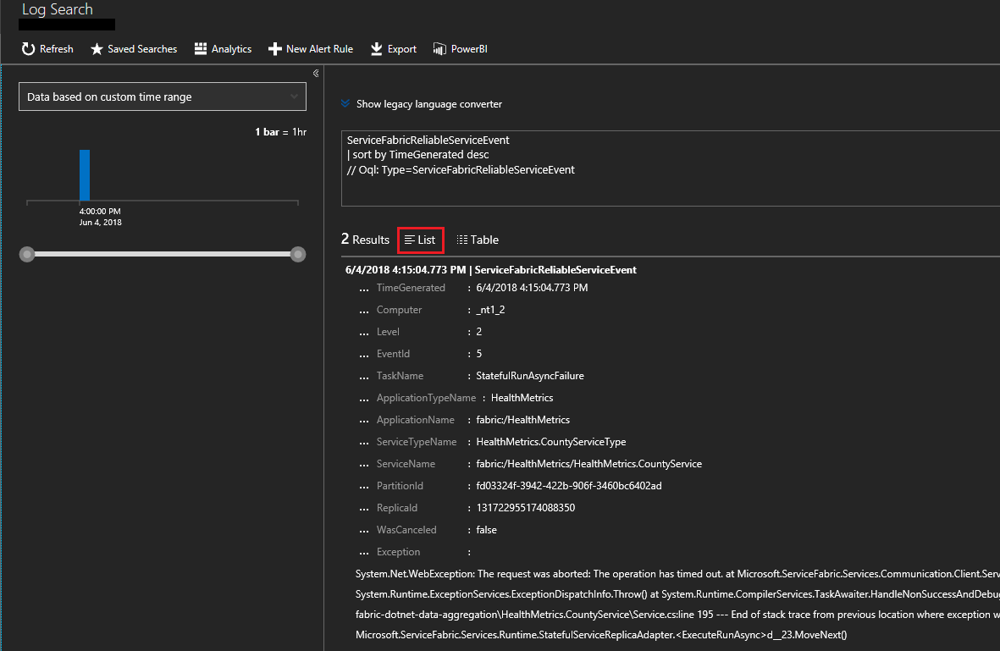

# Event analysis and visualization with Log Analytics
 Log Analytics collects and analyzes telemetry from applications and services hosted in the cloud and provides analysis tools to help you maximize their availability and performance. This article outlines how to run queries in Log Analytics to gain insights and troubleshoot what is happening in your cluster. The following common questions are addressed:

* How do I troubleshoot health events?
* How do I know when a node goes down?
* How do I know if my application's services have started or stopped?

## Overview of the Log Analytics workspace

>[!NOTE] 
>While diagnostic storage is enabled by default at the cluster creation time, you must still set up the Log Analytics workspace to read from the diagnostic storage.

Log Analytics collects data from managed resources, including an Azure storage table or an agent, and maintains it in a central repository. The data can then be used for analysis, alerting, and visualization, or further exporting. Log Analytics supports events, performance data, or any other custom data. Check out [steps to configure the diagnostics extension to aggregate events](service-fabric-diagnostics-event-aggregation-wad.md) and [steps to create a Log Analytics workspace to read from the events in storage](service-fabric-diagnostics-oms-setup.md) to make sure data is flowing into Log Analytics.

After data is received by Log Analytics, Azure has several *Management Solutions* that are prepackaged solutions or operational dashboards to monitor incoming data, customized to several scenarios. These include a *Service Fabric Analytics* solution and a *Containers* solution, which are the two most relevant ones to diagnostics and monitoring when using Service Fabric clusters. This article describes how to use the Service Fabric Analytics solution, which is created with the workspace.

## Access the Service Fabric Analytics solution

In the [Azure Portal](https://portal.azure.com), go to the resource group in which you created the Service Fabric Analytics solution.

Select the resource **ServiceFabric\<nameOfOMSWorkspace\>**.

In `Summary`, you will see tiles in the form of a graph for each of the solutions enabled, including one for Service Fabric. Click the **Service Fabric** graph to continue to the Service Fabric Analytics solution.


The following image shows the home page of the Service Fabric Analytics solution. This home page provides a snapshot view of what's happening in your cluster.


 If you enabled diagnostics upon cluster creation, you can see events for 

* [Service Fabric cluster events](service-fabric-diagnostics-event-generation-operational.md)
* [Reliable Actors programming model events](service-fabric-reliable-actors-diagnostics.md)
* [Reliable Services programming model events](service-fabric-reliable-services-diagnostics.md)

>[!NOTE]
>In addition to the Service Fabric events out of the box, more detailed system events can be collected by [updating the config of your diagnostics extension](service-fabric-diagnostics-event-aggregation-wad.md#log-collection-configurations).

## View Service Fabric Events, including actions on nodes

On the Service Fabric Analytics page, click on the graph for **Service Fabric Events**.

    

Click **List** to view the events in a list. 
Once here you will see all the system events that have been collected. For reference, these are from the **WADServiceFabricSystemEventsTable** in the Azure Storage account, and similarly the reliable services and actors events you see next are from those respective tables.
    


Alternatively you can click the magnifying glass on the left and use the Kusto query language to find what you're looking for. For example, to find all actions taken on nodes in the cluster, you can use the following query. The event IDs used below are found in the [operational channel events reference](service-fabric-diagnostics-event-generation-operational.md).

```kusto
ServiceFabricOperationalEvent
| where EventId < 25627 and EventId > 25619 
```

You can query on many more fields such as the specific nodes (Computer) the system service (TaskName).

### View Service Fabric Reliable Service and Actor events

On the Service Fabric Analytics page, click the graph for **Reliable Services**.



Click **List** to view the events in a list. Here you can see events from the reliable services. You can see different events for when the service runasync is started and completed which typically happens on deployments and upgrades. 



Reliable actor events can be viewed in a similar fashion. To configure more detailed events for reliable actors, you need to change the `scheduledTransferKeywordFilter` in the config for the diagnostic extension (shown below). Details on the values for these are in the [reliable actors events reference](service-fabric-reliable-actors-diagnostics.md#keywords).

```json
"EtwEventSourceProviderConfiguration": [
                {
                    "provider": "Microsoft-ServiceFabric-Actors",
                    "scheduledTransferKeywordFilter": "1",
                    "scheduledTransferPeriod": "PT5M",
                    "DefaultEvents": {
                    "eventDestination": "ServiceFabricReliableActorEventTable"
                    }
                },
```

The Kusto query language is powerful. Another valuable query you can run is to find out which nodes are generating the most events. The query in the screenshot below shows Service Fabric operational events aggregated with the specific service and node.


## Next steps

* To enable infrastructure monitoring i.e. performance counters, head over to [adding the Log Analytics agent](service-fabric-diagnostics-oms-agent.md). The agent collects performance counters and adds them to your existing workspace.
* For on-premises clusters, Log Analytics offers a Gateway (HTTP Forward Proxy) that can be used to send data to Log Analytics. Read more about that in [Connecting computers without Internet access to Log Analytics using the Log Analytics gateway](../azure-monitor/platform/gateway.md).
* Configure  [automated alerting](../log-analytics/log-analytics-alerts.md) to aid in detection and diagnostics.
* Get familiarized with the [log search and querying](../log-analytics/log-analytics-log-searches.md) features offered as part of Log Analytics.
* Get a more detailed overview of Log Analytics and what it offers, read [What is Log Analytics?](../operations-management-suite/operations-management-suite-overview.md).
