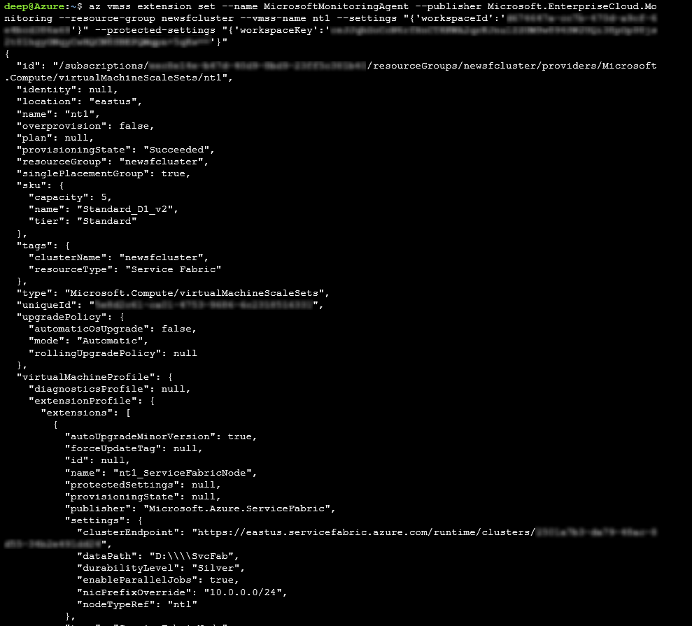

# Add the OMS Agent to a cluster

This article will go over adding the OMS Agent as a virtual machine scale set extension to your cluster, and connect it to your OMS Log Analytics workspace. This will help you collect diagnostics data about any running containers, as well as make it significantly easy to collect and monitor performance counters from your nodes. By adding it as an extension, Azure Resource Manager ensures that it gets installed on every node, even when scaling the cluster.

> [!NOTE]
> This article assumes that you have an OMS Log Analytics workspace already set up. If you do not, head over to [Set up OMS Log Analytics](service-fabric-diagnostics-oms-setup.md)

 A sample Resource Manager template that deploys the OMS workspace with the Service Fabric solution (as above) and adds the agent to your nodes can be found for clusters running [Windows](https://github.com/ChackDan/Service-Fabric/tree/master/ARM%20Templates/SF%20OMS%20Samples/Windows) or [Linux](https://github.com/ChackDan/Service-Fabric/tree/master/ARM%20Templates/SF%20OMS%20Samples/Linux).

## Add the agent extension via Azure CLI

The best way to add the OMS Agent to your cluster is via the virtual machine scale set APIs available with the Azure CLI. If you do not have Azure CLI set up yet, head over to Azure Portal and open up a [Cloud Shell](../cloud-shell/overview.md) instance, or [Install Azure CLI 2.0](https://docs.microsoft.com/cli/azure/install-azure-cli).

1. Once your Cloud Shell is requested, make sure you are working in the same subscription as your resource. Check this with `az account show` and make sure the "name" value matches that of your cluster's subscription.

2. In the Portal, navigate to the resource group where your OMS workspace is located. Click into the Log Analytics resource type, on the right nav, scroll down and click on **Properties**.

    

3. Run the command to install the OMS agent onto your cluster, using the `vmss extension set` API in your Cloud Shell:

    For a Windows cluster:
    
    ```sh
    az vmss extension set --name MicrosoftMonitoringAgent --publisher Microsoft.EnterpriseCloud.Monitoring --resource-group <nameOfResourceGroup> --vmss-name <nameOfNodeType> --settings "{'workspaceId':'<OMSworkspaceId>'}" --protected-settings "{'workspaceKey':'<OMSworkspaceKey>'}"
    ```

    For a Linux cluster:

    ```sh
    az vmss extension set --name OmsAgentForLinux --publisher Microsoft.EnterpriseCloud.Monitoring --resource-group <nameOfResourceGroup> --vmss-name <nameOfNodeType> --settings "{'workspaceId'}":'<OMSworkspaceId>'}" --protected-settings "{'workspaceKey':'<OMSworkspaceKey>'}"
    ```

    Here's an example of the OMS Agent being added to a Windows cluster.

    
 
    This should take less than 15 min to successfully add the agent to your nodes. You can verify that the agents have been added by using the `az vmss extension list` API:

    ```sh
    az vmss extension list --resource-group <nameOfResourceGroup> --vmss-name <nameOfNodeType>
    ```

## Next Steps

* Collect relevant [performance counters](service-fabric-diagnostics-event-generation-perf.md). To configure the OMS agent to pick up specific performance counters, head to the OMS Portal (linked at the top of the OMS Log Analytics resource). Then click on **Home > Settings > Data > Windows Performance Counters** or **Linux Performance Counters**  and choose the counters you would like to collect.
* Configure OMS to set up [automated alerting](../log-analytics/log-analytics-alerts.md) to aid in detecting and diagnostics
