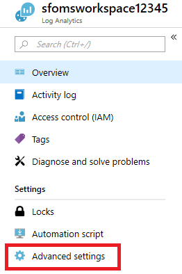
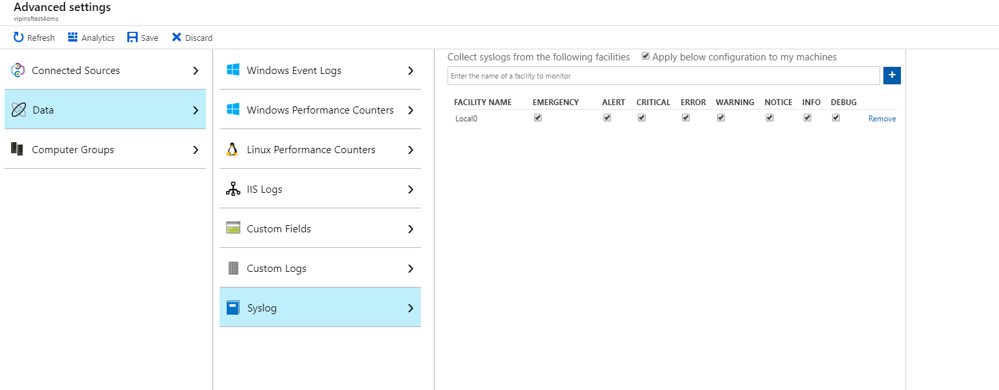
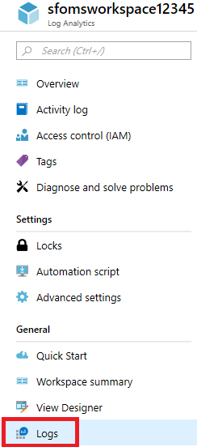
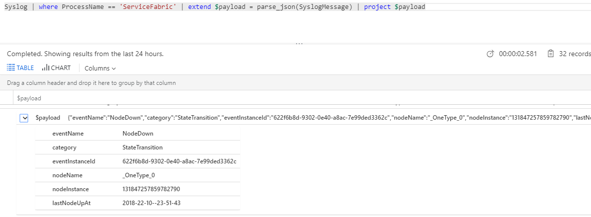

# Service Fabric Linux cluster events in Syslog

Service fabric exposes a set of platform events to inform you of important activity in your cluster. The full list of events that we expose is available [here](service-fabric-diagnostics-event-generation-operational.md). There are variety of ways through which these events can be consumed. In this article, we are going to discuss how to configure Service Fabric to write these events to Syslog.

## Introduction

In the 6.4 release, we have added functionality called the SyslogConsumer to send the Service Fabric platform events to Syslog for Linux clusters. Once turned on, events will automatically flow to Syslog which can be collected and sent by the Log Analytics Agent.

Each Syslog event has 4 components
* Facility
* Identity
* Message
* Severity

The SyslogConsumer writes all platform events using Facility `Local0`. You can update to any valid facility cy changing the config  config. The Identity used is `ServicFabric`. The Message field contains the whole event serialized in JSON so that it can be queried and consumed by a variety of tools. 

## Enable SyslogConsumer

To enable the SyslogConsumer, you need to perform an ARM upgrade of your cluster. The `fabricSettings` section needs to be updated with the following code. Note this code just includes sections related to SyslogConsumer

```json
    "fabricSettings": [
        {
            "name": "Diagnostics",
            "parameters": [
            {
                "name": "ConsumerInstances",
                "value": "AzureWinFabCsv, AzureWinFabCrashDump, AzureTableWinFabEtwQueryable, SyslogConsumer"
            }
            ]
        },
        {
            "name": "SyslogConsumer",
            "parameters": [
            {
                "name": "ProducerInstance",
                "value": "WinFabLttProducer"
            },
            {
            "name": "ConsumerType",
            "value": "SyslogConsumer"
            },
            {
                "name": "IsEnabled",
                "value": "true"
            }
            ]
        },
        {
            "name": "Common",
            "parameters": [
            {
                "name": "LinuxStructuredTracesEnabled",
                "value": "true"
            }
            ]
        }
    ],
```

Here are the changes to call out
1. In the Common section, we have a new parameter called `LinuxStructuredTracesEnabled`. **This is required to have Linux events structured and serialized when sent to Syslog.**
2. In the Diagnostics section, we added a new ConsumerInstance: SyslogConsumer. This tells the platform there is another consumer of the events. 
3. The new section SyslogConsumer needs to have `IsEnabled` as `true`. It is configurd to use the Local0 facility automatically. You can override this by adding another parameter.

```json
    {
        "name": "New LogFacility",
        "value": "<Valid Syslog Facility>"
    }
```

## Log Analytics integration
You can read these Syslog events in a monitoring tool such as Log Analytics. You can create a Log Analytics workspace by using the Azure Marketplace using these [instructions](../log-analytics/log-analytics-quick-create-workspace.md)
You also need to add the Log Analytics agent to your cluster to collect and send this data to the workspace. This is the same agent used to collect performance counters. 

1. Navigate to the `Advanced Settings` blade

    

2. Click `Data`
3. Click `Syslog`
4. Configure Local0 as the Facility to track. You can add another Facility if you changed it in fabricSettings

    
5. Head over to the query explorer by clicking `Logs` in the workspace resource's menu to start querying

    
6. You can query against the `Syslog` table looking for `ServiceFabric` as the ProcessName. The query below is an example of how to parse the JSON in the event and display its contents

```kusto
    Syslog | where ProcessName == "ServiceFabric" | extend $payload = parse_json(SyslogMessage) | project $payload
```



The example above is of a NodeDown event. You can view the full list of events [here](service-fabric-diagnostics-event-generation-operational.md).

## Next steps
* [Deploy the Log Analytics agent](service-fabric-diagnostics-oms-agent.md) onto your nodes to gather performance counters and collect docker stats and logs for your containers
* Get familiarized with the [log search and querying](../log-analytics/log-analytics-log-searches.md) features offered as part of Log Analytics
* [Use View Designer to create custom views in Log Analytics](../log-analytics/log-analytics-view-designer.md)
* Reference for how to [Log Analytics integration with Syslog](../log-analytics/log-analytics-data-sources-syslog.md).
