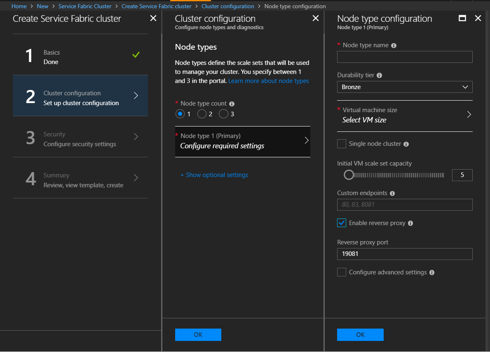
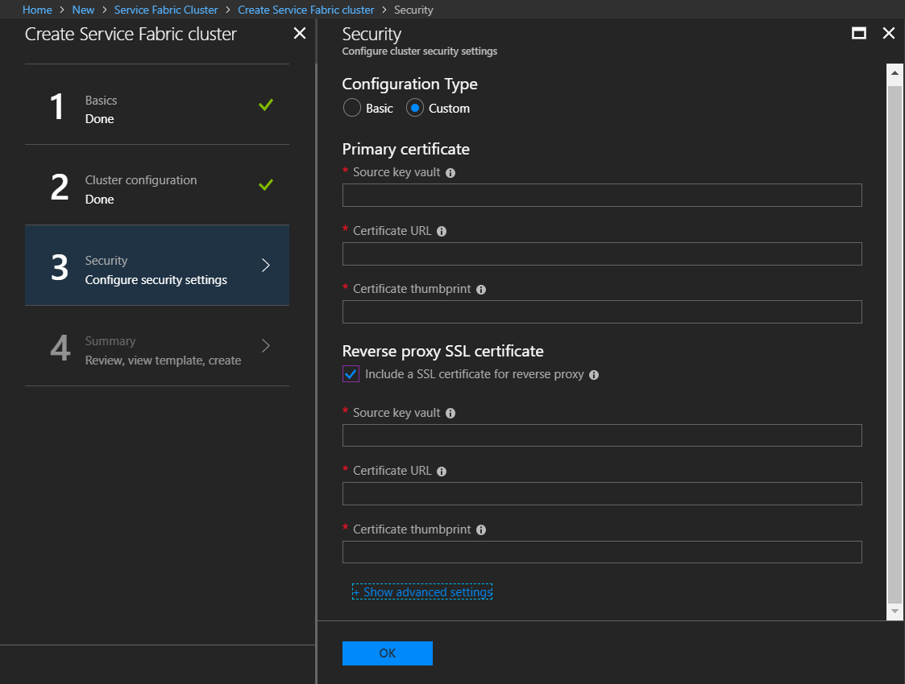

# Set up and configure reverse proxy in Azure Service Fabric
Reverse proxy is an optional Azure Service Fabric service that helps microservices running in a Service Fabric cluster discover and communicate with other services that have http endpoints. This article shows you how to set up reverse proxy in your cluster. 

## Enable reverse proxy using Azure portal

Azure portal provides an option to enable reverse proxy when you create a new Service Fabric cluster. You can't upgrade an existing cluster to use reverse proxy through the portal. 

To configure reverse proxy when you create a cluster using Azure portal, do the following:

 - In **Step 2: Cluster Configuration**, under **Node type configuration**, select **Enable reverse proxy**.

   
 - (Optional) To configure secure reverse proxy, you need to configure an SSL certificate. In **Step 3: Security**, on **Configure cluster security settings**, under **Configuration type**, select **Custom**. Then, under **Reverse Proxy SSL certificate**, select **Include a SSL certificate for reverse proxy** and enter your certificate details.

   

## Enable reverse proxy via Azure Resource Manager templates

For clusters on Azure, you can use the [Azure Resource Manager template](service-fabric-cluster-creation-via-arm.md) to enable the reverse proxy in Service Fabric for the cluster. You can enable reverse proxy when you create the cluster or updae it duringupgrade at a later time. 

Refer to [Configure HTTPS Reverse Proxy in a secure cluster](https://github.com/ChackDan/Service-Fabric/tree/master/ARM%20Templates/ReverseProxySecureSample/README.md#configure-https-reverse-proxy-in-a-secure-cluster) for Azure Resource Manager template samples to configure secure reverse proxy with a certificate and handling certificate rollover.

First, you get the template for the cluster that you want to deploy. You can either use the sample templates or create a custom Resource Manager template. Then, you can enable the reverse proxy by using the following steps:

1. Define a port for the reverse proxy in the [Parameters section](../azure-resource-manager/resource-group-authoring-templates.md) of the template.

    ```json
    "SFReverseProxyPort": {
        "type": "int",
        "defaultValue": 19081,
        "metadata": {
            "description": "Endpoint for Service Fabric Reverse proxy"
        }
    },
    ```
2. Specify the port for each of the nodetype objects in the **Cluster** [Resource type section](../azure-resource-manager/resource-group-authoring-templates.md).

    The port is identified by the parameter name, reverseProxyEndpointPort.

    ```json
    {
        "apiVersion": "2016-09-01",
        "type": "Microsoft.ServiceFabric/clusters",
        "name": "[parameters('clusterName')]",
        "location": "[parameters('clusterLocation')]",
        ...
       "nodeTypes": [
          {
           ...
           "reverseProxyEndpointPort": "[parameters('SFReverseProxyPort')]",
           ...
          },
        ...
        ],
        ...
    }
    ```
3. To address the reverse proxy from outside the Azure cluster, set up the Azure Load Balancer rules for the port that you specified in step 1.

    ```json
    {
        "apiVersion": "[variables('lbApiVersion')]",
        "type": "Microsoft.Network/loadBalancers",
        ...
        ...
        "loadBalancingRules": [
            ...
            {
                "name": "LBSFReverseProxyRule",
                "properties": {
                    "backendAddressPool": {
                        "id": "[variables('lbPoolID0')]"
                    },
                    "backendPort": "[parameters('SFReverseProxyPort')]",
                    "enableFloatingIP": "false",
                    "frontendIPConfiguration": {
                        "id": "[variables('lbIPConfig0')]"
                    },
                    "frontendPort": "[parameters('SFReverseProxyPort')]",
                    "idleTimeoutInMinutes": "5",
                    "probe": {
                        "id": "[concat(variables('lbID0'),'/probes/SFReverseProxyProbe')]"
                    },
                    "protocol": "tcp"
                }
            }
        ],
        "probes": [
            ...
            {
                "name": "SFReverseProxyProbe",
                "properties": {
                    "intervalInSeconds": 5,
                    "numberOfProbes": 2,
                    "port":     "[parameters('SFReverseProxyPort')]",
                    "protocol": "tcp"
                }
            }  
        ]
    }
    ```
4. To configure SSL certificates on the port for the reverse proxy, add the certificate to the ***reverseProxyCertificate*** property in the **Cluster** [Resource type section](../resource-group-authoring-templates.md).

    ```json
    {
        "apiVersion": "2016-09-01",
        "type": "Microsoft.ServiceFabric/clusters",
        "name": "[parameters('clusterName')]",
        "location": "[parameters('clusterLocation')]",
        "dependsOn": [
            "[concat('Microsoft.Storage/storageAccounts/', parameters('supportLogStorageAccountName'))]"
        ],
        "properties": {
            ...
            "reverseProxyCertificate": {
                "thumbprint": "[parameters('sfReverseProxyCertificateThumbprint')]",
                "x509StoreName": "[parameters('sfReverseProxyCertificateStoreName')]"
            },
            ...
            "clusterState": "Default",
        }
    }
    ```

### Supporting a reverse proxy certificate that's different from the cluster certificate
 If the reverse proxy certificate is different from the certificate that secures the cluster, then the previously specified certificate should be installed on the virtual machine and added to the access control list (ACL) so that Service Fabric can access it. This can be done in the **virtualMachineScaleSets** [Resource type section](../resource-group-authoring-templates.md). For installation, add the certificate to the osProfile. The extension section of the template can update the certificate in the ACL.

  ```json
  {
    "apiVersion": "[variables('vmssApiVersion')]",
    "type": "Microsoft.Compute/virtualMachineScaleSets",
    ....
      "osProfile": {
          "adminPassword": "[parameters('adminPassword')]",
          "adminUsername": "[parameters('adminUsername')]",
          "computernamePrefix": "[parameters('vmNodeType0Name')]",
          "secrets": [
            {
              "sourceVault": {
                "id": "[parameters('sfReverseProxySourceVaultValue')]"
              },
              "vaultCertificates": [
                {
                  "certificateStore": "[parameters('sfReverseProxyCertificateStoreValue')]",
                  "certificateUrl": "[parameters('sfReverseProxyCertificateUrlValue')]"
                }
              ]
            }
          ]
        }
   ....
   "extensions": [
          {
              "name": "[concat(parameters('vmNodeType0Name'),'_ServiceFabricNode')]",
              "properties": {
                      "type": "ServiceFabricNode",
                      "autoUpgradeMinorVersion": false,
                      ...
                      "publisher": "Microsoft.Azure.ServiceFabric",
                      "settings": {
                        "clusterEndpoint": "[reference(parameters('clusterName')).clusterEndpoint]",
                        "nodeTypeRef": "[parameters('vmNodeType0Name')]",
                        "dataPath": "D:\\\\SvcFab",
                        "durabilityLevel": "Bronze",
                        "testExtension": true,
                        "reverseProxyCertificate": {
                          "thumbprint": "[parameters('sfReverseProxyCertificateThumbprint')]",
                          "x509StoreName": "[parameters('sfReverseProxyCertificateStoreValue')]"
                        },
                  },
                  "typeHandlerVersion": "1.0"
              }
          },
      ]
    }
  ```
> [!NOTE]
> When you use certificates that are different from the cluster certificate to enable the reverse proxy on an existing cluster, install the reverse proxy certificate and update the ACL on the cluster before you enable the reverse proxy. Complete the [Azure Resource Manager template](service-fabric-cluster-creation-via-arm.md) deployment by using the settings mentioned previously before you start a deployment to enable the reverse proxy in steps 1-4.

## Next steps
* See an example of HTTP communication between services in a [sample project on GitHub](https://github.com/Azure-Samples/service-fabric-dotnet-getting-started).
* [Forwarding to secure HTTP service with the reverse proxy](service-fabric-reverseproxy-configure-secure-communication.md)
* [Remote procedure calls with Reliable Services remoting](service-fabric-reliable-services-communication-remoting.md)
* [Web API that uses OWIN in Reliable Services](service-fabric-reliable-services-communication-webapi.md)
* [WCF communication by using Reliable Services](service-fabric-reliable-services-communication-wcf.md)
* For additional reverse proxy configuration options, refer ApplicationGateway/Http section in [Customize Service Fabric cluster settings](service-fabric-cluster-fabric-settings.md).

[0]: ./media/service-fabric-reverseproxy/external-communication.png
[1]: ./media/service-fabric-reverseproxy/internal-communication.png
