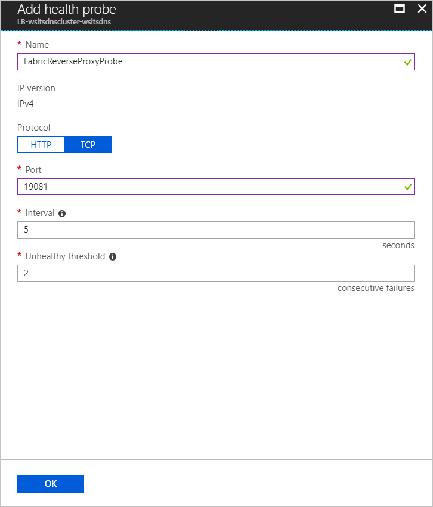
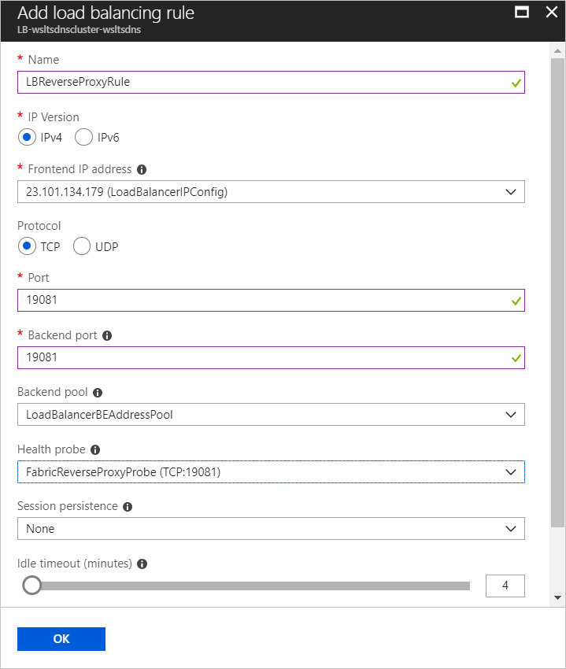

# Set up and configure reverse proxy in Azure Service Fabric
Reverse proxy is an optional Azure Service Fabric service that helps microservices running in a Service Fabric cluster discover and communicate with other services that have http endpoints. To learn more, see [Reverse proxy in Azure Service Fabric](service-fabric-reverseproxy.md). This article shows you how to set up and configure reverse proxy in your cluster. 

## Enable reverse proxy using Azure portal

Azure portal provides an option to enable reverse proxy when you create a new Service Fabric cluster. You can't upgrade an existing cluster to use reverse proxy through the portal. 

To configure reverse proxy when you [create a cluster using Azure portal](./service-fabric-cluster-creation-via-portal.md), make sure you do the following:

1. In **Step 2: Cluster Configuration**, under **Node type configuration**, select **Enable reverse proxy**.

   
2. (Optional) To configure secure reverse proxy, you need to configure a TLS/SSL certificate. In **Step 3: Security**, on **Configure cluster security settings**, under **Configuration type**, select **Custom**. Then, under **Reverse Proxy SSL certificate**, select **Include a SSL certificate for reverse proxy** and enter your certificate details.

   

   If you choose not to configure the reverse proxy with a certificate when you create the cluster, you can do so later through the Resource Manager template for the cluster's resource group. To learn more, see [Enable reverse proxy via Azure Resource Manager templates](#enable-reverse-proxy-via-azure-resource-manager-templates).

## Enable reverse proxy via Azure Resource Manager templates

For clusters on Azure, you can use the Azure Resource Manager template to enable the reverse proxy in Service Fabric. You can enable reverse proxy when you create the cluster or enable it by updating the cluster at a later time. 

For a new cluster, you can [create a custom Resource Manager template](service-fabric-cluster-creation-via-arm.md) or you can use a sample template. 

You can find sample Resource Manager templates that can help you configure secure reverse proxy for an Azure cluster in the [Secure Reverse Proxy Sample Templates](https://github.com/Azure-Samples/service-fabric-cluster-templates/tree/master/Reverse-Proxy-Sample) on GitHub. Refer to [Configure HTTPS Reverse Proxy in a secure cluster](https://github.com/Azure-Samples/service-fabric-cluster-templates/tree/master/Reverse-Proxy-Sample/README.md#configure-https-reverse-proxy-in-a-secure-cluster) in the README file for instructions and the templates to use to configure secure reverse proxy with a certificate and to handle certificate rollover.

For an existing cluster, you can export the Resource Manager template for the cluster's resource group using the [Azure portal](../azure-resource-manager/templates/export-template-portal.md), [PowerShell](../azure-resource-manager/management/manage-resources-powershell.md), or the [Azure CLI](../azure-resource-manager/management/manage-resources-cli.md).

After you have a Resource Manager template, you can enable the reverse proxy with the following steps:

1. Define a port for the reverse proxy in the [Parameters section](../azure-resource-manager/templates/syntax.md) of the template.

    ```json
    "SFReverseProxyPort": {
        "type": "int",
        "defaultValue": 19081,
        "metadata": {
            "description": "Endpoint for Service Fabric Reverse proxy"
        }
    },
    ```
2. Specify the port for each of the nodetype objects in the [**Microsoft.ServiceFabric/clusters**](/azure/templates/microsoft.servicefabric/clusters) [Resource type section](../azure-resource-manager/templates/syntax.md).

    The port is identified by the parameter name, reverseProxyEndpointPort.

    ```json
    {
        "apiVersion": "2016-09-01",
        "type": "Microsoft.ServiceFabric/clusters",
        "name": "[parameters('clusterName')]",
        "location": "[parameters('clusterLocation')]",
        ...
       "nodeTypes": [
          {
           ...
           "reverseProxyEndpointPort": "[parameters('SFReverseProxyPort')]",
           ...
          },
        ...
        ],
        ...
    }
    ```
3. To configure TLS/SSL certificates on the port for the reverse proxy, add the certificate to the ***reverseProxyCertificate*** object in the **Microsoft.ServiceFabric/clusters** [resource](azure/templates/microsoft.servicefabric/clusters?tabs=json#clusterproperties-object) template.

    ```json
    {
        "apiVersion": "2016-09-01",
        "type": "Microsoft.ServiceFabric/clusters",
        "name": "[parameters('clusterName')]",
        "location": "[parameters('clusterLocation')]",
        "dependsOn": [
            "[concat('Microsoft.Storage/storageAccounts/', parameters('supportLogStorageAccountName'))]"
        ],
        "properties": {
            ...
            "reverseProxyCertificate": {
                "thumbprint": "[parameters('sfReverseProxyCertificateThumbprint')]",
                "x509StoreName": "[parameters('sfReverseProxyCertificateStoreName')]"
            },
            ...
            "clusterState": "Default",
        }
    }
    ```

    You can also specify a common name for reverse proxy certificates using the **reverseProxyCertificateCommonNames** object in the clusters resource template.

### Supporting a reverse proxy certificate that's different from the cluster certificate
 If the reverse proxy certificate is different from the certificate that secures the cluster, then the previously specified certificate should be installed on the virtual machine and added to the access control list (ACL) so that Service Fabric can access it. This can be done in the [**Microsoft.Compute/virtualMachineScaleSets**](/azure/templates/microsoft.compute/virtualmachinescalesets) [Resource type section](../azure-resource-manager/templates/syntax.md). For installation, add the certificate to the osProfile. The extension section of the template can update the certificate in the ACL.

  ```json
  {
    "apiVersion": "[variables('vmssApiVersion')]",
    "type": "Microsoft.Compute/virtualMachineScaleSets",
    ....
      "osProfile": {
          "adminPassword": "[parameters('adminPassword')]",
          "adminUsername": "[parameters('adminUsername')]",
          "computernamePrefix": "[parameters('vmNodeType0Name')]",
          "secrets": [
            {
              "sourceVault": {
                "id": "[parameters('sfReverseProxySourceVaultValue')]"
              },
              "vaultCertificates": [
                {
                  "certificateStore": "[parameters('sfReverseProxyCertificateStoreValue')]",
                  "certificateUrl": "[parameters('sfReverseProxyCertificateUrlValue')]"
                }
              ]
            }
          ]
        }
   ....
   "extensions": [
          {
              "name": "[concat(parameters('vmNodeType0Name'),'_ServiceFabricNode')]",
              "properties": {
                      "type": "ServiceFabricNode",
                      "autoUpgradeMinorVersion": false,
                      ...
                      "publisher": "Microsoft.Azure.ServiceFabric",
                      "settings": {
                        "clusterEndpoint": "[reference(parameters('clusterName')).clusterEndpoint]",
                        "nodeTypeRef": "[parameters('vmNodeType0Name')]",
                        "dataPath": "D:\\\\SvcFab",
                        "durabilityLevel": "Bronze",
                        "testExtension": true,
                        "reverseProxyCertificate": {
                          "thumbprint": "[parameters('sfReverseProxyCertificateThumbprint')]",
                          "x509StoreName": "[parameters('sfReverseProxyCertificateStoreValue')]"
                        },
                  },
                  "typeHandlerVersion": "1.0"
              }
          },
      ]
    }
  ```
> [!NOTE]
> When you use certificates that are different from the cluster certificate to enable the reverse proxy on an existing cluster, install the reverse proxy certificate and update the ACL on the cluster before you enable the reverse proxy. Complete the [Azure Resource Manager template](service-fabric-cluster-creation-via-arm.md) deployment by using the settings mentioned previously before you start a deployment to enable the reverse proxy in steps 1-3.

## Enable reverse proxy on standalone clusters

For standalone clusters, you enable reverse proxy in the ClusterConfig.json file. You can enable reverse proxy at cluster creation or by upgrading the configuration for an existing cluster. To learn more about the settings available in ClusterConfig.json files, see [Standalone cluster settings](./service-fabric-cluster-manifest.md).

The following steps show you the settings to use to enable reverse proxy and, optionally, to secure the reverse proxy with an X.509 certificate. 

1. To enable reverse proxy, set the **reverseProxyEndpointPort** value for the node type under **properties** in the cluster config. The following JSON shows setting the reverse proxy endpoint port to 19081 for nodes with a type of "NodeType0":

   ```json
       "properties": {
          ... 
           "nodeTypes": [
               {
                   "name": "NodeType0",
                   ...
                   "reverseProxyEndpointPort": "19081",
                   ...
               }
           ],
          ...
       }
   ```
2. (Optional) For a secure reverse proxy, configure a certificate in the **security** section under **properties**. 
   - For a development or test environment, you can use the **ReverseProxyCertificate** setting:

      ```json
          "properties": {
              ...
              "security": {
                  ...
                  "CertificateInformation": {
                      ...
                      "ReverseProxyCertificate": {
                          "Thumbprint": "[Thumbprint]",
                          "ThumbprintSecondary": "[Thumbprint]",
                          "X509StoreName": "My"
                      },
                      ...
                  }
              },
              ...
          }
      ```
   - For a production environment, the **ReverseProxyCertificateCommonNames** setting is recommended:

      ```json
          "properties": {
              ...
              "security": {
                  ...
                  "CertificateInformation": {
                      ...
                      "ReverseProxyCertificateCommonNames": {
                        "CommonNames": [
                            {
                              "CertificateCommonName": "[CertificateCommonName]"
                            }
                          ],
                          "X509StoreName": "My"
                      },
                      ...
                  }
              },
              ...
          }
      ```

   To learn more about configuring and managing certificates for a standalone cluster, as well as more detail about configuring certificates used to secure reverse proxy, see [X509 certificate-based security](./service-fabric-windows-cluster-x509-security.md).

After you've modified your ClusterConfig.json file to enable reverse proxy, follow the instructions in [Upgrade the cluster configuration](service-fabric-cluster-config-upgrade-windows-server.md) to push the changes to your cluster.


## Expose reverse proxy on a public port through Azure Load Balancer

To address the reverse proxy from outside an Azure cluster, set up Azure Load Balancer rules and an Azure Health Probe for the reverse proxy port. These steps can be performed using the Azure portal or the Resource Manager template at any time after you have created the cluster. 

> [!WARNING]
> When you configure the reverse proxy's port in Load Balancer, all microservices in the cluster that expose an HTTP endpoint are addressable from outside the cluster. This means that microservices meant to be internal may be discoverable by a determined malicious user. This potentially presents serious vulnerabilities that can be exploited; for example:
>
> * A malicious user may launch a denial of service attack by repeatedly calling an internal service that does not have a sufficiently hardened attack surface.
> * A malicious user may deliver malformed packets to an internal service resulting in unintended behavior.
> * A service meant to be internal may return private or sensitive information not intended to be exposed to services outside the cluster, thus exposing this sensitive information to a malicious user. 
>
> Make sure you fully understand and mitigate the potential security ramifications for your cluster and the apps running on it, before you make the reverse proxy port public. 
>

If you want to expose reverse proxy publicly for a standalone cluster, the manner in which you do so will depend on the system hosting the cluster and is beyond the scope of this article. The preceding warning about exposing reverse proxy publicly, however, still applies.

### Expose the reverse proxy using Azure portal 

1. On the Azure portal, click the resource group for your cluster, then click the load balancer for your cluster.
2. To add a health Probe for the reverse proxy port, in the left pane of the load balancer window, under **SETTINGS**, click **Health probes**. Then click **Add** at the top of the Health probes window and enter details for the reverse proxy port, then click **OK**. By default, the reverse proxy port is 19081, unless you changed it when you created the cluster.

   
3. To add a Load Balancer rule to expose the reverse proxy port, in the left pane of the load balancer window, under **SETTINGS**, click **Load balancing rules**. Then click **Add** at the top of the Load balancing rules window and enter details for the reverse proxy port. Make sure you set the **Port** value to the port you want the reverse proxy exposed on, the **Backend port** value to the port you set when you enabled reverse proxy, and the **Health probe** value to the health probe you configured in the previous step. Set other fields as appropriate and click **OK**.

   

### Expose the reverse proxy via Resource Manager templates

The following JSON references the same template that is used in [Enable reverse proxy via Azure Resource Manager templates](#enable-reverse-proxy-via-azure-resource-manager-templates). Refer to that section of the document for information about how to create a Resource Manager template or export a template for an existing cluster.  The changes are made to the [**Microsoft.Network/loadBalancers**](/azure/templates/microsoft.network/loadbalancers) [Resource type section](../azure-resource-manager/templates/syntax.md).

```json
{
    "apiVersion": "[variables('lbApiVersion')]",
    "type": "Microsoft.Network/loadBalancers",
    ...
    ...
    "loadBalancingRules": [
        ...
        {
            "name": "LBSFReverseProxyRule",
            "properties": {
                "backendAddressPool": {
                    "id": "[variables('lbPoolID0')]"
                },
                "backendPort": "[parameters('SFReverseProxyPort')]",
                "enableFloatingIP": "false",
                "frontendIPConfiguration": {
                    "id": "[variables('lbIPConfig0')]"
                },
                "frontendPort": "[parameters('SFReverseProxyPort')]",
                "idleTimeoutInMinutes": "5",
                "probe": {
                    "id": "[concat(variables('lbID0'),'/probes/SFReverseProxyProbe')]"
                },
                "protocol": "tcp"
            }
        }
    ],
    "probes": [
        ...
        {
            "name": "SFReverseProxyProbe",
            "properties": {
                "intervalInSeconds": 5,
                "numberOfProbes": 2,
                "port":     "[parameters('SFReverseProxyPort')]",
                "protocol": "tcp"
            }
        }  
    ]
}
```


## Customize reverse proxy behavior using fabric settings

You can customize the behavior of reverse proxy through fabric settings in the Resource Manager template for clusters hosted in Azure or in the ClusterConfig.json file for standalone clusters. Settings that control reverse proxy behavior are located in the [**ApplicationGateway/Http**](./service-fabric-cluster-fabric-settings.md#applicationgatewayhttp) section in the **fabricSettings** section under the cluster **properties** section. 

For example, you can set the value of **DefaultHttpRequestTimeout** to set the timeout for requests to the reverse proxy to 180 seconds as in the following JSON:

   ```json
   {
   "fabricSettings": [
             ...
             {
               "name": "ApplicationGateway/Http",
               "parameters": [
                 {
                   "name": "DefaultHttpRequestTimeout",
                   "value": "180"
                 }
               ]
             }
           ],
           ...
   }
   ``` 

For more information about updating fabric settings for Azure clusters, see [Customize cluster settings using Resource Manager templates](service-fabric-cluster-config-upgrade-azure.md). For standalone clusters, see [Customize cluster settings for standalone clusters](service-fabric-cluster-config-upgrade-windows-server.md). 

Several fabric settings are used to help establish secure communication between reverse proxy and services. For detailed information about these settings, see [Connect to a secure service with the reverse proxy](service-fabric-reverseproxy-configure-secure-communication.md).

## Next steps
* [Set up forwarding to secure HTTP service with the reverse proxy](service-fabric-reverseproxy-configure-secure-communication.md)
* For reverse proxy configuration options, see [ApplicationGateway/Http section in Customize Service Fabric cluster settings](service-fabric-cluster-fabric-settings.md#applicationgatewayhttp).