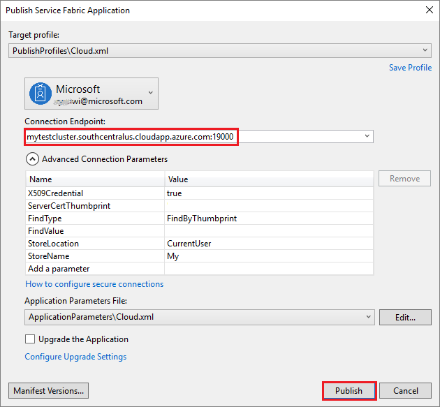

# Deploy an application to a Cluster in Azure
This tutorial is part two of a series and shows you how to deploy an Azure Service Fabric application to an existing or new cluster in Azure directly from Visual Studio.

In part two of the tutorial series, you learn how to:
> [!div class="checklist"]
> * [Build a .NET Service Fabric application](service-fabric-tutorial-create-dotnet-app.md)
> * Deploy the application to a remote cluster
> * [Configure CI/CD using Visual Studio Team Services](service-fabric-tutorial-deploy-app-with-cicd-vsts.md)
> * [Set up monitoring and diagnostics for the application](service-fabric-tutorial-monitoring-aspnet.md)

In this tutorial series you learn how to:
> [!div class="checklist"]
> * Deploy an application to a remote cluster using Visual Studio
> * Remove an application from a cluster using Service Fabric Explorer

## Prerequisites
Before you begin this tutorial:
- If you don't have an Azure subscription, create a [free account](https://azure.microsoft.com/free/?WT.mc_id=A261C142F)
- [Install Visual Studio 2017](https://www.visualstudio.com/) and install the **Azure development** and **ASP.NET and web development** workloads.
- [Install the Service Fabric SDK](service-fabric-get-started.md)

## Download the Voting sample application
If you did not build the Voting sample application in [part one of this tutorial series](service-fabric-tutorial-create-dotnet-app.md), you can download it. In a command window, run the following command to clone the sample app repository to your local machine.

```
git clone https://github.com/Azure-Samples/service-fabric-dotnet-quickstart
```

## Deploy the sample application

### Select a Service Fabric cluster to which to publish
Now that the application is ready, you can deploy it to a cluster directly from Visual Studio.

You have three options for deployment:
- Create a cluster from Visual Studio. This option allows you to create a secure cluster directly from Visual Studio with your preferred configurations. This type of cluster is ideal for test scenarios, where you can create the cluster and then publish directly to it within Visual Studio.
- Publish to a party cluster. Party clusters are free, limited-time Service Fabric clusters run by the Service Fabric team. Currently they are available for use for one hour.
- Publish to an existing cluster in your subscription.

In this tutorial we will create a cluster a cluster from Visual Studio. For the other options you can copy and paste your connection endpoint or choose it from your subscription.
> [!NOTE]
> Many services use the reverse proxy to communicate with each other. Clusters created from Visual Studio and Party Clusters have reverse proxy enabled by default.  If using an existing cluster, you must [enable the reverse proxy in the cluster](../service-fabric-reverseproxy.md#setup-and-configuration.md).

### Deploy the app to the Service Fabric cluster

1. Right-click on the application project in the Solution Explorer and choose **Publish**.

    

2. Sign in by using your Azure account so that you can have access to your subscription(s). This step is optional if you're using a party cluster.

3. Select the dropdown for the **Connection Endpoint** and select the "<Create New Cluster...>" option.

    

    1. In this dialog, specify the name of your cluster in the "Cluster Name" field, as well as the subscription and location you want to use.
    2. You can modify the number of nodes. By default you have 3 nodes, which is the minimum required for testing Service Fabric scenarios.
    3. Select the "Certificate" tab. In this tab, type a password to use to secure the certificate of your cluster. This helps make your cluster secure. You can also modify the path on which you want to save the certificate.
    4. Select the "VM Detail" tab. In here, specify the password you would like to use for the Virtual Machine for your nodes. If you wish to, you can modify the image and the size of the virtual machine.
    5. Optional: go to the "Advanced" tab to modify the ports for your cluster, or to add an Application Insights key.
    6. When you are done modifying settings, select the "Create" button. Creation takes a few minutes to complete; the output window will indicate when the cluster is fully created.

4. Once the cluster you want to use is ready, click **Publish**.

    When the publish has finished, you should be able to send a request to the application via a browser.

5. Open you preferred browser and type in the cluster address (the connection endpoint without the port information - for example, win1kw5649s.westus.cloudapp.azure.com).

    You should now see the same result as you saw when running the application locally.

    

## Next steps
In this tutorial, you learned how to:

> [!div class="checklist"]
> * Deploy an application to a remote cluster using Visual Studio
> * Remove an application from a cluster using Service Fabric Explorer

Advance to the next tutorial:
> [!div class="nextstepaction"]
> [Set up continuous integration using Visual Studio Team Services](service-fabric-tutorial-deploy-app-with-cicd-vsts.md)
