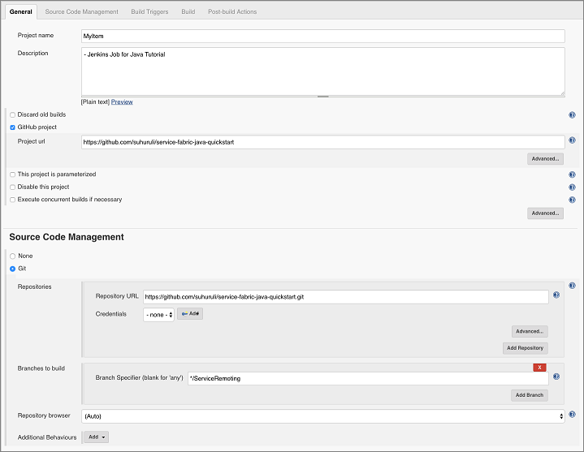
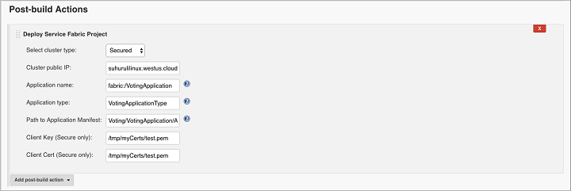
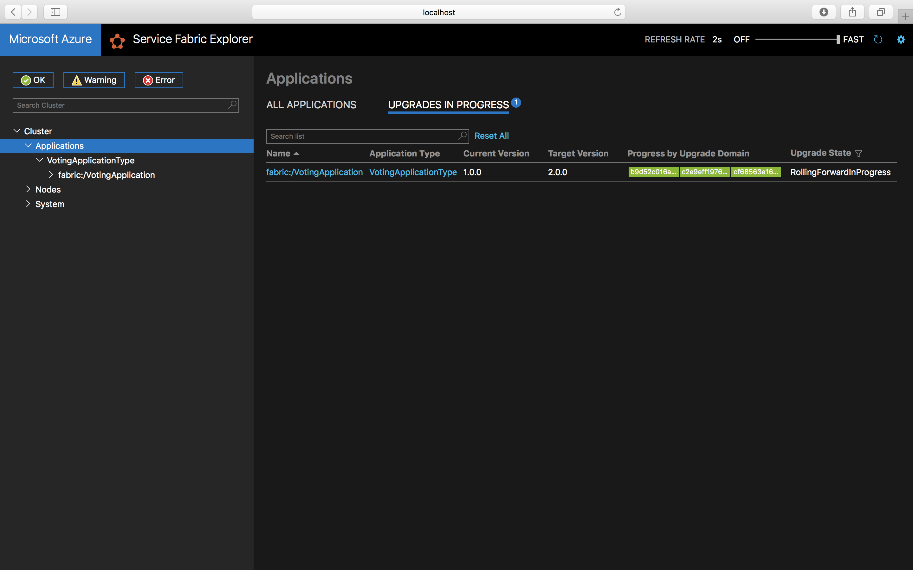

# Set up Jenkins environment for continuous deployment with Service Fabric
This tutorial is part five of a series and shows you how to use Jenkins to deploy upgrades to your application. In this tutorial, the Service Fabric Jenkins plugin will be used in combination with a Github repository hosting the Voting application to deploy our Voting application to a cluster. 

In this tutorial series you learn how to:
> [!div class="checklist"]
> * Deploy Service Fabric Jenkins container on your machine
> * Set up Jenkins environment for deployment to Service Fabric


## Prerequisites
- Have Git installed locally. You can install the appropriate Git version from [the Git downloads page](https://git-scm.com/downloads), based on your operating system. If you are new to Git, learn more about it from the [Git documentation](https://git-scm.com/docs).
- Have working knoweldege of Jenkins
- Have a [Github](https://github.com/) account and know how to use Github
- Have [Docker](https://www.docker.com/community-edition) installed on your machine

## Pull and deploy Service Fabric Jenkins container image

You can set up Jenkins either inside or outside a Service Fabric cluster. The following instructions will show how to set it up outside a cluster using a provided Docker image. However, a preconfigured Jenkins build environment can also be used if you do not wish to use the container. The container image used below comes installed with the Service Fabric plugin and is ready for use with Service Fabric immediately. 

1. Pull the Service Fabric Jenkins container image: ``docker pull rapatchi/jenkins:v10``. This image comes with Service Fabric Jenkins plugin pre-installed.
2. Run the container image with the location where your certificates are on your local machine mounted
```bash
docker run -itd -p 8080:8080 -v /Users/suhuruli/Documents/Work/Samples/service-fabric-java-quickstart/AzureCluster:/tmp/myCerts rapatchi/jenkins:v10
```
3. Get the ID of the container image instance. You can list all the Docker containers with the command ``docker ps –a``
4. Retrieve the password of your Jenkins instance by running the following:

    ```sh
    docker exec [first-four-digits-of-container-ID] cat /var/jenkins_home/secrets/initialAdminPassword
    ```
    If container ID is 2d24a73b5964, use 2d24.
    * This password is required for signing in to the Jenkins dashboard from portal, which is ``http://<HOST-IP>:8080``
    * After you sign in for the first time, you can create your own user account and use that for future purposes, or you can continue to use the administrator account. After you create a user, you need to continue with that.
5. Set up GitHub to work with Jenkins, by using the steps mentioned in [Generating a new SSH key and adding it to the SSH agent](https://help.github.com/articles/generating-a-new-ssh-key-and-adding-it-to-the-ssh-agent/). Since we are running these commands from the Docker container, follow the instructions for the Linux environment. 
    * Use the instructions provided by GitHub to generate the SSH key, and to add the SSH key to the GitHub account that is hosting the repository.
    * Run the commands mentioned in the preceding link in the Jenkins Docker shell (and not on your host).
    * To sign in to the Jenkins shell from your host, use the following commands:

    ```sh
    docker exec -t -i [first-four-digits-of-container-ID] /bin/bash
    ```

Ensure that the cluster or machine where the Jenkins container image is hosted has a public-facing IP. This enables the Jenkins instance to receive notifications from GitHub.

## Create and configure a Jenkins job

1. First, if you do not have a repository that you can use to host the Voting project on Github, create one. The repository will be called **dev_test** for the remaining of this tutorial.
2. Create a **new item** on your Jenkins dashboard.
3. Enter an item name (for example, **MyJob**). Select **free-style project**, and click **OK**.
4. Go the job page, and click **Configure**.

   a. In the general section, select the checkbox for **GitHub project**, and specify your GitHub project URL. This URL hosts the Service Fabric Java application that you want to integrate with the Jenkins continuous integration, continuous deployment (CI/CD) flow (for example, ``https://github.com/testaccount/dev_test``).

   b. Under the **Source Code Management** section, select **Git**. Specify the repository URL that hosts the Service Fabric Java application that you want to integrate with the Jenkins CI/CD flow (for example, ``https://github.com/testaccount/dev_test.git``). Also, you can specify here which branch to build (for example, **/master**).
5. Configure your *GitHub* (which is hosting the repository) so that it is able to talk to Jenkins. Use the following steps:

   a. Go to your GitHub repository page. Go to **Settings** > **Integrations and Services**.

   b. Select **Add Service**, type **Jenkins**, and select the **Jenkins-GitHub plugin**.

   c. Enter your Jenkins webhook URL (by default, it should be ``http://<PublicIPorFQDN>:8081/github-webhook/``). Click **add/update service**.

   d. A test event is sent to your Jenkins instance. You should see a green check by the webhook in GitHub, and your project will build.

   

6. Under the **Build Triggers** section, select which build option you want. For this example, you want to trigger a build whenever some push to the repository happens. So you select **GitHub hook trigger for GITScm polling**.

7. Under the **Build section**, from the drop-down **Add build step**, select the option **Invoke Gradle Script**. In the widget that comes open the advanced menu, specify the path to **Root build script** for your application. It picks up build.gradle from the path specified and works accordingly.

    
  
   h. From the **Post-Build Actions** drop-down, select **Deploy Service Fabric Project**. Here you need to provide cluster details where the Jenkins compiled Service Fabric application would be deployed. The path to the certificate is where the volume was mounted (/tmp/myCerts). 
   
    You can also provide additional application details used to deploy the application. See the following screenshot for an example of what this looks like:

    

      > [!NOTE]
      > The cluster here could be same as the one hosting the Jenkins container application, in case you are using Service Fabric to deploy the Jenkins container image.
      >

## Update your existing application 
1. Update the title of the HTML in the ```VotingApplication/VotingWebPkg/Code/wwwroot/index.html``` file with **Service Fabric Voting Sample V2**. 
```html 
<div ng-app="VotingApp" ng-controller="VotingAppController" ng-init="refresh()">
    <div class="container-fluid">
        <div class="row">
            <div class="col-xs-8 col-xs-offset-2 text-center">
                <h2>Service Fabric Voting Sample V2</h2>
            </div>
        </div>
    </div>
</div>
```

2. Update the **ApplicationTypeVersion** and **ServiceManifestVersion** version to **2.0.0** in the ```Voting/VotingApplication/ApplicationManifest.xml``` file. 

```xml
<?xml version="1.0" encoding="utf-8" standalone="no"?>
<ApplicationManifest xmlns="http://schemas.microsoft.com/2011/01/fabric" xmlns:xsi="http://www.w3.org/2001/XMLSchema-instance" ApplicationTypeName="VotingApplicationType" ApplicationTypeVersion="2.0.0">
  <Description>Voting Application</Description>
  <ServiceManifestImport>
    <ServiceManifestRef ServiceManifestName="VotingWebPkg" ServiceManifestVersion="2.0.0"/>
  </ServiceManifestImport>
  <ServiceManifestImport>
        <ServiceManifestRef ServiceManifestName="VotingDataServicePkg" ServiceManifestVersion="1.0.0"/>
    </ServiceManifestImport>
    <DefaultServices>
      <Service Name="VotingWeb">
         <StatelessService InstanceCount="1" ServiceTypeName="VotingWebType">
            <SingletonPartition/>
         </StatelessService>
      </Service>      
   <Service Name="VotingDataService">
            <StatefulService MinReplicaSetSize="3" ServiceTypeName="VotingDataServiceType" TargetReplicaSetSize="3">
                <UniformInt64Partition HighKey="9223372036854775807" LowKey="-9223372036854775808" PartitionCount="1"/>
            </StatefulService>
        </Service>
    </DefaultServices>      
</ApplicationManifest>
```

3. Update the **Version** field in the **ServiceManifest** and the **Version** field in the **CodePackage** tag in the ```Voting/VotingApplication/VotingWebPkg/ServiceManifest.xml``` file to **2.0.0**.
```xml
<CodePackage Name="Code" Version="2.0.0">
<EntryPoint>
    <ExeHost>
    <Program>entryPoint.sh</Program>
    </ExeHost>
</EntryPoint>
</CodePackage>
```
4. Push your new changes to your Github repository to initialize a Jenkins job which will perform an application upgrade. 

5. In Service Fabric Explorer, if you click on the **Applications** dropdown and click on the **Upgrades in Progress** tab, you will see the status of your upgrade. 


6. If you access **<Host-IP>:8080**, you will see the Voting application with full functionality now up and running. 


## Next steps
In this tutorial, you learned how to:

> [!div class="checklist"]
> * Get an ELK server up and running in Azure 
> * Configure the server to receive to receive diagnostic information from your Service Fabric cluster

Advance to the next tutorial:
> [!div class="nextstepaction"]
> [Set up CI/CD](service-fabric-tutorial-java-jenkins-cicd.md)