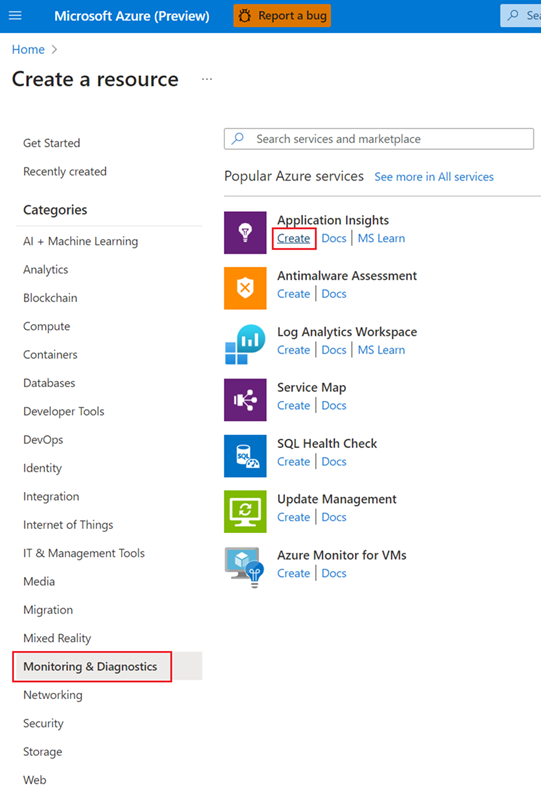
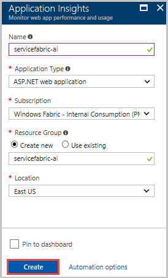
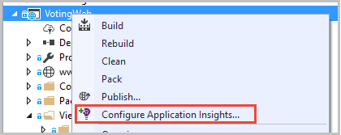
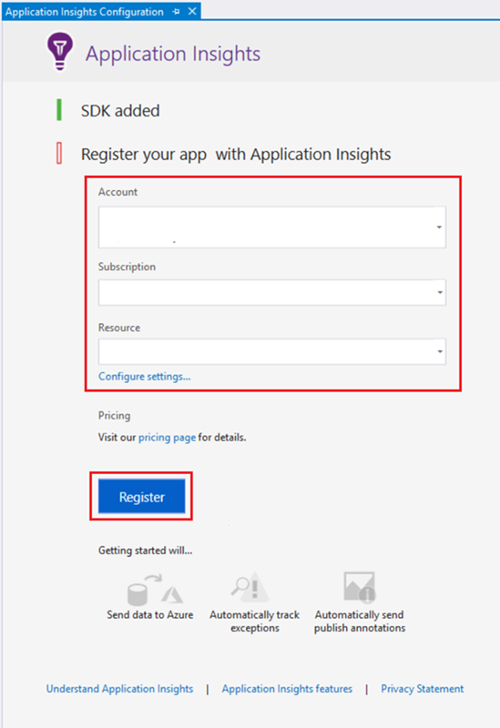
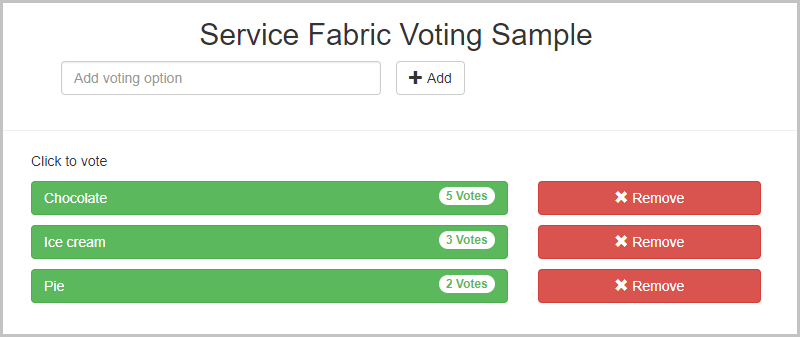
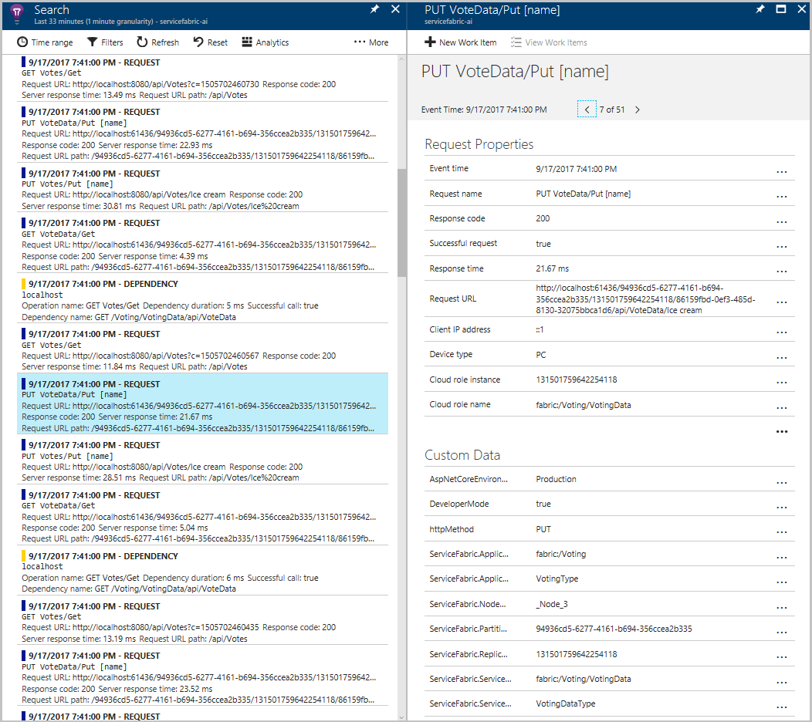
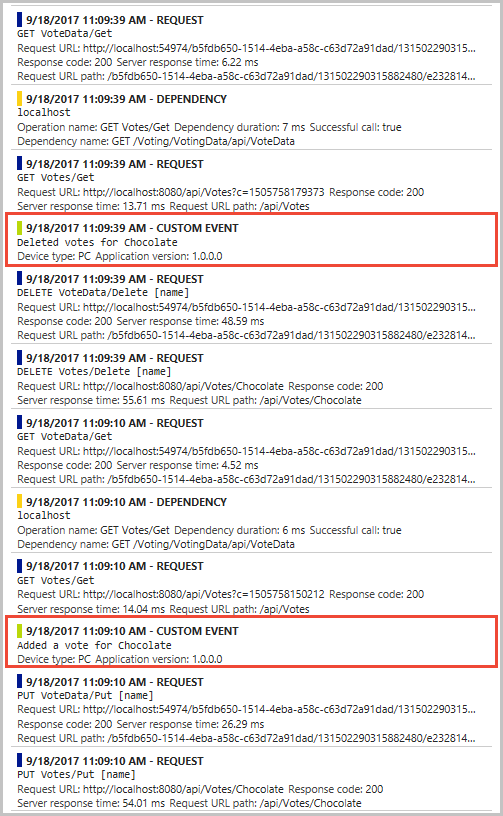

# Tutorial: Monitor and diagnose an ASP.NET Core application on Service Fabric by using Application Insights

This tutorial is *part five* in a series. It walks through the steps to configure monitoring and diagnostics for an ASP.NET Core application running on an Azure Service Fabric cluster by using Application Insights. You collect telemetry from the application that's developed in the first part of the tutorial, [Tutorial: Build a .NET Service Fabric application](service-fabric-tutorial-create-dotnet-app.md).

In this tutorial, you learn how to:

> [!div class="checklist"]
>
> * Set up an Application Insights resource
> * Add Application Insights to the application's services
> * View telemetry and the App map in Application Insights
> * Add custom instrumentation to your application

The tutorial series shows you how to:

* [Build a .NET Service Fabric application](service-fabric-tutorial-create-dotnet-app.md)
* [Deploy the application to a remote cluster](service-fabric-tutorial-deploy-app-to-party-cluster.md)
* [Add an HTTPS endpoint to an ASP.NET Core front-end service](service-fabric-tutorial-dotnet-app-enable-https-endpoint.md)
* [Configure CI/CD by using Azure Pipelines](service-fabric-tutorial-deploy-app-with-cicd-vsts.md)
* Set up monitoring and diagnostics for the application

## Prerequisites

Before you begin this tutorial:

* If you don't have an Azure subscription, create a [free account](https://azure.microsoft.com/free/?WT.mc_id=A261C142F).
* [Install Visual Studio 2019](https://www.visualstudio.com/) and install the **Azure development** and **ASP.NET and web development** workloads.
* [Install the Service Fabric SDK](service-fabric-get-started.md).

## Download the Voting sample application

If you didn't build the Voting sample application in [part one of this tutorial series](service-fabric-tutorial-create-dotnet-app.md), you can download it. In a command window or terminal, run the following command to clone the sample app repository to your local computer:

```git
git clone https://github.com/Azure-Samples/service-fabric-dotnet-quickstart
```

## Set up an Application Insights resource

Application Insights is the Azure application performance management platform. We recommend that you use Application Insights for application monitoring and diagnostics in Service Fabric.

To create an Application Insights resource, go to the [Azure portal](https://portal.azure.com). On the left resource menu, select **Create a resource**. Select **Monitoring + Management**, and then select **Application Insights**.



You'll now need to fill out required information about the attributes of the resource to be created. Enter an appropriate *Name*, *Resource Group*, and *Subscription*. Set the *Location* to where you would deploy your Service Fabric cluster in the future. In this tutorial, we deploy the app to a local cluster so the *Location* field is irrelevant. The *Application Type* should be left as "ASP.NET web application."



When you've entered or selected the required information, select **Create** to provision the resource. It takes about a minute.

<!-- When it's finished, go to the newly deployed resource and find the value for **Instrumentation Key** (in the **Essentials** dropdown). Copy it to the clipboard because you use it in the next step. -->

## Add Application Insights to the application's services

Open Visual Studio 2019 by using the **Run as administrator** option (right-click the Visual Studio icon in the Start menu). Select **File** > **Open** > **Project/Solution** and go to the Voting application (either created in part one of the tutorial or git cloned). Open *Voting.sln*. If you're prompted to restore the application's NuGet packages, select **Yes**.

To configure Application Insights for the VotingWeb and VotingData services:

1. Right-click the name of the service, and select **Add** > **Connected Services** > **Monitoring with Application Insights**.

    

   >[!NOTE]
   >Depending on the project type, when you Right-click the name of the service, you might need to select Add-> Application Insights Telemetry ...

1. Select **Get started**.
1. Sign in to the account you use for your Azure subscription and select the subscription in which you created the Application Insights resource. Find the resource under *Existing Application Insights resource* in the "Resource" dropdown. Select **Register** to add Application Insights to your service.

    

1. When the dialog that completes the action pops up, select **Finish**.

> [!NOTE]
> Make sure to do these steps for *both* of the services in the application to finish configuring Application Insights for the application.
> The same Application Insights resource is used for both of the services in order to see incoming and outgoing requests and communication between the services.

## Add the Microsoft.ApplicationInsights.ServiceFabric.Native NuGet to the services

Application Insights has two Service Fabric specific NuGets that can be used depending on the scenario. One is used with Service Fabric's native services, and the other with containers and guest executables. In this case, we are using the Microsoft.ApplicationInsights.ServiceFabric.Native NuGet to use the understanding of service context that it brings. To read more about the Application Insights SDK and the Service Fabric specific NuGet packages, see [Microsoft Application Insights for Service Fabric](https://github.com/Microsoft/ApplicationInsights-ServiceFabric/blob/master/README.md).

Here are the steps to set up the NuGet package:

1. Right-click **Solution 'Voting'** at the top of Solution Explorer, and select **Manage NuGet Packages for Solution**.
1. Select **Browse** on the top navigation menu of the "NuGet - Solution" window, and check the **Include prerelease** box next to the search bar.

   >[!NOTE]
   >You might need to install the Microsoft.ServiceFabric.Diagnostics.Internal package in a similar fashion if not preinstalled before installing the Application Insights package

1. Search for `Microsoft.ApplicationInsights.ServiceFabric.Native` and select the appropriate NuGet package.
1. On the right, select the two check boxes next to the two services in the application, **VotingWeb** and **VotingData** and select **Install**.

    
1. On the *Preview Changes* dialog box that appears, select **OK** to accept the license. This adds the NuGet packages to the services.
1. You now need to set up the telemetry initializer in the two services. To do this, open up *VotingWeb.cs* and *VotingData.cs*. For both of them, do the following two steps:
    1. Add these two *using* statements at the top of each *\<ServiceName>.cs*, after the existing *using* statements:

      ```csharp
      using Microsoft.ApplicationInsights.Extensibility;
      using Microsoft.ApplicationInsights.ServiceFabric;
      ```

    1. In both files, in the nested *return* statement of *CreateServiceInstanceListeners()* or *CreateServiceReplicaListeners()*, under *ConfigureServices* > *services*, with the other singleton services declared, add:

       ```csharp
       .AddSingleton<ITelemetryInitializer>((serviceProvider) => FabricTelemetryInitializerExtension.CreateFabricTelemetryInitializer(serviceContext))
       ```

    This adds the *Service Context* to your telemetry, allowing you to better understand the source of your telemetry in Application Insights. Your nested *return* statement in *VotingWeb.cs* should look like this example:

    ```csharp
    return new WebHostBuilder()
        .UseKestrel()
        .ConfigureServices(
            services => services
                .AddSingleton<HttpClient>(new HttpClient())
                .AddSingleton<FabricClient>(new FabricClient())
                .AddSingleton<StatelessServiceContext>(serviceContext)
                .AddSingleton<ITelemetryInitializer>((serviceProvider) => FabricTelemetryInitializerExtension.CreateFabricTelemetryInitializer(serviceContext)))
        .UseContentRoot(Directory.GetCurrentDirectory())
        .UseStartup<Startup>()
        .UseApplicationInsights()
        .UseServiceFabricIntegration(listener, ServiceFabricIntegrationOptions.None)
        .UseUrls(url)
        .Build();
    ```

    Similarly, in *VotingData.cs*, you should have:

    ```csharp
    return new WebHostBuilder()
        .UseKestrel()
        .ConfigureServices(
            services => services
                .AddSingleton<StatefulServiceContext>(serviceContext)
                .AddSingleton<IReliableStateManager>(this.StateManager)
                .AddSingleton<ITelemetryInitializer>((serviceProvider) => FabricTelemetryInitializerExtension.CreateFabricTelemetryInitializer(serviceContext)))
        .UseContentRoot(Directory.GetCurrentDirectory())
        .UseStartup<Startup>()
        .UseApplicationInsights()
        .UseServiceFabricIntegration(listener, ServiceFabricIntegrationOptions.UseUniqueServiceUrl)
        .UseUrls(url)
        .Build();
    ```

Double-check that the `UseApplicationInsights()` method is called in both *VotingWeb.cs* and *VotingData.cs* as shown in the example.

>[!NOTE]
>This sample app uses HTTP for the services to communicate. If you develop an app by using Service Remoting V2, you also add the following lines of code in the same place in the code:

```csharp
ConfigureServices(services => services
    ...
    .AddSingleton<ITelemetryModule>(new ServiceRemotingDependencyTrackingTelemetryModule())
    .AddSingleton<ITelemetryModule>(new ServiceRemotingRequestTrackingTelemetryModule())
)
```

At this point, you are ready to deploy the application. Select **Start** at the top (or select F5). Visual Studio builds and packages the application, sets up your local cluster, and deploys the application to it.

> [!NOTE]
> You might get a build error if you do not have an up-to-date version of the .NET Core SDK installed.

When the application is done deploying, go to `localhost:8080`, where you should be able to see the Voting Sample single-page application. Vote for a few different items of your choice to create some sample data and telemetry - I went for desserts!



Feel free to *remove* some of the voting options as well when you're done adding a few votes.

## View telemetry and the App map in Application Insights

In the Azure portal, go to your Application Insights resource.

Select **Overview** to go back to the landing page of your resource. Then select **Search** in the top to see the traces coming in. It takes a few minutes for traces to appear in Application Insights. In the case that you do not see any, wait a minute and hit the **Refresh** button at the top.

:::image type="content" source="media/service-fabric-tutorial-monitoring-aspnet/ai-search.png" alt-text="Screenshot that shows the Application Insights see traces view.":::

Scroll down on the search window to view all the incoming telemetry that comes with Application Insights. For each action that you took in the Voting application, there should be an outgoing PUT request from *VotingWeb* (PUT Votes/Put [name]), an incoming PUT request from *VotingData* (PUT VoteData/Put [name]), followed by a pair of GET requests for refreshing the data being displayed. There will also be a dependency trace for HTTP on localhost, since these are HTTP requests. Here is an example of what you will see for how one vote is added:

:::image type="content" source="media/service-fabric-tutorial-monitoring-aspnet/sample-request.png" alt-text="Screenshot that shows a sample request trace in Application Insights.":::

You can select on one of the traces to view more details about it. There is useful information about the request that is provided by Application Insights, including the *Response time* and the *Request URL*. In addition, since you added the Service Fabric specific NuGet, you will also get data about your application in the context of a Service Fabric cluster in the *Custom Data* section below. This includes the service context, so you can see the *PartitionID* and *ReplicaId* of the source of the request, and better localize issues when diagnosing errors in your application.



Additionally, you can select *Application map* on the left menu on the **Overview** pane, or select the **App map** icon to take you to the App Map showing your two services connected.


The App map can help you understand your application topology better, especially as you start adding multiple different services that work together. It also gives you basic data on request success rates, and can help you diagnose failed request to understand where things might have gone wrong. To learn more about using the App map, see [Application Map in Application Insights](../azure-monitor/app/app-map.md).

## Add custom instrumentation to your application

Although Application Insights provides a lot of telemetry out of the box, you might want to add further custom instrumentation. This could be based on your business needs or to improve diagnostics when things go wrong in your application. Application Insights has an API to ingest custom events and metrics, which you can read more about [here](../azure-monitor/app/api-custom-events-metrics.md).

Let's add some custom events to *VoteDataController.cs* (under **VotingData** > **Controllers**) to track when votes are being added and deleted from the underlying *votesDictionary*.

1. Add `using Microsoft.ApplicationInsights;` at the end of the other `using` statements.
1. Declare a new value for `TelemetryClient` at the start of the class, under the creation of `IReliableStateManager`: `private TelemetryClient telemetry = new TelemetryClient();`.
1. In the `Put()` function, add an event that confirms a vote has been added. Add `telemetry.TrackEvent($"Added a vote for {name}");` after the transaction has completed, right before the return **OkResult** statement.
1. In `Delete()`, there is an "if/else" based on the condition that `votesDictionary` contains votes for a specific voting option.

    1. Add an event that confirms the deletion of a vote in the *if* statement, after `await tx.CommitAsync()`:
     `telemetry.TrackEvent($"Deleted votes for {name}");`
    1. Add an event to show that the deletion did not take place in the **else** statement, before the return statement:
    `telemetry.TrackEvent($"Unable to delete votes for {name}, voting option not found");`

Here's an example of what your `Put()` and `Delete()` functions might look like after you add the events:

```csharp
// PUT api/VoteData/name
[HttpPut("{name}")]
public async Task<IActionResult> Put(string name)
{
    var votesDictionary = await this.stateManager.GetOrAddAsync<IReliableDictionary<string, int>>("counts");

    using (ITransaction tx = this.stateManager.CreateTransaction())
    {
        await votesDictionary.AddOrUpdateAsync(tx, name, 1, (key, oldvalue) => oldvalue + 1);
        await tx.CommitAsync();
    }

    telemetry.TrackEvent($"Added a vote for {name}");
    return new OkResult();
}

// DELETE api/VoteData/name
[HttpDelete("{name}")]
public async Task<IActionResult> Delete(string name)
{
    var votesDictionary = await this.stateManager.GetOrAddAsync<IReliableDictionary<string, int>>("counts");

    using (ITransaction tx = this.stateManager.CreateTransaction())
    {
        if (await votesDictionary.ContainsKeyAsync(tx, name))
        {
            await votesDictionary.TryRemoveAsync(tx, name);
            await tx.CommitAsync();
            telemetry.TrackEvent($"Deleted votes for {name}");
            return new OkResult();
        }
        else
        {
            telemetry.TrackEvent($"Unable to delete votes for {name}, voting option not found");
            return new NotFoundResult();
        }
    }
}
```

When you finish making these changes, select **Start** in the application so that it builds and deploys the latest version. When the application is finished deploying, go to `localhost:8080`, and add and delete some voting options. Then, go back to your Application Insights resource to see the traces for the latest run (as before, traces can take from 1 to 2 minutes to appear in Application Insights). For all the votes you added and deleted, you should now see an entry for *Custom Event* with all the response telemetry.



## Related content

Now that you have set up monitoring and diagnostics for your ASP.NET application, try the following:

* [Further explore monitoring and diagnostics in Service Fabric](service-fabric-diagnostics-overview.md)
* [Service Fabric event analysis with Application Insights](service-fabric-diagnostics-event-analysis-appinsights.md)
* To learn more about Application Insights, see [Application Insights Documentation](/azure/application-insights/)
