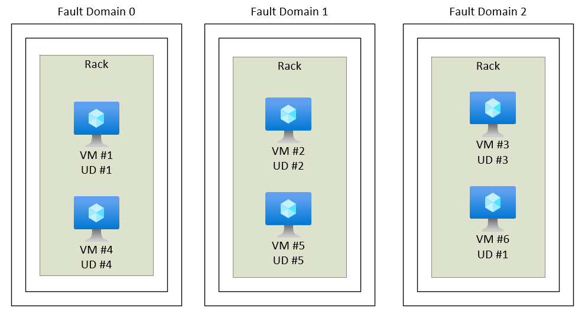

    
# Availability options for Azure Virtual Machines
This article provides you with an overview of the availability features of Azure virtual machines (VMs).

## Availability zones

[Availability zones](../availability-zones/az-overview.md) expands the level of control you have to maintain the availability of the applications and data on your VMs. An Availability Zone is a physically separate zone, within an Azure region. There are three Availability Zones per supported Azure region. 

Each Availability Zone has a distinct power source, network, and cooling. By designing your solutions to use replicated VMs in zones, you can protect your apps and data from the loss of a data center. If one zone is compromised, then replicated apps and data are instantly available in another zone. 

:::image type="content" source="media/virtual-machines-common-regions-and-availability/three-zones-per-region.png" alt-text="Image shows 3 available data centers in a region.":::

Learn more about deploying a [Windows](./windows/create-powershell-availability-zone.md) or [Linux](./linux/create-cli-availability-zone.md) VM in an Availability Zone.

## Availability sets
An availability set is a logical grouping of VMs that allows Azure to understand how your application is built to provide for redundancy and availability. We recommended that two or more VMs are created within an availability set to provide for a highly available application and to meet the [99.95% Azure SLA](https://azure.microsoft.com/support/legal/sla/virtual-machines/). There is no cost for the Availability Set itself, you only pay for each VM instance that you create.

## Virtual Machines Scale Sets 

Azure virtual machine scale sets let you create and manage a group of load balanced VMs. The number of VM instances can automatically increase or decrease in response to demand or a defined schedule. Scale sets provide high availability to your applications, and allow you to centrally manage, configure, and update many VMs. We recommended that two or more VMs are created within a scale set to provide for a highly available application and to meet the [99.95% Azure SLA](https://azure.microsoft.com/support/legal/sla/virtual-machines/). There is no cost for the scale set itself, you only pay for each VM instance that you create. When a single VM is using [Azure premium SSDs](./disks-types.md#premium-ssd), the Azure SLA applies for unplanned maintenance events. Virtual machines in a scale set can be deployed across multiple update domains and fault domains to maximize availability and resilience to outages due to data center outages, and planned or unplanned maintenance events. Virtual machines in a scale set can also be deployed into a single Availability zone, or regionally. Availability zone deployment options may differ based on the [orchestration mode](../virtual-machine-scale-sets/virtual-machine-scale-sets-orchestration-modes.md).

## Load balancer
Combine the [Azure Load Balancer](../load-balancer/load-balancer-overview.md) with an availability zone or availability set to get the most application resiliency. The Azure Load Balancer distributes traffic between multiple virtual machines. For our Standard tier virtual machines, the Azure Load Balancer is included. Not all virtual machine tiers include the Azure Load Balancer. For more information about load balancing your virtual machines, see **Load Balancing virtual machines** for [Linux](linux/tutorial-load-balancer.md) or [Windows](windows/tutorial-load-balancer.md).

If the load balancer is not configured to balance traffic across multiple virtual machines, then any planned maintenance event affects the only traffic-serving virtual machine, causing an outage to your application tier. Placing multiple virtual machines of the same tier under the same load balancer and availability set enables traffic to be continuously served by at least one instance.

## Azure Storage redundancy
Azure Storage always stores multiple copies of your data so that it is protected from planned and unplanned events, including transient hardware failures, network or power outages, and massive natural disasters. Redundancy ensures that your storage account meets its availability and durability targets even in the face of failures.

When deciding which redundancy option is best for your scenario, consider the tradeoffs between lower costs and higher availability. The factors that help determine which redundancy option you should choose include:
- How your data is replicated in the primary region
- Whether your data is replicated to a second region that is geographically distant to the primary region, to protect against regional disasters
- Whether your application requires read access to the replicated data in the secondary region if the primary region becomes unavailable for any reason

For more information, see [Azure Storage redundancy](./storage/common/storage-redundancy.md)

## Azure Site Recovery
As an organization you need to adopt a business continuity and disaster recovery (BCDR) strategy that keeps your data safe, and your apps and workloads online, when planned and unplanned outages occur.

Site Recovery helps ensure business continuity by keeping business apps and workloads running during outages. Site Recovery replicates workloads running on physical and virtual machines (VMs) from a primary site to a secondary location. When an outage occurs at your primary site, you fail over to secondary location, and access apps from there. After the primary location is running again, you can fail back to it.

Site Recovery can manage replication for:
- Azure VMs replicating between Azure regions.
- On-premises VMs, Azure Stack VMs, and physical servers.

For more information, see [Azure Site Recovery Overview](./site-recovery/site-recovery-overview.md)

## Next steps
You can now start to use these availability and redundancy features to build your Azure environment. For best practices information, see [Azure availability best practices](/azure/architecture/checklist/resiliency-per-service).
