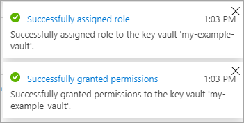

# Azure portal - Enable double encryption at rest on your managed disks

Azure Disk Storage supports double encryption at rest for managed disks. For conceptual information on double encryption at rest, as well as other managed disk encryption types, see the **Double encryption at rest** section of our disk encryption article:

- For Linux: [Double encryption at rest](./linux/disk-encryption.md#double-encryption-at-rest)
- For Windows: [Double encryption at rest](./windows/disk-encryption.md#double-encryption-at-rest)

## Supported regions

[!INCLUDE [virtual-machines-disks-double-encryption-at-rest-regions](../../includes/virtual-machines-disks-double-encryption-at-rest-regions.md)]

## Getting started

1. Sign in to the [Azure portal](https://aka.ms/diskencryptionupdates).

    > [!IMPORTANT]
    > You must use the [provided link](https://aka.ms/diskencryptionupdates) to access the Azure portal. Double encryption at rest is not currently visible in the public Azure portal without using the link.

1. Search for and select **Disk Encryption Sets**.

    :::image type="content" source="media/virtual-machines-disks-double-encryption-at-rest-portal/double-encryption-disk-encryption-sets-search.png" alt-text="Screenshot of the main Azure portal, disk encryption sets is highlighted in the search bar.":::

1. Select **+ Add**.

    :::image type="content" source="media/virtual-machines-disks-double-encryption-at-rest-portal/double-encryption-add-disk-encryption-set.png" alt-text="Screenshot of the disk encryption set blade, + Add is highlighted.":::

1. Select one of the supported regions.
1. For **Encryption type**, select **Double encryption with platform-managed and customer-managed keys**.

    > [!NOTE]
    > Once you create a disk encryption set with a particular encryption type, it cannot be changed. If you want to use a different encryption type, you must create a new disk encryption set.

1. Fill in the remaining info.

    :::image type="content" source="media/virtual-machines-disks-double-encryption-at-rest-portal/double-encryption-create-disk-encryption-set-blade.png" alt-text="Screenshot of the disk encryption set creation blade, regions and double encryption with platform-managed and customer-managed keys are highlighted.":::

1. Select an Azure Key Vault and key, or create a new one if necessary.

    > [!NOTE]
    > If you create a Key Vault instance, you must enable soft delete and purge protection. These settings are mandatory when using a Key Vault for encrypting managed disks, and protect you from losing data due to accidental deletion.

    :::image type="content" source="media/virtual-machines-disks-double-encryption-at-rest-portal/double-encryption-select-key-vault.png" alt-text="Screenshot of the Key Vault creation blade.":::

1. Select **Create**.
1. Navigate to the disk encryption set you created, and select the error that is displayed. This will configure your disk encryption set to work.

    :::image type="content" source="media/virtual-machines-disks-double-encryption-at-rest-portal/double-encryption-disk-set-error.png" alt-text="Screenshot of the disk encryption set displayed error, the error text is: To associate a disk, image, or snapshot with this disk encryption set, you must grant permissions to the key vault.":::

    A notification should pop up and succeed. Doing this will allow you to use the disk encryption set with your key vault.
    
    

1. Navigate to your disk.
1. Select **Encryption**.
1. For **Encryption type**, select **Double encryption with platform-managed and customer-managed keys**.
1. Select your disk encryption set.
1. select **Save**.

    :::image type="content" source="media/virtual-machines-disks-double-encryption-at-rest-portal/double-encryption-enable-disk-blade.png" alt-text="Screenshot of the encryption blade for your managed disk, the aforementioned encryption type is highlighted.":::

You have now enabled double encryption at rest on your managed disk.

## Next steps

- [Azure PowerShell - Enable customer-managed keys with server-side encryption - managed disks](./windows/disks-enable-customer-managed-keys-powershell.md)
- [Azure Resource Manager template samples](https://github.com/Azure-Samples/managed-disks-powershell-getting-started/tree/master/DoubleEncryption)
- [Enable customer-managed keys with server-side encryption - Examples](./linux/disks-enable-customer-managed-keys-cli.md#examples)