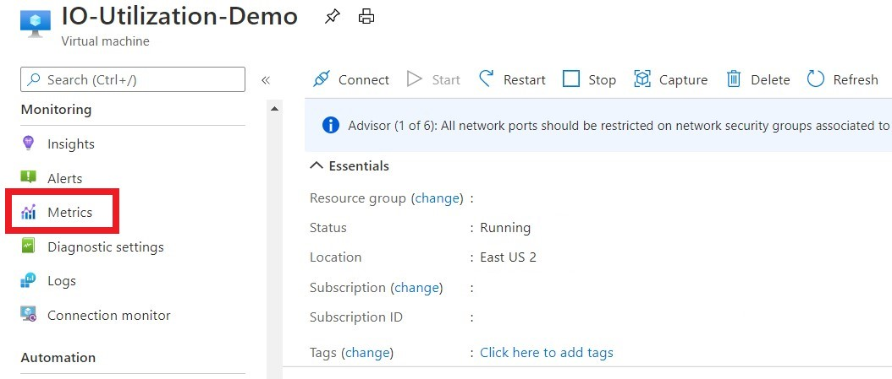
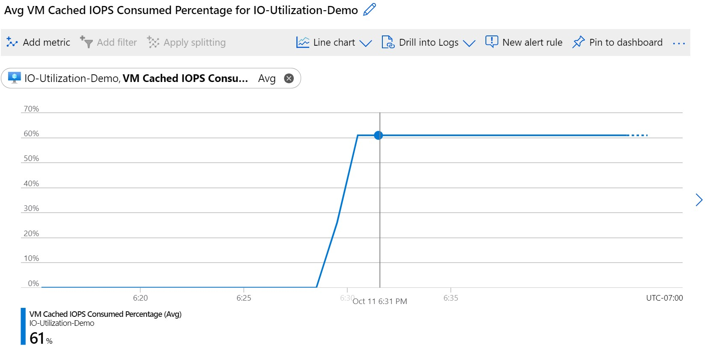

# Disk performance metrics
Azure offers metrics in the Azure portal that provide insight on how your virtual machines (VM) and disks are performing. The metrics can also be retrieved through an API call. Metrics are calculated over one-minute intervals. 

## Disk IO, throughput and queue depth metrics
The following metrics are available to get insight on VM and Disk IO, throughput, and queue depth performance:

- **OS Disk Queue Depth**: The number of current outstanding IO requests that are waiting to be read from or written to the OS disk.
- **OS Disk Read Bytes/Sec**: The number of bytes that are read in a second from the OS disk.
- **OS Disk Read Operations/Sec**: The number of input operations that are read in a second from the OS disk.
- **OS Disk Write Bytes/Sec**: The number of bytes that are written in a second from the OS disk.
- **OS Disk Write Operations/Sec**: The number of output operations that are written in a second from the OS disk.
- **Data Disk Queue Depth**: The number of current outstanding IO requests that are waiting to be read from or written to the data disk(s).
- **Data Disk Read Bytes/Sec**: The number of bytes that are read in a second from the data disk(s).
- **Data Disk Read Operations/Sec**: The number of input operations that are read in a second from data disk(s).
- **Data Disk Write Bytes/Sec**: The number of bytes that are written in a second from the data disk(s).
- **Data Disk Write Operations/Sec**: The number of output operations that are written in a second from data disk(s).
- **Disk Read Bytes/Sec**: The number of total bytes that are read in a second from all disks attached to a VM.
- **Disk Read Operations/Sec**: The number of input operations that are read in a second from all disks attached to a VM.
- **Disk Write Bytes/Sec**: The number of bytes that are written in a second from all disks attached to a VM.
- **Disk Write Operations/Sec**: The number of output operations that are written in a second from all disks attached to a VM.

## Bursting Metrics
The following metrics help with observability into our [bursting](disk-bursting.md) feature on our premium disks:

- **Data Disk Max Burst Bandwidth**: The throughput limit that the data disk(s) can burst up to.
- **OS Disk Max Burst Bandwidth**: The throughput limit that the OS disk can burst up to.
- **Data Disk Max Burst IOPS**: the IOPS limit that the data disk(s) can burst up to.
- **OS Disk Max Burst IOPS**: The IOPS limit that the OS disk can burst up to.
- **Data Disk Target Bandwidth**: The throughput limit that the data(s) disk can achieve without bursting.
- **OS Disk Target Bandwidth**: The throughput limit that the OS disk can achieve without bursting.
- **Data Disk Target IOPS**: The IOPS limit that the data disk(s) can achieve without bursting.
- **OS Disk Target IOPS**: The IOPS limit that the data disk(s) can achieve without bursting.
- **Data Disk Used Burst BPS Credits Percentage**: The accumulated percentage of the throughput burst used for the data disk(s).
- **OS Disk Used Burst BPS Credits Percentage**: The accumulated percentage of the throughput burst used for the OS disk.
- **Data Disk Used Burst IO Credits Percentage**: The accumulated percentage of the IOPS burst used for the data disk(s).
- **OS Disk Used Burst IO Credits Percentage**: The accumulated percentage of the IOPS burst used for the OS disk.

## Storage IO utilization metrics
The following metrics help diagnose bottleneck in your Virtual Machine and Disk combination. These metrics are only available when using Premium enabled VM. These metrics are available for all disk types except for Ultra. 

Metrics that help diagnose disk IO capping:

- **Data Disk IOPS Consumed Percentage**: The percentage calculated by the data disk IOPS completed over the provisioned data disk IOPS. If this amount is at 100%, your application running is IO capped from your data disk's IOPS limit.
- **Data Disk Bandwidth Consumed Percentage**: The percentage calculated by the data disk throughput completed over the provisioned data disk throughput. If this amount is at 100%, your application running is IO capped from your data disk's bandwidth limit.
- **OS Disk IOPS Consumed Percentage**: The percentage calculated by the OS disk IOPS completed over the provisioned OS disk IOPS. If this amount is at 100%, your application running is IO capped from your OS disk's IOPS limit.
- **OS Disk Bandwidth Consumed Percentage**: The percentage calculated by the OS disk throughput completed over the provisioned OS disk throughput. If this amount is at 100%, your application running is IO capped from your OS disk's bandwidth limit.

Metrics that help diagnose VM IO capping:

- **VM Cached IOPS Consumed Percentage**: The percentage calculated by the total IOPS completed over the max cached virtual machine IOPS limit. If this amount is at 100%, your application running is IO capped from your VM's cached IOPS limit.
- **VM Cached Bandwidth Consumed Percentage**: The percentage calculated by the total disk throughput completed over the max cached virtual machine throughput. If this amount is at 100%, your application running is IO capped from your VM's cached bandwidth limit.
- **VM uncached IOPS Consumed Percentage**: The percentage calculated by the total IOPS on a virtual machine completed over the max uncached  virtual machine IOPS limit. If this amount is at 100%, your application running is IO capped from your VM's uncached IOPS limit.
- **VM Uncached Bandwidth Consumed Percentage**: The percentage calculated by the total disk throughput on a virtual machine completed over the max provisioned virtual machine throughput. If this amount is at 100%, your application running is IO capped from your VM's uncached bandwidth limit.

## Storage IO metrics example

Let's run through an example of how to use these new Storage IO utilization metrics to help us debug where a bottleneck is in our system. The system setup is the same as the previous example, except this time the attached OS disk is *not* cached.

**Setup:**

- Standard_D8s_v3
  - Cached IOPS: 16,000
  - Uncached IOPS: 12,800
- P30 OS disk
  - IOPS: 5,000
  - Host caching: **Disabled**
- Two P30 data disks × 2
  - IOPS: 5,000
  - Host caching: **Read/write**
- Two P30 data disks × 2
  - IOPS: 5,000
  - Host caching: **Disabled**

Let's run a benchmarking test on this virtual machine and disk combination that creates IO activity. To learn how to benchmark storage IO on Azure, see [Benchmark your application on Azure Disk Storage](disks-benchmarks.md). From the benchmarking tool, you can see that the VM and disk combination can achieve 22,800 IOPS:

The Standard_D8s_v3 can achieve a total of 28,600 IOPS. Using the metrics, let's investigate what's going on and identify our storage IO bottleneck. On the left pane, select **Metrics**:

Let's first take a look at our **VM Cached IOPS Consumed Percentage** metric:

This metric tells us that 61% of the 16,000 IOPS allotted to the cached IOPS on the VM is being used. This percentage means that the storage IO bottleneck isn't with the disks that are cached because it isn't at 100%. Now let's look at our **VM Uncached IOPS Consumed Percentage** metric:

This metric is at 100%. It tells us that all of the 12,800 IOPS allotted to the uncached IOPS on the VM are being used. One way we can remediate this issue is to change the size of our VM to a larger size that can handle the additional IO. But before we do that, let's look at the attached disk to find out how many IOPS they are seeing. Check the OS Disk by looking at the **OS Disk IOPS Consumed Percentage**:

This metric tells us that around 90% of the 5,000 IOPS provisioned for this P30 OS disk is being used. This percentage means there's no bottleneck at the OS disk. Now let's check the data disks that are attached to the VM by looking at the **Data Disk IOPS Consumed Percentage**:

This metric tells us that the average IOPS consumed percentage across all the disks attached is around 42%. This percentage is calculated based on the IOPS that are used by the disks, and that aren't being served from the host cache. Let's drill deeper into this metric by applying *splitting* on these metrics and splitting by the LUN value:

This metric tells us the data disks attached on LUN 3 and 2 are using around 85% of their provisioned IOPS. Here is a diagram of what the IO looks like from the VM and disks architecture:

