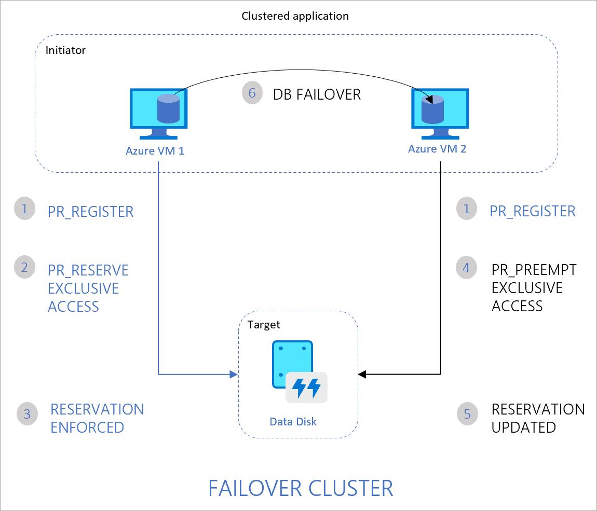
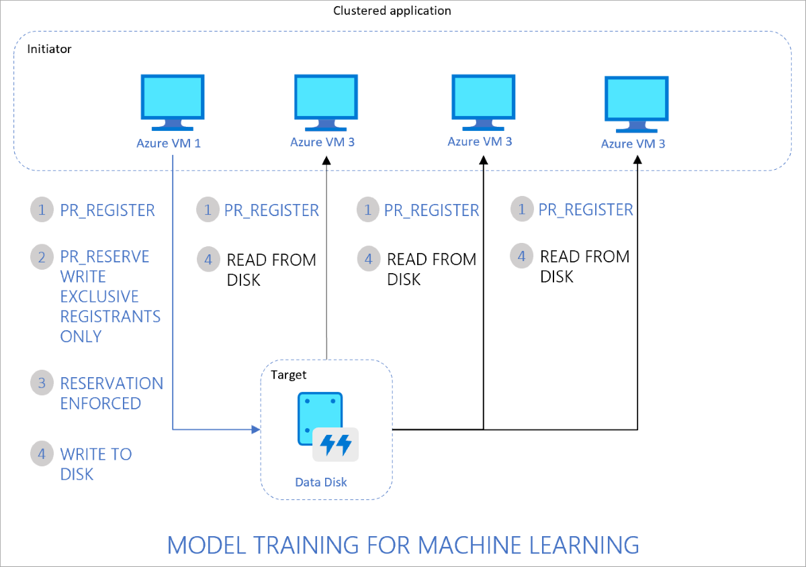

# Share an Azure managed disk

**Applies to:** :heavy_check_mark: Linux VMs :heavy_check_mark: Windows VMs :heavy_check_mark: Flexible scale sets :heavy_check_mark: Uniform scale sets

Azure shared disks is a feature for Azure managed disks that allow you to attach a managed disk to multiple virtual machines (VMs) simultaneously. Attaching a managed disk to multiple VMs allows you to either deploy new or migrate existing clustered applications to Azure.

## How it works

VMs in the cluster can read or write to their attached disk based on the reservation chosen by the clustered application using [SCSI Persistent Reservations](https://www.t10.org/members/w_spc3.htm) (SCSI PR). SCSI PR is an industry standard used by applications running on Storage Area Network (SAN) on-premises. Enabling SCSI PR on a managed disk allows you to migrate these applications to Azure as-is.

Shared managed disks offer shared block storage that can be accessed from multiple VMs, these are exposed as logical unit numbers (LUNs). LUNs are then presented to an initiator (VM) from a target (disk). These LUNs look like direct-attached-storage (DAS) or a local drive to the VM.

Shared managed disks don't natively offer a fully managed file system that can be accessed using SMB/NFS. You need to use a cluster manager, like Windows Server Failover Cluster (WSFC), or Pacemaker, that handles cluster node communication and write locking.

## Billing implications

When using shared disks, your billing could be impacted in two different ways, depending on the type of disk you're sharing.

For shared premium SSDs, there's an extra charge that increases with each VM the SSD is mounted to. See [managed disks pricing](https://azure.microsoft.com/en-us/pricing/details/managed-disks/) for details.

Ultra disks don't have an extra charge for each VM that they're mounted to. They're billed on the total IOPS and MBps that the disk is configured for. Originally, an ultra disk only has two performance throttles that determine its total IOPS/MBps. However, when configured as a shared ultra disk, two more performance throttles are exposed, for a total of four. These two extra meters allow for increased performance at an extra expense and each meter has a default value, which raises the performance and cost of the disk.

The four performance throttles a shared ultra disk has are diskMBpsReadWrite, diskIOPSReadOnly, diskMBpsReadWrite, and diskMBpsReadOnly. Each performance throttle can be configured to change the performance of your disk. The performance for shared ultra disk is calculated in the following ways: total provisioned IOPS (diskIOPSReadWrite + diskIOPSReadOnly) and for total provisioned throughput MBps (diskMBpsReadWrite + diskMBpsReadOnly). The total provisioned IOPS and total provisioned throughput are what you would use in the [pricing calculator](https://azure.microsoft.com/en-us/pricing/calculator/?service=managed-disks) to determine the cost of an ultra shared disk.

## Limitations

[!INCLUDE [virtual-machines-disks-shared-limitations](../../includes/virtual-machines-disks-shared-limitations.md)]

### Operating system requirements

Shared disks support several operating systems. See the [Windows](#windows) or [Linux](#linux) sections for the supported operating systems.

## Disk sizes

[!INCLUDE [virtual-machines-disks-shared-sizes](../../includes/virtual-machines-disks-shared-sizes.md)]

## Sample workloads

### Windows

Azure shared disks are supported on Windows Server 2008 and newer. Most Windows-based clustering builds on WSFC, which handles all core infrastructure for cluster node communication, allowing your applications to take advantage of parallel access patterns. WSFC enables both CSV and non-CSV-based options depending on your version of Windows Server. For details, refer to [Create a failover cluster](/windows-server/failover-clustering/create-failover-cluster).

Some popular applications running on WSFC include:

- [Create an FCI with Azure shared disks (SQL Server on Azure VMs)](/azure/azure-sql/virtual-machines/windows/failover-cluster-instance-azure-shared-disks-manually-configure)
    - [Migrate your failover cluster instance to SQL Server on Azure VMs with shared disks](/azure/azure-sql/migration-guides/virtual-machines/sql-server-failover-cluster-instance-to-sql-on-azure-vm)
- Scale-out File Server (SoFS) [template](https://aka.ms/azure-shared-disk-sofs-template)
- SAP ASCS/SCS [template](https://aka.ms/azure-shared-disk-sapacs-template)
- File Server for General Use (IW workload)
- Remote Desktop Server User Profile Disk (RDS UPD)

### Linux

Azure shared disks are supported on:
- [SUSE SLE HA 15 SP1 and above](https://www.suse.com/c/azure-shared-disks-excercise-w-sles-for-sap-or-sle-ha/)
- [Ubuntu 18.04 and above](https://discourse.ubuntu.com/t/ubuntu-high-availability-corosync-pacemaker-shared-disk-environments/14874)
- [RHEL 8.3 and above](https://access.redhat.com/documentation/en-us/red_hat_enterprise_linux/8/html-single/deploying_red_hat_enterprise_linux_8_on_public_cloud_platforms/index?lb_target=production#azure-configuring-shared-block-storage-configuring-rhel-high-availability-on-azure)
    - It may be possible to use RHEL 7 or an older version of RHEL 8 with shared disks, contact SharedDiskFeedback @microsoft.com
- [Oracle Enterprise Linux](https://docs.oracle.com/en/operating-systems/oracle-linux/8/availability/)

Linux clusters can use cluster managers such as [Pacemaker](https://wiki.clusterlabs.org/wiki/Pacemaker). Pacemaker builds on [Corosync](http://corosync.github.io/corosync/), enabling cluster communications for applications deployed in highly available environments. Some common clustered filesystems include [ocfs2](https://oss.oracle.com/projects/ocfs2/) and [gfs2](https://access.redhat.com/documentation/en-us/red_hat_enterprise_linux/7/html/global_file_system_2/ch-overview-gfs2). You can use SCSI Persistent Reservation (SCSI PR) and/or STONITH Block Device (SBD) based clustering models for arbitrating access to the disk. When using SCSI PR, you can manipulate reservations and registrations using utilities such as [fence_scsi](http://manpages.ubuntu.com/manpages/eoan/man8/fence_scsi.8.html) and [sg_persist](https://linux.die.net/man/8/sg_persist).

## Persistent reservation flow

The following diagram illustrates a sample 2-node clustered database application that uses SCSI PR to enable failover from one node to the other.

The flow is as follows:

1. The clustered application running on both Azure VM1 and VM2 registers its intent to read or write to the disk.
1. The application instance on VM1 then takes exclusive reservation to write to the disk.
1. This reservation is enforced on your Azure disk and the database can now exclusively write to the disk. Any writes from the application instance on VM2 won't succeed.
1. If the application instance on VM1 goes down, the instance on VM2 can now initiate a database failover and take-over of the disk.
1. This reservation is now enforced on the Azure disk and the disk will no longer accept writes from VM1. It will only accept writes from VM2.
1. The clustered application can complete the database failover and serve requests from VM2.

The following diagram illustrates another common clustered workload consisting of multiple nodes reading data from the disk for running parallel processes, such as training of machine learning models.

The flow is as follows:

1. The clustered application running on all VMs registers the intent to read or write to the disk.
1. The application instance on VM1 takes an exclusive reservation to write to the disk while opening up reads to the disk from other VMs.
1. This reservation is enforced on your Azure disk.
1. All nodes in the cluster can now read from the disk. Only one node writes back results to the disk, on behalf of all nodes in the cluster.

### Ultra disks reservation flow

Ultra disks offer an extra throttle, for a total of two throttles. Due to this, ultra disks reservation flow can work as described in the earlier section, or it can throttle and distribute performance more granularly.

:::image type="content" source="media/virtual-machines-disks-shared-disks/ultra-reservation-table.png" alt-text="An image of a table that depicts the `ReadOnly` or `Read/Write` access for Reservation Holder, Registered, and Others.":::

## Performance throttles

### Premium SSD performance throttles

With premium SSD, the disk IOPS and throughput is fixed, for example, IOPS of a P30 is 5000. This value remains whether the disk is shared across 2 VMs or 5 VMs. The disk limits can be reached from a single VM or divided across two or more VMs. 

### Ultra disk performance throttles

Ultra disks have the unique capability of allowing you to set your performance by exposing modifiable attributes and allowing you to modify them. By default, there are only two modifiable attributes but, shared ultra disks have two more attributes.

|Attribute  |Description  |
|---------|---------|
|DiskIOPSReadWrite     |The total number of IOPS allowed across all VMs mounting the shared disk with write access.         |
|DiskMBpsReadWrite     |The total throughput (MB/s) allowed across all VMs mounting the shared disk with write access.         |
|DiskIOPSReadOnly*     |The total number of IOPS allowed across all VMs mounting the shared disk as `ReadOnly`.         |
|DiskMBpsReadOnly*     |The total throughput (MB/s) allowed across all VMs mounting the shared disk as `ReadOnly`.         |

\* Applies to shared ultra disks only

The following formulas explain how the performance attributes can be set, since they're user modifiable:

- DiskIOPSReadWrite/DiskIOPSReadOnly: 
    - IOPS limits of 300 IOPS/GiB, up to a maximum of 160 K IOPS per disk
    - Minimum of 100 IOPS
    - DiskIOPSReadWrite  + DiskIOPSReadOnly is at least 2 IOPS/GiB
- DiskMBpsRead    Write/DiskMBpsReadOnly:
    - The throughput limit of a single disk is 256 KiB/s for each provisioned IOPS, up to a maximum of 2000 MBps per disk
    - The minimum guaranteed throughput per disk is 4KiB/s for each provisioned IOPS, with an overall baseline minimum of 1 MBps

#### Examples

The following examples depict a few scenarios that show how the throttling can work with shared ultra disks, specifically.

##### Two nodes cluster using cluster shared volumes

The following is an example of a 2-node WSFC using clustered shared volumes. With this configuration, both VMs have simultaneous write-access to the disk, which results in the `ReadWrite` throttle being split across the two VMs and the `ReadOnly` throttle not being used.

:::image type="content" source="media/virtual-machines-disks-shared-disks/ultra-two-node-example.png" alt-text="CSV two node ultra example":::

##### Two node cluster without cluster share volumes

The following is an example of a 2-node WSFC that isn't using clustered shared volumes. With this configuration, only one VM has write-access to the disk. This results in the `ReadWrite` throttle being used exclusively for the primary VM and the `ReadOnly` throttle only being used by the secondary.

:::image type="content" source="media/virtual-machines-disks-shared-disks/ultra-two-node-no-csv.png" alt-text="CSV two nodes no csv ultra disk example":::

##### Four node Linux cluster

The following is an example of a 4-node Linux cluster with a single writer and three scale-out readers. With this configuration, only one VM has write-access to the disk. This results in the `ReadWrite` throttle being used exclusively for the primary VM and the `ReadOnly` throttle being split by the secondary VMs.

:::image type="content" source="media/virtual-machines-disks-shared-disks/ultra-four-node-example.png" alt-text="Four node ultra throttling example":::

##### Ultra pricing

Ultra shared disks are priced based on provisioned capacity, total provisioned IOPS (diskIOPSReadWrite + diskIOPSReadOnly) and total provisioned Throughput MBps (diskMBpsReadWrite + diskMBpsReadOnly). There's no extra charge for each additional VM mount. For example, an ultra shared disk with the following configuration (diskSizeGB: 1024, DiskIOPSReadWrite: 10000, DiskMBpsReadWrite: 600, DiskIOPSReadOnly: 100, DiskMBpsReadOnly: 1) is charged with 1024 GiB, 10100 IOPS, and 601 MBps regardless of whether it is mounted to two VMs or five VMs.

## Next steps

If you're interested in enabling and using shared disks for your managed disks, proceed to our article [Enable shared disk](disks-shared-enable.md)
