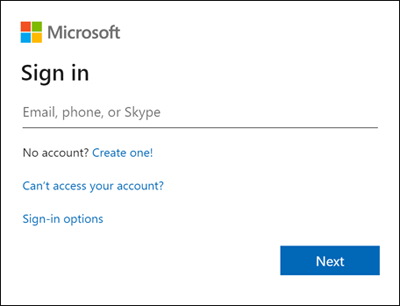

# Use Azure Storage Explorer to manage Azure managed disks

**Applies to:** :heavy_check_mark: Linux VMs :heavy_check_mark: Windows VMs :heavy_check_mark: Flexible scale sets :heavy_check_mark: Uniform scale sets

Azure Storage Explorer enables users to upload, download, and copy managed disks, as well as create snapshots. Because of these additional capabilities, you can use Storage Explorer to migrate data from on-premises to Azure, and migrate data across Azure regions.

## Prerequisites

To complete this article, you'll need the following:
- An Azure subscription
- One or more Azure managed disks
- The latest version of [Azure Storage Explorer](https://azure.microsoft.com/features/storage-explorer/)

## Connect to an Azure subscription

If your Storage Explorer isn't connected to Azure, you won't be able to use it to manage resources. Follow the steps in this section to connect Storage Explorer to your Azure account and use it to manage resources.

1. Launch Azure Storage Explorer and click the **plug-in** icon on the left.

    

1. Select **Subscription**, and then click **Next**.

    

1. Select the appropriate environment and click **Next**. Alternatively, you can click **Manage custom environments** to configure and add a custom environment.

    :::image type="content" source="media/disks-upload-vhd-to-managed-disk-storage-explorer/choose-environment.png" alt-text="Select your environment type":::

1. In the **Azure Sign in** dialog box, enter your Azure credentials.

    

1. Select your subscription from the list and then click **Apply**.

    

## Upload a managed disk from an on-prem virtual hard disk

1. In the left pane, expand **Disks** and select the resource group to which you'll upload your disk.

    

1. Select **Upload**.

    

1. In **Upload VHD** specify your virtual hard disk (VHD) source file, the name of the disk, the operating system type, the region to which you want to upload the disk, and the account type. In some regions availability zones are supported, and in those regions you can select a zone of your choice.
1. Select **Create** to begin uploading your disk.

    

1. The status of the upload will now display in **Activities**.

    

If the upload has finished and you don't see the disk in the right pane, click the **Refresh** button.

## Download a managed disk

Follow the steps below to download a managed disk to an on-prem VHD. A disk's state must be **Unattached** in order to be downloaded. You cannot download an **Attached** disk.

1. In the left pane, expand **Disks** and select the resource group from which you will download your disk.

    

1. In the right pane, select the disk you want to download.
1. Select **Download** and then choose where you would like to save the disk.

    

1. Select **Save** the begin the download. The download status will display in **Activities**.

    

## Copy a managed disk

With Storage Explorer, you can copy a manged disk within or across regions. To copy a disk:

1. From the **Disks** dropdown on the left, select the resource group that contains the disk you want to copy.

    

1. In the right pane, select the disk you'd like to copy and select **Copy**.

    

1. In the left pane, select the resource group in which you'd like to paste the disk.

    

1. Select **Paste** on the right pane.

    

1. In the **Paste Disk** dialog, fill in the values. You can also specify an availability zone in supported regions.

    

1. Select **Paste** to begin the disk copy. The status is displayed in **Activities**.

    

## Create a snapshot

1. From the **Disks** dropdown on the left, select the resource group that contains the disk you want to snapshot.

    

1. On the right, select the disk you'd like to snapshot and select **Create Snapshot**.

    

1. In **Create Snapshot**, specify the name of the snapshot as well as the resource group in which you will create it. Select **Create**.

    

1. Once the snapshot has been created, you can select **Open in Portal** in **Activities** to view the snapshot in the Azure portal.

    

## Next steps

Learn how to [Create a virtual machine from a VHD by using the Azure portal](windows/create-vm-specialized-portal.md).

Learn how to [Attach a managed data disk to a Windows virtual machine by using the Azure portal](windows/attach-managed-disk-portal.md).
