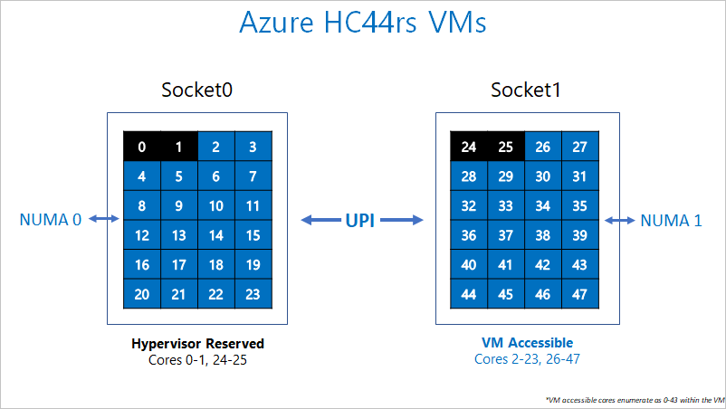

# HC-series virtual machine overview

**Applies to:** :heavy_check_mark: Linux VMs :heavy_check_mark: Windows VMs :heavy_check_mark: Flexible scale sets :heavy_check_mark: Uniform scale sets

Maximizing HPC application performance on Intel Xeon Scalable Processors requires a thoughtful approach to process placement on this new architecture. Here, we outline our implementation of it on Azure HC-series VMs for HPC applications. We'll use the term “pNUMA” to refer to a physical NUMA domain, and “vNUMA” to refer to a virtualized NUMA domain. Similarly, we'll use the term “pCore” to refer to physical CPU cores, and “vCore” to refer to virtualized CPU cores.

Physically, an [HC-series](hc-series.md) server is 2 * 24-core Intel Xeon Platinum 8168 CPUs for a total of 48 physical cores. Each CPU is a single pNUMA domain, and has unified access to six channels of DRAM. Intel Xeon Platinum CPUs feature a 4x larger L2 cache than in prior generations (256 KB/core -> 1 MB/core), while also reducing the L3 cache compared to prior Intel CPUs (2.5 MB/core -> 1.375 MB/core).

The above topology carries over to the HC-series hypervisor configuration as well. To provide room for the Azure hypervisor to operate without interfering with the VM, we reserve pCores 0-1 and 24-25 (that is, the first 2 pCores on each socket). We then assign pNUMA domains all remaining cores to the VM. Thus, the VM will see:

`(2 vNUMA domains) * (22 cores/vNUMA) = 44` cores per VM

The VM has no knowledge that pCores 0-1 and 24-25 weren't given to it. Thus, it exposes each vNUMA as if it natively had 22 cores.

Intel Xeon Platinum, Gold, and Silver CPUs also introduce an on-die 2D mesh network for communication within and external to the CPU socket. We strongly recommend process pinning for optimal performance and consistency. Process pinning will work on HC-series VMs because the underlying silicon is exposed as-is to the guest VM.

The following diagram shows the segregation of cores reserved for Azure Hypervisor and the HC-series VM.

## Hardware specifications

| Hardware Specifications          | HC-series VM                     |
|----------------------------------|----------------------------------|
| Cores                            | 44 (HT disabled)                 |
| CPU                              | Intel Xeon Platinum 8168         |
| CPU Frequency (non-AVX)          | 3.7 GHz (single core), 2.7-3.4 GHz (all cores) |
| Memory                           | 8 GB/core (352 total)            |
| Local Disk                       | 700 GB SSD                       |
| Infiniband                       | 100 Gb EDR Mellanox ConnectX-5   |
| Network                          | 50 Gb Ethernet (40 Gb usable) Azure second Gen SmartNIC    |

## Software specifications

| Software Specifications     |HC-series VM           |
|-----------------------------|-----------------------|
| Max MPI Job Size            | 13200 cores (300 VMs in a single virtual machine scale set with singlePlacementGroup=true)  |
| MPI Support                 | HPC-X, Intel MPI, OpenMPI, MVAPICH2, MPICH, Platform MPI  |
| Additional Frameworks       | UCX, libfabric, PGAS |
| Azure Storage Support       | Standard and Premium Disks (maximum 4 disks) |
| OS Support for SRIOV RDMA   | RHEL 7.6+, Ubuntu 20.04+, SLES 15.4, WinServer 2016+  |
| Orchestrator Support        | CycleCloud, Batch, AKS; [cluster configuration options](sizes-hpc.md#cluster-configuration-options)  |

> [!IMPORTANT]
> * This document references a release version of Linux that is nearing or at, End of Life(EOL). Please consider updating to a more current version.
> * There is no official kernel level support from AMD on CentOS, the support starts at RHEL.

## Next steps

- Learn more about [Intel Xeon SP architecture](https://software.intel.com/content/www/us/en/develop/articles/intel-xeon-processor-scalable-family-technical-overview.html).
- Read about the latest announcements, HPC workload examples, and performance results at the [Azure Compute Tech Community Blogs](https://techcommunity.microsoft.com/t5/azure-compute/bg-p/AzureCompute).
- For a higher level architectural view of running HPC workloads, see [High Performance Computing (HPC) on Azure](/azure/architecture/topics/high-performance-computing/).
