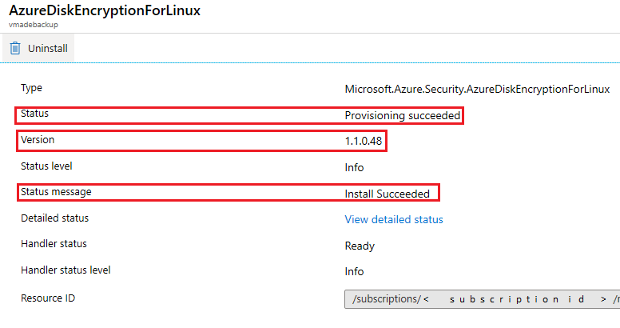
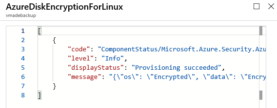

# How to verify encryption status for Linux 

**This scenario applies for ADE dual-pass and single-pass extensions.**  
This Document scope is to validate the encryption status of a virtual machine using different methods.

### Environment

- Linux distributions

### Procedure

A virtual machine has been encrypted using dual-pass or single-pass.

The encryption status can be validated during or after the encryption using different methods.

>[!NOTE] 
>We're using variables throughout the document, replace the values accordingly.

### Verification

The verification can be done from the Portal, PowerShell, AZ CLI and, or from the VM OS side. 

This verification can be done by checking the disks attached to a particular VM. 

Or by querying the encryption settings on each individual disk whether the disk is attached or unattached.

Below the different validations methods:

## Using the Portal

Validate the encryption status by checking the extensions section on the Azure portal.

Inside the **Extensions** section, you'll see the ADE extension listed. 

Click it and take a look at the **status message**, it will indicate the current encryption status:



In the list of extensions, you'll see the corresponding ADE extension version. Version 0.x corresponds to ADE Dual-Pass and version 1.x corresponds to ADE Single-pass.

You can get further details clicking on the extension and then on *View detailed status*.

You'll see a more detailed status of the encryption process in json format:




Another way of validating the encryption status is by taking a look at the **Disks** section.


>[!NOTE] 
> This status means the disks have encryption settings stamped but not that they were actually encrypted at OS level. 
> By design, the disks get stamped first and encrypted later. 
> If the encryption process fails, the disks may end up stamped but not encrypted. 
> To confirm if the disks are truly encrypted, you can double check the encryption of each disk at OS level.

## Using PowerShell

You can validate the **general** encryption status of an encrypted VM using the following PowerShell commands:

```azurepowershell
   $VMNAME="VMNAME"
   $RGNAME="RGNAME"
   Get-AzVmDiskEncryptionStatus -ResourceGroupName  ${RGNAME} -VMName ${VMNAME}
```


You can capture the encryption settings from each individual disk using the following PowerShell commands:

### **Single-Pass**
If single-pass the encryption settings are stamped in each of the disks (OS and Data).
You can capture the OS disk encryption settings in single pass as follows:

``` powershell
$RGNAME = "RGNAME"
$VMNAME = "VMNAME"

$VM = Get-AzVM -Name ${VMNAME} -ResourceGroupName ${RGNAME}  
 $Sourcedisk = Get-AzDisk -ResourceGroupName ${RGNAME} -DiskName $VM.StorageProfile.OsDisk.Name
 Write-Host "============================================================================================================================================================="
 Write-Host "Encryption Settings:"
 Write-Host "============================================================================================================================================================="
 Write-Host "Enabled:" $Sourcedisk.EncryptionSettingsCollection.Enabled
 Write-Host "Version:" $Sourcedisk.EncryptionSettingsCollection.EncryptionSettingsVersion
 Write-Host "Source Vault:" $Sourcedisk.EncryptionSettingsCollection.EncryptionSettings.DiskEncryptionKey.SourceVault.Id
 Write-Host "Secret URL:" $Sourcedisk.EncryptionSettingsCollection.EncryptionSettings.DiskEncryptionKey.SecretUrl
 Write-Host "Key URL:" $Sourcedisk.EncryptionSettingsCollection.EncryptionSettings.KeyEncryptionKey.KeyUrl
 Write-Host "============================================================================================================================================================="
```


If the disk doesn't have encryption settings stamped, the output will be empty as shown below:


Capture Data disk(s) encryption settings:

```azurepowershell
$RGNAME = "RGNAME"
$VMNAME = "VMNAME"

$VM = Get-AzVM -Name ${VMNAME} -ResourceGroupName ${RGNAME}
 clear
 foreach ($i in $VM.StorageProfile.DataDisks|ForEach-Object{$_.Name})
 {
 Write-Host "============================================================================================================================================================="
 Write-Host "Encryption Settings:"
 Write-Host "============================================================================================================================================================="
 Write-Host "Checking Disk:" $i
 $Disk=(Get-AzDisk -ResourceGroupName ${RGNAME} -DiskName $i)
 Write-Host "Encryption Enable: " $Sourcedisk.EncryptionSettingsCollection.Enabled
 Write-Host "Encryption KeyEncryptionKey: " $Sourcedisk.EncryptionSettingsCollection.EncryptionSettings.KeyEncryptionKey.KeyUrl;
 Write-Host "Encryption DiskEncryptionKey: " $Sourcedisk.EncryptionSettingsCollection.EncryptionSettings.DiskEncryptionKey.SecretUrl;
 Write-Host "============================================================================================================================================================="
 }
```


### **Dual-Pass**
In Dual Pass, the encryption settings are stamped in the VM model and not on each individual disk.

To verify the encryption settings were stamped in dual-pass, you can use the following commands:

```azurepowershell
$RGNAME = "RGNAME"
$VMNAME = "VMNAME"

$vm = Get-AzVm -ResourceGroupName ${RGNAME} -Name ${VMNAME};
$Sourcedisk = Get-AzDisk -ResourceGroupName ${RGNAME} -DiskName $VM.StorageProfile.OsDisk.Name
clear
Write-Host "============================================================================================================================================================="
Write-Host "Encryption Settings:"
Write-Host "============================================================================================================================================================="
Write-Host "Enabled:" $Sourcedisk.EncryptionSettingsCollection.Enabled
Write-Host "Version:" $Sourcedisk.EncryptionSettingsCollection.EncryptionSettingsVersion
Write-Host "Source Vault:" $Sourcedisk.EncryptionSettingsCollection.EncryptionSettings.DiskEncryptionKey.SourceVault.Id
Write-Host "Secret URL:" $Sourcedisk.EncryptionSettingsCollection.EncryptionSettings.DiskEncryptionKey.SecretUrl
Write-Host "Key URL:" $Sourcedisk.EncryptionSettingsCollection.EncryptionSettings.KeyEncryptionKey.KeyUrl
Write-Host "============================================================================================================================================================="
```


### **Unattached disks**

Check the encryption settings for disks that aren't attached to a VM.

**Managed disks**
```powershell
$Sourcedisk = Get-AzDisk -ResourceGroupName ${RGNAME} -DiskName ${TARGETDISKNAME}
Write-Host "============================================================================================================================================================="
Write-Host "Encryption Settings:"
Write-Host "============================================================================================================================================================="
Write-Host "Enabled:" $Sourcedisk.EncryptionSettingsCollection.Enabled
Write-Host "Version:" $Sourcedisk.EncryptionSettingsCollection.EncryptionSettingsVersion
Write-Host "Source Vault:" $Sourcedisk.EncryptionSettingsCollection.EncryptionSettings.DiskEncryptionKey.SourceVault.Id
Write-Host "Secret URL:" $Sourcedisk.EncryptionSettingsCollection.EncryptionSettings.DiskEncryptionKey.SecretUrl
Write-Host "Key URL:" $Sourcedisk.EncryptionSettingsCollection.EncryptionSettings.KeyEncryptionKey.KeyUrl
Write-Host "============================================================================================================================================================="
```
## Using AZ CLI

You can validate the **general** encryption status of an encrypted VM using the following AZ CLI commands:

```bash
VMNAME="VMNAME"
RGNAME="RGNAME"
az vm encryption show --name ${VMNAME} --resource-group ${RGNAME} --query "substatus"
```


### **Single Pass**
You can validate the encryption settings from each individual disk using the following AZ CLI commands:

```bash
az vm encryption show -g ${RGNAME} -n ${VMNAME} --query "disks[*].[name, statuses[*].displayStatus]"  -o table
```


>[!IMPORTANT]
> In case the disk does not have encryption settings stamped, it will be shown as 
  "Disk is  not encrypted"

Detailed Status and Encryption settings:

OS Disk:

```bash
RGNAME="RGNAME"
VMNAME="VNAME"

disk=`az vm show -g ${RGNAME} -n ${VMNAME} --query storageProfile.osDisk.name -o tsv`
for disk in $disk; do \
echo "============================================================================================================================================================="
echo -ne "Disk Name: "; az disk show -g ${RGNAME} -n ${disk} --query name -o tsv; \
echo -ne "Encryption Enabled: "; az disk show -g ${RGNAME} -n ${disk} --query encryptionSettingsCollection.enabled -o tsv; \
echo -ne "Version: "; az disk show -g ${RGNAME} -n ${TARGETDISKNAME} --query encryptionSettingsCollection.encryptionSettingsVersion -o tsv; \
echo -ne "Disk Encryption Key: "; az disk show -g ${RGNAME} -n ${disk} --query encryptionSettingsCollection.encryptionSettings[].diskEncryptionKey.secretUrl -o tsv; \
echo -ne "key Encryption Key: "; az disk show -g ${RGNAME} -n ${disk} --query encryptionSettingsCollection.encryptionSettings[].keyEncryptionKey.keyUrl -o tsv; \
echo "============================================================================================================================================================="
done
```


Data Disks:

```bash
RGNAME="RGNAME"
VMNAME="VMNAME"
az vm encryption show --name ${VMNAME} --resource-group ${RGNAME} --query "substatus"

for disk in `az vm show -g ${RGNAME} -n ${VMNAME} --query storageProfile.dataDisks[].name -o tsv`; do \
echo "============================================================================================================================================================="; \
echo -ne "Disk Name: "; az disk show -g ${RGNAME} -n ${disk} --query name -o tsv; \
echo -ne "Encryption Enabled: "; az disk show -g ${RGNAME} -n ${disk} --query encryptionSettingsCollection.enabled -o tsv; \
echo -ne "Version: "; az disk show -g ${RGNAME} -n ${TARGETDISKNAME} --query encryptionSettingsCollection.encryptionSettingsVersion -o tsv; \
echo -ne "Disk Encryption Key: "; az disk show -g ${RGNAME} -n ${disk} --query encryptionSettingsCollection.encryptionSettings[].diskEncryptionKey.secretUrl -o tsv; \
echo -ne "key Encryption Key: "; az disk show -g ${RGNAME} -n ${disk} --query encryptionSettingsCollection.encryptionSettings[].keyEncryptionKey.keyUrl -o tsv; \
echo "============================================================================================================================================================="
done
```


**Dual Pass**

``` bash
az vm encryption show --name ${VMNAME} --resource-group ${RGNAME} -o table
```


You can also check the Encryption settings on the VM Model Storage profile of the OS disk:

```bash
disk=`az vm show -g ${RGNAME} -n ${VMNAME} --query storageProfile.osDisk.name -o tsv`
for disk in $disk; do \
echo "============================================================================================================================================================="; \
echo -ne "Disk Name: "; az disk show -g ${RGNAME} -n ${disk} --query name -o tsv; \
echo -ne "Encryption Enabled: "; az disk show -g ${RGNAME} -n ${disk} --query encryptionSettingsCollection.enabled -o tsv; \
echo -ne "Version: "; az disk show -g ${RGNAME} -n ${TARGETDISKNAME} --query encryptionSettingsCollection.encryptionSettingsVersion -o tsv; \
echo -ne "Disk Encryption Key: "; az disk show -g ${RGNAME} -n ${disk} --query encryptionSettingsCollection.encryptionSettings[].diskEncryptionKey.secretUrl -o tsv; \
echo -ne "key Encryption Key: "; az disk show -g ${RGNAME} -n ${disk} --query encryptionSettingsCollection.encryptionSettings[].keyEncryptionKey.keyUrl -o tsv; \
echo "============================================================================================================================================================="
done
```


### **Unattached disks**

Check the encryption settings for disks that aren't attached to a VM.

### **Managed disks**

```bash
RGNAME="RGNAME"
TARGETDISKNAME="DISKNAME"
echo "============================================================================================================================================================="
echo -ne "Disk Name: "; az disk show -g ${RGNAME} -n ${TARGETDISKNAME} --query name -o tsv; \
echo -ne "Encryption Enabled: "; az disk show -g ${RGNAME} -n ${TARGETDISKNAME} --query encryptionSettingsCollection.enabled -o tsv; \
echo -ne "Version: "; az disk show -g ${RGNAME} -n ${TARGETDISKNAME} --query encryptionSettingsCollection.encryptionSettingsVersion -o tsv; \
echo -ne "Disk Encryption Key: "; az disk show -g ${RGNAME} -n ${TARGETDISKNAME} --query encryptionSettingsCollection.encryptionSettings[].diskEncryptionKey.secretUrl -o tsv; \
echo -ne "key Encryption Key: "; az disk show -g ${RGNAME} -n ${TARGETDISKNAME} --query encryptionSettingsCollection.encryptionSettings[].keyEncryptionKey.keyUrl -o tsv; \
echo "============================================================================================================================================================="
```
### **Unmanaged disks**

Unmanaged disks are VHD files that are stored as page blobs in Azure storage accounts.

To get the details of a specific disk, you need to provide:

The ID of the storage account that contains the disk.
A connection string for that particular storage account.
The name of the container that stores the disk.
The disk name.

This command lists all the IDs for all your storage accounts:

```bash
az storage account list --query [].[id] -o tsv
```
The storage account IDs are listed in the following form:

/subscriptions/\<subscription id>/resourceGroups/\<resource group name>/providers/Microsoft.Storage/storageAccounts/\<storage account name>

Select the appropriate ID and store it on a variable:
```bash
id="/subscriptions/<subscription id>/resourceGroups/<resource group name>/providers/Microsoft.Storage/storageAccounts/<storage account name>"
```
The connection string.

This command gets the connection string for one particular storage account and stores it on a variable:

```bash
ConnectionString=$(az storage account show-connection-string --ids $id --query connectionString -o tsv)
```

The container name.

The following command lists all the containers under a storage account:
```bash
az storage container list --connection-string $ConnectionString --query [].[name] -o tsv
```
The container used for disks is normally named "vhds"

Store the container name on a variable 
```bash
ContainerName="name of the container"
```

The disk name.

Use this command to list all the blobs on a particular container
```bash 
az storage blob list -c ${ContainerName} --connection-string $ConnectionString --query [].[name] -o tsv
```
Choose the disk you want to query and store its name on a variable.
```bash
DiskName="diskname.vhd"
```
Query the disk encryption settings
```bash
az storage blob show -c ${ContainerName} --connection-string ${ConnectionString} -n ${DiskName} --query metadata.DiskEncryptionSettings
```

## From the OS
Validate if the data disk partitions are encrypted (and the OS disk isn't)

When a partition/disk is encrypted it's displayed as **crypt** type, when it's not encrypted it's displayed as **part/disk** type

``` bash
lsblk
```


You can get further details using the following "lsblk" variant. 

You'll see a **crypt** type layer that is mounted by the extension.

The following example shows Logical Volumes and normal disks having a "**crypto\_LUKS FSTYPE**".

```bash
lsblk -o NAME,TYPE,FSTYPE,LABEL,SIZE,RO,MOUNTPOINT
```


As an extra step, you can also validate if the data disk has any keys loaded

``` bash
cryptsetup luksDump /dev/VGNAME/LVNAME
```

``` bash
cryptsetup luksDump /dev/sdd1
```

And which dm devices are listed as crypt

```bash
dmsetup ls --target crypt
```

## Next Steps

- [Azure Disk Encryption troubleshooting](disk-encryption-troubleshooting.md)
