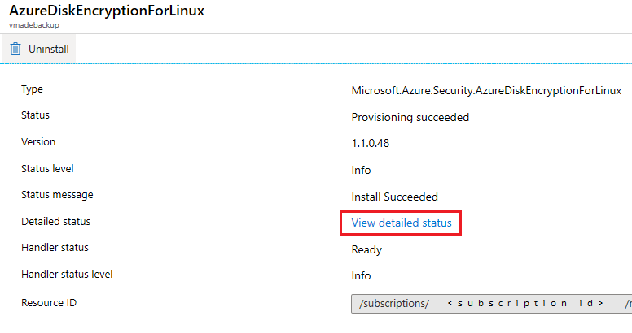
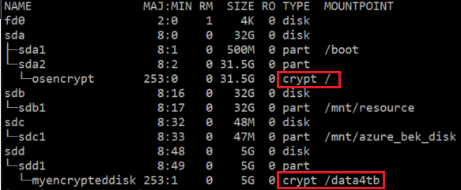

# Verify encryption status for Linux 

The scope of this article is to validate the encryption status of a virtual machine by using different methods: the Azure portal, PowerShell, the Azure CLI, or the OS of the virtual machine (VM). 

You can validate the encryption status during or after the encryption, by either:

- Checking the disks attached to a particular VM. 
- Querying the encryption settings on each disk, whether the disk is attached or unattached.

This scenario applies for Azure Disk Encryption dual-pass and single-pass extensions. Linux distributions are the only environment for this scenario.

>[!NOTE] 
>We're using variables throughout the article. Replace the values accordingly.

## Portal

Validate the encryption status by checking the extensions section on the Azure portal.

In the Azure portal, inside the **Extensions** section, select the Azure Disk Encryption extension in the list. The information for **Status message** indicates the current encryption status:


In the list of extensions, you'll see the corresponding Azure Disk Encryption extension version. Version 0.x corresponds to Azure Disk Encryption dual-pass, and version 1.x corresponds to Azure Disk Encryption single-pass.

You can get more details by selecting the extension and then selecting **View detailed status**. The detailed status of the encryption process appears in JSON format.




Another way to validate the encryption status is by looking at the **Disk settings** section.


>[!NOTE] 
> This status means the disks have encryption settings stamped but not that they were actually encrypted at the OS level.
>
> By design, the disks are stamped first and encrypted later. If the encryption process fails, the disks may end up stamped but not encrypted. 
>
> To confirm if the disks are truly encrypted, you can double check the encryption of each disk at OS level.

## PowerShell

You can validate the *general* encryption status of an encrypted VM by using the following PowerShell commands:

```azurepowershell
   $VMNAME="VMNAME"
   $RGNAME="RGNAME"
   Get-AzVmDiskEncryptionStatus -ResourceGroupName  ${RGNAME} -VMName ${VMNAME}
```


You can capture the encryption settings from each disk by using the following PowerShell commands.

### Single pass
In a single pass, the encryption settings are stamped on each of the disks (OS and data). You can capture the encryption settings for an OS disk in a single pass, as follows:

``` powershell
$RGNAME = "RGNAME"
$VMNAME = "VMNAME"

$VM = Get-AzVM -Name ${VMNAME} -ResourceGroupName ${RGNAME}  
 $Sourcedisk = Get-AzDisk -ResourceGroupName ${RGNAME} -DiskName $VM.StorageProfile.OsDisk.Name
 Write-Host "============================================================================================================================================================="
 Write-Host "Encryption Settings:"
 Write-Host "============================================================================================================================================================="
 Write-Host "Enabled:" $Sourcedisk.EncryptionSettingsCollection.Enabled
 Write-Host "Version:" $Sourcedisk.EncryptionSettingsCollection.EncryptionSettingsVersion
 Write-Host "Source Vault:" $Sourcedisk.EncryptionSettingsCollection.EncryptionSettings.DiskEncryptionKey.SourceVault.Id
 Write-Host "Secret URL:" $Sourcedisk.EncryptionSettingsCollection.EncryptionSettings.DiskEncryptionKey.SecretUrl
 Write-Host "Key URL:" $Sourcedisk.EncryptionSettingsCollection.EncryptionSettings.KeyEncryptionKey.KeyUrl
 Write-Host "============================================================================================================================================================="
```


If the disk doesn't have encryption settings stamped, the output will be empty:


Use the following commands to capture encryption settings for data disks:

```azurepowershell
$RGNAME = "RGNAME"
$VMNAME = "VMNAME"

$VM = Get-AzVM -Name ${VMNAME} -ResourceGroupName ${RGNAME}
 clear
 foreach ($i in $VM.StorageProfile.DataDisks|ForEach-Object{$_.Name})
 {
 Write-Host "============================================================================================================================================================="
 Write-Host "Encryption Settings:"
 Write-Host "============================================================================================================================================================="
 Write-Host "Checking Disk:" $i
 $Disk=(Get-AzDisk -ResourceGroupName ${RGNAME} -DiskName $i)
 Write-Host "Encryption Enable: " $Sourcedisk.EncryptionSettingsCollection.Enabled
 Write-Host "Encryption KeyEncryptionKey: " $Sourcedisk.EncryptionSettingsCollection.EncryptionSettings.KeyEncryptionKey.KeyUrl;
 Write-Host "Encryption DiskEncryptionKey: " $Sourcedisk.EncryptionSettingsCollection.EncryptionSettings.DiskEncryptionKey.SecretUrl;
 Write-Host "============================================================================================================================================================="
 }
```


### Dual pass
In a dual pass, the encryption settings are stamped in the VM model and not on each individual disk.

To verify that the encryption settings were stamped in a dual pass, use the following commands:

```azurepowershell
$RGNAME = "RGNAME"
$VMNAME = "VMNAME"

$vm = Get-AzVm -ResourceGroupName ${RGNAME} -Name ${VMNAME};
$Sourcedisk = Get-AzDisk -ResourceGroupName ${RGNAME} -DiskName $VM.StorageProfile.OsDisk.Name
clear
Write-Host "============================================================================================================================================================="
Write-Host "Encryption Settings:"
Write-Host "============================================================================================================================================================="
Write-Host "Enabled:" $Sourcedisk.EncryptionSettingsCollection.Enabled
Write-Host "Version:" $Sourcedisk.EncryptionSettingsCollection.EncryptionSettingsVersion
Write-Host "Source Vault:" $Sourcedisk.EncryptionSettingsCollection.EncryptionSettings.DiskEncryptionKey.SourceVault.Id
Write-Host "Secret URL:" $Sourcedisk.EncryptionSettingsCollection.EncryptionSettings.DiskEncryptionKey.SecretUrl
Write-Host "Key URL:" $Sourcedisk.EncryptionSettingsCollection.EncryptionSettings.KeyEncryptionKey.KeyUrl
Write-Host "============================================================================================================================================================="
```


### Unattached disks

Check the encryption settings for disks that aren't attached to a VM.

### Managed disks
```powershell
$Sourcedisk = Get-AzDisk -ResourceGroupName ${RGNAME} -DiskName ${TARGETDISKNAME}
Write-Host "============================================================================================================================================================="
Write-Host "Encryption Settings:"
Write-Host "============================================================================================================================================================="
Write-Host "Enabled:" $Sourcedisk.EncryptionSettingsCollection.Enabled
Write-Host "Version:" $Sourcedisk.EncryptionSettingsCollection.EncryptionSettingsVersion
Write-Host "Source Vault:" $Sourcedisk.EncryptionSettingsCollection.EncryptionSettings.DiskEncryptionKey.SourceVault.Id
Write-Host "Secret URL:" $Sourcedisk.EncryptionSettingsCollection.EncryptionSettings.DiskEncryptionKey.SecretUrl
Write-Host "Key URL:" $Sourcedisk.EncryptionSettingsCollection.EncryptionSettings.KeyEncryptionKey.KeyUrl
Write-Host "============================================================================================================================================================="
```
## Azure CLI

You can validate the *general* encryption status of an encrypted VM by using the following Azure CLI commands:

```bash
VMNAME="VMNAME"
RGNAME="RGNAME"
az vm encryption show --name ${VMNAME} --resource-group ${RGNAME} --query "substatus"
```


### Single pass
You can validate the encryption settings from each individual disk by using the following Azure CLI commands:

```bash
az vm encryption show -g ${RGNAME} -n ${VMNAME} --query "disks[*].[name, statuses[*].displayStatus]"  -o table
```


>[!IMPORTANT]
> If the disk doesn't have encryption settings stamped, you'll see the message "Disk is not encrypted."

Use the following commands to get detailed status and encryption settings.

OS disk:

```bash
RGNAME="RGNAME"
VMNAME="VNAME"

disk=`az vm show -g ${RGNAME} -n ${VMNAME} --query storageProfile.osDisk.name -o tsv`
for disk in $disk; do \
echo "============================================================================================================================================================="
echo -ne "Disk Name: "; az disk show -g ${RGNAME} -n ${disk} --query name -o tsv; \
echo -ne "Encryption Enabled: "; az disk show -g ${RGNAME} -n ${disk} --query encryptionSettingsCollection.enabled -o tsv; \
echo -ne "Version: "; az disk show -g ${RGNAME} -n ${TARGETDISKNAME} --query encryptionSettingsCollection.encryptionSettingsVersion -o tsv; \
echo -ne "Disk Encryption Key: "; az disk show -g ${RGNAME} -n ${disk} --query encryptionSettingsCollection.encryptionSettings[].diskEncryptionKey.secretUrl -o tsv; \
echo -ne "key Encryption Key: "; az disk show -g ${RGNAME} -n ${disk} --query encryptionSettingsCollection.encryptionSettings[].keyEncryptionKey.keyUrl -o tsv; \
echo "============================================================================================================================================================="
done
```


Data disks:

```bash
RGNAME="RGNAME"
VMNAME="VMNAME"
az vm encryption show --name ${VMNAME} --resource-group ${RGNAME} --query "substatus"

for disk in `az vm show -g ${RGNAME} -n ${VMNAME} --query storageProfile.dataDisks[].name -o tsv`; do \
echo "============================================================================================================================================================="; \
echo -ne "Disk Name: "; az disk show -g ${RGNAME} -n ${disk} --query name -o tsv; \
echo -ne "Encryption Enabled: "; az disk show -g ${RGNAME} -n ${disk} --query encryptionSettingsCollection.enabled -o tsv; \
echo -ne "Version: "; az disk show -g ${RGNAME} -n ${TARGETDISKNAME} --query encryptionSettingsCollection.encryptionSettingsVersion -o tsv; \
echo -ne "Disk Encryption Key: "; az disk show -g ${RGNAME} -n ${disk} --query encryptionSettingsCollection.encryptionSettings[].diskEncryptionKey.secretUrl -o tsv; \
echo -ne "key Encryption Key: "; az disk show -g ${RGNAME} -n ${disk} --query encryptionSettingsCollection.encryptionSettings[].keyEncryptionKey.keyUrl -o tsv; \
echo "============================================================================================================================================================="
done
```


### Dual pass

``` bash
az vm encryption show --name ${VMNAME} --resource-group ${RGNAME} -o table
```


You can also check the Encryption settings on the VM Model Storage profile of the OS disk:

```bash
disk=`az vm show -g ${RGNAME} -n ${VMNAME} --query storageProfile.osDisk.name -o tsv`
for disk in $disk; do \
echo "============================================================================================================================================================="; \
echo -ne "Disk Name: "; az disk show -g ${RGNAME} -n ${disk} --query name -o tsv; \
echo -ne "Encryption Enabled: "; az disk show -g ${RGNAME} -n ${disk} --query encryptionSettingsCollection.enabled -o tsv; \
echo -ne "Version: "; az disk show -g ${RGNAME} -n ${TARGETDISKNAME} --query encryptionSettingsCollection.encryptionSettingsVersion -o tsv; \
echo -ne "Disk Encryption Key: "; az disk show -g ${RGNAME} -n ${disk} --query encryptionSettingsCollection.encryptionSettings[].diskEncryptionKey.secretUrl -o tsv; \
echo -ne "key Encryption Key: "; az disk show -g ${RGNAME} -n ${disk} --query encryptionSettingsCollection.encryptionSettings[].keyEncryptionKey.keyUrl -o tsv; \
echo "============================================================================================================================================================="
done
```


### Unattached disks

Check the encryption settings for disks that aren't attached to a VM.

### Managed disks

```bash
RGNAME="RGNAME"
TARGETDISKNAME="DISKNAME"
echo "============================================================================================================================================================="
echo -ne "Disk Name: "; az disk show -g ${RGNAME} -n ${TARGETDISKNAME} --query name -o tsv; \
echo -ne "Encryption Enabled: "; az disk show -g ${RGNAME} -n ${TARGETDISKNAME} --query encryptionSettingsCollection.enabled -o tsv; \
echo -ne "Version: "; az disk show -g ${RGNAME} -n ${TARGETDISKNAME} --query encryptionSettingsCollection.encryptionSettingsVersion -o tsv; \
echo -ne "Disk Encryption Key: "; az disk show -g ${RGNAME} -n ${TARGETDISKNAME} --query encryptionSettingsCollection.encryptionSettings[].diskEncryptionKey.secretUrl -o tsv; \
echo -ne "key Encryption Key: "; az disk show -g ${RGNAME} -n ${TARGETDISKNAME} --query encryptionSettingsCollection.encryptionSettings[].keyEncryptionKey.keyUrl -o tsv; \
echo "============================================================================================================================================================="
```
### Unmanaged disks

Unmanaged disks are VHD files that are stored as page blobs in Azure storage accounts.

To get the details of a specific disk, you need to provide:

- The ID of the storage account that contains the disk.
- A connection string for that particular storage account.
- The name of the container that stores the disk.
- The disk name.

This command lists all the IDs for all your storage accounts:

```bash
az storage account list --query [].[id] -o tsv
```
The storage account IDs are listed in the following form:

/subscriptions/\<subscription id>/resourceGroups/\<resource group name>/providers/Microsoft.Storage/storageAccounts/\<storage account name>

Select the appropriate ID and store it on a variable:
```bash
id="/subscriptions/<subscription id>/resourceGroups/<resource group name>/providers/Microsoft.Storage/storageAccounts/<storage account name>"
```

This command gets the connection string for one particular storage account and stores it on a variable:

```bash
ConnectionString=$(az storage account show-connection-string --ids $id --query connectionString -o tsv)
```

The following command lists all the containers under a storage account:
```bash
az storage container list --connection-string $ConnectionString --query [].[name] -o tsv
```
The container used for disks is normally named "vhds."

Store the container name on a variable: 
```bash
ContainerName="name of the container"
```

Use this command to list all the blobs on a particular container:
```bash 
az storage blob list -c ${ContainerName} --connection-string $ConnectionString --query [].[name] -o tsv
```
Choose the disk you want to query and store its name on a variable:
```bash
DiskName="diskname.vhd"
```
Query the disk encryption settings:
```bash
az storage blob show -c ${ContainerName} --connection-string ${ConnectionString} -n ${DiskName} --query metadata.DiskEncryptionSettings
```

## Operating system
Validate if the data disk partitions are encrypted (and the OS disk isn't).

When a partition or disk is encrypted, it's displayed as a **crypt** type. When it's not encrypted, it's displayed as a **part/disk** type.

``` bash
lsblk
```



You can get more details using the following **lsblk** variant. 

You'll see a **crypt** type layer that is mounted by the extension. The following example shows logical volumes and normal disks having **crypto\_LUKS FSTYPE**.

```bash
lsblk -o NAME,TYPE,FSTYPE,LABEL,SIZE,RO,MOUNTPOINT
```


As an extra step, you can validate if the data disk has any keys loaded:

``` bash
cryptsetup luksDump /dev/VGNAME/LVNAME
```

``` bash
cryptsetup luksDump /dev/sdd1
```

And you can check which **dm** devices are listed as **crypt**:

```bash
dmsetup ls --target crypt
```

## Next steps

- [Azure Disk Encryption troubleshooting](disk-encryption-troubleshooting.md)
