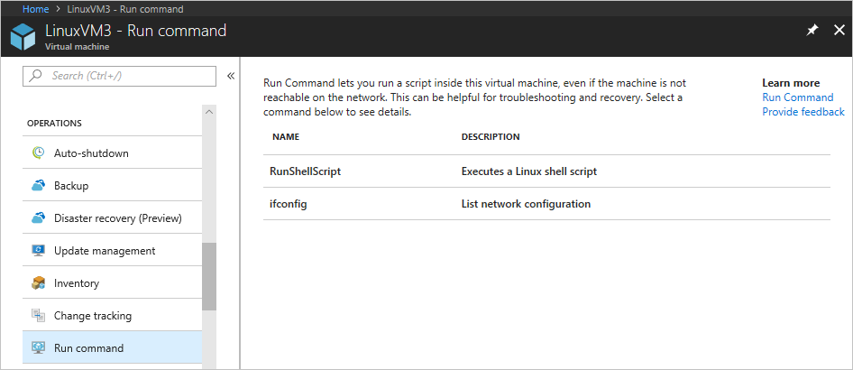

# Run shell scripts in your Linux VM with Run command

Run command allows you to run shell scripts within an Azure Linux VM regardless of network connectivity. These scripts can be used for general machine or application management, and can be used to quickly diagnose and remediate VM access and network issues and get the VM back to a good state.

## Prerequisites

The account using Run Command must have [Contributor role](../../role-based-access-control/built-in-roles.md) for the VM.

## Benefits

There are multiple options that can be used to access your virtual machines. Run command can run scripts on your virtual machines regardless of network connectivity and is available by default (no installation required). Run command can be used through the Azure portal, [REST API](/rest/api/compute/virtual%20machines%20run%20commands/runcommand), [Azure CLI](/cli/azure/vm/run-command?view=azure-cli-latest#az-vm-run-command-invoke), or [PowerShell](/powershell/module/azurerm.compute/invoke-azurermvmruncommand).

This capability is useful in all scenarios where you want to run a script witin a virtual machines, and is one of the only ways to troubleshoot and remediate a virtual machine that is not connected to the network due to improper network or administrative user configuration.

## Restrictions

The following are a list of restrictions that are present when using run command.

* Output is limited to the last 4096 bytes
* The minimum time to run a script about 20 seconds
* Scripts run as elevated user on Linux
* One script at a time may run
* You cannot cancel a running script
* The maximum time a script can run is 90 minutes, after which it will time out

## Run a command

Navigate to a VM in [Azure](https://portal.azure.com) and select **Run command** under **OPERATIONS**. You are presented with a list of the available commands to run on the VM.



Choose a command to run. Some of the commands may have optional or required input parameters. For those commands the parameters are presented as text fields for you to provide the input values. For each command you can view the script that is being run by expanding **View script**. **RunPowerShellScript** is different from the other commands as it allows you to provide your own custom script. 

> [!NOTE]
> The built-in commands are not editable.

Once the command is chosen, click **Run** to run the script. The script runs and when complete, returns the output and any errors in the output window. The following screenshot shows an example output from running the **ifconfig** command.


## Commands

This table shows the list of commands available for Linux VMs. The **RunShellScript** command can be used to run any custom script you want.

|**Name**|**Description**|
|---|---|
|**RunShellScript**|Executes a Linux shell script.|
|**ifconfig**| Get the configuration of all network interfaces.|

## Azure CLI

The following is an example using the [az vm run-command](/cli/azure/vm/run-command?view=azure-cli-latest#az-vm-run-command-invoke) command to run a shell script on an Azure Linux VM.

```azurecli-interactive
az vm run-command invoke -g MyResourceGroup -n MyVm --command-id RunShellScript --scripts "sudo apt-get update && sudo apt-get install -y nginx"
```

## Limiting access to run command

Run command is available for users with the VM Contributor or higher permissions. In order to limit the access to this feature remove the VM Contributor or higher role from the user's roles.

## Next steps
