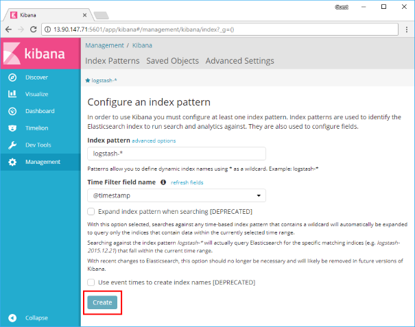
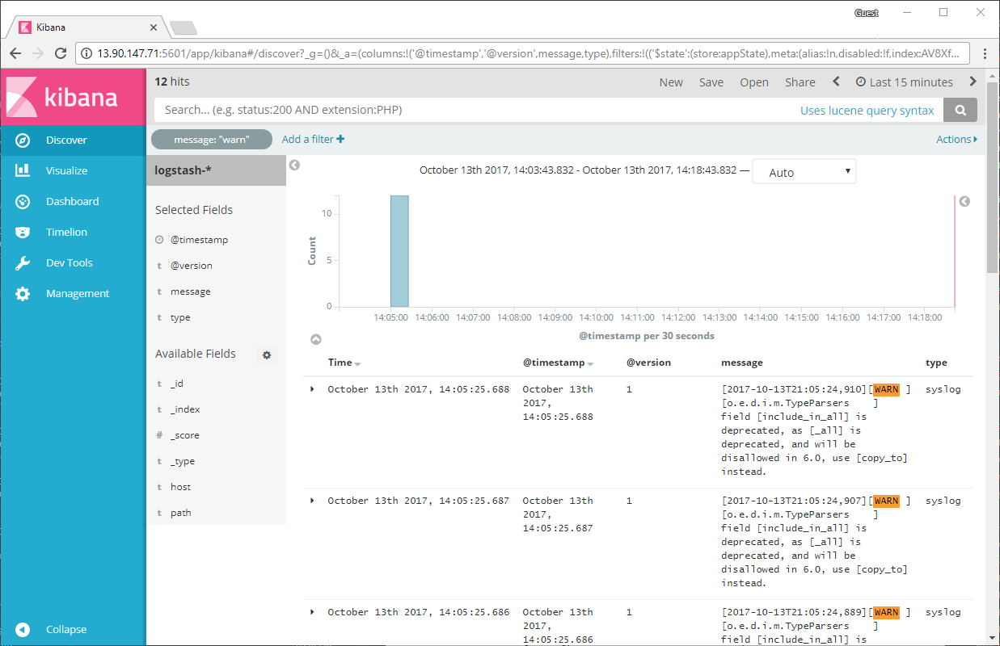

# Install the Elastic Stack on an Azure VM

This article walks you through how to deploy [Elasticsearch](https://www.elastic.co/products/elasticsearch), [Logstash](https://www.elastic.co/products/logstash), and [Kibana](https://www.elastic.co/products/kibana), on an Ubuntu VM in Azure.  To see the Elastic Stack in action, you can optionally connect to the Kibana interface and view sample data. In this tutorial you learn how to:

> [!div class="checklist"]
> * Create an Ubuntu VM 
> * Install Elasticsearch, Logstash, and Kibana
> * Add data to Elasticsearch from Logstash 
> * Verify installation and configuration
> * Open ports and work with data in the Kibana console


For more on the Elastic stack, including recommendations for a production environment, see the [Elastic documentation](https://www.elastic.co/guide/index.html) and the [Elasticsearch area of the Azure Architecture Center](/azure/architecture/elasticsearch/).

[!INCLUDE [cloud-shell-try-it.md](../../../includes/cloud-shell-try-it.md)]

[!INCLUDE [virtual-machines-linux-tutorial-stack-intro.md](../../../includes/virtual-machines-linux-tutorial-stack-intro.md)]


## Install the Elastic Stack

Import the Elasticsearch signing key and update your APT sources list to include the Elastic package repository:

```bash
wget -qO - https://artifacts.elastic.co/GPG-KEY-elasticsearch | sudo apt-key add -
echo "deb https://artifacts.elastic.co/packages/5.x/apt stable main" | sudo tee -a /etc/apt/sources.list.d/elastic-5.x.list
```

Install the Java Virtual on the VM and configure the JAVA_HOME variable-this is necessary for the Elastic Stack components to run.

```bash
sudo apt update && sudo apt install openjdk-8-jre-headless
export JAVA_HOME=/usr/lib/jvm/java-8-openjdk-amd64
```

Run the following commands to update Ubuntu package sources and install Elasticsearch, Kibana, and Logstash.

```bash
sudo apt update && sudo apt install elasticsearch kibana logstash   
```

> [!NOTE]
> Detailed installation instructions , including directory layouts and initial configuration, are maintained on [Elastic's documentation](https://www.elastic.co/guide/en/elastic-stack/current/installing-elastic-stack.html)

## Start Elasticsearch 

Start Elasticsearch on your VM with the following command:

```bash
sudo systemctl start elasticsearch.service
```

This command produces no output, so to verify that Elasticsearch is running on the VM you can use this `curl` command:

```bash
curl -XGET 'localhost:9200/'
```

You'll see output like the following if Elasticsearch is running:

```json
{
  "name" : "w6Z4NwR",
  "cluster_name" : "elasticsearch",
  "cluster_uuid" : "SDzCajBoSK2EkXmHvJVaDQ",
  "version" : {
    "number" : "5.6.3",
    "build_hash" : "1a2f265",
    "build_date" : "2017-10-06T20:33:39.012Z",
    "build_snapshot" : false,
    "lucene_version" : "6.6.1"
  },
  "tagline" : "You Know, for Search"
}
```

## Start Logstash and add data to Elasticsearch

Start Logstash with the following command:

```bash
sudo systemctl start logstash.service
```

Test logstash in interactive mode to make sure it's working correctly:

```
sudo /usr/share/logstash/bin/logstash -e 'input { stdin { } } output { stdout {} }'
```

This is a basic logstash [pipeline](https://www.elastic.co/guide/en/logstash/5.6/pipeline.html) that echoes standard input to standard output. 

```output
The stdin plugin is now waiting for input:
hello azure
2017-10-11T20:01:08.904Z myVM hello azure
```

Set up Logstash to forward the kernel messages from this VM to Elasticsearch. Create a new file in an empty directory called `vm-syslog-logstash.conf` with the following Logstash configuration.

```
input {
    stdin {
        type => "stdin-type"
    }

    file {
        type => "syslog"
        path => [ "/var/log/*.log", "/var/log/*/*.log", "/var/log/messages", "/var/log/syslog" ]
        start_position => "beginning"
    }
}

output {

    stdout {
        codec => rubydebug
    }
    elasticsearch {
        hosts  => "localhost:9200"
    }
}
```

Test this configuration and send data to Elasticsearch with the following command:

```bash
sudo /usr/share/logstash/bin/logstash -f vm-syslog-logstash.conf
```

You'll see the output of the syslog entries in your console window echoed as they are sent to Elasticsearch. Use `CTRL+C` to exit out of Logstash once you've sent some data.

## Start Kibana and visualize the data in Elasticsearch

Edit the Kibana configuration at `/etc/kibana/kibana.yml` to listen on the IP address of the VM and not localhost so you can access it remotely.

```
server.host:"0.0.0.0"
```

Start Kibana with the following command:

```bash
sudo systemctl start kibana.service
```

Open port 5601 from the Azure CLI to allow remote access to the Kibana console:

```bash
az vm open-port --port 5601 --resource-group myResourceGroup --name myVM
```

Open up the Kibana console and select **Create** to generate a default index based on the syslog data you sent to Elasticsearch in the previous step. 



Select **Discover** on the Kibana console to search, browse and filter through the syslog events.




## Next steps

In this tutorial, you deployed the Elastic Stack in Azure. You learned how to:

> [!div class="checklist"]
> * Create an Ubuntu VM 
> * Install Elasticsearch, Logstash, and Kibana
> * Add data to Elasticsearch from Logstash 
> * Verify installation and configuration
> * Open ports and work with data in the Kibana console

Advance to the next tutorial to learn how to monitor Azure infrastrcuture with Elasticsearch.

[!div class="nextstepaction"] Monitor Azure resources with Elasticsearch