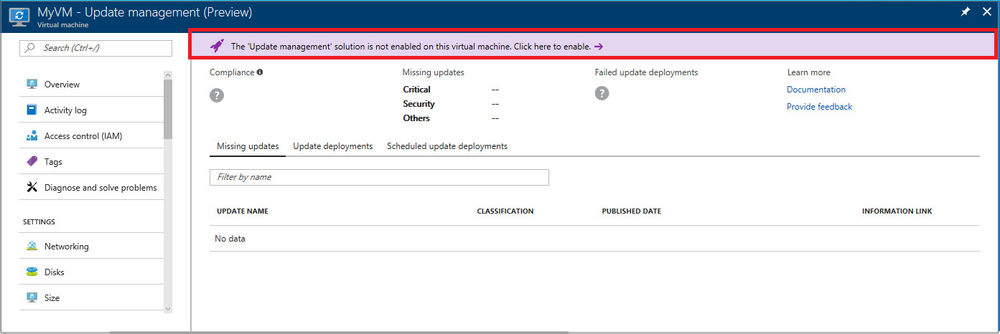
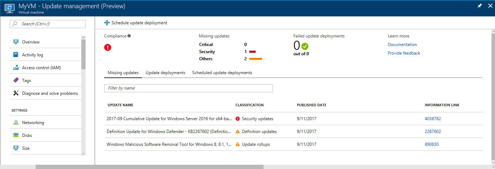

# Manage package updates

By using Update management, you can manage package updates and patches for your Azure Linux virtual machines.
Directly from your virtual machine, you can quickly assess the status of available updates, schedule installation of required updates,
and review deployment results to verify updates were applied successfully to the virtual machine.

If you don't already have a virtual machine to use, you can create one using the [Linux quickstart](quick-create-portal.md). In this tutorial you learn how to:

> [!div class="checklist"]
> * Enable the Update management solution for your virtual machine
> * View missing updates
> * Schedule installation of updates

For pricing information, see [Automation pricing for Update management](https://azure.microsoft.com/pricing/details/automation/)

## Sign in to the Azure portal

Sign in to the [Azure portal](https://portal.azure.com/).

## Enable Update management

Enable Update management for your virtual machine

1. On the left-hand side of the screen, select **Virtual machines**.
1. From the list, select a virtual machine.
1. On the virtual machine screen, in the **Operations** section, click **Update management**. The **Enable Update management** screen opens.

Validation is performed to determine if the Update management solution is enabled for this virtual machine.

The validation includes checks for Log Analytics workspace and linked Automation account and if the virtual machine is provisioned with the Microsoft Monitoring Agent (MMA) and hybrid worker. If these prerequisites are not met, a banner appears that gives you the option to enable the solution.

   

Click the banner to enable the solution. If any of the following prerequisites were found to be missing after the validation,
they will be automatically added:

* [Log Analytics](../log-analytics/log-analytics-overview.md) workspace
* [Automation](../automation/automation-offering-get-started.md)
* A [Hybrid runbook worker](../automation/automation-hybrid-runbook-worker.md) is enabled on the virtual machine

The **Enable Update Management** screen opens. Configure the settings, and click **Enable**.

   

Enabling the solution can take up to 15 minutes, and during this time you should not close the browser window. After the solution is enabled,
information about missing updates from the package manager on the virtual machine flows to Log Analytics.
It can take between 30 minutes and 6 hours for the data to be available for analysis.

## View update assessment

AFter the **Update management** solution is enabled, the **Update management** screen appears. You can see a list of missing updates on the **Missing updates** tab.

   

## Schedule an update deployment

To install updates, schedule a deployment that follows your release schedule and maintenance window.

Schedule a new Update Deployment for the virtual machine by clicking **Schedule update deployment** at the top of the **Update management** screen. 
In the **New update deployment** screen, specify the following:

* **Name** - Provide a unique name to identify the update deployment.
* **Updates to exclude** - select this to enter names of packages to exclude from the update.
* **Schedule settings** - You can either accept the default date and time, which is 30 minutes after current time, or specify a different time.
   You can also specify whether the deployment occurs once or set up a recurring schedule. Click the Recurring option under Recurrence to set up a recurring schedule.

   

* **Maintenance window (minutes)** - Specify the period of time you want the update deployment to occur within.  This helps ensure changes are performed within your defined maintenance windows.

After you have completed configuring the schedule, click **Create** button and you return to the status dashboard.
Notice that the **Scheduled** table shows the deployment schedule you just created.

> [!WARNING]
> The virtual machine will be restarted automatically after updates are installed if .

Update management uses the existing package manager on your virtual machine to install packages.

## View results of an update deployment

After the scheduled deployment is started, you can see the status for that deployment on the **Update deployments** tab on the **Update management** screen.
If it is currently running, it's status shows as **In progress**. After it completes, if successful, it changes to **Succeeded**.
If there is a failure with one or more updates in the deployment, the status is **Failed**.
Click the completed update deployment to see the dashboard for that update deployment.

   

In **Update results** tile is a summarization of the total number of updates and deployment results on the virtual machine.
In the table to the right is a detailed breakdown of each update and the installation results, which could be one of the following values:

* Not attempted - the update was not installed because there was insufficient time available based on the maintenance window duration defined.
* Succeeded - the update was successfully downloaded and installed on the virtual machine
* Failed - the update failed to download or install on the virtual machine.

Click the **Output** tile to see job stream of the runbook responsible for managing the update deployment on the target virtual machine.

Click **All logs** to see all log entries that the deployment created.

Click **Errors** to see detailed information about any errors from the deployment.

## Next steps

In this tutorial, you learned how to:

> [!div class="checklist"]
> * Enable the Update management solution for your virtual machine
> * View missing updates
> * Schedule installation of updates

Advance to the next tutorial to learn about monitoring virtual machines.

> [!div class="nextstepaction"]
> [Monitor virtual machines](tutorial-monitoring.md)
