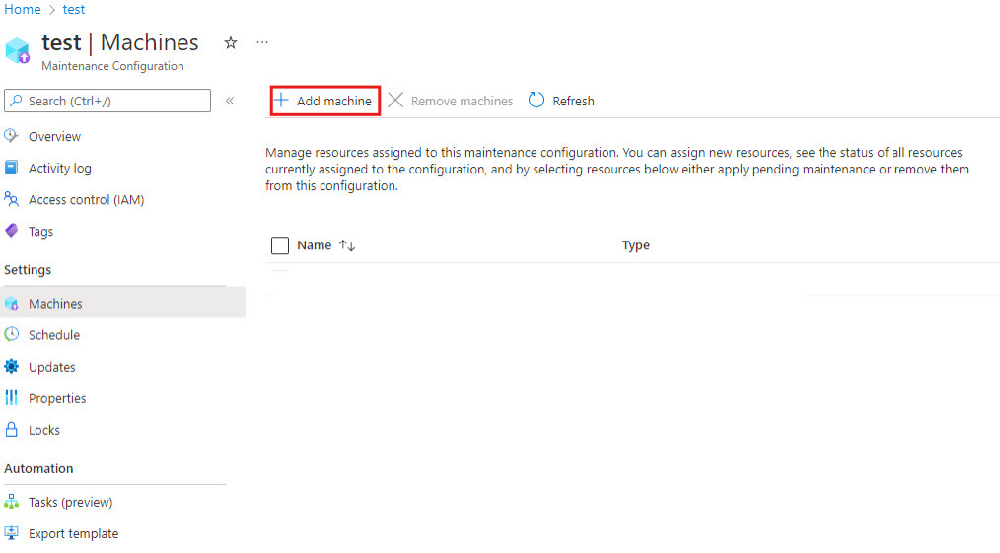
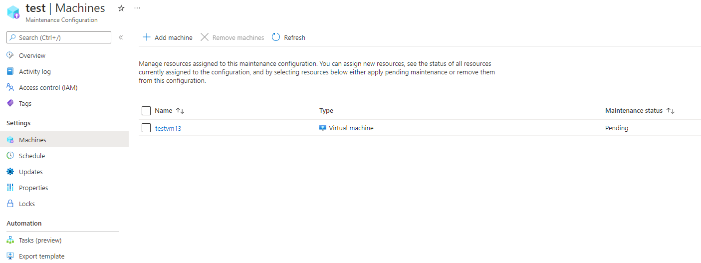

# Control updates with Maintenance Configurations and the Azure portal

**Applies to:** :heavy_check_mark: Linux VMs :heavy_check_mark: Windows VMs :heavy_check_mark: Flexible scale sets :heavy_check_mark: Uniform scale sets

With Maintenance Configurations, you can now take more control over when to apply updates to various Azure resources. This topic covers the Azure portal options for creating Maintenance Configurations. For more about benefits of using Maintenance Configurations, its limitations, and other management options, see [Managing platform updates with Maintenance Configurations](maintenance-configurations.md).

## Create a Maintenance Configuration

1. Sign in to the Azure portal.

1. Search for **Maintenance Configurations**.
    
    :::image type="content" source="media/virtual-machines-maintenance-control-portal/maintenance-configurations-search-bar.png" alt-text="Screenshot showing how to open Maintenance Configurations":::

1. Click **Create**.

    :::image type="content" source="media/virtual-machines-maintenance-control-portal/maintenance-configurations-add-2.png" alt-text="Screenshot showing how to add a maintenance configuration":::

1. In the Basics tab, choose a subscription and resource group, provide a name for the configuration, choose a region, and select one of the scopes we offer which you wish to apply updates for. Click **Add a schedule** to add or modify the schedule for your configuration.
    
    > [!IMPORTANT]
    > There are different **scopes** which support certain machine types, so please ensure you are selecting the right scope for your virtual machine.

    :::image type="content" source="media/virtual-machines-maintenance-control-portal/maintenance-configurations-basics-tab.png" alt-text="Screenshot showing Maintenance Configuration basics":::

1. In the Schedule tab, declare a scheduled window when Azure will apply the updates on your resources. Set a start date, maintenance window, and recurrence if your resource requires it. Once you create a scheduled window you no longer have to apply the updates manually. Click **Next**. 

    > [!IMPORTANT]
    > Maintenance window **duration** must be *2 hours* or longer. 

    :::image type="content" source="media/virtual-machines-maintenance-control-portal/maintenance-configurations-schedule-tab.png" alt-text="Screenshot showing Maintenance Configuration schedule":::

1. In the Machines tab, assign resources now or skip this step and assign resources later after maintenance configuration deployment. Click **Next**.

1. Add tags and values. Click **Next**.
    
    :::image type="content" source="media/virtual-machines-maintenance-control-portal/maintenance-configurations-tags-tab.png" alt-text="Screenshot showing how to add tags to a maintenance configuration":::

1. Review the summary. Click **Create**.

1. After the deployment is complete, click **Go to resource**.

## Assign the configuration

On the details page of the maintenance configuration, click Machines and then click **Add Machine**. 

Select the resources that you want the maintenance configuration assigned to and click **Ok**. The VM needs to be running to assign the configuration. An error occurs if you try to assign a configuration to a VM that is stopped. 

<!---Shantanu to add details about the error case--->

## Check configuration

You can verify that the configuration was applied correctly or check to see any maintenance configuration that is currently assigned to a machine by going to the **Maintenance Configurations** and checking under the **Machines** tab. You should see any machine you have assigned the configuration in this tab.

<!-- You can also check the configuration for a specific virtual machine on its properties page. Click **Maintenance** to see the configuration assigned to that virtual machine.

 -->

## Check for pending updates

You can check if there are any updates pending for a maintenance configuration. In **Maintenance Configurations**, on the details for the configuration, click **Machines** and check **Maintenance status**.

<!-- You can also check a specific host using **Virtual Machines** or properties of the dedicated host. 

 -->

<!-- ## Apply updates

You can apply pending updates on demand. On the VM or Azure Dedicated Host details, click **Maintenance** and click **Apply maintenance now**. Apply update calls can take upto 2 hours to complete.

## Check the status of applying updates 

You can check on the progress of the updates for a configuration in **Maintenance Configurations** or using **Virtual Machines**. On the VM details, click **Maintenance**. In the following example, the **Maintenance state** shows an update is **Pending**.

 -->

## Delete a maintenance configuration

To delete a configuration, open the configuration details and click **Delete**.

## Next steps

To learn more, see [Maintenance and updates](maintenance-and-updates.md).
