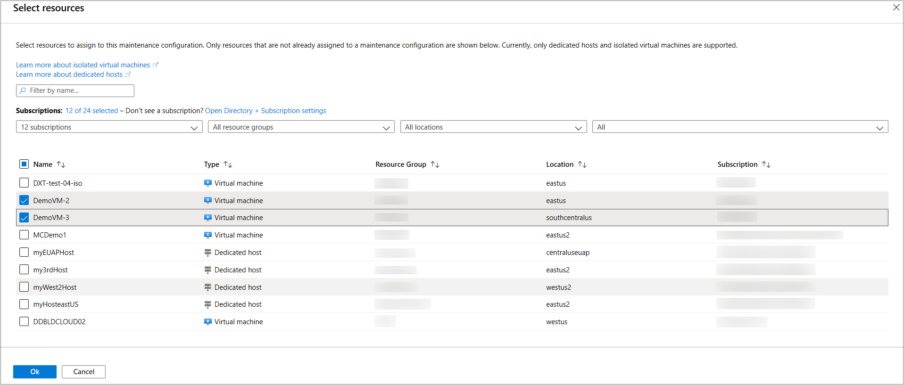

# Control updates with Maintenance Configurations and the Azure portal

**Applies to:** :heavy_check_mark: Linux VMs :heavy_check_mark: Windows VMs :heavy_check_mark: Flexible scale sets :heavy_check_mark: Uniform scale sets

With the Maintenance Configurations feature, you can control when to apply updates to various Azure resources. This article covers the Azure portal options for using this feature. For more information about the benefits of using Maintenance Configurations, its limitations, and other management options, see [Managing platform updates with Maintenance Configurations](maintenance-configurations.md).

## Create a maintenance configuration

1. Sign in to the Azure portal.

1. Search for **maintenance configurations**, and then open the **Maintenance Configurations** result.

    :::image type="content" source="media/virtual-machines-maintenance-control-portal/maintenance-configurations-search-bar.png" alt-text="Screenshot that shows how to find the Maintenance Configurations service in the Azure portal.":::

1. Select **Create**.

    :::image type="content" source="media/virtual-machines-maintenance-control-portal/maintenance-configurations-add-2.png" alt-text="Screenshot that shows the location of the command for creating a maintenance configuration.":::

1. On the **Basics** tab, choose a subscription and resource group, provide a name for the configuration, choose a region, and select one of the scopes that you want to apply updates for. Then select **Add a schedule** to add or modify the schedule for your configuration.

    > [!IMPORTANT]
    > Certain virtual machine types and schedules require a specific kind of scope. To find the right scope for your virtual machine, see [Scopes](maintenance-configurations.md#scopes).

    :::image type="content" source="media/virtual-machines-maintenance-control-portal/maintenance-configurations-basics-tab.png" alt-text="Screenshot that shows basic information for a maintenance configuration.":::

1. On the **Add/Modify schedule** pane, declare a scheduled window when Azure will apply the updates on your resources. Set a start date, maintenance window, and recurrence if your resource requires it. After you create a scheduled window, you no longer have to apply the updates manually. When you finish, select **Next**.

    > [!IMPORTANT]
    > The duration of the maintenance window must be 2 hours or longer.

    :::image type="content" source="media/virtual-machines-maintenance-control-portal/maintenance-configurations-schedule-tab.png" alt-text="Screenshot that shows schedule options for applying updates.":::

1. On the **Machines** tab, assign resources now or skip this step and assign resources later (after you deploy the maintenance configuration). Then select **Next**.

1. On the **Tags** tab, add tags and values. Then select **Next**.

    :::image type="content" source="media/virtual-machines-maintenance-control-portal/maintenance-configurations-tags-tab.png" alt-text="Screenshot that shows name and value boxes for adding tags to a maintenance configuration.":::

1. On the **Review + create** tab, review the summary. Then select **Create**.

1. After the deployment is complete, select **Go to resource**.

## Assign the configuration

1. On the details page of the maintenance configuration, select **Machines**, and then select **Add machine**.

    

1. On the **Select resources** pane, select the resources that you want the maintenance configuration assigned to. The VMs that you select need to be running. If you try to assign a configuration to a VM that's stopped, an error occurs. When you finish, select **Ok**.

    

## Check the configuration and status

You can verify that the configuration was applied correctly, or check which machines are assigned to a maintenance configuration, by going to **Maintenance Configurations** > **Machines**.

The **Maintenance status** column shows whether any updates are pending for a maintenance configuration.

## Delete a maintenance configuration

To delete a maintenance configuration, open the configuration details and select **Delete**.

## Next steps

To learn more, see [Maintenance for virtual machines in Azure](maintenance-and-updates.md).
