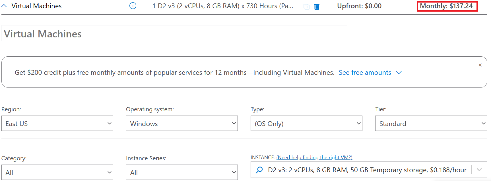
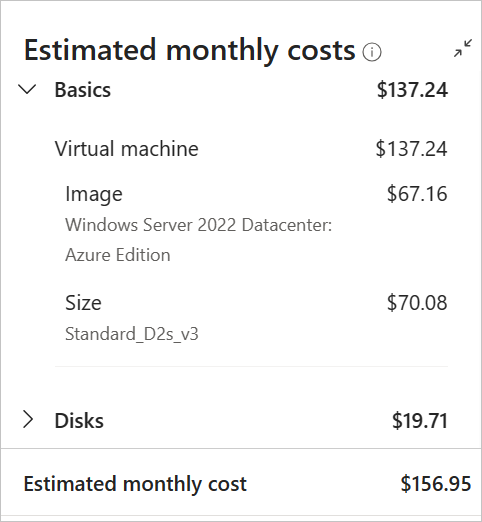
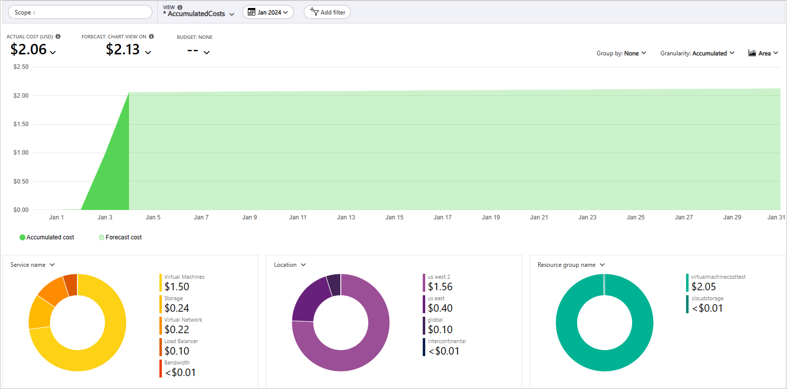

# Plan to manage costs for virtual machines

This article describes how you plan for and manage costs for virtual machines. Before you deploy the service, you can use the [Azure pricing calculator](https://azure.microsoft.com/pricing/calculator/) to estimate costs for virtual machines. Later, as you deploy Azure resources, review the estimated costs.

After you start using virtual machine resources, use Cost Management features to set budgets and monitor costs. You can also review forecasted costs and identify spending trends to identify areas where you might want to act. Costs for virtual machines are only a portion of the monthly costs in your Azure bill. Although this article explains how to plan for and manage costs for virtual machines, your bill includes the costs of all Azure services and resources used in your Azure subscription, including the third-party services.

## Prerequisites

Cost analysis in Cost Management supports most Azure account types but not all of them. To view the full list of supported account types, see [Understand Cost Management data](../cost-management-billing/costs/understand-cost-mgt-data.md?WT.mc_id=costmanagementcontent_docsacmhorizontal_-inproduct-learn). To view cost data, you need at least read access for an Azure account. For information about assigning access to Microsoft Cost Management data, see [Assign access to data](../cost-management/assign-access-acm-data.md?WT.mc_id=costmanagementcontent_docsacmhorizontal_-inproduct-learn).

## Estimate costs before using virtual machines

Use the [Azure pricing calculator](https://azure.microsoft.com/pricing/calculator/) to estimate costs before you add virtual machines.

1. On the **Virtual Machines** tile under the **Products** tab, select **Add to estimate** and scroll down to the **Your Estimate** section.

1. Select options from the drop-downs. There are various options available to choose from. The options that have the largest impact on your estimate total are your virtual machine's operating system, the operating system license if applicable, the [VM size](sizes.md) you select under **INSTANCE**, the number of instances you choose, and the amount of time your month your instances to run.

   Notice that the total estimate changes as you select different options. The estimate appears in the upper corner and the bottom of the **Your Estimate** section.

   

1. Below the **Savings Options** section, there are choices for optional, additional resources you can deploy with your virtual machine, including **Managed Disks**, **Storage transactions**, and **Bandwidth**. For optimal performance, we recommend pairing your virtual machines with [managed disks](https://azure.microsoft.com/pricing/details/managed-disks/), but make sure to review the additional cost incurred by these resources.

   

As you add new resources to your workspace, return to this calculator and add the same resource here to update your cost estimates.

For more information, see [Azure Virtual Machines pricing for Windows](https://azure.microsoft.com/pricing/details/virtual-machines/windows/) or [Linux](https://azure.microsoft.com/pricing/details/virtual-machines/linux/).

## Understand the full billing model for virtual machines

Virtual machines run on Azure infrastructure that accrues costs when you deploy new resources. It's important to understand that there could be other infrastructure costs that might accrue.

### How you're charged for virtual machines

When you create or use virtual machines resources, you might get charged for the following meters:

- **Virtual machines** - You're charged for it based on the number of hours per VM.
    - The price also changes based on your [VM size](sizes.md).
    - The price also changes based on the region your virtual machine where is located.
    - As virtual machine instances go through different states, they are [billed differently](states-billing.md).
- **Storage** - You're charged for it based on the disk size in GB and the transactions per hour.
    - For more information about transactions, see the [transactions section of the Understanding billing page for storage](../storage/files/understanding-billing.md#what-are-transactions).
- **Virtual network** - You're charged for it based on the number of GBs of data transferred.
- **Bandwidth** - You're charged for it based on the number of GBs of data transferred.
- **Azure Monitor** - You're charged for it based on the number of GBs of data ingested.
- **Azure Bastion** - You're charged for it based on the number of GBs of data transferred.
- **Azure DNS** - You're charged for it based on the number of DNS zones hosted in Azure and the number of DNS queries received.
- **Load balancer, if used** - You're charged for it based on the number of rulesets, hours used, and GB of data processed.

Any premium software from the Azure Marketplace comes with its own billing meters.

At the end of your billing cycle, the charges for each meter are summed. Your bill or invoice shows a section for all virtual machines costs. There's a separate line item for each meter.

### Other costs that might accrue with virtual machines

When you create resources for virtual machines, resources for other Azure services are also created. They include:

- [Virtual Network](https://azure.microsoft.com/pricing/details/virtual-network/)
- Virtual Network Interface Card (NIC)
    - NICs don't incur any costs by themselves. However, your [VM size](sizes.md) limits how many NICs you can deploy, so play accordingly.
- [A private IP and sometimes a public IP](https://azure.microsoft.com/pricing/details/ip-addresses/)
- Network Security Group (NSG)
    - NSGs don't incur any costs.
- [OS disk and, optionally, additional disks](https://azure.microsoft.com/pricing/details/managed-disks/)
- In some cases, a [load balancer](https://azure.microsoft.com/pricing/details/load-balancer/)

For more information, see the [Parts of a VM and how they're billed section of the virtual machines documentation overview](overview.md#parts-of-a-vm-and-how-theyre-billed).

### Costs might accrue after resource deletion

After you delete virtual machines resources, the following resources might continue to exist. They continue to accrue costs until you delete them.

- Any disks deployed other than the OS and local disks
    - By default, the OS disk is deleted with the VM, but it can be [set not to during the VM's creation](delete.md)
- Virtual network
    - Your virtual NIC and public IP, if applicable, can be set to delete along with your virtual machine
- Bandwidth
- Load balancer

If your OS disk isn't deleted with your VM, it likely incurs [P10 disk costs](https://azure.microsoft.com/pricing/details/managed-disks/) even in a stopped state. The OS disk size is smaller by default for some images and incurs lower costs accordingly.

For virtual networks, one virtual network is billed per subscription and per region. Virtual networks cannot span regions or subscriptions. Setting up private endpoints in vNet setups may also incur charges.

Bandwidth is charged by usage; the more data transferred, the more you're charged.

### Using a savings plan with virtual machines

You can choose to spend a fixed hourly amount for your virtual machines, unlocking lower prices until you reach your hourly commitment. These savings plans are available in one- and three-year options.

### Using Azure Prepayment with virtual machines

You can pay for virtual machines charges with your Azure Prepayment credit. However, you can't use Azure Prepayment credit to pay for charges for third party products and services including those from the Azure Marketplace.

When you prepay for virtual machines, you're purchasing [reserved instances](../cost-management-billing/reservations/save-compute-costs-reservations.md?toc=%2Fazure%2Fvirtual-machines%2Ftoc.json). Committing to a reserved VM instance can save you money. The reservation discount is applied automatically to the number of running virtual machines that match the reservation scope and attributes. Reserved instances are available in one- and three-year plans.

For more information, see [Save costs with Azure Reserved VM Instances](prepay-reserved-vm-instances.md).

## Review estimated costs in the Azure portal

As you create resources for virtual machines, you see estimated costs.

To create a virtual machine and view the estimated price:

1. Sign in to the [Azure portal](https://portal.azure.com).

1. Enter *virtual machines* in the search.

1. Under **Services**, select **Virtual machines**.

1. In the **Virtual machines** page, select **Create** and then **Azure virtual machine**. The **Create a virtual machine** page opens.

1. On the right side, you see a summary of the estimated costs. Adjust the options in the creation settings to see how the price changes and review the estimated costs.

   

1. Finish creating the resource.

If your Azure subscription has a spending limit, Azure prevents you from spending over your credit amount. As you create and use Azure resources, your credits are used. If you reach your credit limit, the resources that you deployed are disabled for the rest of that billing period. You can't change your credit limit, but you can remove it. For more information about spending limits, see [Azure spending limit](../cost-management-billing/manage/spending-limit.md?WT.mc_id=costmanagementcontent_docsacmhorizontal_-inproduct-learn).

## Monitor costs

As you use Azure resources with virtual machines, you incur costs. Azure resource usage unit costs vary by time intervals (seconds, minutes, hours, and days) or by unit usage (bytes, megabytes, and so on.) As soon as virtual machine use starts, costs are incurred, and you can see the costs in [cost analysis](../cost-management/quick-acm-cost-analysis.md?WT.mc_id=costmanagementcontent_docsacmhorizontal_-inproduct-learn).

When you use cost analysis, you view virtual machine costs in graphs and tables for different time intervals. Some examples are by day, current and prior month, and year. You also view costs against budgets and forecasted costs. Switching to longer views over time can help you identify spending trends, and you can see where you might be overspending. If you create budgets, you can also easily see where they're exceeded.

To view virtual machine costs in cost analysis:

1. Sign in to the [Azure portal](https://portal.azure.com).

1. Open the scope in the Azure portal and select **Cost analysis** in the menu. For example, go to **Subscriptions**, select a subscription from the list, and then select  **Cost analysis** in the menu. Select **Scope** to switch to a different scope in cost analysis.

1. By default, cost for services are shown in the first donut chart. Select the area in the chart labeled virtual machines.

> [!NOTE]
> If you just created your virtual machine, cost and usage data is typically only available within 8-24 hours. 

Actual monthly costs are shown when you initially open cost analysis. Here's an example showing all monthly usage costs.

To narrow costs for a single service, like virtual machines, select **Add filter** and then select **Service name**. Then, select **Virtual Machines**.

Here's an example showing costs for just virtual machines.

In the preceding example, you see the current cost for the service. Costs by Azure regions (locations) and virtual machines costs by resource group are also shown. From here, you can explore costs on your own.

## Create budgets

You can create [budgets](../cost-management/tutorial-acm-create-budgets.md?WT.mc_id=costmanagementcontent_docsacmhorizontal_-inproduct-learn) to manage costs and create [alerts](../cost-management-billing/costs/cost-mgt-alerts-monitor-usage-spending.md?WT.mc_id=costmanagementcontent_docsacmhorizontal_-inproduct-learn) that automatically notify stakeholders of spending anomalies and overspending risks. Alerts are based on spending compared to budget and cost thresholds. Budgets and alerts are created for Azure subscriptions and resource groups, so they're useful as part of an overall cost monitoring strategy. 

Budgets can be created with filters for specific resources or services in Azure if you want more granularity present in your monitoring. Filters help ensure that you don't accidentally create new resources that cost you more money. For more information about the filter options available when you create a budget, see [Group and filter options](../cost-management-billing/costs/group-filter.md?WT.mc_id=costmanagementcontent_docsacmhorizontal_-inproduct-learn).

## Export cost data

You can also [export your cost data](../cost-management-billing/costs/tutorial-export-acm-data.md?WT.mc_id=costmanagementcontent_docsacmhorizontal_-inproduct-learn) to a storage account. This is helpful when you need or others to do additional data analysis for costs. For example, a finance team can analyze the data using Excel or Power BI. You can export your costs on a daily, weekly, or monthly schedule and set a custom date range. Exporting cost data is the recommended way to retrieve cost datasets.

## Other ways to manage and reduce costs for virtual machines

The following are some best practices you can use to reduce the cost of your virtual machines:

- Use the [virtual machines selector](https://azure.microsoft.com/pricing/vm-selector/) to identify the best VMs for your needs
    - For development and test environments:
        - Use B-Series virtual machines
            - Use at least B2 for Windows machines
        - Use HDDs instead of SSDs when you can
        - Use locally redundant storage (LRS) accounts instead of geo- or zone-redundant storage accounts
        - Use Logic Apps or Azure Automation to implement an automatic start and stop schedule for your VMs
    - For production environments:
        - Use the dedicated Standard pricing tier or higher
        - Use a Premium SSD v2 disk and programmatically adjust its performance to account for either higher or lower demand based on your workload patterns
        - For other disk types, size your disks to achieve your desired performance without the need for over-provisioning. Account for fluctuating workload patterns, and minimizing unused provisioned capacity
- Use [role-based-access-control (RBAC)](../role-based-access-control/built-in-roles.md) to control who can create resources
- Use [Azure Spot virtual machines](spot-vms.md) where you can
- For Windows virtual machines, consider [Azure Hybrid Benefit for Windows Server](windows/hybrid-use-benefit-licensing.md) to save cost on licensing
- Use [cost alerts](../cost-management-billing/costs/cost-mgt-alerts-monitor-usage-spending.md) to monitor usage and spending
- Minimize idle instances by configuring [autoscaling](../virtual-machine-scale-sets/virtual-machine-scale-sets-autoscale-overview.md)
- Configure Azure Bastion for operational access

### Using policies to help manage and reduce costs for virtual machines

You can use [Azure Policy](../governance/policy/overview.md) to help govern and optimize the costs of your resources.

There are built-in policies for [virtual machines](policy-reference.md) and [networking services](../networking/policy-reference.md) that can help with cost savings:

- **Allowed virtual machine SKUs** - This policy enables you to specify a set of virtual machine size SKUs that your organization can deploy. You could use this policy to restrict any virtual machine sizes that exceed your desired budget. This policy would require updates to maintain as new virtual machine SKUs are added.
    - https://github.com/Azure/azure-policy/blob/master/built-in-policies/policyDefinitions/Compute/VMSkusAllowed_Deny.json
    -  You can review the available [VM sizes](sizes.md) and cross-reference their associated costs on the pricing pages for [Windows](https://azure.microsoft.com/pricing/details/virtual-machines/windows/) and [Linux](https://azure.microsoft.com/pricing/details/virtual-machines/linux/).
- **Network interfaces should not have public IPs** - This policy restricts the creation of public IP addresses, except in cases where they are explicitly allowed. Restricting unnecessary exposure to the internet can help reduce bandwidth and virtual network data costs.

You can also make custom policies using Azure Policy. Some examples include:

- Implement policies to restrict what resources can be created:
     - https://github.com/Azure/azure-policy/blob/master/built-in-policies/policyDefinitions/General/AllowedResourceTypes_Deny.json 
- Implement policies to not allow certain resources to be created:
     - https://github.com/Azure/azure-policy/blob/master/built-in-policies/policyDefinitions/General/InvalidResourceTypes_Deny.json
- Using the resource policy to limit the allowed locations where virtual machines can be deployed.
- Auditing resources that are incurring costs even after virtual machine deletion.
- Auditing resources to enforce the use of the Azure Hybrid Benefit.

## Next steps

- Learn [how to optimize your cloud investment with Microsoft Cost Management](../cost-management-billing/costs/cost-mgt-best-practices.md?WT.mc_id=costmanagementcontent_docsacmhorizontal_-inproduct-learn).
- Learn more about managing costs with [cost analysis](../cost-management-billing/costs/quick-acm-cost-analysis.md?WT.mc_id=costmanagementcontent_docsacmhorizontal_-inproduct-learn).
- Learn about how to [prevent unexpected costs](../cost-management-billing/understand/analyze-unexpected-charges.md?WT.mc_id=costmanagementcontent_docsacmhorizontal_-inproduct-learn).
- Take the [Cost Management](/training/paths/control-spending-manage-bills?WT.mc_id=costmanagementcontent_docsacmhorizontal_-inproduct-learn) guided learning course.
- Learn how to create [Linux](linux/quick-create-portal.md) and [Windows](windows/quick-create-portal.md) virtual machines.
- Take the [Microsoft Azure Well-Architected Framework - Cost Optimization training](/training/modules/azure-well-architected-cost-optimization/).
- Review the [Well-Architected Framework cost optimization design principles](/azure/well-architected/cost-optimization/principles) and how they apply to [virtual machines](/azure/well-architected/service-guides/virtual-machines-review#cost-optimization).
