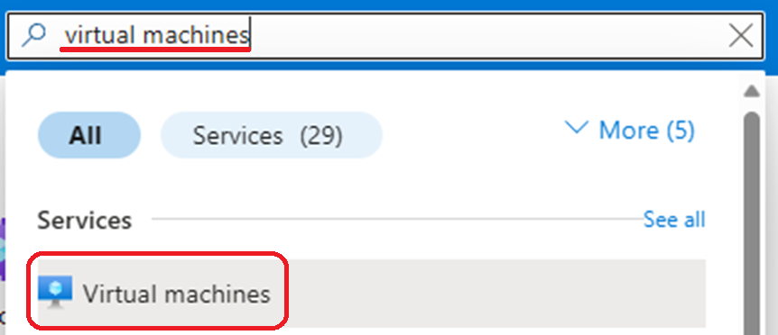
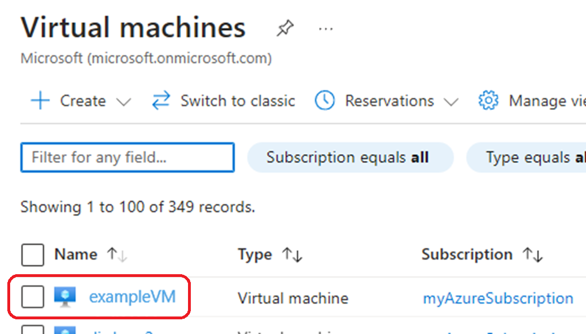
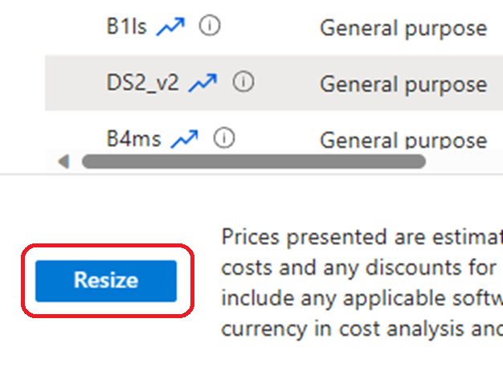

Retiring hardware is necessary over time to ensure that the latest and greatest technology is being used. This ensures that the hardware is reliable, secure, and efficient. It also allows for the latest features and capabilities to be used by customers. When hardware is retired, it is recommended to migrate your workloads to newer hardware that provides better performance and reliability. This will help you to avoid any potential issues that may arise from using outdated hardware. By keeping your hardware up-to-date, you can ensure that your workloads are running smoothly and efficiently.

## Previous-gen sizes
Previous generation sizes **are not currently retired** and can still be used. These sizes will eventually be retired, so it is still recommended to migrate to the latest generation replacements as soon as possible. For a list of sizes which are considered "previous-gen", see the [list of previous-gen sizes](./previous_gen_sizes_list.md). 

## Migrate to newer sizes by resizing your VM

### [Portal](#tab/retire-in-portal)
1. Open the [Azure portal](https://portal.azure.com). <br/><br/>
1. Type *virtual machines* in the search. Under **Services**, select **Virtual machines**.
    <br/><br/>
1. In the **Virtual machines** page, select the virtual machine you want to resize.
    <br/><br/>
1. In the left menu, select **size**. Pick a new compatible size from the list of available sizes 
    <br/><br/>
1. After picking a size, select **Resize**.
    <br/><br/>

### [PowerShell](#tab/retire-in-PS)
1. Set the resource group and VM name variables. Replace the values with information of the VM you want to resize.

    ```powershell
    $resourceGroup = "myResourceGroup"
    $vmName = "myVM"
    ```

1. List the VM sizes that are available on the hardware cluster where the VM is hosted.

    ```powershell
    Get-AzVMSize -ResourceGroupName $resourceGroup -VMName $vmName
    ```

1. Resize the VM to the new size.

    ```powershell
    $vm = Get-AzVM -ResourceGroupName $resourceGroup -VMName $vmName
    $vm.HardwareProfile.VmSize = "<newAv2VMsize>"
    Update-AzVM -VM $vm -ResourceGroupName $resourceGroup
    ```

## Next steps
- For a list of retired sizes, see [Retired Azure VM sizes](./retired_sizes_list.md).
- For a list of previous-gen sizes, see [Previous generation Azure VM sizes](./previous_gen_sizes_list.md).
- For more information on VM sizes, see [Sizes for virtual machines in Azure](../sizes.md).