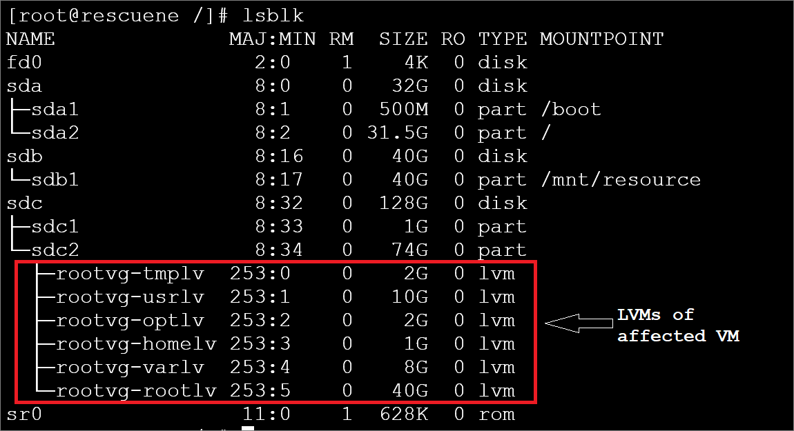

# Troubleshooting a Linux VM when there is no access to the Azure serial console and the disk layout is using LVM (Logical Volume Manager)

This troubleshooting guide is of benefit for scenarios where a Linux VM is not booting or ssh is not possible and the underlying file system layout is based upon LVM.

## Take a backup or snapshot of the failing VM

## Create a temporary VM
This can be achieved using automated or manual steps

## Connect to the temporary VM

Elevate privileges and become super user using

```
sudo su -
```
Create a mount point named rescue by running

```
mkdir /rescue
```

run the fdisk -l command to verify the snapshot disk has been attached and list all devices and partitions available

```
fdisk -l
```

In most scenarios the attached snapshot disk will be seen as /dev/sdc displaying 2 partitions /dev/sdc1 and /dev/sdc2


The * indicates a boot partition , both partitions are to be mounted


run the command lsblk to see the LVMs of the affected VM

```
#lsblk
```




If the LVMs are not displaying, then use the below commands to enable them and rerun **lsblk** ensure to have the LVMs from the attached disk visible.

```
vgscan --mknodes
vgchange -ay
lvscan
mount –a
lsblk
```

Locate the path to mount the Logical Volume which contains the / partition. It has configuration files such as /etc/default/grub

Taking the output from the **lsblk** command the "rootvg-rootlv" is probably the correct LV to mount and can be used in the next command.
The output of the command will show the path to mount

```
pvdisplay -m | grep -i rootlv
```


Proceed to mount this device on the directory /rescue

```
mount /dev/rootvg/rootlv /rescue
```

Mount the partition which has the **Boot flag**
 set on /rescue/boot
```
mount /dev/sdc1 /rescue/boot
```


verify the file file system of the attached disk are now correctly mounted using the **lsblk** command


or the **df -Th** command


## Gaining chroot access

Gain **chroot** access which will enable you to perform various fixes , slight variations exist for each Linux distribution.

```
 cd /rescue​
 mount -t proc proc proc
 mount -t sysfs sys sys/​
 mount -o bind /dev dev/​
 mount -o bind /dev/pts dev/pts/​
 chroot /rescue​
```

If an error is experienced such as:

**chroot: failed to run command ‘/bin/bash’: No such file or directory**

then attempt to mount the usr Logical Volume

```
mount  /dev/mapper/rootvg-usrlv /rescue/usr
```
After executing chroot, commands are run against the attached OSDisk and not the local recovery VM. Commands can be used to update software and troubleshoot the VM in order to fix the errors with the VM.

Run package management commands to remove install software, edit files and so on.
After repairing the issue proceed to unmount the disk allowing to swap the affected VM OS disk with the newly repaired disk.

Execute the lsblk command and the /rescue is now / and /rescue/boot is /boot


# Perform Fixes

## Configure the VM to boot from a different kernel

```
cd /boot/grub2

grep -i linux grub.cfg

grub2-editenv list

grub2-set-default "CentOS Linux (3.10.0-1062.1.1.el7.x86_64) 7 (Core)"

grub2-editenv list

grub2-mkconfig -o /boot/grub2/grub.cfg
```

*walkthrough*

The grep command lists the kernels that grub.cfg is aware of.


grub2-editenv list displays which kernel will be loaded at next boot


grub2-set-default is used to change to another kernel


grub2-editenv list displays which kernel will be loaded at next boot


grub2-mkconfig rebuilds grub.cfg using the versions required


## Upgrade packages

A failed kernel upgrade can render the VM non-bootable.
Mount all the Logical Volumes to allow packages to be removed or reinstalled


Once completed recovery operations, exit and unmount previously mounted partitions.

Detach the disk from the rescue VM and perform a Disk Swap.

```
exit
cd /
umount /rescue/proc/
umount /rescue/sys/
umount /rescue/dev/pts
umount /rescue/dev/
umount /rescue/boot
umount /rescue
```