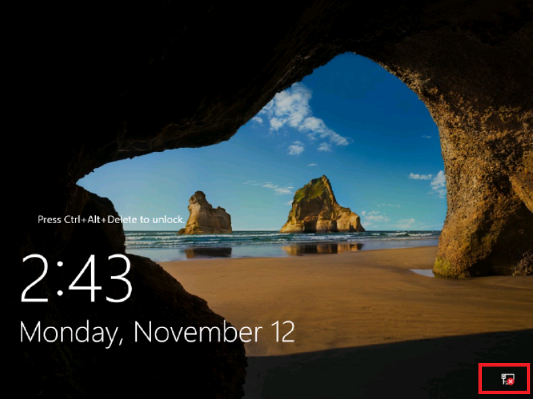

#  Cannot remote desktop to a VM because the network interface is disabled

This article shows how to resolve a problem in which you cannot remote desktop to Azure Windows Virtual Machines (VMs) because the network interface is disabled.

> [!NOTE] 
> Azure has two different deployment models for creating and working with resources: 
[Resource Manager and classic](../../azure-resource-manager/resource-manager-deployment-model.md). This article covers using the Resource Manager deployment model, which we recommend using for new deployments instead of the classic deployment model. 

## Symptoms 

You cannot make an RDP connection and other connections (such as HTTP) to a VM in Azure because the network interface in the VM is disabled. 

## Solution 

Before you follow these steps, take a snapshot of the OS disk of the affected VM as a backup. For more information, see [Snapshot a disk](../windows/snapshot-copy-managed-disk.md).

To enable the interface for the VM, use Serial control or [reset network interface](reset-network-interface.md) for the VM.

### Use Serial control

1. Connect to [Serial Console and open CMD instance](./serial-console-windows.md#open-cmd-or-powershell-in-serial-console
). If the Serial Console is not enabled on your VM, see [reset network interface](reset-network-interface.md).
2. Check the state of the network interface:

        netsh interface show interface

    Note the name of the disabled network interface. 

3. Enable the network interface:

	    netsh interface set interface name="interface Name" admin=enabled

    For example, if the interwork interface names "Ethernet 2", run the following command:

        netsh interface set interface name=""Ethernet 2" admin=enabled
    

4.  Check the state of the network interface again to make sure that the network interface is enabled.

        netsh interface show interface

    You don't have to restart the VM at this point. The VM will be back reachable.
        
5.  Connect to the VM and see if the problem is resolved.