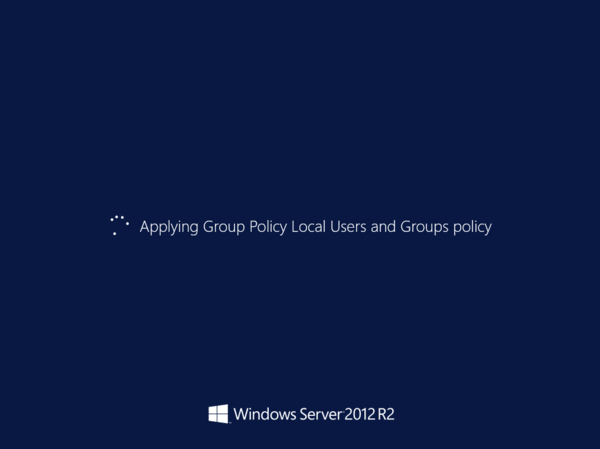
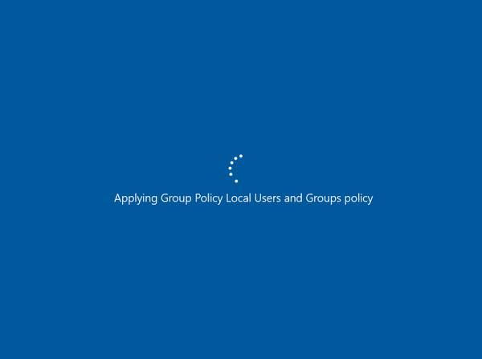

# VM is unresponsive while applying ‘Group Policy Local Users & Groups’ policy

This article provides steps to resolve issues where the load screen is stuck applying a policy during boot in an Azure VM.

## Symptoms

When you use [Boot diagnostics](https://docs.microsoft.com/azure/virtual-machines/troubleshooting/boot-diagnostics) to view the screenshot of the VM, you will see that the screen is stuck loading with the message: ‘*Applying Group Policy Local Users and Groups policy*’.





## Cause

This issue is caused by conflicting locks when the policy is attempting to cleanup old user profiles.

> [!NOTE]
> This applies only on Windows Server 2012 and Windows Server 2012 R2.

The policy being applied that won’t finish its processes is:

`Computer Configuration\Policies\Administrative Templates\System/User Profiles\Delete user profiles older than a specified number of days on system restart`

## Resolution

### Process overview

1. [Create and access a repair VM](#step-1-create-and-access-a-repair-vm)
2. [Disable the policy](#step-2-disable-the-policy)
3. [Enable Serial Console and memory dump collection](#step-3-enable-serial-console-and-memory-dump-collection)
4. [Rebuild the VM](#step-4-rebuild-the-vm)

> [!NOTE]
> When encountering this boot error, the Guest OS is not operational. You will be troubleshooting in offline mode to resolve this issue.

### Step 1: Create and access a repair VM

1. Use [steps 1-3 of the VM repair commands](https://docs.microsoft.com/azure/virtual-machines/troubleshooting/repair-windows-vm-using-azure-virtual-machine-repair-commands#repair-process-example) to prepare a repair VM.
2. Use Remote Desktop Connection connect to the repair VM.

### Step 2: Disable the policy

1. On the repair VM, open the Registry Editor.
2. Locate the key **HKEY_LOCAL_MACHINE** and then select **File** > **Load Hive...** from the menu.

    

    - Load Hive allows you to load a registry key from an offline system, which in this case is your broken disk attached to your repair VM.
    - **HKEY_LOCAL_MACHINE** is where all the system-wide settings are stored and may be abbreviated as “HKLM”.
3. In the attached disk, navigate to the `\windows\system32\config\SOFTWARE` file and open it.

    a) When you open it, you will be prompted for a name. Enter BROKENSOFTWARE as the name.<br/>
    b) To verify that BROKENSOFTWARE was loaded, you can expand **HKEY_LOCAL_MACHINE** and look for the added BROKENSOFTWARE key.
4. Navigate to the BROKENSOFTWARE and validate if the CleanupProfile key exists in the hive that was loaded.

    a) If the key does not exist, then the CleanupProfile policy is not set up. In this case, you should [submit a support ticket](https://portal.azure.com/?#blade/Microsoft_Azure_Support/HelpAndSupportBlade), including the memory.dmp file located in the Windows directory of the attached OS disk.<br/>
    b) If the key does exist, then it means that the CleanupProfile policy is set up. Its value represents the retention policy in days. Continue to delete the key.
5. Delete the CleanupProfiles key using the command below:

    ```
    reg delete "HKLM\BROKENSOFTWARE\Policies\Microsoft\Windows\System" /v CleanupProfiles /f
    ```
6.	Unload the BROKENSOFTWARE hive using the command below:

    ```
    reg unload HKLM\BROKENSOFTWARE
    ```

### Step 3: Enable Serial Console and memory dump collection

To enable memory dump collection and Serial Console, run the script below:

1. Open an elevated command prompt session (Run as administrator).
2. Run the following commands:

    **Enable Serial Console**: 
    
    ```
    bcdedit /store <VOLUME LETTER WHERE THE BCD FOLDER IS>:\boot\bcd /ems {<BOOT LOADER IDENTIFIER>} ON
    ```

    ```
    bcdedit /store <VOLUME LETTER WHERE THE BCD FOLDER IS>:\boot\bcd /emssettings EMSPORT:1 EMSBAUDRATE:115200 
    ```
3. Verify if the free space on the OS disk is as much as the memory size (RAM) on the VM.

    If there's not enough space on the OS disk, you should change the location where the memory dump file will be created and refer that to any data disk attached to the VM that has enough free space. To change the location, replace “%SystemRoot%” with the drive letter (for example “F:”) of the data disk in the below commands.

    **Suggested configuration to enable OS dump**:

    Load Broken OS Disk:

    ```
    REG LOAD HKLM\BROKENSYSTEM <VOLUME LETTER OF BROKEN OS DISK>:\windows\system32\config\SYSTEM
    ```

    Enable on ControlSet001:
    
    ```
    REG ADD "HKLM\BROKENSYSTEM\ControlSet001\Control\CrashControl" /v CrashDumpEnabled /t REG_DWORD /d 1 /f 
    REG ADD "HKLM\BROKENSYSTEM\ControlSet001\Control\CrashControl" /v DumpFile /t REG_EXPAND_SZ /d "%SystemRoot%\MEMORY.DMP" /f 
    REG ADD "HKLM\BROKENSYSTEM\ControlSet001\Control\CrashControl" /v NMICrashDump /t REG_DWORD /d 1 /f 
    ```
    
    Enable on ControlSet002:
    
    ```
    REG ADD "HKLM\BROKENSYSTEM\ControlSet002\Control\CrashControl" /v CrashDumpEnabled /t REG_DWORD /d 1 /f 
    REG ADD "HKLM\BROKENSYSTEM\ControlSet002\Control\CrashControl" /v DumpFile /t REG_EXPAND_SZ /d "%SystemRoot%\MEMORY.DMP" /f 
    REG ADD "HKLM\BROKENSYSTEM\ControlSet002\Control\CrashControl" /v NMICrashDump /t REG_DWORD /d 1 /f 
    ```
    
    Unload broken OS disk:
    
    ```
    REG UNLOAD HKLM\BROKENSYSTEM
    ```

### Step 4: Rebuild the VM

Use [step 5 of the VM Repair Commands](https://docs.microsoft.com/azure/virtual-machines/troubleshooting/repair-windows-vm-using-azure-virtual-machine-repair-commands#repair-process-example) to reassemble the VM.

If this fixed the issue, then you have disabled this policy locally. For a permanent solution, do not to use the CleanupProfiles policy on VMs, and use another method to perform the profile cleanup.

Policy to stop using:

Machine\Admin Templates\System\User Profiles\Delete user profiles older than a specified number of days on system restart
