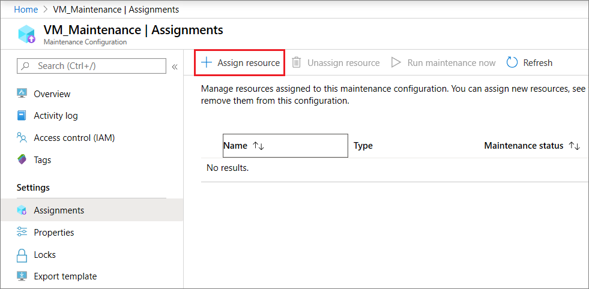

# Preview: Maintenance control for OS image upgrades on Azure virtual machine scale sets using Azure portal

Maintenance control lets you decide when to apply automatic guest OS image upgrades to your virtual machine scale sets. This topic covers the Azure portal options for Maintenance control. For more information on using Maintenance control, see [Maintenance control for Azure virtual machine scale sets](virtual-machine-scale-sets-maintenance-control.md).

> [!IMPORTANT]
> Maintenance control for OS image upgrades on Azure virtual machine scale sets is currently in Public Preview.
> This preview version is provided without a service level agreement, and is not recommended for production workloads. Certain features might not be supported or might have constrained capabilities.
> For more information, see [Supplemental Terms of Use for Microsoft Azure Previews](https://azure.microsoft.com/support/legal/preview-supplemental-terms/).

## Create a maintenance configuration

1. Sign in to the Azure portal.

1. Search for **Maintenance Configurations**.
    
    :::image type="content" source="media/virtual-machine-scale-sets-maintenance-control-portal/maintenance-configurations-search.png" alt-text="Screenshot showing how to open Maintenance Configurations":::

1. Click **Add**.

    :::image type="content" source="media/virtual-machine-scale-sets-maintenance-control-portal/maintenance-configurations-add.png" alt-text="Screenshot showing how to add a maintenance configuration":::

1. In the Basics tab, choose a subscription and resource group, provide a name for the configuration, choose a region, and select *OS image upgrade* for the scope. Click **Next**.
    
    :::image type="content" source="media/virtual-machine-scale-sets-maintenance-control-portal/maintenance-configurations-basics.png" alt-text="Screenshot showing Maintenance Configuration basics":::

1. In the Schedule tab, declare a scheduled window when Azure will apply the updates on your resources. Set a start date, maintenance window, and recurrence. Once you create a scheduled window, you no longer have to apply the updates manually. Click **Next**. 

    > [!IMPORTANT]
    > Maintenance window **duration** must be *5 hours* or longer. Maintenance **recurrence** must be set to repeat at least once a day. 

    :::image type="content" source="media/virtual-machine-scale-sets-maintenance-control-portal/maintenance-configurations-schedule.png" alt-text="Screenshot showing Maintenance Configuration schedule":::

1. In the Assignment tab, assign resources now or skip this step and assign resources later after maintenance configuration deployment. Click **Next**.

1. Add tags and values. Click **Next**.
    
    :::image type="content" source="media/virtual-machine-scale-sets-maintenance-control-portal/maintenance-configurations-tags.png" alt-text="Screenshot showing how to add tags to a maintenance configuration":::

1. Review the summary. Click **Create**.

1. After the deployment is complete, click **Go to resource**.

## Assign the configuration

On the details page of the maintenance configuration, click Assignments and then click **Assign resource**. 

Select the resources that you want the maintenance configuration assigned to and click **Ok**. The **Type** column shows whether the resource is an isolated VM or Azure dedicated host. The VM needs to be running to assign the configuration. An error occurs if you try to assign a configuration to a VM that is stopped. 

## Next steps

Learn about Maintenance and updates for virtual machines running in Azure.

> [!div class="nextstepaction"]
> [Maintenance and updates](maintenance-and-updates.md)
