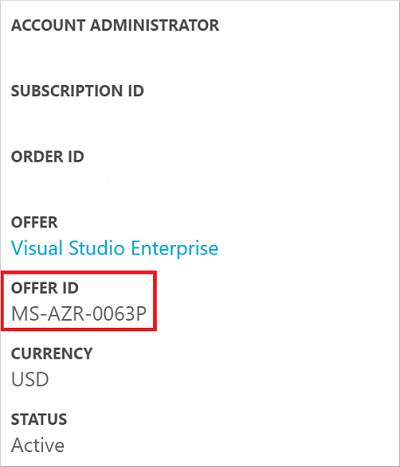

# Use Windows client in Azure for dev/test scenarios
You can use Windows 7, Windows 8, or Windows 10 Enterprise (x64) in Azure for dev/test scenarios provided you have an appropriate Visual Studio (formerly MSDN) subscription. 

To run Windows 10 in a production environment see, [How to deploy Windows 10 on Azure with Multitenant Hosting Rights](windows-desktop-multitenant-hosting-deployment.md)

## Subscription eligibility
Active Visual Studio subscribers (people who have acquired a Visual Studio subscription license) can use Windows client for development and testing purposes. Windows client can be used on your own hardware and Azure virtual machines running in any type of Azure subscription. Windows client may not be deployed to or used on Azure for normal production use, or used by people who are not active Visual Studio subscribers.

For your convenience, certain Windows 10 images are available from the Azure Gallery within [eligible dev/test offers](#eligible-offers). Visual Studio subscribers within any type of offer can also [adequately prepare and create](prepare-for-upload-vhd-image.md) a 64-bit Windows 7, Windows 8, or Windows 10 image and then [upload to Azure](upload-generalized-managed.md). The use remains limited to dev/test by active Visual Studio subscribers.

## Eligible offers and images
The following table details the offer IDs that are eligible to deploy Windows client images through the Azure Gallery. The Windows client images are only visible to the following offers. Visual Studio subscribers who need to run Windows client in a different offer type require you to [adequately prepare and create](prepare-for-upload-vhd-image.md) a 64-bit Windows 7, Windows 8, or Windows 10 image and [then upload to Azure](upload-generalized-managed.md).

| Offer Name | Offer Number | Available client images | 
|:--- |:---:|:---:|
| [Pay-As-You-Go Dev/Test](https://azure.microsoft.com/offers/ms-azr-0023p/) |0023P | Windows 10 Enterprise N (x64)   Windows 8.1 Enterprise N (x64)   Windows 7 Enterprise N with SP1 (x64) |
| [Visual Studio Enterprise (MPN) subscribers](https://azure.microsoft.com/offers/ms-azr-0029p/) |0029P | Windows 10 Enterprise N (x64)   Windows 8.1 Enterprise N (x64)   Windows 7 Enterprise N with SP1 (x64) |
| [Visual Studio Professional subscribers](https://azure.microsoft.com/offers/ms-azr-0059p/) |0059P | Windows 10 Enterprise N (x64)   Windows 8.1 Enterprise N (x64)   Windows 7 Enterprise N with SP1 (x64) |
| [Visual Studio Test Professional subscribers](https://azure.microsoft.com/offers/ms-azr-0060p/) |0060P | Windows 10 Enterprise N (x64)   Windows 8.1 Enterprise N (x64)   Windows 7 Enterprise N with SP1 (x64) |
| [Visual Studio Premium with MSDN (benefit)](https://azure.microsoft.com/offers/ms-azr-0061p/) |0061P | Windows 10 Enterprise N (x64)   Windows 8.1 Enterprise N (x64)   Windows 7 Enterprise N with SP1 (x64) |
| [Visual Studio Enterprise subscribers](https://azure.microsoft.com/offers/ms-azr-0063p/) |0063P | Windows 10 Enterprise N (x64)   Windows 8.1 Enterprise N (x64)   Windows 7 Enterprise N with SP1 (x64) |
| [Visual Studio Enterprise (BizSpark) subscribers](https://azure.microsoft.com/offers/ms-azr-0064p/) |0064P | Windows 10 Enterprise N (x64)   Windows 8.1 Enterprise N (x64)   Windows 7 Enterprise N with SP1 (x64) |
| [Enterprise Dev/Test](https://azure.microsoft.com/offers/ms-azr-0148p/) |0148P | Windows 10 Enterprise N (x64)   Windows 8.1 Enterprise N (x64)   Windows 7 Enterprise N with SP1 (x64) |

## Check your Azure subscription
If you do not know your offer ID, you can obtain it through the Azure portal in one of these two ways:  

- On the *Subscriptions* window:

   

- Or, click **Billing** and then click your subscription ID. The offer ID appears in the *Billing* window.

You can also view the offer ID from the ['Subscriptions' tab](https://account.windowsazure.com/Subscriptions) of the Azure Account portal:

 

## Next steps
You can now deploy your VMs using [PowerShell](quick-create-powershell.md), [Resource Manager templates](ps-template.md), or [Visual Studio](../../azure-resource-manager/templates/create-visual-studio-deployment-project.md).
