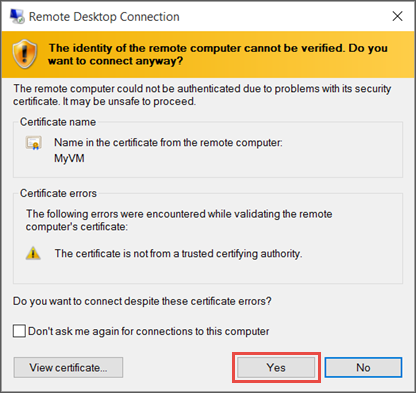

# How to connect and log on to an Azure virtual machine running Windows
You'll use the **Connect** button in the Azure portal to start a Remote Desktop (RDP) session from a Windows desktop. First you connect to the virtual machine, then you log on.

If you are trying to connect to a Windows VM from a Mac, you need to install an RDP client for Mac like [Microsoft Remote Desktop](https://itunes.apple.com/app/microsoft-remote-desktop/id715768417).

## Connect to the virtual machine
1. If you haven't already done so, sign in to the [Azure portal](https://portal.azure.com/).
2. In the left menu, click **Virtual Machines**.
3. Select the virtual machine from the list.
4. On the top of the page for the virtual machine, click the  button.
1. Click the **Connect** button on the virtual machine properties page. 
2. In the **Connect to virtual machine** page, keep select the appropriate options and click **Download RDP file**.
2. Open the downloaded RDP file and click **Connect** when prompted. 
2. You get a warning that the `.rdp` file is from an unknown publisher. This is normal. In the Remote Desktop window, click **Connect** to continue.
   
    
3. In the **Windows Security** window, select **More choices** and then **Use a different account**. Type the credentials for an account on the virtual machine and then click **OK**.
   
     **Local account** - this is usually the local account user name and password that you specified when you created the virtual machine. In this case, the domain is the name of the virtual machine and it is entered as *vmname*&#92;*username*.  
   
    **Domain joined VM** - if the VM belongs to a domain, enter the user name in the format *Domain*&#92;*Username*. The account also needs to either be in the Administrators group or have been granted remote access privileges to the VM.
   
    **Domain controller** - if the VM is a domain controller, type the user name and password of a domain administrator account for that domain.
4. Click **Yes** to verify the identity of the virtual machine and finish logging on.
   
   

   > [!TIP]
   > If the **Connect** button in the portal is greyed out and you are not connected to Azure via an [Express Route](../../expressroute/expressroute-introduction.md) or [Site-to-Site VPN](../../vpn-gateway/vpn-gateway-howto-site-to-site-resource-manager-portal.md) connection, you need to create and assign your VM a public IP address before you can use RDP. You can read more about [public IP addresses in Azure](../../virtual-network/virtual-network-ip-addresses-overview-arm.md).
   > 
   > 

## Next steps
If you run into trouble when you try to connect, see [Troubleshoot Remote Desktop connections](troubleshoot-rdp-connection.md?toc=%2fazure%2fvirtual-machines%2fwindows%2ftoc.json). This article walks you through diagnosing and resolving common problems.

