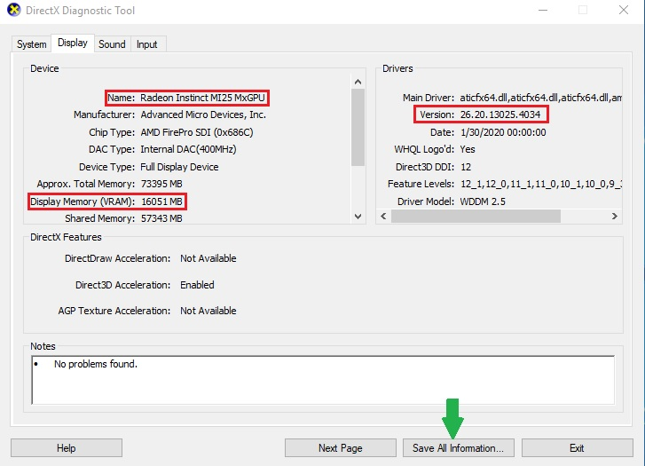

# Install AMD GPU drivers on N-series VMs running Windows

**Applies to:** Windows VMs :heavy_check_mark: Flexible scale sets 

## NGads V620 Series (preview) ##
You can create the VMs using CLI. (Azure AMD GPU driver extensions don't support NGads  V620 Series during preview)
- Link to the CLI VM creation documentation https://learn.microsoft.com/en-us/azure/virtual-machines/windows/quick-create-cli 

To install the driver
- Driver download [link](https://go.microsoft.com/fwlink/?linkid=2234555) 
- Download the zip file to a local drive.  Unzip to a local drive.  Run setup.exe.  

## Supported operating systems and drivers

| OS | Driver |
| -------- |------------- |
| Windows 11 64-bit 21H2, 22H2  Windows 10 64-bit 21H2, 22H2   Windows 11 EMS 64-bit 21H2, 22H2   Windows 10 EMS 64-bit 21H2, 22H2  Windows Server 2019 Release 1909  Windows Server 2022 64-bit Release 20348 | [Driver Download](https://go.microsoft.com/fwlink/?linkid=2234555) |

## NVv4 Series ##
To take advantage of the GPU capabilities of the new Azure NVv4 series VMs running Windows, AMD GPU drivers must be installed. The [AMD GPU Driver Extension](../extensions/hpccompute-amd-gpu-windows.md) installs AMD GPU drivers on a NVv4-series VM. Install or manage the extension using the Azure portal or tools such as Azure PowerShell or Azure Resource Manager templates. See the [AMD GPU Driver Extension documentation](../extensions/hpccompute-amd-gpu-windows.md) for supported operating systems and deployment steps.

If you choose to install AMD GPU drivers manually, this article provides supported operating systems, drivers, and installation and verification steps.

Only GPU drivers published by Microsoft are supported on NVv4 VMs. Please DO NOT install GPU drivers from any other source.

For basic specs, storage capacities, and disk details, see [GPU Windows VM sizes](../sizes-gpu.md?toc=/azure/virtual-machines/windows/toc.json).

## Supported operating systems and drivers

| OS | Driver |
| -------- |------------- |
| Windows 11 64-bit 21H2  Windows 10 64-bit 21H1, 21H2, 20H2 (RSX not supported on Win10 20H2)  Windows 11 EMS 64-bit 21H2   Windows 10 EMS 64-bit 20H2, 21H2, 21H1(RSX not supported on EMS)  Windows Server 2016  Windows Server 2019 | [22.Q2-2]( https://download.microsoft.com/download/4/1/2/412559d0-4de5-4fb1-aa27-eaa3873e1f81/AMD-Azure-NVv4-Driver-22Q2.exe) (.exe) |

Previous supported driver versions for Windows builds up to 1909 are [20.Q4-1](https://download.microsoft.com/download/0/e/6/0e611412-093f-40b8-8bf9-794a1623b2be/AMD-Azure-NVv4-Driver-20Q4-1.exe) (.exe) and [21.Q2-1](https://download.microsoft.com/download/4/e/a/4ea28d3f-28e2-4eaa-8ef2-4f7d32882a0b/AMD-Azure-NVv4-Driver-21Q2-1.exe) (.exe) 
 
 > [!NOTE]
   >  If you use build 1903/1909 then you may need to update the following group policy for optimal performance. These changes are not needed for any other Windows builds.
   >  
   >  [Computer Configuration->Policies->Windows Settings->Administrative Templates->Windows Components->Remote Desktop Services->Remote Desktop Session Host->Remote Session    Environment], set the Policy [Use WDDM graphics display driver for Remote Desktop Connections] to Disabled.
   >  

 
## Driver installation

1. Connect by Remote Desktop to each NVv4-series VM.

2. If you need to uninstall the previous driver version then download the [AMD cleanup utility](https://download.microsoft.com/download/4/f/1/4f19b714-9304-410f-9c64-826404e07857/AMDCleanupUtilityni.exe) Please do not use the utility that comes with the previous version of the driver.

3. Download and install the latest driver.

4. Reboot the VM.

## Verify driver installation

You can verify driver installation in Device Manager. The following example shows successful configuration of the Radeon Instinct MI25 card on an Azure NVv4 VM.
 

You can use dxdiag to verify the GPU display properties including the video RAM. The following example shows a 1/2 partition of the Radeon Instinct MI25 card on an Azure NVv4 VM.
 

If you are running Windows 10 build 1903 or higher then dxdiag will show no information in the 'Display' tab. Please use the 'Save All Information' option at the bottom and the output file will show the information related to AMD MI25 GPU.

