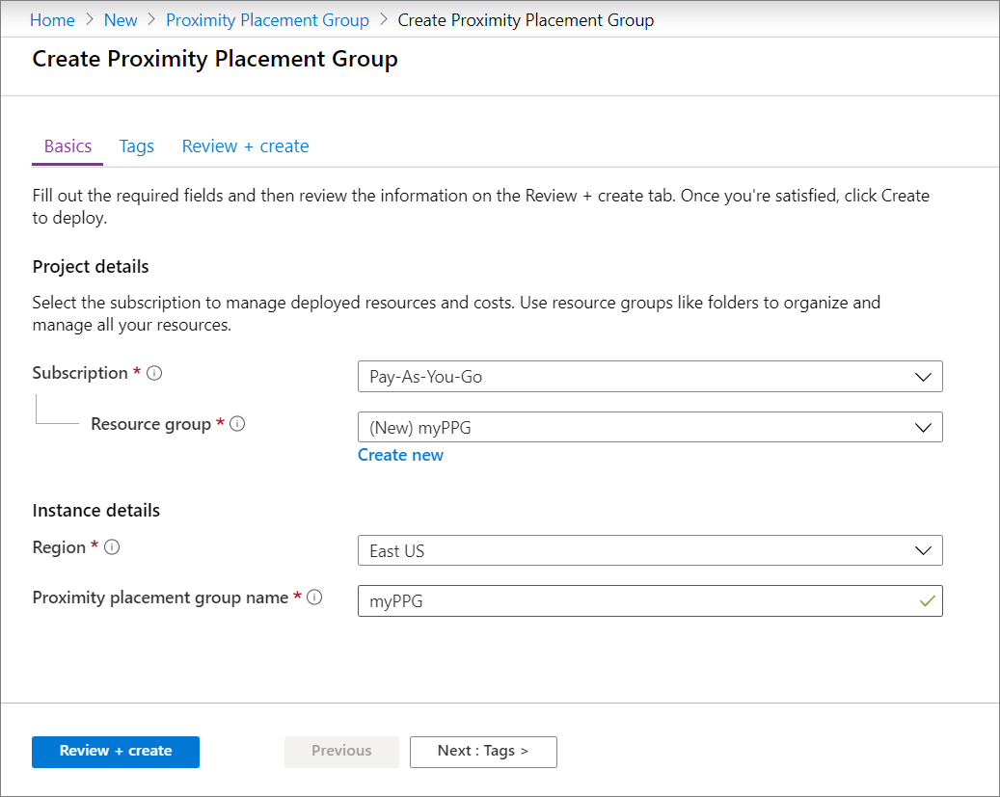

# Create a proximity placement group using the portal

To get VMs as close as possible, achieving the lowest possible latency, you should deploy them within a [proximity placement group](co-location.md#proximity-placement-groups).

A proximity placement group is a logical grouping used to make sure that Azure compute resources are physically located close to each other. Proximity placement groups are useful for workloads where low latency is a requirement.

## Create the proximity placement group

1. Type **proximity placement group** in the search.
1. Under **Services** in the search results, select **Proximity placement groups**.
1. In the **Proximity placement groups** page, select **Add**.
1. In the **Basics** tab, under **Project details**, make sure the correct subscription is selected.
1. In **Resource group** either select **Create new** to create a new group or select an existing resource group from the drop-down.
1. If you’re planning to create a placement group in an existing resource group, you need to ensure that the existing resource group is  empty 
1. In **Region** select the location where you want the proximity placement group to be created.
1. In **Proximity placement group name** type a name and then select **Review + create**.
1. After validation passes, select **Create** to create the proximity placement group.

	

## Create a VM

1. While creating a VM in the portal, go to the **Advanced** tab. 
1. In the **Proximity placement group** selection, select the correct placement group. 

	

1. When you are done making all of the other required selections, select **Review + create**.
1. After it passes validation, select **Create** to deploy the VM in the placement group.

# Add an Existing VM to Proximity Placement Group
### Prerequisites
1. If the VM is part of the Availability set, then we need to add the Availability set into the placement group 

1. If there exists a VM already part of an Availability Zone in the placement group, then while adding a VM we need to ensure that the VM to be added is part of the same Availability Zone
E.g. VM1 is in AVzone 1 and is a part of placement group, then if we’re planning to add vm2, then vm2 should be part of the same AV zone 

1. Proximity placement groups cannot be used with dedicated hosts.

#### Once this prerequisites are met 

## Add VMs existing in an AV set into Placement group can be achieved by 
1. Stop (Deallocate) all the VMs in the Availability set 
1. Go to Availability set configuration 
1. Select the Placement group and click save 
1. Start the VMs 
this will add the availability set along with all its VM into the Placement group.

## Add Existing VM to Placement Group 
1. Stop (Deallocate) the VM
1. Go to the VM Configuration Blade 
1. Select the Placement Group and Click on Save 
1. Start the VMs
This will add the Existing VM into a Placement group 

## Next steps

You can also use the [Azure PowerShell](proximity-placement-groups.md) to create proximity placement groups.

