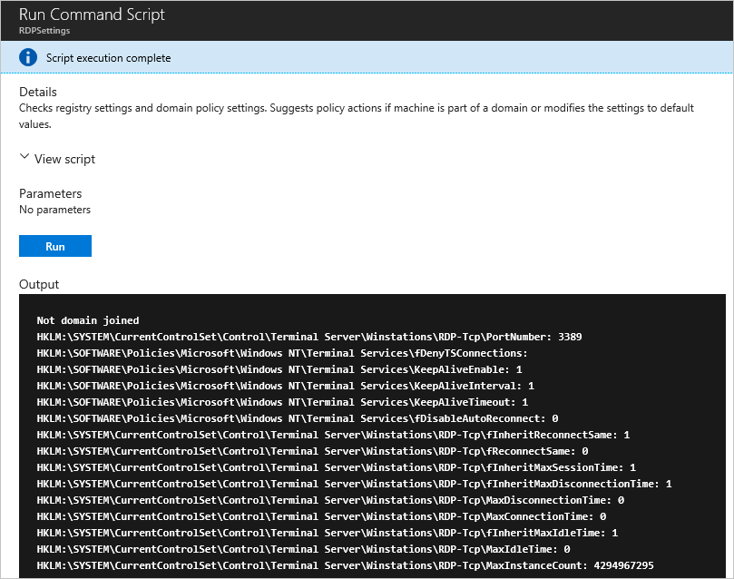

# Run scripts in your Windows VM with Run command

Run command allows you to run scripts within a VM regardless of network connectivity. For Windows tt runs PowerShell scripts, that allow general machine management, and can be used to quickly diagnose and remediate VM access and network issues and get the VM back to a good state.

## Benefits

There are multiple options that can be used to access your virtual machines. Run command can run scripts on your VMs regardless of network connectivity and is available by default on your virtual machines.

This capability is useful in scenarios when you are unable to access a VM due to improper network or administrative user configuration. 

## Configuration constraints

The follow are a list of configuration constaints that are present when using run command.

* Output limited to last 4096 bytes
* Minimum time to run a script about 20 seconds
* Scripts run as System on Windows and as elevated user on Linux
* Can only run one script at a time
* Cannot cancel running script (current default timeout is 90 minutes)

## Run a command

Navigate to a VM in the [Azure portal](https://portal.azure.com) and select **Run command** under **OPERATIONS**. You are presented with a list of the available commands to run on the VM.

Choose a command to run. Some commands have parameters, and the **RunPowerShellScript** allows you to provide your own script. When done, click **Run** to run the script. The script runs and when complete, returns the output in the output window. The following screenshot shows an example output from the **RDPSettings** command.

## Default commands

The follow table shows the list of default commands available. The **RunPowerShellScript** command can be used to run any custom script you need.

|**Name**|**Description**|
|---|---|
|**EnableRemotePS**|Configures the machine to enable remote PowerShell.|
|**IPConfig**| Shows detailed information for the IP address, subnet mask and default gateway for each adapter bound to TCP/IP.|
|**RunPowerShellScript**|Executes a PowerShell script|
|**EnableAdminAccount**|Checks if the local Administrator account is disabled, and if so enables it.|
|**ResetAccountPassword**| Resets built-in Administrator account password.|
|**RDPSettings**|Checks registry settings and domain policy settings. Suggests policy actions if machine is part of a domain or modifies the settings to default values.|
|**SetRDPPort**|Sets the default or user specified port number for Remote Desktop connections. Enables firewall rule for inbound access to the port.|
|**ResetRDPCert**|Removes the SSL certificate tied to the RDP listener and restores the RDP listerner security to default. Use this script if you see any issues with the certificate.|

## Limiting access to run command

Run command is available for users with the VM Contributor or higher permissions. In order to limit the access to this feature remove the VM Contributor or higher role from the user's roles.

## Next steps

