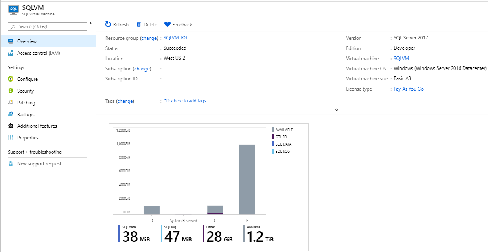

# Manage SQL Server VMs in Azure using the Azure portal

There are now two different access points to manage your SQL Server VM on Azure using the [Azure portal](https://portal.azure.com). 

The first is the **SQL virtual machine** resource, which is now an independent management service and is meant to modify settings dedicated to SQL Server: 

The second is the **SQL Server configuration tab** found within the typical virtual machine management blade: 

You can use either option to manage the following SQL Server settings, as long as the image supports them:
- SQL Server license, such as enabling the [Azure hybrid benefit](https://azure.microsoft.com/pricing/hybrid-benefit/)
- Connectivity and authentication, such as the port and SQL authentication
- [Automated patching](virtual-machines-windows-sql-automated-patching.md)
- [Automated backup](virtual-machines-windows-sql-automated-backup-v2.md)
- [Azure Key Vault integration](virtual-machines-windows-ps-sql-keyvault.md)
- SQL Server Machine Learning Services (In-Database)

## Remarks

The SQL VM management blade is only available to SQL Server VMs that have [registered with the SQL VM resource provider](virtual-machines-windows-sql-ahb.md#register-sql-server-vm-with-the-sql-vm-resource-provider). 

## Which to use

The **SQL virtual machine** resource is the recommended choice for managing your SQL Server VM. However, managing [end-of-support (EOS)](virtual-machines-windows-sql-server-2008-eos-extend-support.md) SQL Server VM images is not supported with the new management blade and as such, those SQL Server VM images should be managed with the **SQL Server configuration** tab. 

## How to access

### SQL virtual machine resource
To access the SQL virtual machine resource, do the following:

1. Open the [Azure portal](https://portal.azure.com). 
1. Select **All Services**. 
1. Type `SQL virtual machines` in the search box.
1. (Optional): Select the star next to **SQL virtual machines** to add this option to your Favorites menu. 
1. Select **SQL virtual machines**. 

   

1. This will list all SQL Server VMs available within the subscription. Select the one you would like to manage to launch the **SQL VM management blade**. Use the search box if your SQL Server VM is not readily apparent. 

Selecting your SQL Server VM will open the SQL VM management blade: 

  > [!TIP]
  > The management blade is for dedicated SQL Server settings. Select the name of the VM in the **Virtual machine** field to navigate to settings that are specific to the VM, but not exclusive to SQL Server. 

### SQL Server configuration tab
To access the SQL server configuration tab, you'll need to navigate to the management blade for the virtual machine. To do so, do the following:

1. Open the [Azure portal](https://portal.azure.com). 
1. Select **All Services**. 
1. Type `virtual machines` in the search box.
1. (Optional): Select the star next to **Virtual machines** to add this option to your Favorites menu. 
1. Select **Virtual machines**. 

   

1. This will list all virtual machines in the subscription. Select the one you would like to manage to launch the **VM management blade**. Use the search box if your SQL Server VM is not readily apparent. 
1. Select **SQL Server configuration** in the **Settings** pane to manage your SQL Server. 

## Next steps

For more information, see the following articles: 

* [Overview of SQL Server on a Windows VM](virtual-machines-windows-sql-server-iaas-overview.md)
* [SQL Server on a Windows VM FAQ](virtual-machines-windows-sql-server-iaas-faq.md)
* [SQL Server on a Windows VM pricing guidance](virtual-machines-windows-sql-server-pricing-guidance.md)
* [SQL Server on a Windows VM release notes](virtual-machines-windows-sql-server-iaas-release-notes.md)

