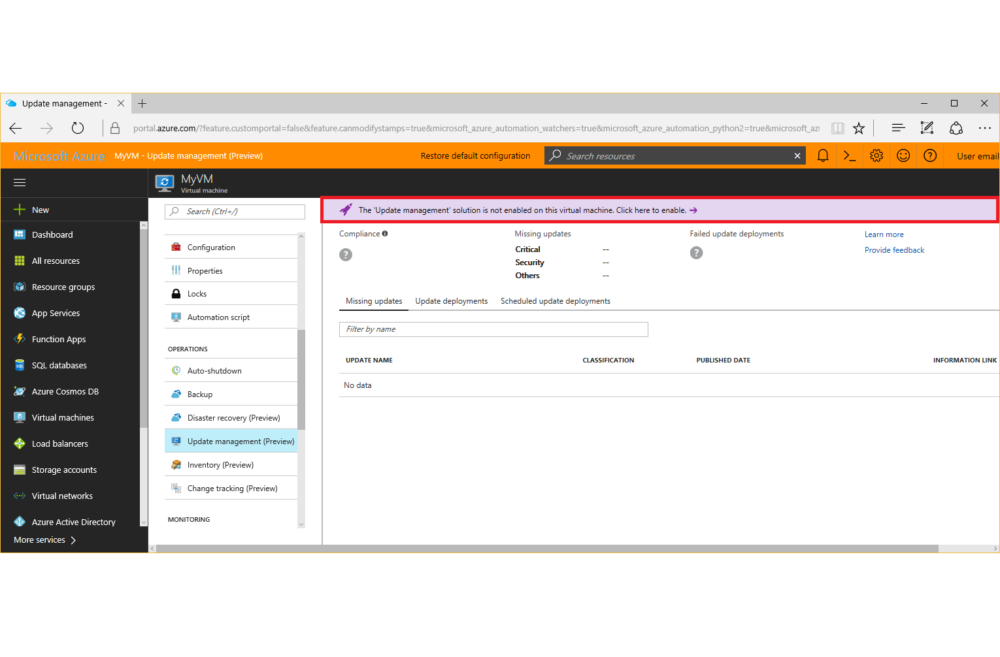
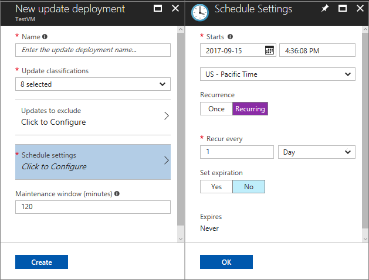

# Manage Windows updates

By using the Update management solution, you can manage package updates and patches for your Azure Linux virtual machines.
Directly from your VM, you can quickly assess the status of available updates, schedule installation of required updates,
and review deployment results to verify updates were applied successfully to the VM.

For more information about the Update management solution, see [Update Management solution in OMS](../operations-management-suite/oms-solution-update-management.md).

If you don't already have a VM to use, you can create one using the [Windows quickstart](quick-create-portal.md). In this tutorial you learn how to:

> [!div class="checklist"]
> * Enable the Update management solution for your  VM
> * View missing updates
> * Schedule installation of updates

## Enable Update management

Enable the Update management solution for your VM

1. Sign in to the [Azure portal](https://portal.azure.com/).
1. In the menu on the left, select **Virtual machines**.
1. From the list, select a VM.
1. On the VM menu, in the **Operations** section, click **Update management**. The **Enable backup** menu opens.

Validation is performed to determine if the Update management solution is enabled for this VM.  The validation includes checks for Log Analytics workspace and linked Automation account, if the solution is in the workspace, and if the VM is provisioned with the Microsoft Monitoring Agent (MMA) and hybrid worker.  If these prerequisites are not met, a banner appears that gives you the option to enable the solution.

   

Click the banner to enable the solution. The **Enable Update Management** menu opens. Configure the settings, and click **Enable**.

   

Enabling the solution can take up to 15 minutes, and during this time you should not close the browser window.  After the solution is enabled, and log data starts to flow to the workspace, it can take anywhere from 30 minutes to 6 hours for the data to be available for analysis.

## View update assessment

AFter the **Update management** solution is enabled, the **Update management** menu appears. You can see a list of missing updates on the **Missing updates** tab.

   

## Schedule an update deployment

To install updates, schedule a deployment that follows your release schedule and service window. 
You can choose which update types to include in the deployment. For example you can include critical or security updates and exclude update rollups.

Schedule a new Update Deployment for the VM by clicking **Schedule update deployment** at the top of the **Update management** menu. 
In the **New update deployment** menu, specify the following:

* **Name** - Provide a unique name to identify the update deployment.
* **Update classification** - Select the types of software the update deployment will include in the deployment. The classification types are:
  * Critical updates
  * Security updates
  * Update rollups
  * Feature packs
  * Service packs
  * Definition updates
  * Tools
  * Updates

* **Schedule settings** - You can either accept the default date and time, which is 30 minutes after current time, or specify a different time.
   You can also specify whether the deployment occurs once or set up a recurring schedule. Click the Recurring option under Recurrence to set up a recurring schedule.

   

* **Maintenance window (minutes)** - Specify the period of time you want the update deployment to occur within.  This helps ensure changes are performed within your defined service windows.

After you have completed configuring the schedule, click **Create** button and you return to the status dashboard.
Notice that the **Scheduled** table shows the deployment schedule you just created.

> [!WARNING]
> For updates that require a reboot, the VM will be restarted automatically.

## View results of an update deployment

After the scheduled deployment is started, you can see the status for that deployment on the **Update deployments** tab on the **Update management** menu.
If it is currently running, it's status shows as **In progress**. After it completes, if successful, it changes to **Succeeded**.
If there is a failure with one or more updates in the deployment, the status is **Partially failed**.
Click the completed update deployment to see the dashboard for that update deployment.

   

In **Update results** tile is a summarization of the total number of updates and deployment results on the VM.
In the table to the right is a detailed breakdown of each update and the installation results, which could be one of the following values:

* Not attempted - the update was not installed because there was insufficient time available based on the maintenance window duration defined.
* Succeeded - the update succeeded
* Failed - the update failed

Click the **Output** tile to see job stream of the runbook responsible for managing the update deployment on the target VM.

Click **All logs** to see all log entries that the deployment created.

Click **Errors** to see detailed information about any errors from the deployment.

## Next steps

In this tutorial, you learned how to:

> [!div class="checklist"]
> * Enable the Update management solution for your  VM
> * View missing updates
> * Schedule installation of updates

Advance to the next tutorial to learn about monitoring virtual machines.

> [!div class="nextstepaction"]
> [Monitor virtual machines](tutorial-monitoring.md)
