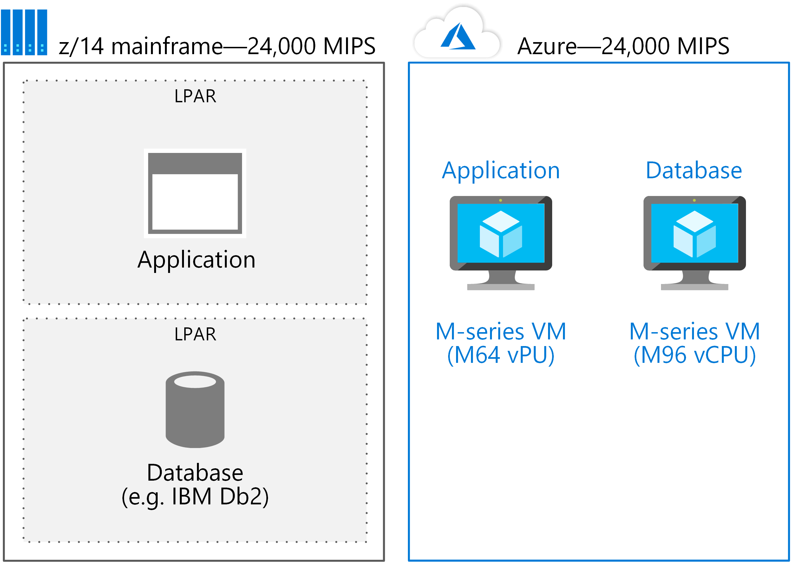
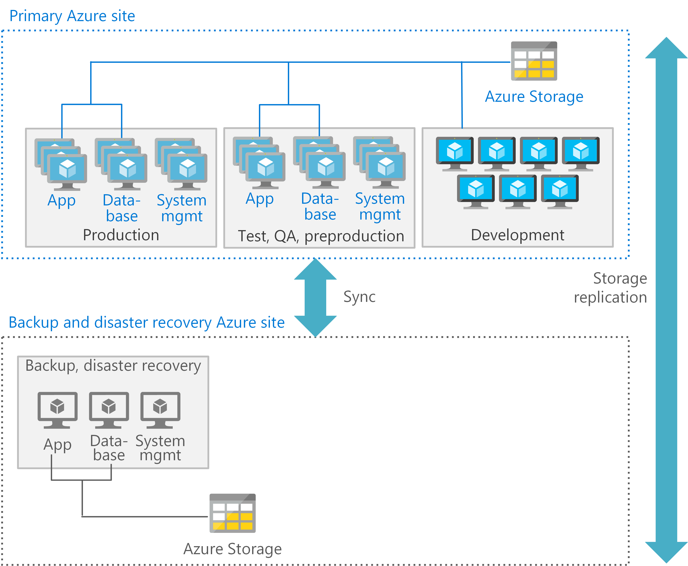

# Move mainframe compute to Azure

Mainframes have a reputation for high reliability and availability and continue to be the trusted backbone of many enterprises. They are often thought to have nearly limitless scalability and computing power as well. However, some
enterprises have outgrown the capability of the largest available mainframes and need to know how to make the most of the cloud’s agility, reach, and infrastructure savings.

To run mainframe workloads on Microsoft Azure, you need to know how your mainframe’s compute capabilities compare to Azure. Based on an IBM z14 mainframe (the most current model as of this writing), this article tells you how to get comparable results on Azure.

To get started, it helps to see both environments side by side. The following figure compares a mainframe environment for running applications to an Azure hosting environment. Consider it a useful point of reference.

The power of mainframes is often used for online transaction processing (OLTP) systems that handle millions of updates for thousands of users. These applications often use software for transaction processing, screen handling, and
form entry, such as a Customer Information Control System (CICS), Information Management System (IMS), and Transaction Interface Package (TIP). 

As the figure shows, a TPM emulator on Azure can handle CICS and IMS workloads. A batch system emulator on Azure performs the role of Job Control Language (JCL). Mainframe data is migrated to Azure databases, such as Azure SQL Database. Azure services or other software hosted in Azure Virtual Machines can be used for system management.

## Mainframe compute glance

In the z14 mainframe, processors are arranged in up to four *drawers*. A *drawer* is simply a cluster of processors and chipsets. Each drawer can have six active central processor (CP) chips, and each CP has 10 system controller
(SC) chips. In Intel x86 terminology, there are six sockets per drawer, 10 cores per socket, and four drawers. This architecture provides the rough equivalent of 24 sockets and 240 cores, maximum, for a z14.

The z14 CP is extremely fast with a 5.2 GHz clock speed.

A z14 is usually delivered with all the CPs in the box. They are activated as needed. A customer is typically charged for at least four hours of compute time per month despite actual usage.

A mainframe processor can be configured as a General Purpose (GP) processor, System z Integrated Information Processor (zIIP), Integrated Facility for Linux (IFL) processor, System Assist Processor (SAP), and Integrated Coupling Facility (ICF) processor.

## Scaling mainframe compute up and out

IBM mainframes offer the ability to scale up to 240 cores (the current z14 size for a single system). Additionally, IBM mainframes can scale out through a feature called the Coupling Facility (CF). The CF allows multiple mainframe
systems to access the same data simultaneously. Using the CF, the mainframe Parallel Sysplex technology groups mainframe processors in clusters. When this guide was written, the Parallel Sysplex feature supported 32 groupings of 64 processors each. Up to 2,048 processors can be grouped in this manner to scale out compute capacity.

A CF allows the compute clusters to share data with direct access, and it is used for locking information, cache information, and the list of shared data resources. A Parallel Sysplex using one or more CFs can be thought of as a
“shared everything” scale-out compute cluster. For more information about these features, see [Parallel Sysplex on IBM
Z](https://www.ibm.com/it-infrastructure/z/technologies/parallel-sysplex-resources) on the IBM website.

Applications can use these features to provide both scale-out performance and high availability. For information about how CICS can use Parallel Sysplex with CF, download the [IBM CICS and the Coupling Facility: Beyond the Basics](http://www.redbooks.ibm.com/redbooks/pdfs/sg248420.pdf) redbook.

## Azure compute at a glance

Although some people think that Intel-based servers are not as powerful as mainframes, the new core-dense, Intel-based systems have as much compute capacity as mainframes. This section describes the Azure infrastructure-as-a-service (IaaS) options for computing and storage. Azure provides platform-as-a-service (PaaS) options as well, but the focus here are the IaaS choices that provide comparable mainframe capacity.

Azure Virtual Machines provide compute power in a range of sizes and types. In Azure, a virtual CPU (vCPU) roughly equates to a core on a mainframe.

Currently, the range of Azure Virtual Machine sizes provides from 1 to 128 vCPUs. Virtual machine (VM) types are optimized for particular workloads. For example, the following list shows the VM types (current as of this writing) and their recommended uses:

| Size     | Type and description                                                                 |
|----------|--------------------------------------------------------------------------------------|
| D-Series | General purpose with 64 vCPU and up to 3.5 GHz clock speed                           |
| E-Series | Memory optimized with up to 64 vCPUs                                                 |
| F-Series | Compute optimized with up to 64 vCPUs and 3..7 GHz clock speed                       |
| H-Series | Optimized for high performance computing (HPC) applications                          |
| L-Series | Storage optimized for high-throughput applications backed by databases such as NoSQL |
| M Series | Largest compute and memory optimized VMs with up to 128 vCPUs                        |

For details about available VMs, see [Virtual Machine series](https://azure.microsoft.com/en-us/pricing/details/virtual-machines/series/).

A z14 mainframe can have up to 240 cores. However, z14 mainframes almost never use all the cores for a single application or workload. Instead, a mainframe segregates workloads into logical partitions (LPARs), and the LPARs have ratings—MIPS (Millions of Instructions Per Second) or MSU (Million Service Unit). When determining the comparable VM size needed to run a mainframe workload on Azure, factor in the MIPS (or MSU) rating.

The following are general estimates:

-   150 MIPS per vCPU

-   1,000 MIPS per processor

To determine the correct VM size for a given workload in a LPAR, first optimize the VM for the workload. Then determine the number of vCPUs needed. A conservative estimate is 150 MIPS per vCPU. Based on this estimate, for example, an F-series VM with 16 vCPUs could easily support an IBM Db2 workload coming from an LPAR with 2,400 MIPS.

## Azure compute scale-up

The M-series VMs can scale up to 128 vCPUs (at the time this article was written). Using the conservative estimate of 150 MIPS per vCPU, the M-series VM equates to about 19,000 MIPS. The general rule of thumb for estimating MIPS for a mainframe is 1,000 MIPS per processor. A z14 mainframe can have up to 24 processors. This provides about 24,000 MIPS for a single mainframe system.

While the largest single z14 mainframe has approximately 5,000 MIPS more than the largest VM available in Azure, it is important to compare how workloads are deployed on a mainframe and on an Azure Virtual Machine. If a system has both an application and a relational database, both are typically deployed on the same physical mainframe, using separate LPARs for the application and database. 

On Azure, the same solution is typically deployed using one VM for the application and a separate, suitably sized VM for the database. For example, if a M64 vCPU system supports the application, and a M96 vCPU is used for the database,
approximately 150 vCPUs are needed—or about 24,000 MIPS as the following figure shows.

When you take the approach of migrating LPARs to individual VMs, Azure can easily scale up to the size needed for most applications that are deployed on a single mainframe system.

## Azure compute scale-out

One of the big advantages of an Azure–based solution is the ability to scale out. Scaling makes nearly limitless compute capacity available to an application. Azure supports multiple methods to scale-out compute power:

- **Scale-out with multiple VMs in a cluster.** In this scenario, an application can use a [load balancer](/azure/load-balancer/load-balancer-overview) or resource manager to spread the workload out among multiple VMs in a cluster. If more compute capacity is needed, additional VMs are added to the cluster.

- **VM scale sets.** In this burst scenario, an application can scale to additional [compute resources](/azure/virtual-machine-scale-sets/overview) based on VM utilization. When demand decreases, the number of VMs in a scale set can also decrease, ensuring efficient use of compute power.

- **PaaS scaling.** In addition to VMs, Azure PaaS offerings scale compute resources as needed. For example, [Azure Service Fabric](/azure/service-fabric/service-fabric-overview), a platform for building and running microservices and containers, allocates additional compute resources to support increases in the volume of requests.

- **Kubernetes clusters.** Applications on Azure can use [Kubernetes clusters](/azure/aks/concepts-clusters-workloads) for compute services for specified resources. Azure Kubernetes Service (AKS) is a managed service that orchestrates Kubernetes nodes, pools, and clusters on Azure.

In choosing the right method for scaling out compute resources, it’s important to understand the difference in how Azure and mainframes scale out. The key is how—or if—data is shared by compute resources. In Azure, data (by default) is not typically shared by multiple VMs. If data sharing is required by multiple VMs in a scale-out compute cluster, the shared data must reside in a resource that supports this functionality. On Azure, data sharing involves storage as the following section discusses.

## Azure compute optimization

You can optimize each tier of processing in an Azure architecture using the most suitable type of VMs and features for that environment. The following shows one potential pattern for deploying VMs in Azure to support a CICS application that uses Db2. In the primary site, the production, preproduction, and testing VMs are deployed with high availability. The secondary site is for backup and disaster recovery.

Each tier can also provide appropriate disaster recovery services. For example, production and database VMs might require a hot or warm recovery, while the development and testing VMs support a cold recovery.

## Learn more

- [Mainframe migration](/azure/architecture/cloud-adoption/infrastructure/mainframe-migration/overview)
- [Mainframe rehosting on Azure Virtual Machines](/azure/virtual-machines/workloads/mainframe-rehosting/overview)
- [Move mainframe storage to Azure](mainframe-storage-on-Azure.md)

### IBM resources

- [Parallel Sysplex on IBM Z](https://www.ibm.com/it-infrastructure/z/technologies/parallel-sysplex-resources)
- [IBM CICS and the Coupling Facility: Beyond the Basics](http://www.redbooks.ibm.com/redbooks/pdfs/sg248420.pdf)
- [Creating required users for a Db2 pureScale Feature installation](https://www.ibm.com/support/knowledgecenter/en/SSEPGG_11.1.0/com.ibm.db2.luw.qb.server.doc/doc/t0055374.html?pos=2)
- [Db2icrt - Create instance command](https://www.ibm.com/support/knowledgecenter/en/SSEPGG_11.1.0/com.ibm.db2.luw.admin.cmd.doc/doc/r0002057.html)
- [Db2 pureScale Clustered Database Solution](http://www.ibmbigdatahub.com/blog/db2-purescale-clustered-database-solution-part-1)
- [IBM Data Studio](https://www.ibm.com/developerworks/downloads/im/data/index.html/)

### Azure Government

- [Microsoft Azure Government cloud for mainframe applications](https://azure.microsoft.com/en-us/resources/microsoft-azure-government-cloud-for-mainframe-applications/en-us/)
- [Microsoft and FedRAMP](https://www.microsoft.com/en-us/TrustCenter/Compliance/FedRAMP)

### More migration resources

- [Platform Modernization Alliance: IBM Db2 on Azure](https://www.platformmodernization.org/pages/ibmdb2azure.aspx)
- [Azure Virtual Data Center Lift and Shift Guide](https://azure.microsoft.com/resources/azure-virtual-datacenter-lift-and-shift-guide/)
- [GlusterFS iSCSI](https://docs.gluster.org/en/latest/Administrator%20Guide/GlusterFS%20iSCSI/)
