# Set up Micro Focus CICS BankDemo for Micro Focus Enterprise Developer 4.0 in Azure

When you set up Micro Focus Enterprise Server 4.0 and Enterprise Developer 4.0 on Azure, you can test deployments of IBM z/OS workloads. This article shows how to set up CICS BankDemo, a sample application that comes with Enterprise Developer.

CICs stands for Customer Information Control System, the transaction platform used by many of the online mainframe applications. The BankDemo application is great for learning how Enterprise Server and Enterprise Developer operate and how to manage and deploy an actual application complete with green screen
terminals.

## Prerequisites

- A VM with Enterprise Developer. See Set up Enterprise Server 4.0 and Enterprise Developer 4.0 on Azure. Keep in mind that Enterprise Developer has a complete instance of Enterprise Server on it for development and test purposes. This is the instance of Enterprise Server used for the demo.

- [SQL Server 2017 Express edition](https://www.microsoft.com/sql-server/sql-server-editions-express). Download and install it on the Enterprise Developer VM. Enterprise Server requires a database for the management of CICS regions, and the BankDemo application also uses a SQL Server database called BANKDEMO. This demo assumes you are using SQL Server Express for both databases. When installing, select the basic installation.

- [SQL Server Management Studio](/sql/ssms/download-sql-server-management-studio-ssms?view=sql-server-2017) (SSMS). SSMS is used for managing the databases and running a T-SQL script. Download and install it on the Enterprise Developer VM.

- [Visual Studio 2017](https://azure.microsoft.com/downloads/) with the latest service pack or [Visual Studio Community](https://visualstudio.microsoft.com/vs/community/), which you can download for free.

- Rumba Desktop or another 3270 emulator.

## Configure the Windows environment

After you install Enterprise Developer 4.0 on the VM, you must configure the instance of Enterprise Server that comes with it. To do that, you need to install a few additional Windows features as follows.

1. Use RDP to log on to the Enterprise Server 4.0 VM you created.

2. Click the **Search** icon next to the **Start** button and type **Windows features**. The Server Manager Add Roles and Features Wizard opens.

3. Select **Web Server (IIS) Role**, and then check the following:

    - Web Management Tools
    - IIS 6 Management Compatibility (select all available features)
    - IIS Management Console
    - IIS Management Scripts and Tools
    - IIS Management Service

4. Select **World Wide Web Services**, and check the following:

     Application Development Features:
    - .NET Extensibility
    - ASP.NET
    - Common HTTP Features: Add all available features
    - Health and Diagnostics: Add all available features
    - Security:
        - Basic Authentication
        - Windows Authentication

5. Select **Windows Process Activation Service** and all its children.

6. For **Features**, check **Microsoft .NET framework 3.5.1**, and check the following:

    - Windows Communication Foundation HTTP Activation
    - Windows Communication Foundation Non-HTTP Activation

7. For **Features**, check **Microsoft .NET framework 4.6**, and check the following:

    - Named Pipe Activation
    - TCP Activation
    - TCP Port Sharing

     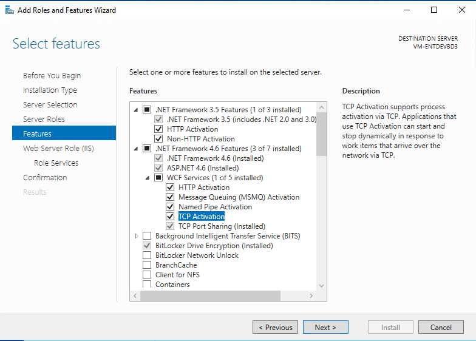

8. When you have selected all the options, click **Next** to install.

9. After the Windows features, go to **Control Panel \> System and Security \> Administrative Tools**, and select **Services**. Scroll down and make sure the following services are running and set to **Automatic**:

    - **NetTcpPortSharing**
    - **Net.Pipe Listener Adapter**
    - **Net.tcp Listener Adapter**

10. To configure IIS and WAS support, from the menu locate **Micro Focus Enterprise Developer Command Prompt (64 bit)** and run as **Administrator**.

11. Type **wassetup –i** and press **Enter**.

12. After the script runs, you can close the window.

## Configure the local system account for SQL Server

Some Enterprise Server processes need to be able to log on to SQL Server and create databases and other objects. These processes use the local system account, so you must give sysadmin authority to that account.

1. Launch the **SSMS** and click **Connect** to connect to the local SQLEXPRESS Server using Windows Authentication. It should be available in the **Server Name** list.

2. On the left, expand the **Security** folder and select **Logins**.

3. Select **NT AUTHORITY\\SYSTEM** and select **Properties**.

4. Select **Server Roles** and check **sysadmin**.

     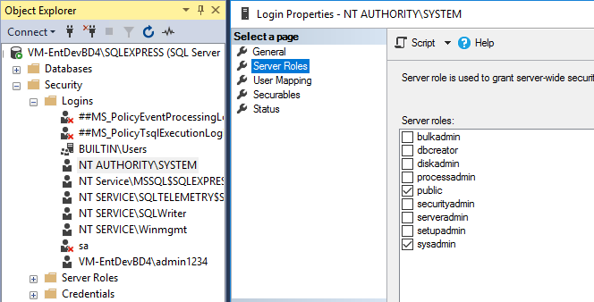

## Create the BankDemo database and all its objects

1. Open **Windows Explorer** and Navigate to **C:\\Users\\Public\\Documents\\Micro Focus\\Enterprise Developer\\Samples\\Mainframe\\CICS\\DotNet\\BankDemo\\SQL**.

2. Copy the contents of **BankDemoCreateAll.SQL** file into your clipboard.

3. Open **SSMS**. On the right, click **Server** and select **New Query**.

4. Paste the contents of the clipboard into the **New Query** box.

5. Execute the SQL by clicking **Execute** from the **Command** tab above the query.

The query should run with no errors. When it is complete, you have the sample database for the BankDemo application.

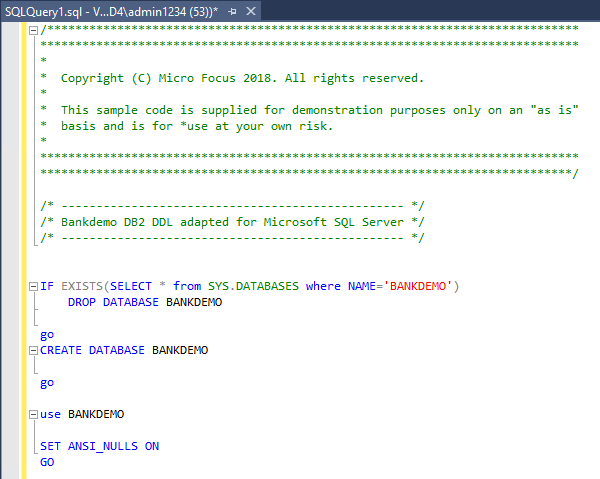

## Verify that the database tables and objects have been created

1. Right-click the **BANKDEMO** database and select **Refresh**.

2. Expand the **Database** and select **Tables**. You should see something like the following.

     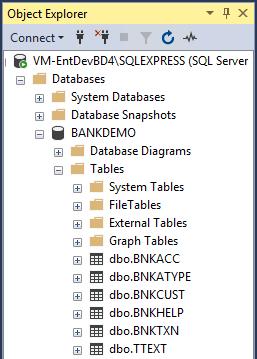

## Build the application in Enterprise Developer

1. Open Visual Studio and log on.

2. Under the **File** menu option, select **Open Project/Solution**, navigate to **C:\\Users\\Public\\Documents\\Micro Focus\\Enterprise Developer\\Samples\\Mainframe\\CICS\\DotNet\\BankDemo**, and select the **sln** file.

3. Take some time to examine the objects. COBOL programs are shown in Solution Explorer with the CBL extension along with CopyBooks (CPY) and JCL.

4. Right-click the **BankDemo2** Project and select **Set as Startup Project**.

> [!NOTE]
> The BankDemo Project makes use of HCOSS (Host Compatibility Option for SQL Server), which is not used for this demo.

5. In **Solution Explorer**, right-click the **BankDemo2** Project and select **Build**.

> [!NOTE]
> Building at the solution level results in errors, as HCOSS has not been configured.

6. When the Project is built, examine the **Output** window. It should look like the image below.

     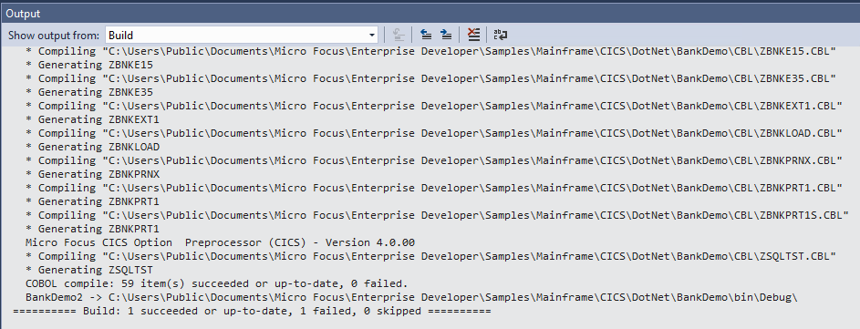

## Deploy the BankDemo application into the Region database

1. Open an Enterprise Developer command prompt (64bit) as Administrator.

2. Navigate to the **%PUBLIC%\\Documents\\Micro Focus\\Enterprise Developer\\samples\\Mainframe\\CICS\\DotNet\\BankDemo**.

3. At the command prompt, execute **bankdemodbdeploy** and include the parameter for the database to deploy to, for example:

```
    bankdemodbdeploy (local)/sqlexpress
```

> [!NOTE]
> Make sure to use a forward slash (/) not a backward slash(\\). This script runs for a while.

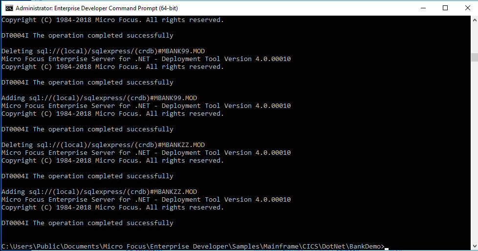

## Create the BankDemo Region in Enterprise Administrator for .NET

1. Open the **Enterprise Server for .NET Administration** UI.

2. To start the MMC snap-in, from the Windows **Start** menu, choose **Micro Focus Enterprise Developer \> Configuration \> Enterprise Server for .NET Admin**. (For Windows Server, choose **Micro Focus Enterprise Developer \> Enterprise Server for .NET Admin**).

3. Expand the **Regions** container in the left pane and then right-click **CICS**.

4. Select **Define Region** to create a new CICS Region called **BANKDEMO**, hosted in the (local) database.

5. Supply the database server instance, click **Next**, and then enter the region name **BANKDEMO**.

     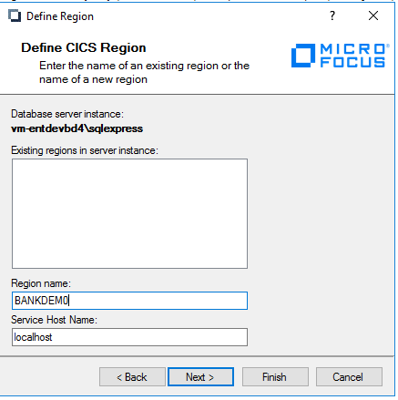

6. To select the region definition file for the cross-region database, locate **region\_bankdemo\_db.config** in **C:\\Users\\Public\\Documents\\Micro Focus\\Enterprise Developer\\Samples\\Mainframe\\CICS\\DotNet\\BankDemo**.

     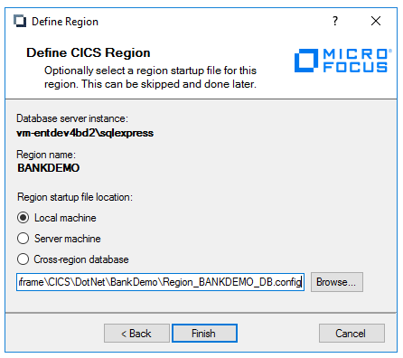

7. Click **Finish**.

## Create XA Resource Definitions

1. In the left pane of the **Enterprise Server for .NET Administration** UI, expand **System**, and then **XA Resource Definitions**. This setting defines how the Region interoperates with Enterprise Server and the application databases.

2. Right-click on **XA Resource Definitions** and select **Add Server Instance**.

3. In the drop-down box, select **Database Service Instance**. It will be the local machine SQLEXPRESS.

4. Select the instance from under the **XA Resource Definitions (machinename\\sqlexpress)** container and click **Add**.

5. Select **Database XA Resource Definition** and then type **BANKDEMO** for the **Name** and **Region**.

     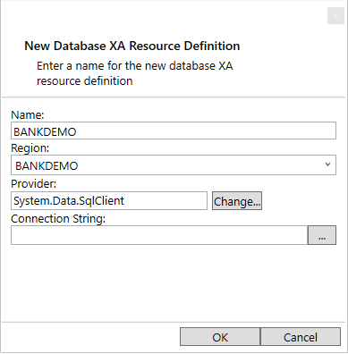

6. Click the ellipses (**…**) to bring up the Connection String wizard. For **Server Name**, type **(local)\\SQLEXPRESS**. For **Logon**, select **Windows Authentication**. For database name, type **BANKDEMO**

     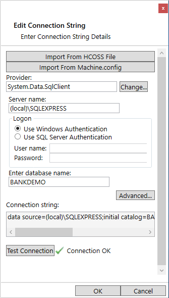

7. Test the connection.

## Start the BANKDEMO Region

> [!NOTE]
> The first step is important: You must set the Region to use the XA Resource Definition you just created.

1. Navigate to the **BANDEMO CICS Region** under the **Regions Container**, and then select **Edit Region Startup File** from the **Actions** pane. Scroll down to the SQL properties and enter **bankdemo** for the **XA resource name** , or use the ellipsis to select it.

2. Click the **Save** icon to save your changes.

3. Right-click **BANKDEMO CICS Region** in the **Console** pane, and select **Start/Stop Region**.

4. In the bottom of the **Start / Stop** box that appears in the middle pane, select **Start**. After a few seconds, the Region starts.

     

     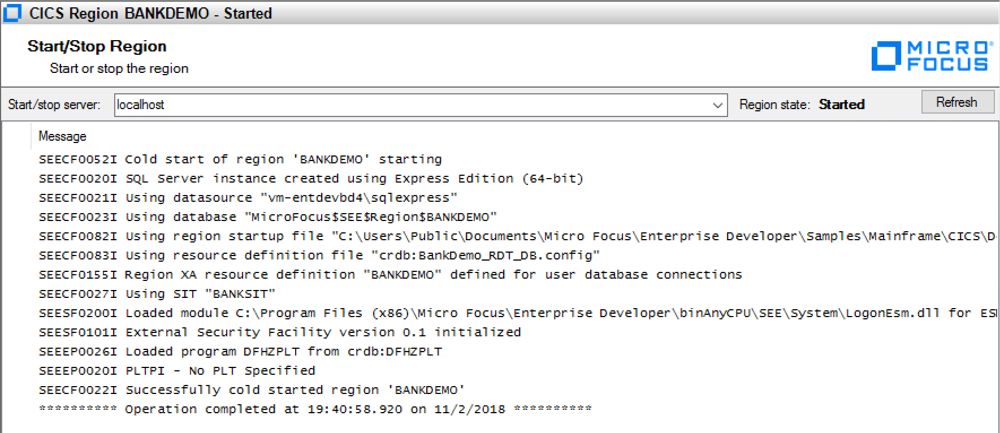

## Create a listener

You need to create a listener for the TN3270 sessions that access the BankDemo application.

1. In the left pane, expand **Configuration Editors** and select **Listener**.

2. Click the **Open File** icon and select the **seelistener.exe.config** file. This file will be edited and is loaded every time Enterprise Server starts.

3. Notice the two Regions previously defined (ESDEMO and JCLDEMO).

4. To create a new Region for BANKDEMO, right-click **Regions**, and select **Add Region**.

5. Select **BANKDEMO Region**.

6. Add a TN3270 channel by right-clicking **BANKDEMO Region** and selecting **Add Channel**.

7. For **Name**, enter **TN3270**. For **Port**, enter **9024**. (Note that the ESDEMO application uses port 9230 so you need to use a different port.)

8. To save the file, click the **Save** icon or choose **File** \> **Save**.

9. To start the listener, click the **Start Listener** icon or choose **Options** \> **Start Listener**.

     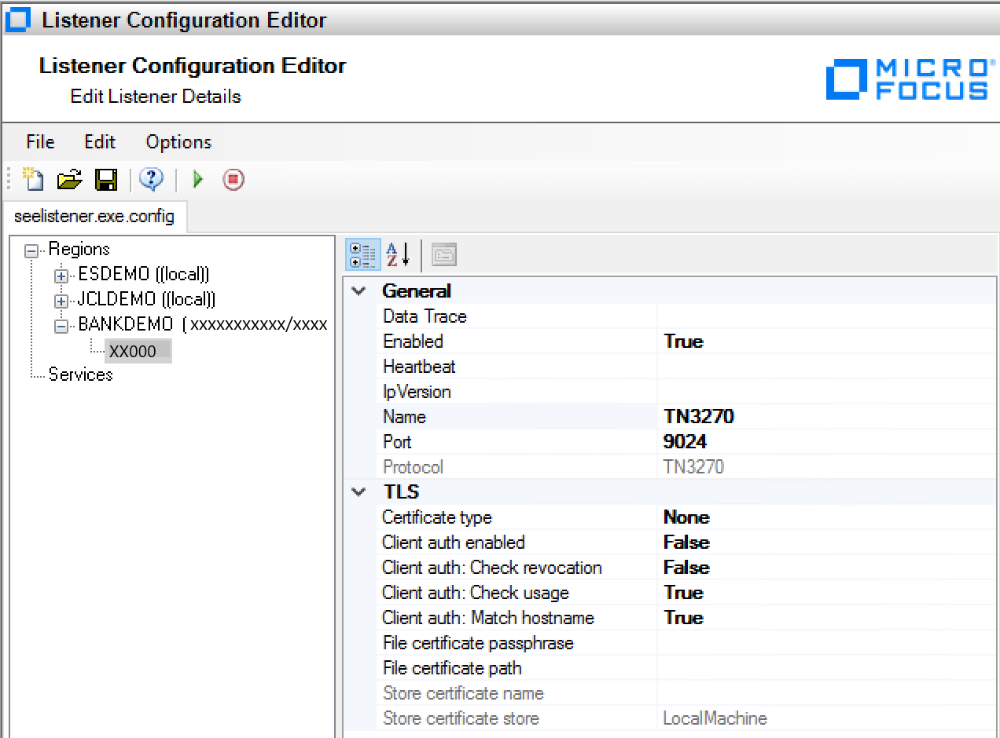


## Configure Rumba to access the BankDemo application

The final thing you need to do is configure a 3270 session using Rumba, a 3270 emulator. This step enables you to access the BankDemo application through the listener you just created.

1. From the Windows **Start** menu, launch Rumba Desktop.

2. Under the **Connections** menu item, select **TN3270**.

3. Click **Insert** and type **127.0.0.1** for the IP address and **9024** for the User Defined port.

4. At the bottom of the dialog box, click **Connect**. A black CICS screen appears.

5. Type **bank** to display the initial 3270 screen for the BankDemo application.

6. For User ID, type **B0001** and for the password, type anything. The first screen BANK20 opens.

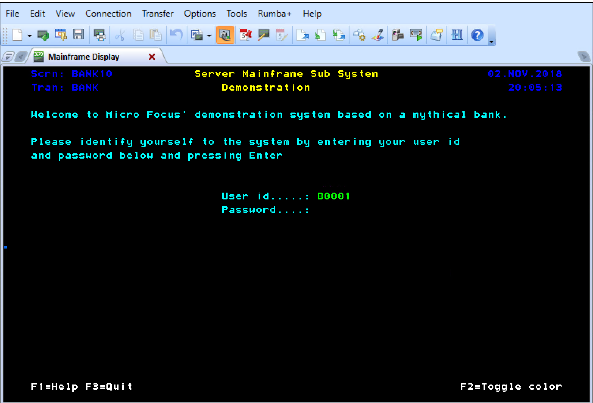
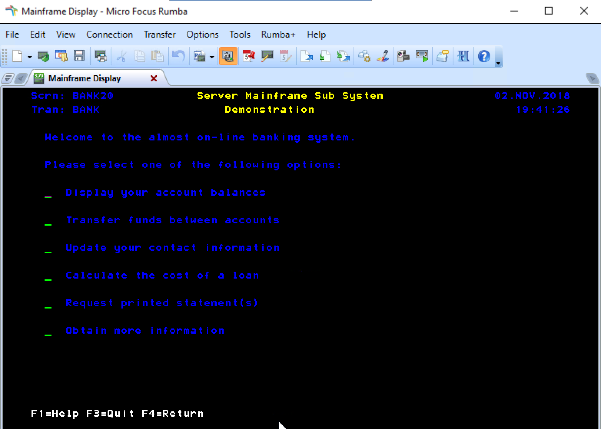

Congratulations! You are now running a CICS application in Azure using Micro Focus Enterprise Server.

## Learn more

- [Mainframe Migration - Portal](https://blogs.msdn.microsoft.com/azurecat/2018/11/16/mainframe-migration-to-azure-portal/)
- [Virtual Machines](https://docs.microsoft.com/azure/virtual-machines/linux/overview)
- [Troubleshooting](https://docs.microsoft.com/azure/virtual-machines/troubleshooting/)
- [Demystifying mainframe to Azure migration](https://azure.microsoft.com/resources/demystifying-mainframe-to-azure-migration/en-us/)
