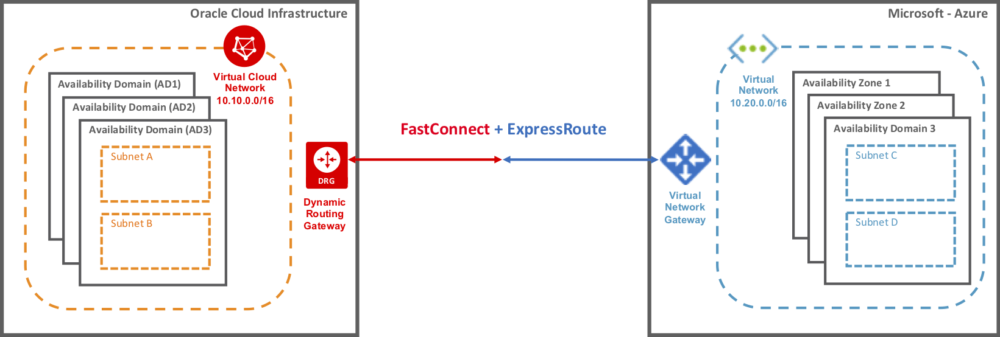

# Set up a direct interconnection between Azure and Oracle Cloud Infrastructure  

To create an [integrated multi-cloud experience](oracle-oci-overview.md) (preview), Microsoft and Oracle offer direct interconnection between Azure and Oracle Cloud Infrastructure (OCI) through [ExpressRoute](../../../expressroute/expressroute-introduction.md) and [FastConnect](https://docs.cloud.oracle.com/iaas/Content/Network/Concepts/fastconnectoverview.htm). Through the ExpressRoute and FastConnect interconnection, customers can experience low latency, high throughput, private direct connectivity between the two clouds.

The following image shows a high-level overview of the interconnection:

## Prerequisites

* To establish connectivity between Azure and OCI, you must have an active Azure subscription and an active OCI tenancy.

* Connectivity is only possible where an Azure ExpressRoute peering location is in proximity to or in the same peering location as the OCI FastConnect. See [preview limitations](oracle-oci-overview.md#preview-limitations).

## Configure direct connectivity between ExpressRoute and FastConnect

1. Create a standard ExpressRoute circuit on your Azure subscription under a resource group. 
    * While creating the ExpressRoute, choose **Oracle** as the service provider. To create an ExpressRoute circuit, see the [step-by-step guide](../../../expressroute/expressroute-howto-circuit-portal-resource-manager.md).
    * An Azure ExpressRoute circuit provides granular bandwidth options, whereas FastConnect supports 1, 2, 5, or 10 Gbps. Therefore, it is recommended to choose one of these matching bandwidth options under ExpressRoute.
    * Note down your ExpressRoute Service key. You need to provide the key while configuring your FastConnect. 
1. Configure FastConnect under your Oracle tenant. For more information, see the [Oracle documentation](https://docs.cloud.oracle.com/iaas/Content/Network/Concepts/azure.htm).
  
    * Under FastConnect configuration, select **Microsoft Azure** as the provider.
    * In **Provider Service Key**, paste the ExpressRoute service key.
1. Complete linking the FastConnect to VCN under your Oracle tenant via Dynamic Routing Gateway, using Route Table.
1. Configure private peering under your ExpressRoute circuit. To configure peering, see the [step-by-step guide](../../../expressroute/expressroute-howto-routing-portal-resource-manager.md).
    
1. Complete connecting the private peering to the virtual gateway of your VNet, following the [step-by-step guide](../../../expressroute/expressroute-howto-linkvnet-portal-resource-manager.md).

Once you have completed the network configuration, you can verify the validity of your configuration by checking the ARP table and Route table under the ExpressRoute private peering blade in Azure portal.

## Monitoring

Installing agents on both the clouds, you can leverage Azure [Network Performance Monitor (NPM)](../../../expressroute/how-to-npm.md) to monitor the performance of the end-to-end network. NPM helps you to readily identify network issue, and help eliminating them.

## Next steps

* For more information about the cross-cloud connection between OCI and Azure, see the [Oracle documentation](https://docs.cloud.oracle.com/iaas/Content/Network/Concepts/azure.htm).
* You can use Terraform templates to deploy infrastructure for targeted Oracle applications over Azure, and configure the cross-cloud direct connectivity. 