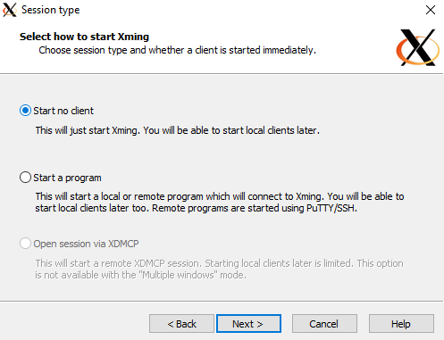
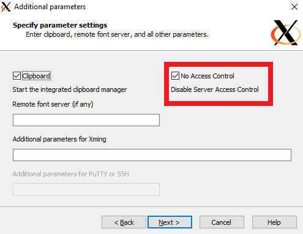
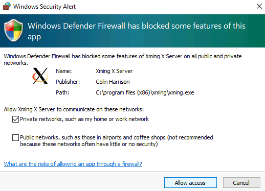
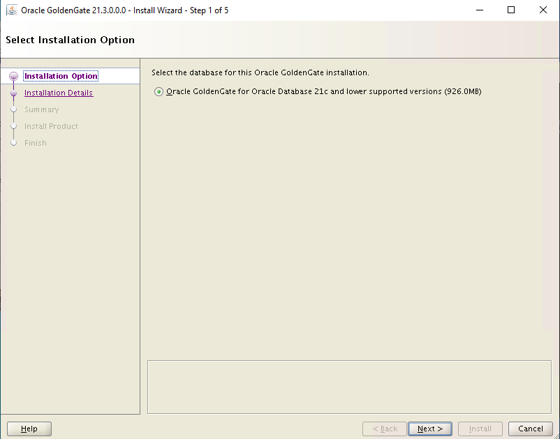
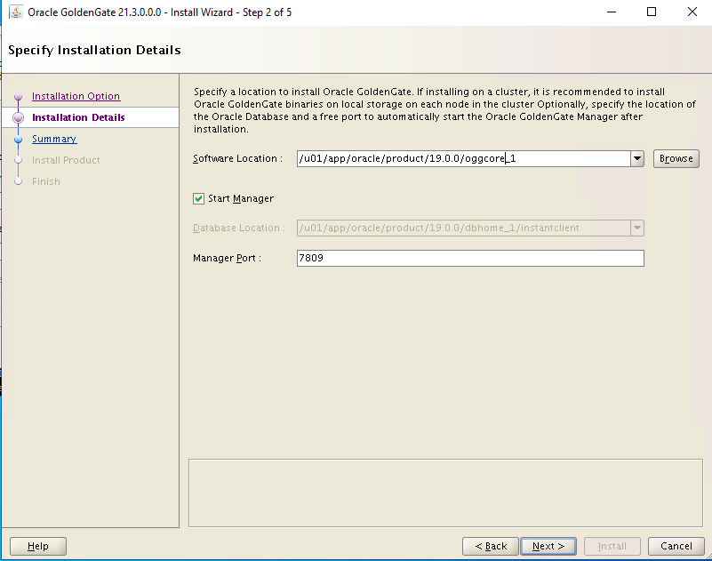
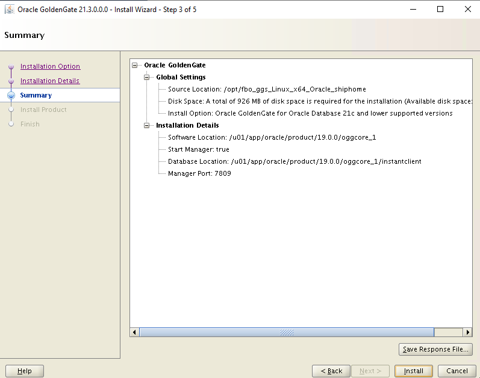
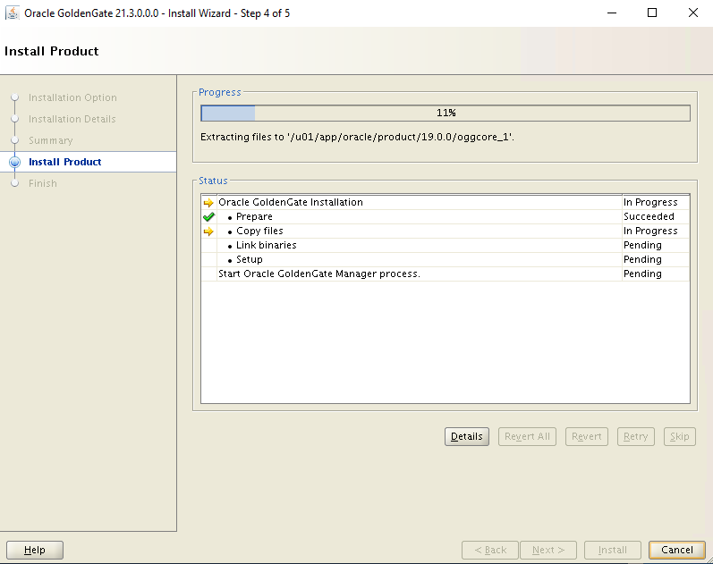
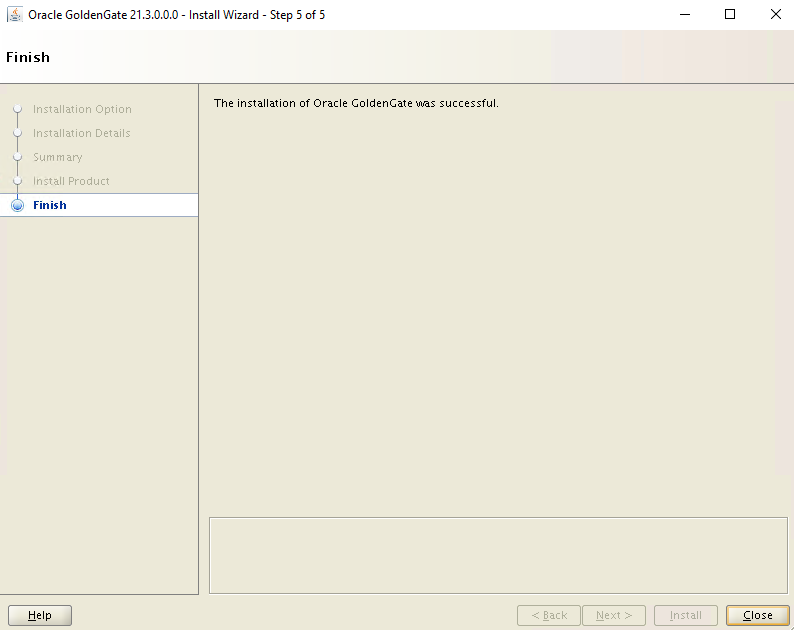

# Implement Oracle Golden Gate on an Azure Linux virtual machine

**Applies to:** :heavy_check_mark: Linux VMs

The Azure CLI is used to create and manage Azure resources from the command line or in scripts. This guide details how to use the Azure CLI to deploy an Oracle 19c database from the Azure Marketplace gallery image.

This document shows you step-by-step how to create, install, and configure Oracle Golden Gate on an Azure VM. In this tutorial, two virtual machines are set up in an availability set in a single region. The same tutorial can be used to setup OracleGolden Gate for VMs in different Availability Zones in a single Azure region or for VMs set up in two different regions.

Before you start, make sure that the Azure CLI has been installed. For more information, see [Azure CLI installation guide](/cli/azure/install-azure-cli).

## Introduction

GoldenGate is a logical replication software that enables real-time replication, filtering, and transformation of data from a source database to a target database. This feature ensures that changes in the source database are replicated in real-time, making it possible for the target database to be up-to-date with the latest data.

GoldenGate is mainly used for heterogeneous replication cases, such as replicating data from different source databases to a single database (like a data warehouse), cross-platform migrations (such as from SPARC and AIX to Linux x86 environments), and advanced high availability and scalability scenarios. Additionally, GoldenGate is also suitable for near-zero downtime migrations since it supports online migrations with minimal disruption to the source systems.

While GoldenGate facilitates bi-directional replication, the application must be configured accordingly. Additionally, the software permits filtering and transformation of data to meet specific business requirements, enabling users to make use of the replicated data for various purposes.

## Prepare the environment

To perform the Oracle Golden Gate installation, you need to create two Azure VMs on the same availability set. The Marketplace image you use to create the VMs is **Oracle:oracle-database-19-3:oracle-database-19-0904:19.3.1**.

You also need to be familiar with Unix editor vi and have a basic understanding of X Server.

The following table is a summary of the environment configuration:
>
> |  | **Primary site** | **Replicate site** |
> | --- | --- | --- |
> | **Oracle release** |Oracle Database 19.3.1.0|Oracle Database 19.3.1.0|
> | **Machine name** |ggVM1 |ggVM2 |
> | **Operating system** |Oracle Linux 7.x |Oracle Linux 7.x |
> | **Oracle SID** |CDB1 |CDB1 |
> | **Replication schema** |TEST|TEST |
> | **Golden Gate owner/replicate** |C##GGADMIN |REPUSER |
> | **Golden Gate process** |EXTORA |REPORA|

### Sign in to Azure

1. Open your preferred shell on Windows, Linux or [Azure Shell](https://shell.azure.com).

2. Sign in to your Azure subscription with the [az login](/cli/azure/authenticate-azure-cli) command. Then follow the on-screen directions.

```azurecli
$ az login
```

3. Ensure you are connected to the correct subscription by verifying subscription name and/or ID.

```azurecli
$ az account show
```

```output
{
  "environmentName": "XXXXX",
  "homeTenantId": "XXXXXXXX-XXXX-XXXX-XXXX-XXXXXXXXXXXX",
  "id": "<SUBSCRIPTION_ID>",
  "isDefault": true,
  "managedByTenants": [],
  "name": "<SUBSCRIPTION_NAME>",
  "state": "Enabled",
  "tenantId": XXXXXXXX-XXXX-XXXX-XXXX-XXXXXXXXXXXX",
  "user": {
    "cloudShellID": true,
    "name": "aaaaa@bbbbb.com",
    "type": "user"
  }
}
```

### Generate authentication keys

We use key file based authentication with ssh to connect to the Oracle Database VM. Ensure that you have your private (named `id_rsa`) and public (named `id_rsa.pub`) key files are created on your [shell](#sign-in-to-azure).

Location of key files depends on your source system.

Windows: %USERPROFILE%\.ssh
Linux: ~/.ssh 

If they don't exist you can create a new keyfile pair.

ssh-keygen -m PEM -t rsa -b 4096

The .ssh directory and key files are created. For more information, refer to [Create and manage SSH keys for authentication to a Linux VM in Azure](/azure/virtual-machines/linux/create-ssh-keys-detailed)

### Create a resource group

To create a resource group, use the [az group create](/cli/azure/group) command. An Azure resource group is a logical container in which Azure resources are deployed and managed.

```azurecli
$ az group create --name GoldenGateOnAzureLab --location westus
```

### Create and configure network

#### Create Virtual Network

Use following command to create the virtual network that hosts resources we create in this lab.

```azurecli
$ az network vnet create \
  --name ggVnet \
  --resource-group GoldenGateOnAzureLab \
  --address-prefixes "10.0.0.0/16" \
  --subnet-name ggSubnet1 \
  --subnet-prefixes "10.0.0.0/24"
```

#### Create a Network Security Group (NSG)

1. Create network security group (NSG) to lock down your virtual network.

```azurecli
$ az network nsg create \
  --resource-group GoldenGateOnAzureLab \
  --name ggVnetNSG
```

2. Create NSG rule to allow communication within virtual network.

```azurecli
$ az network nsg rule create  --resource-group GoldenGateOnAzureLab --nsg-name ggVnetNSG \
    --name ggAllowVnet \
    --protocol '*' --direction inbound --priority 3400 \
    --source-address-prefix 'VirtualNetwork' --source-port-range '*' \
    --destination-address-prefix 'VirtualNetwork' --destination-port-range '*' --access allow
```

3. Create NSG rule to deny all inbound connections

```azurecli
$ az network nsg rule create \
  --resource-group GoldenGateOnAzureLab \
  --nsg-name ggVnetNSG \
  --name ggDenyAllInBound \
  --protocol '*' --direction inbound --priority 3500 \
  --source-address-prefix '*' --source-port-range '*' \
  --destination-address-prefix '*' --destination-port-range '*' --access deny
```

4. Assign NSG to Subnet where we host our servers.

```azurecli
$ az network vnet subnet update --resource-group GoldenGateOnAzureLab --vnet-name ggVNet --name ggSubnet1 --network-security-group ggVnetNSG
```

#### Create Bastion Network

1. Create Bastion subnet. Name of the subnet must be **AzureBastionSubnet**

```azurecli
$ az network vnet subnet create  \
    --resource-group GoldenGateOnAzureLab \
    --name AzureBastionSubnet \
    --vnet-name ggVnet \
    --address-prefixes 10.0.1.0/24 
```

2. Create public IP for Bastion

```azurecli
$ az network public-ip create \
    --resource-group GoldenGateOnAzureLab \
    --name ggBastionIP \
    --sku Standard 
```

3. Create Azure Bastion resource. It takes about 10 minutes for the resource to deploy.

```azurecli
$ az network bastion create \
    --resource-group GoldenGateOnAzureLab \
    --name ggBastion \
    --public-ip-address ggBastionIP \
    --vnet-name ggVnet \
    --sku Standard \
    --enable-tunneling \
    --enable-ip-connect true
```

### Create X Server VM  (ggXServer)

Replace your password and run following command to create a Windows workstation VM where we deploy X Server.

```azurecli
$ az vm create \
     --resource-group GoldenGateOnAzureLab \
     --name ggXServer \
     --image MicrosoftWindowsDesktop:Windows-10:win10-22h2-pro-g2:19045.2604.230207 \
     --size Standard_DS1_v2  \
     --vnet-name ggVnet \
     --subnet ggSubnet1 \
     --public-ip-sku Standard \
     --nsg "" \
     --data-disk-delete-option Delete \
     --os-disk-delete-option Delete \
     --nic-delete-option Delete \
     --admin-username azureuser \
     --admin-password <ENTER_YOUR_PASSWORD_HERE>
```

### Connect to ggXServer through Bastion

Connect to **ggXServer** using Bastion.

1. Navigate to **ggXServer** from Azure portal.
2. Go to **Overview** in the left blade
3. Select **Connect** > **Bastion** on the menu at the top
4. Select Bastion tab
5. Click **Use Bastion**

### Prepare ggXServer to run X Server

X Server is required for later steps of this lab. Perform following steps to install and start X Server.

1. [Download Xming X Server for Windows](https://sourceforge.net/projects/xming/) to **ggXServer** and install with all default options.

2. Ensure that you did not select **Launch** at the end of installation

3. Launch "XLAUNCH" application from start menu.

4. Select **Multiple Windows**

   

5. Select **Start no client**

   

6. Select **No access control**

   

7. Select **Allow Access** to allow X Server through Windows Firewall

   

If you restart your **ggXServer** VM, follow steps 2-6 above to restart X Server application.

### Create Oracle database virtual machines

For this lab, we create virtual machines `ggVM1` and `ggVM2` from Oracle Database 19c image. If they do not already exist in the default key location, this command also creates SSH keys. To use a specific set of keys, use the `--ssh-key-value` option. If you have already created your SSH keys in [Generate authentication keys](#generate-authentication-keys) section, those keys will be used.

When creating a new virtual machine `size` parameter indicates the size and type of virtual machine created. Depending on the Azure region you selected to create virtual machine and your subscription settings, some virtual machine sizes and types may not be available for you to use. Below example uses minimum required size for this lab `Standard_DS1_v2`. If you want to change specs of virtual machine, select one of the available sizes from [Azure VM Sizes](/azure/virtual-machines/sizes). For test purposes, you may choose from General Purpose (D-Series) virtual machine types. For production or pilot deployments, Memory Optimized (E-Series and M-Series) are more suitable.

#### Create ggVM1 (primary)

```azurecli
$ az vm create \
     --resource-group GoldenGateOnAzureLab \
     --name ggVM1 \
     --image Oracle:oracle-database-19-3:oracle-database-19-0904:19.3.1 \
     --size Standard_DS1_v2 \
     --generate-ssh-keys \
    --admin-username azureuser \
    --vnet-name ggVnet \
    --subnet ggSubnet1 \
    --public-ip-address "" \
    --nsg "" \
    --zone 1 
```

#### Create ggVM2 (replicate)

```azurecli
$ az vm create \
    --resource-group GoldenGateOnAzureLab \
    --name ggVM2 \
    --image Oracle:oracle-database-19-3:oracle-database-19-0904:19.3.1 \
    --size Standard_DS1_v2  \
    --generate-ssh-keys \
    --admin-username azureuser \
    --vnet-name ggVnet \
    --subnet ggSubnet1 \
    --public-ip-address "" \
    --nsg "" \
    --zone 2
```

### Connect to ggVM1 (primary)

Connect to **ggVM1** using Bastion.

* Navigate to **ggVM1** from Azure portal.
* Go to **Overview** in the left blade
* Select **Connect** > **Bastion** on the menu at the top
* Select Bastion tab
* Click **Use Bastion**

### Create the database on ggVM1 (primary)

The Oracle software is already installed on the Marketplace image, so the next step is to create the database.

1. Run the software as the `oracle` user.

```bash
$ sudo su - oracle
```

2. Create the database using following command. This command may take 30-40 minutes to complete.

```bash
$ dbca -silent \
   -createDatabase \
   -templateName General_Purpose.dbc \
   -gdbname cdb1 \
   -sid cdb1 \
   -responseFile NO_VALUE \
   -characterSet AL32UTF8 \
   -sysPassword OraPasswd1 \
   -systemPassword OraPasswd1 \
   -createAsContainerDatabase true \
   -numberOfPDBs 1 \
   -pdbName pdb1 \
   -pdbAdminPassword OraPasswd1 \
   -databaseType MULTIPURPOSE \
   -automaticMemoryManagement false \
   -storageType FS \
   -datafileDestination "/u01/app/oracle/oradata/" \
   -ignorePreReqs
```

Output should look similar to the following response.

```output
Copying database files
1% complete
2% complete
8% complete
13% complete
19% complete
27% complete
Creating and starting Oracle instance
29% complete
32% complete
33% complete
34% complete
38% complete
42% complete
43% complete
45% complete
Completing Database Creation
48% complete
51% complete
53% complete
62% complete
70% complete
72% complete
Creating Pluggable Databases
78% complete
100% complete
Look at the log file "/u01/app/oracle/cfgtoollogs/dbca/cdb1/cdb1.log" for more details.
```

3. Set the ORACLE_SID and LD_LIBRARY_PATH variables. 

```bash
$ export ORACLE_SID=cdb1
$ export LD_LIBRARY_PATH=$ORACLE_HOME/lib
```

4. Run following to add ORACLE_SID and LD_LIBRARY_PATH to the .bashrc file, so that these settings are saved for future sign-ins. ORACLE_HOME variable should already be set in .bashrc file.

```bash
$ sed -i '$ a export ORACLE_SID=cdb1' .bashrc
$ sed -i '$ a export LD_LIBRARY_PATH=$ORACLE_HOME/lib' .bashrc
```

5. Start Oracle listener

```bash
$ lsnrctl start
```

### Connect to ggVM2 (replicate)

Connect to **ggVM2** using Bastion.

1. Navigate to **ggVM2** from Azure portal.
2. Go to **Overview** in the left blade
3. Select **Connect** > **Bastion** on the menu at the top
4. Select Bastion tab
5. Click **Use Bastion**

### Open firewall ports for ggVM1

Configure firewall to allow connections from ggVM1. Note that following command is run on ggVM2.

```bash
$ sudo su -
$ firewall-cmd --permanent --zone=trusted --add-source=10.0.0.5 
$ firewall-cmd --reload
$ exit
```

### Create the database on ggVM2 (replicate)

1. Switch to `oracle` user if necessary

```bash
$ sudo su - oracle
```

2. Create the database

```bash
$ dbca -silent \
   -createDatabase \
   -templateName General_Purpose.dbc \
   -gdbname cdb1 \
   -sid cdb1 \
   -responseFile NO_VALUE \
   -characterSet AL32UTF8 \
   -sysPassword OraPasswd1 \
   -systemPassword OraPasswd1 \
   -createAsContainerDatabase true \
   -numberOfPDBs 1 \
   -pdbName pdb1 \
   -pdbAdminPassword OraPasswd1 \
   -databaseType MULTIPURPOSE \
   -automaticMemoryManagement false \
   -storageType FS \
   -datafileDestination "/u01/app/oracle/oradata/" \
   -ignorePreReqs
```

3. Set the ORACLE_SID and ORACLE_HOME variables.

```bash
$ export ORACLE_SID=cdb1
$ export LD_LIBRARY_PATH=$ORACLE_HOME/lib
```

4. Run following to add ORACLE_SID and LD_LIBRARY_PATH to the .bashrc file, so that these settings are saved for future sign-ins. ORACLE_HOME variable should already be set in .bashrc file.

```bash
$ sed -i '$ a export ORACLE_SID=cdb1' .bashrc
$ sed -i '$ a export LD_LIBRARY_PATH=$ORACLE_HOME/lib' .bashrc
```

5. Start Oracle listener

```bash
$ lsnrctl start
```

## Configure Golden Gate on ggVM1

Follow the steps in this section to install and configure Golden Gate.

### Enable archive log mode on ggVM1 (primary)

1. Connect to `sqlplus`

```bash
$ sqlplus / as sysdba
```

2. Enable archive log

```PL/SQL
SQL> SELECT log_mode FROM v$database;

LOG_MODE
------------
NOARCHIVELOG

SQL> SHUTDOWN IMMEDIATE;
SQL> STARTUP MOUNT;
SQL> ALTER DATABASE ARCHIVELOG;
SQL> ALTER DATABASE OPEN;
```

3. Enable force logging, and make sure at least one log file is present.

```PL/SQL
SQL> ALTER DATABASE FORCE LOGGING;
SQL> ALTER SYSTEM SWITCH LOGFILE;
SQL> ALTER SYSTEM set enable_goldengate_replication=true;
SQL> ALTER PLUGGABLE DATABASE PDB1 OPEN;
SQL> ALTER SESSION SET CONTAINER=CDB$ROOT;
SQL> ALTER DATABASE ADD SUPPLEMENTAL LOG DATA;
SQL> ALTER SESSION SET CONTAINER=PDB1;
SQL> ALTER DATABASE ADD SUPPLEMENTAL LOG DATA;
SQL> EXIT;
```

### Download Golden Gate software

1. Download the **213000_fbo_ggs_Linux_x64_Oracle_shiphome.zip** file from the [Oracle Golden Gate download page](https://www.oracle.com/middleware/technologies/goldengate-downloads.html). Under the download title **Oracle GoldenGate 21.3.0.0.0 for Oracle on Linux x86-64**.

2. After you download the .zip file to your client computer, you can use Secure Copy Protocol (SCP) to copy the files to your virtual machines (ggVM1 and ggVM2). Make sure that `scp` command points to correct path of .zip file.

3. Copy to ggVM1

   * Login and ensure you are using the correct subscription as necessary as described in [Sign in to Azure](#sign-in-to-azure)

   * Open the tunnel to your target VM using the following PowerShell command

   ```PowerShell
   $ggVM1id=$(az vm show --resource-group GoldenGateOnAzureLab --name ggVM1 --query 'id' --output tsv)
   az network bastion tunnel --name ggBastion --resource-group GoldenGateOnAzureLab --target-resource-id $ggVM1id --resource-port 22 --port 57500
   ```

   * Leave the first command prompt running and open a second command prompt to connect to your target VM through the tunnel. In this second command prompt window, you can upload files from your local machine to your target VM using the following command. The correct `id_rsa` keyfile to access virtual machine must reside in `.ssh` directory or you can point to a different key file using `-i` parameter to `scp` command.

   ```PowerShell
    scp -P 57500 "213000_fbo_ggs_Linux_x64_Oracle_shiphome.zip"  azureuser@127.0.0.1:.
   ```

4. Copy to ggVM2

   * Open the tunnel to your target VM using the following PowerShell command

   ```PowerShell
   $ggVM2id=$(az vm show --resource-group GoldenGateOnAzureLab --name ggVM2 --query 'id' --output tsv)
   az network bastion tunnel --name ggBastion --resource-group GoldenGateOnAzureLab --target-resource-id $ggVM2id --resource-port 22 --port 57501
   ```

   * Leave the first command prompt running and open a second command prompt to connect to your target VM through the tunnel. In this second command prompt window, you can upload files from your local machine to your target VM using the following command. Note that the correct `id_rsa` keyfile to access virtual machine must reside in `.ssh` directory or you can point to a different key file using `-i` parameter to `scp` command.

   ```powershell
   scp -P 57501 "213000_fbo_ggs_Linux_x64_Oracle_shiphome.zip"  azureuser@127.0.0.1:.
   ```

### Install Golden Gate software

1. Connect to **ggVM1** using Bastion.

    * Navigate to **ggVM1** from Azure portal.
    * Go to **Overview** in the left blade
    * Select **Connect** > **Bastion** on the menu at the top
    * Select Bastion tab
    * Click **Use Bastion**

2. Move the .zip file to the **/opt** folder, then change the owner

   ```bash
   $ sudo su -
   $ mv /home/azureuser/*.zip /opt
   ```

3. Unzip the files (install unzip utility if it's not already installed)

   ```bash
   $ yum install unzip
   $ cd /opt
   $ unzip 213000_fbo_ggs_Linux_x64_Oracle_shiphome.zip
   ```

4. Change permission

   ```bash
   $ chown -R oracle:oinstall /opt/fbo_ggs_Linux_x64_Oracle_shiphome
   $ exit
   ```

5. Start Golden Gate installer

   ```bash
   $ sudo su - oracle
   $ export DISPLAY=10.0.0.4:0.0
   $ cd /opt/fbo_ggs_Linux_x64_Oracle_shiphome/Disk1
   $ ./runInstaller
   ```

   The installer opens on **ggXServer**.

6. Select 'Oracle GoldenGate for Oracle Database 21c'. Then select **Next** to continue.

   

7. Set the software location to **/u01/app/oracle/product/19.0.0/oggcore_1**, make sure **Start Manager** box is selected and select **Next** to continue.

   

8. On the **Summary** screen, select **Install** to continue.

   

9. Wait for installation to finish.

   

10. Select **Close** to continue.

    

11. Connect to **ggVM2** using Bastion.

    * Navigate to **ggVM2** from Azure portal.
    * Go to **Overview** in the left blade
    * Select **Connect** > **Bastion** on the menu at the top
    * Select Bastion tab
    * Click **Use Bastion**

12. Repeat steps 2-10 above on **ggVM2**

### Set up service on ggVM1 (primary)

1. Create or update the tnsnames.ora file.

   ```bash
   $ sudo su - oracle
   $ cd $ORACLE_HOME/network/admin
   $ vi tnsnames.ora
   ```

    When vi editor opens you have to press `i` to switch to insert mode, then copy and paste file contents and press `Esc` key, `:wq!` to save file.

   ```text
   cdb1=
    (DESCRIPTION=
      (ADDRESS=
        (PROTOCOL=TCP)
        (HOST=localhost)
        (PORT=1521)
      )
      (CONNECT_DATA=
        (SERVER=dedicated)
        (SERVICE_NAME=cdb1)
      )
    )

   pdb1=
    (DESCRIPTION=
      (ADDRESS=
        (PROTOCOL=TCP)
        (HOST=localhost)
        (PORT=1521)
      )
      (CONNECT_DATA=
        (SERVER=dedicated)
        (SERVICE_NAME=pdb1)
      )
    )
   ```

2. Create the Golden Gate owner and user accounts.

   > [!NOTE]
   > The owner account must have C## prefix.
   >

   ```bash
   $ sqlplus / as sysdba
   ```

   ```PL/SQL
    SQL> CREATE USER C##GGADMIN identified by ggadmin;
    SQL> EXEC dbms_goldengate_auth.grant_admin_privilege('C##GGADMIN',container=>'ALL');
    SQL> GRANT DBA to C##GGADMIN container=all;
    SQL> connect C##GGADMIN/ggadmin
    SQL> ALTER SESSION SET CONTAINER=PDB1;
    SQL> EXIT;
   ```

3. Create the Golden Gate test user account

   ```bash
   $ cd /u01/app/oracle/product/19.0.0/oggcore_1
   $ sqlplus system/OraPasswd1@pdb1
   ```

   ```PL/SQL
   SQL> CREATE USER test identified by test DEFAULT TABLESPACE USERS TEMPORARY TABLESPACE TEMP;
   SQL> GRANT connect, resource, dba TO test;
   SQL> ALTER USER test QUOTA 100M on USERS;
   SQL> connect test/test@pdb1
   SQL> @demo_ora_create
   SQL> @demo_ora_insert
   SQL> EXIT;
   ```

4. Configure the extract parameter file.

   Start the Golden gate command-line interface (ggsci):

   ```bash
   $ sudo su - oracle
   $ cd /u01/app/oracle/product/19.0.0/oggcore_1
   $ ./ggsci
   ```

   ```PL/SQL
   GGSCI> DBLOGIN USERID test@pdb1, PASSWORD test
   Successfully logged into database  pdb1
   GGSCI>  ADD SCHEMATRANDATA pdb1.test
   2017-05-23 15:44:25  INFO    OGG-01788  SCHEMATRANDATA has been added on schema test.
   2017-05-23 15:44:25  INFO    OGG-01976  SCHEMATRANDATA for scheduling columns has been added on schema test.

   GGSCI> EDIT PARAMS EXTORA
   ```

5. Press `i` key to switch to insert mode and copy and paste (right click on the SSH window) following to the EXTRACT parameter file. Press Esc key, `:wq!` to save file.

   ```PL/SQL
   EXTRACT EXTORA
   USERID C##GGADMIN@cdb1, PASSWORD ggadmin
   RMTHOST 10.0.0.5, MGRPORT 7809
   RMTTRAIL ./dirdat/rt  
   DDL INCLUDE MAPPED
   DDLOPTIONS REPORT 
   LOGALLSUPCOLS
   UPDATERECORDFORMAT COMPACT
   TABLE pdb1.test.TCUSTMER;
   TABLE pdb1.test.TCUSTORD;
   ```

6. Register extract--integrated extract.

   ```PL/SQL
   GGSCI> dblogin userid C##GGADMIN@cdb1, password ggadmin
   Successfully logged into database CDB$ROOT.

   GGSCI> REGISTER EXTRACT EXTORA DATABASE CONTAINER(pdb1)

   2023-03-03 19:37:01  INFO    OGG-02003  Extract group EXTORA successfully registered with database at SCN 2142014.

   GGSCI> exit
   ```

7. Set up extract checkpoints and start real-time extract

   ```bash
   $ ./ggsci
   ```

   ```PL/SQL
   GGSCI>  ADD EXTRACT EXTORA, INTEGRATED TRANLOG, BEGIN NOW
   EXTRACT (Integrated) added.

   GGSCI>  ADD RMTTRAIL ./dirdat/rt, EXTRACT EXTORA, MEGABYTES 10
   RMTTRAIL added.

   GGSCI>  START EXTRACT EXTORA

   Sending START request to MANAGER ...
   EXTRACT EXTORA starting

   GGSCI > INFO ALL

   Program     Status      Group       Lag at Chkpt  Time Since Chkpt

   MANAGER     RUNNING
   EXTRACT     RUNNING     EXTORA      00:00:11      00:00:04

   GGSCI > EXIT
   ```

   In this step, you find the starting SCN, which is used later, in a different section.

   ```bash
   $ sqlplus / as sysdba
   ```

   ```PL/SQL
   SQL> alter session set container = pdb1;
   SQL> SELECT current_scn from v$database;
   CURRENT_SCN
   -----------
      2172191
   SQL> EXIT;
   ```

   ```bash
   $ ./ggsci
   GGSCI> EDIT PARAMS INITEXT
   ```

    When vi editor opens you have to press `i` to switch to insert mode, then copy and paste file contents and press `Esc` key, `:wq!` to save file.

   ```bash
   EXTRACT INITEXT
   USERID C##GGADMIN@cdb1, PASSWORD ggadmin
   RMTHOST 10.0.0.6, MGRPORT 7809
   RMTTASK REPLICAT, GROUP INITREP
   TABLE pdb1.test.*, SQLPREDICATE 'AS OF SCN 2172191'; 
   ```

   ```bash
   GGSCI> ADD EXTRACT INITEXT, SOURCEISTABLE
   Extract added.
   GGSCI> EXIT
   ```

### Set up service on ggVM2 (replicate)

1. Create or update the tnsnames.ora file.

   ```bash
   $ cd $ORACLE_HOME/network/admin
   $ vi tnsnames.ora
   ```

    When vi editor opens you have to press `i` to switch to insert mode, then copy and paste file contents and press `Esc` key, `:wq!` to save file.

   ```PL/SQL
   cdb1=
    (DESCRIPTION=
      (ADDRESS=
        (PROTOCOL=TCP)
        (HOST=localhost)
        (PORT=1521)
      )
      (CONNECT_DATA=
        (SERVER=dedicated)
        (SERVICE_NAME=cdb1)
      )
    )

   pdb1=
    (DESCRIPTION=
      (ADDRESS=
        (PROTOCOL=TCP)
        (HOST=localhost)
        (PORT=1521)
      )
      (CONNECT_DATA=
        (SERVER=dedicated)
        (SERVICE_NAME=pdb1)
      )
    )
   ```

2. Create a replicate account.

   ```bash
   $ sqlplus / as sysdba
   ```

   ```PL/SQL
   SQL> ALTER SYSTEM set enable_goldengate_replication=true;
   SQL> ALTER SESSION SET CONTAINER = pdb1;
   SQL> CREATE USER REPUSER IDENTIFIED BY REP_PASS CONTAINER=CURRENT;
   SQL> GRANT DBA TO REPUSER;
   SQL> EXEC DBMS_GOLDENGATE_AUTH.GRANT_ADMIN_PRIVILEGE('REPUSER',CONTAINER=>'PDB1');
   SQL> CONNECT REPUSER/REP_PASS@PDB1 
   SQL> EXIT;
   ```

3. Create a Golden Gate test user account.

   ```bash
   $ cd /u01/app/oracle/product/19.0.0/oggcore_1
   $ sqlplus system/OraPasswd1@pdb1
   ```

   ```PL/SQL
   SQL> CREATE USER test identified by test DEFAULT TABLESPACE USERS TEMPORARY TABLESPACE TEMP;
   SQL> GRANT connect, resource, dba TO test;
   SQL> ALTER USER test QUOTA 100M on USERS;
   SQL> CONNECT test/test@pdb1
   SQL> @demo_ora_create
   SQL> EXIT;
   ```

4. REPLICAT parameter file to replicate changes.

   ```bash
   $ cd /u01/app/oracle/product/19.0.0/oggcore_1
   $ ./ggsci
   ```

   ```
   GGSCI> EDIT PARAMS REPORA  
   ```

    When vi editor opens you have to press `i` to switch to insert mode, then copy and paste file contents and press `Esc` key, `:wq!` to save file.

   ```bash
   REPLICAT REPORA
   ASSUMETARGETDEFS
   DISCARDFILE ./dirrpt/repora.dsc, PURGE, MEGABYTES 100
   DDL INCLUDE MAPPED
   DDLOPTIONS REPORT
   DBOPTIONS INTEGRATEDPARAMS(parallelism 6)
   USERID repuser@pdb1, PASSWORD REP_PASS
   MAP pdb1.test.*, TARGET pdb1.test.*;
   ```

5. Set up a replicate checkpoint.

   ```bash
   GGSCI> ADD REPLICAT REPORA, INTEGRATED, EXTTRAIL ./dirdat/rt
   GGSCI> EDIT PARAMS INITREP
   ```

    When vi editor opens you have to press `i` to switch to insert mode, then copy and paste file contents and press `Esc` key, `:wq!` to save file.

   ```bash
   REPLICAT INITREP
   ASSUMETARGETDEFS
   DISCARDFILE ./dirrpt/tcustmer.dsc, APPEND
   USERID repuser@pdb1, PASSWORD REP_PASS
   MAP pdb1.test.*, TARGET pdb1.test.*;   
   ```

   ```bash
   GGSCI> ADD REPLICAT INITREP, SPECIALRUN
   GGSCI> EXIT
   ```

### Set up replication (ggVM1 and ggVM2)

#### 1. Set up the replication on ggVM2 (replicate)

Logon to `ggsci`.

  ```bash
  $ cd /u01/app/oracle/product/12.1.0/oggcore_1
  $ ./ggsci
   ```

   ```bash
  GGSCI> EDIT PARAMS MGR
  ```

Update the file with the following.

  ```bash
  PORT 7809
  ACCESSRULE, PROG *, IPADDR *, ALLOW
  ```

Restart the Manager service.

  ```bash
  GGSCI> STOP MGR
  GGSCI> START MGR
  GGSCI> EXIT
  ```

#### 2. Set up the replication on ggVM1 (primary)

Start the initial load and check for errors.

```bash
$ cd /u01/app/oracle/product/19.0.0/oggcore_1
$ ./ggsci
```

```bash
GGSCI> START EXTRACT INITEXT
GGSCI> VIEW REPORT INITEXT
```

#### 3. Set up the replication on ggVM2 (replicate)

Change the SCN number with the number you obtained before.

  ```bash
  $ cd /u01/app/oracle/product/19.0.0/oggcore_1
  $ ./ggsci
  ```

  ```bash
  START REPLICAT REPORA, AFTERCSN 2172191
  ```

The replication has begun, and you can test it by inserting new records to TEST tables.

### View job status and troubleshooting

#### View reports

* To view reports on **ggVM1**, run the following commands.

  ```bash
  GGSCI> VIEW REPORT EXTORA 
  ```

* To view reports on **ggVM2**, run the following commands.

  ```bash
  GGSCI> VIEW REPORT REPORA
  ```

#### View status and history

* To view status and history on **ggVM1**, run the following commands.

  ```bash
  GGSCI> DBLOGIN USERID C##GGADMIN@CDB1, PASSWORD ggadmin 
  GGSCI> INFO EXTRACT EXTORA, DETAIL
  ```

* To view status and history on **ggVM2**, run the following commands.

  ```bash
  GGSCI> DBLOGIN USERID REPUSER@PDB1 PASSWORD REP_PASS 
  GGSCI> INFO REP REPORA, DETAIL
  ```

   ```bash
   $ sqlplus test/test@pdb1
   ```

   ```PL/SQL
   SQL> select * from TCUSTMER;
   SQL> select * from TCUSTORD;
   ```

#### Observe Data Replication

1. Connect to primary database on **ggVM1**

   ```bash
   $ sqlplus test/test@pdb1
   ```

2. Select existing records from table

   ```PL/SQL
   SQL> select * from TCUSTORD;
   ```

3. Create a test record

   ```PL/SQL
   SQL> INSERT INTO TCUSTORD VALUES ('OLLJ',TO_DATE('11-APR-99'),'CYCLE',400,16000,1,102);
   SQL> COMMIT;
   SQL> EXIT;
   ```

4. Observe transaction picked up by Golden Gate (Note **Total inserts** value)

  ```bash
  $ cd /u01/app/oracle/product/19.0.0/oggcore_1
  $ ./ggsci
  ```

  ```bash
  GGSCI> STATS EXTORA
  ```

  ```output
    Sending STATS request to Extract group EXTORA ...
    
    Start of statistics at 2023-03-24 19:41:54.
    
    DDL replication statistics (for all trails):
    
    *** Total statistics since extract started     ***
    Operations                           0.00
    Mapped operations                    0.00
    Unmapped operations                    0.00
    Other operations                    0.00
    Excluded operations                    0.00
    
    Output to ./dirdat/rt:
    
    Extracting from PDB1.TEST.TCUSTORD to PDB1.TEST.TCUSTORD:
    
    *** Total statistics since 2023-03-24 19:41:34 ***
       Total inserts                              1.00
       Total updates                              0.00
       Total deletes                              0.00
       Total upserts                              0.00
       Total discards                             0.00
       Total operations                           1.00
    
    *** Daily statistics since 2023-03-24 19:41:34 ***
       Total inserts                              1.00
       Total updates                              0.00
       Total deletes                              0.00
       Total upserts                              0.00
       Total discards                             0.00
       Total operations                           1.00
    
    *** Hourly statistics since 2023-03-24 19:41:34 ***
       Total inserts                              1.00
       Total updates                              0.00
       Total deletes                              0.00
       Total upserts                              0.00
       Total discards                             0.00
       Total operations                           1.00
    
    *** Latest statistics since 2023-03-24 19:41:34 ***
       Total inserts                              1.00
       Total updates                              0.00
       Total deletes                              0.00
       Total upserts                              0.00
       Total discards                             0.00
       Total operations                           1.00
    
    End of statistics.
  ```

5. Connect to primary database on **ggVM2**

   ```bash
   $ sqlplus test/test@pdb1
   ```

6. Verify new record is replicated

   ```PL/SQL
   SQL> select * from TCUSTORD;
   ```

   ```PL/SQL
    CUST ORDER_DAT PRODUCT_   ORDER_ID PRODUCT_PRICE PRODUCT_AMOUNT TRANSACTION_ID
    ---- --------- -------- ---------- ------------- -------------- --------------
    OLLJ 11-APR-99 CYCLE       400   16000      1    102
    WILL 30-SEP-94 CAR       144   17520      3    100
    JANE 11-NOV-95 PLANE       256  133300      1    100
   ```

The installation and configuration of Golden Gate on Oracle linux is now complete.

## Delete the ggXServer VM

ggXServer VM is only used during setup. You can safely delete it after completing this lab document but keep your GoldenGate on Azure lab setup intact.

```azurecli
$ az vm delete --resource-group GoldenGateOnAzureLab --name ggXServer --force-deletion yes

$ az network public-ip delete --resource-group GoldenGateOnAzureLab --name ggXServerPublicIP 
```

## Delete Golden Gate On Azure Lab Setup

When it's no longer needed, the following command can be used to remove the resource group, VM, and all related resources for this lab.

```azurecli
$ az group delete --name GoldenGateOnAzureLab
```

## Next steps

[Create highly available virtual machines tutorial](../../linux/create-cli-complete.md)

[Explore VM deployment CLI samples](https://github.com/Azure-Samples/azure-cli-samples/tree/master/virtual-machine)
