# Back up and recover Oracle Database on an Azure Linux VM by using Azure Backup

**Applies to:** :heavy_check_mark: Linux VMs

This article demonstrates the use of Azure Backup to take disk snapshots of virtual machine (VM) disks, which include the Oracle Database files and the Oracle fast recovery area. By using Azure Backup, you can take full disk snapshots that are suitable as backups and are stored in a [Recovery Services vault](../../../backup/backup-azure-recovery-services-vault-overview.md).  

Azure Backup also provides application-consistent backups, which ensure that more fixes aren't required to restore the data. Application-consistent backups work with both file system and Oracle Automatic Storage Management (ASM) databases.

Restoring application-consistent data reduces restoration time, so you can quickly return to a running state. Oracle Database recovery is still necessary after restore. You facilitate the recovery by using Oracle archived redo log files that are captured and stored in a separate Azure file share.

This article walks you through the following tasks:

> [!div class="checklist"]
>
> * Back up the database with application-consistent backup.
> * Restore and recover the database from a recovery point.
> * Restore the VM from a recovery point.

[!INCLUDE [azure-cli-prepare-your-environment.md](~/articles/reusable-content/azure-cli/azure-cli-prepare-your-environment.md)]

* To perform the backup and recovery process, you must first create a Linux VM that has an installed instance of Oracle Database 12.1 or later.

* Create an Oracle Database instance by following the steps in [Create an Oracle Database instance in an Azure VM](./oracle-database-quick-create.md).

## Prepare the environment

To prepare the environment, complete these steps:

1. [Connect to the VM](#connect-to-the-vm).
1. [Set up Azure Files storage](#set-up-azure-files-storage-for-the-oracle-archived-redo-log-files).
1. [Prepare the databases](#prepare-the-databases).

### Connect to the VM

1. To create a Secure Shell (SSH) session with the VM, use the following command. Replace `<publicIpAddress>` with the public address value for your VM.

   ```bash
   ssh azureuser@<publicIpAddress>
   ```

1. Switch to the root user:

   ```bash
   sudo su -
   ```

1. Add the Oracle user to the */etc/sudoers* file:

   ```bash
   echo "oracle   ALL=(ALL)      NOPASSWD: ALL" >> /etc/sudoers
   ```

### Set up Azure Files storage for the Oracle archived redo log files

The Oracle Database instance's archived redo log files play a crucial role in database recovery. They store the committed transactions needed to roll forward from a database snapshot taken in the past.

When the database is in `ARCHIVELOG` mode, it archives the contents of online redo log files when they become full and switch. Together with a backup, they're required to achieve point-in-time recovery when the database is lost.  

Oracle provides the capability to archive redo log files to different locations. The industry best practice is that at least one of those destinations should be on remote storage, so it's separate from the host storage and protected with independent snapshots. Azure Files meets those requirements.

An Azure file share is storage that you an attach to a Linux or Windows VM as a regular file-system component, by using the SMB or NFS protocol. To set up an Azure file share on Linux (by using the SMB 3.0 protocol) for use as archive log storage, see [Mount an SMB Azure file share on Linux](../../../storage/files/storage-how-to-use-files-linux.md). When you complete the setup, return to this guide and complete all remaining steps.

### Prepare the databases

This part of the process assumes that you followed [Create an Oracle Database instance in an Azure VM](./oracle-database-quick-create.md). As a result:

* You have an Oracle instance named `oratest1` that's running on a VM named `vmoracle19c`.
* You're using the standard Oracle `oraenv` script with its dependency on the standard Oracle configuration file */etc/oratab* to set up environment variables in a shell session.

Perform the following steps for each database on the VM:

1. Switch to the `oracle` user:

   ```bash
    sudo su - oracle
    ```

1. Set the environment variable `ORACLE_SID` by running the `oraenv` script. It will prompt you to enter the `ORACLE_SID` name.

    ```bash
    . oraenv
    ```

1. Add the Azure file share as another destination for database archive log files.

    This step assumes that you configured and mounted an Azure file share on the Linux VM. For each database installed on the VM, make a subdirectory that's named after your database security identifier (SID).

    In this example, the mount point name is `/backup` and the SID is `oratest1`. So you create the subdirectory `/backup/oratest1` and change ownership to the Oracle user. Substitute `/backup/SID` for your mount point name and database SID.

    ```bash
    sudo mkdir /backup/oratest1
    sudo chown oracle:oinstall /backup/oratest1
    ```

1. Connect to the database:

   ```bash
   sqlplus / as sysdba
   ```

1. Start the database if it's not already running:

    ```bash
    SQL> startup
    ```

1. Set the first archive log destination of the database to the file-share directory that you created earlier:

   ```bash
   SQL> alter system set log_archive_dest_1='LOCATION=/backup/oratest1' scope=both;
   ```

1. Define the recovery point objective (RPO) for the database.

    To achieve a consistent RPO, consider the frequency at which the online redo log files will be archived. These factors control the frequency:

    * The size of the online redo log files. As an online log file becomes full, it's switched and archived. The larger the online log file, the longer it takes to fill up. The added time decreases the frequency of archive generation.
    * The setting of the `ARCHIVE_LAG_TARGET` parameter controls the maximum number of seconds permitted before the current online log file must be switched and archived.

    To minimize the frequency of switching and archiving, along with the accompanying checkpoint operation, Oracle online redo log files generally have a large size (for example, 1,024M, 4,096M, or 8,192M). In a busy database environment, logs are still likely to switch and archive every few seconds or minutes. In a less active database, they might go hours or days before the most recent transactions are archived, which would dramatically decrease archival frequency.

    We recommend that you set `ARCHIVE_LAG_TARGET` to ensure a consistent RPO. A setting of 5 minutes (300 seconds) is a prudent value for `ARCHIVE_LAG_TARGET`. It ensures that any database recovery operation can recover to within 5 minutes of the time of failure.

    To set `ARCHIVE_LAG_TARGET`, run this command:

    ```bash
    SQL> alter system set archive_lag_target=300 scope=both;
    ```

    To better understand how to deploy highly available Oracle Database instances in Azure with zero RPO, see [Reference architectures for Oracle Database](./oracle-reference-architecture.md).

1. Make sure the database is in archive log mode to enable online backups.

    Check the log archive status first:

    ```bash
    SQL> SELECT log_mode FROM v$database;

    LOG_MODE
    ------------
    NOARCHIVELOG
    ```

    If it's in `NOARCHIVELOG` mode, run the following commands:

    ```bash
    SQL> SHUTDOWN IMMEDIATE;
    SQL> STARTUP MOUNT;
    SQL> ALTER DATABASE ARCHIVELOG;
    SQL> ALTER DATABASE OPEN;
    SQL> ALTER SYSTEM SWITCH LOGFILE;
    ```

1. Create a table to test the backup and restore operations:

   ```bash
   SQL> create user scott identified by tiger quota 100M on users;
   SQL> grant create session, create table to scott;
   SQL> connect scott/tiger
   SQL> create table scott_table(col1 number, col2 varchar2(50));
   SQL> insert into scott_table VALUES(1,'Line 1');
   SQL> commit;
   SQL> quit
   ```

## Back up your data by using Azure Backup

The Azure Backup service provides solutions to back up your data and recover it from the Microsoft Azure cloud. Azure Backup provides independent and isolated backups to guard against accidental destruction of original data. Backups are stored in a Recovery Services vault with built-in management of recovery points, so you can restore as needed.

In this section, you use Azure Backup to take application-consistent snapshots of your running VM and Oracle Database instances. The databases are placed into backup mode, allowing a transactionally consistent online backup to occur while Azure Backup takes a snapshot of the VM disks. The snapshot is a full copy of the storage and not an incremental or copy-on-write snapshot, so it's an effective medium to restore your database from.

The advantage of using Azure Backup application-consistent snapshots is that they're fast to take, no matter how large your database is. You can use a snapshot for restore operations as soon as you take it, without having to wait for it to be transferred to the Recovery Services vault.

To use Azure Backup to back up the database, complete these steps:

1. [Understand the Azure Backup framework](#understand-the-azure-backup-framework).
1. [Prepare the environment for an application-consistent backup](#prepare-the-environment-for-an-application-consistent-backup).
1. [Set up application-consistent backups](#set-up-application-consistent-backups).
1. [Trigger an application-consistent backup of the VM](#trigger-an-application-consistent-backup-of-the-vm).

### Understand the Azure Backup framework

The Azure Backup service provides a [framework](../../../backup/backup-azure-linux-app-consistent.md) to achieve application consistency during backups of Windows and Linux VMs for various applications. This framework involves invoking a pre-script to quiesce the applications before taking a snapshot of disks. It calls a post-script to unfreeze the applications after the snapshot is completed.

Microsoft has enhanced the framework so that the Azure Backup service provides packaged pre-scripts and post-scripts for selected applications. These pre-scripts and post-scripts are already loaded on the Linux image, so there's nothing for you to install. You just name the application, and then Azure Backup automatically invokes the relevant pre-scripts and post-scripts. Microsoft manages the packaged pre-scripts and post-scripts, so you can be assured of the support, ownership, and validity of these scripts.

Currently, the supported applications for the enhanced framework are Oracle 12.x or later and MySQL. For details, see [Support matrix for managed Azure VM backups](../../../backup/backup-support-matrix-iaas.md).

You can author your own scripts for Azure Backup to use with pre-12.x databases. Example scripts are available on [GitHub](https://github.com/Azure/azure-linux-extensions/tree/master/VMBackup/main/workloadPatch/DefaultScripts).

Each time you do a backup, the enhanced framework runs the pre-scripts and post-scripts on all Oracle Database instances installed on the VM. The parameter `configuration_path` in the *workload.conf* file points to the location of the Oracle */etc/oratab* file (or a user-defined file that follows the oratab syntax). For details, see [Set up application-consistent backups](#set-up-application-consistent-backups).

Azure Backup runs the pre-scripts and post-scripts for each database listed in the file that `configuration_path` points to. Exceptions are lines that begin with `#` (treated as comment) or `+ASM` (an Oracle ASM instance).

The Azure Backup enhanced framework takes online backups of Oracle Database instances that operate in `ARCHIVELOG` mode. The pre-scripts and post-scripts use the `ALTER DATABASE BEGIN` and `END BACKUP` commands to achieve application consistency.

For the database backup to be consistent, databases in `NOARCHIVELOG` mode must be shut down cleanly before the snapshot starts.

### Prepare the environment for an application-consistent backup

Oracle Database employs job role separation to provide separation of duties by using least privilege. It associates separate operating system (OS) groups with separate database administrative roles. Operating system users can then have different database privileges granted to them, depending on their membership in OS groups.

The `SYSBACKUP` database role (generic name `OSBACKUPDBA`) provides limited privileges to perform backup operations in the database. Azure Backup requires it.

During Oracle installation, we recommend that you use `backupdba` as the OS group name to associate with the `SYSBACKUP` role. But you can use any name, so you need to determine the name of the OS group that represents the Oracle `SYSBACKUP` role first.

1. Switch to the `oracle` user:

   ```bash
   sudo su - oracle
   ```

1. Set the Oracle environment:

   ```bash
   export ORACLE_SID=oratest1
   export ORAENV_ASK=NO
   . oraenv
   ```

1. Determine the name of the OS group that represents the Oracle `SYSBACKUP` role:

   ```bash
   grep "define SS_BKP" $ORACLE_HOME/rdbms/lib/config.c
   ```

   The output looks similar to the following example:

   ```output
   #define SS_BKP_GRP "backupdba"
   ```

   In the output, the value enclosed within double quotation marks is the name of the Linux OS group to which the Oracle `SYSBACKUP` role is externally authenticated. In this example, it's `backupdba`. Note down the actual value.

1. Verify that the OS group exists by running the following command. Substitute `<group name>` with the value that the previous command returned (without the quotation marks).

   ```bash
   grep <group name> /etc/group
   ```

   The output looks similar to the following example:

   ```output
   backupdba:x:54324:oracle
   ```

   > [!IMPORTANT]
   > If the output doesn't match the Oracle OS group value that you retrieved in step 3, use the following command to create the OS group that represents the Oracle `SYSBACKUP` role. Substitute `<group name>` with the group name that you retrieved in step 3.
   >   ```bash
   >   sudo groupadd <group name>
   >   ```

1. Create a new backup user named `azbackup` that belongs to the OS group that you verified or created in the previous steps. Substitute `<group name>` with the name of the verified group. The user is also added to the `oinstall` group to enable it to open ASM disks.

   ```bash
   sudo useradd -g <group name> -G oinstall azbackup 
   ```

1. Set up external authentication for the new backup user.

   The backup user `azbackup` needs to be able to access the database by using external authentication, so it isn't challenged by a password. To enable this access, you must create a database user that authenticates externally through `azbackup`. The database uses a prefix for the user name, which you need to find.

   Perform the following steps for *each* database installed on the VM:

   1. Log in to the database by using SQL Plus, and check the default settings for external authentication:

      ```bash
      sqlplus / as sysdba
      SQL> show parameter os_authent_prefix
      SQL> show parameter remote_os_authent
      ```

      The output should look like this example, which shows `ops$` as the database username prefix:

      ```output
      NAME                                 TYPE        VALUE
      ------------------------------------ ----------- ------------------------------
      os_authent_prefix                    string      ops$
      remote_os_authent                    boolean     FALSE
      ```

   1. Create a database user `ops$azbackup` for external authentication to the `azbackup` user, and grant `SYSBACKUP` privileges:

      ```bash
      SQL> CREATE USER ops$azbackup IDENTIFIED EXTERNALLY;
      SQL> GRANT CREATE SESSION, ALTER SESSION, SYSBACKUP TO ops$azbackup;
      ```

1. If you receive the error `ORA-46953: The password file is not in the 12.2 format` when you run the `GRANT` statement, follow these steps to migrate the *orapwd* file to 12.2 format. Perform these steps for every Oracle Database instance on the VM.

   1. Exit SQL Plus.
   1. Move the password file with the old format to a new name.
   1. Migrate the password file.
   1. Remove the old file.
   1. Run the following commands:

      ```bash
      mv $ORACLE_HOME/dbs/orapworatest1 $ORACLE_HOME/dbs/orapworatest1.tmp
      orapwd file=$ORACLE_HOME/dbs/orapworatest1 input_file=$ORACLE_HOME/dbs/orapworatest1.tmp
      rm $ORACLE_HOME/dbs/orapworatest1.tmp
      ```

   1. Rerun the `GRANT` operation in SQL Plus.

1. Create a stored procedure to log backup messages to the database alert log. Use the following code for each database installed on the VM:

   ```bash
   sqlplus / as sysdba
   SQL> GRANT EXECUTE ON DBMS_SYSTEM TO SYSBACKUP;
   SQL> CREATE PROCEDURE sysbackup.azmessage(in_msg IN VARCHAR2)
   AS
     v_timestamp     VARCHAR2(32);
   BEGIN
     SELECT TO_CHAR(SYSDATE, 'YYYY-MM-DD HH24:MI:SS')
     INTO v_timestamp FROM DUAL;
     DBMS_OUTPUT.PUT_LINE(v_timestamp || ' - ' || in_msg);
     SYS.DBMS_SYSTEM.KSDWRT(SYS.DBMS_SYSTEM.ALERT_FILE, in_msg);
   END azmessage;
   /
   SQL> SHOW ERRORS
   SQL> QUIT
   ```

### Set up application-consistent backups  

1. Switch to the root user:

   ```bash
   sudo su -
   ```

1. Check for the */etc/azure* folder. If it isn't present, create the working directory for the application-consistent backup:

   ```bash
   if [ ! -d "/etc/azure" ]; then
      mkdir /etc/azure
   fi
   ```

1. Check for *workload.conf* within the folder. If it isn't present, create a file in the */etc/azure* directory called *workload.conf* with the following contents. The comments must begin with `[workload]`. If the file is already present, just edit the fields so that they match the following contents. Otherwise, the following command creates the file and populates the contents.

   ```bash
   echo "[workload]
   workload_name = oracle
   configuration_path = /etc/oratab
   timeout = 90
   linux_user = azbackup" > /etc/azure/workload.conf
   ```

   The *workload.conf* file uses the following format:

   * The `workload_name` parameter indicates the database workload type. In this case, setting the parameter to `Oracle` allows Azure Backup to run the correct pre-scripts and post-scripts (consistency commands) for Oracle Database instances.
   * The `timeout` parameter indicates the maximum time, in seconds, that each database must complete storage snapshots.
   * The `linux_user` parameter indicates the Linux user account that Azure Backup uses to run database quiesce operations. You created this user, `azbackup`, previously.
   * The `configuration_path` parameter indicates the absolute path name for a text file on the VM. Each line lists a database instance running on the VM. This is typically the */etc/oratab* file that Oracle generates during database installation, but it can be any file with any name that you choose. It must follow these format rules:
     * The file is a text file. Each field is delimited with the colon character (`:`).
     * The first field in each line is the name for an `ORACLE_SID` instance.
     * The second field in each line is the absolute path name for `ORACLE_HOME` for that `ORACLE_SID` instance.
     * All text after the first two fields is ignored.
     * If the line starts with a pound sign (`#`), the entire line is ignored as a comment.
     * If the first field has the value `+ASM`, denoting an Oracle ASM instance, it's ignored.

### Trigger an application-consistent backup of the VM

# [Portal](#tab/azure-portal)

1. In the Azure portal, go to your resource group **rg-oracle** and select your virtual machine **vmoracle19c**.

1. On the **Backup** pane:
   1. Under **Recovery Services vault**, select **Create new**.
   1. For **Resource group**, select **rg-oracle**.
   1. For the name of the vault, use **myVault**.
   1. For **Choose backup policy**, use **(new) DailyPolicy**. If you want to change the backup frequency or retention range, select **Create a new policy** instead.

    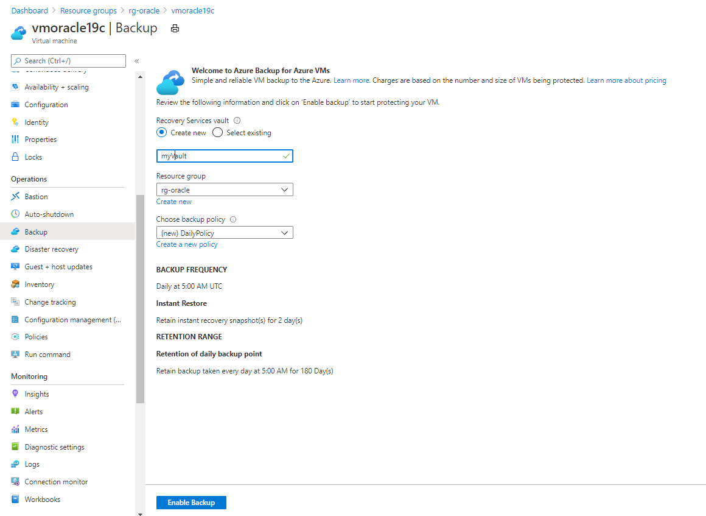

1. Select **Enable Backup**.

    The backup process doesn't start until the scheduled time expires. To set up an immediate backup, complete the next step.

1. From the resource group pane, select your newly created Recovery Services vault named **myVault**. You might need to refresh the page to see it.

1. On the **myVault - Backup items** pane, under **BACKUP ITEM COUNT**, select the backup item count.

    

1. On the **Backup Items (Azure Virtual Machine)** pane, select the ellipsis (**...**) button, and then select **Backup now**.

    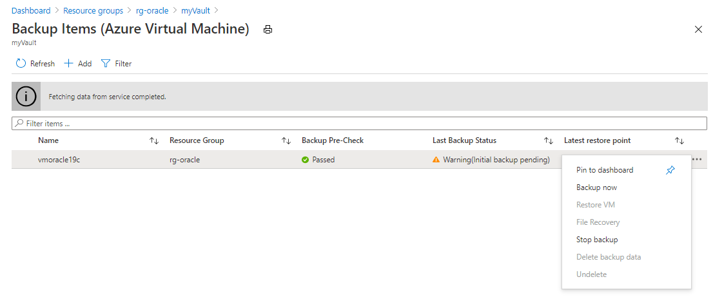

1. Accept the default **Retain Backup Till** value, and then select **OK**. Wait for the backup process to finish.

1. To view the status of the backup job, select **Backup Jobs**.

    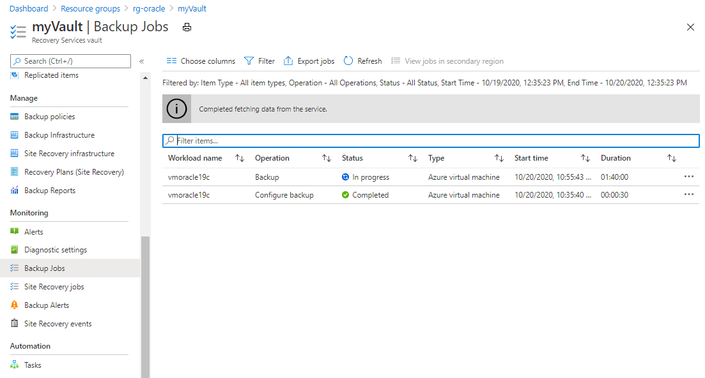

    Select the backup job to see details about its status.

    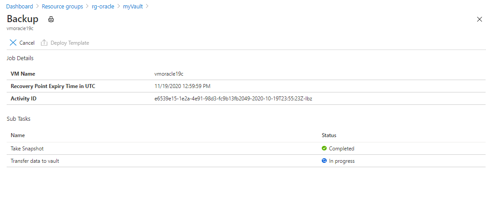

    Although it takes only seconds to execute the snapshot, it can take some time to transfer it to the vault. The backup job is not completed until the transfer is finished.

1. For an application-consistent backup, address any errors in the log file at */var/log/azure/Microsoft.Azure.RecoveryServices.VMSnapshotLinux/extension.log*.

# [Azure CLI](#tab/azure-cli)

1. Create a Recovery Services vault:

   ```azurecli
   az backup vault create --location eastus --name myVault --resource-group rg-oracle
   ```

1. Enable backup protection for the VM:

   ```azurecli
   az backup protection enable-for-vm \
      --resource-group rg-oracle \
      --vault-name myVault \
      --vm vmoracle19c \
      --policy-name DefaultPolicy
   ```

1. Trigger a backup to run now rather than waiting for the backup to run at the default schedule (5:00 AM UTC):

   ```azurecli
   az backup protection backup-now \
      --resource-group rg-oracle \
      --vault-name myVault \
      --backup-management-type AzureIaasVM \
      --container-name vmoracle19c \
      --item-name vmoracle19c 
   ```

1. Monitor the progress of the backup job by using `az backup job list` and `az backup job show`.

---

## Restore the VM

Restoring an entire VM means that you restore the VM and its attached disks to a new VM from a selected restore point. This action also restores all databases that run on the VM. Afterward, you need to recover each database.

To restore an entire VM, complete these steps:

1. [Stop and delete the VM](#stop-and-delete-the-vm).
1. [Recover the VM](#recover-the-vm).
1. [Set the public IP address](#set-the-public-ip-address).
1. [Recover the database](#recover-the-database).

There are two main choices when you're restoring a VM:

* Restore the VM from which the backups were originally taken.
* Restore (clone) a new VM without affecting the VM from which the backups were originally taken.

The first steps in this exercise (stopping, deleting, and then recovering the VM) simulate the first use case.

### Stop and delete the VM

# [Portal](#tab/azure-portal)

1. In the Azure portal, go to the **vmoracle19c** virtual machine, and then select **Stop**.

1. When the virtual machine is no longer running, select **Delete** and then **Yes**.

   

# [Azure CLI](#tab/azure-cli)

1. Stop and deallocate the VM:

    ```azurecli
    az vm deallocate --resource-group rg-oracle --name vmoracle19c
    ```

1. Delete the VM:

    ```azurecli
    az vm delete --resource-group rg-oracle --name vmoracle19c
    ```

   Enter `y` when prompted.

---

### Recover the VM

# [Portal](#tab/azure-portal)

1. Create a storage account for staging in the Azure portal:

   1. In the Azure portal, select **+ Create a resource**, and then search for and select **Storage account**.

      

   1. On the **Create storage account** pane:
      1. For **Resource group**, select your existing resource group, **rg-oracle**.
      1. For **Storage account name**, enter **oracrestore**.
      1. Ensure that **Location** is set to the same region as all your other resources in the resource group.
      1. Set **Performance** to **Standard**.
      1. For **Account kind**, select **StorageV2 (general purpose v2)**.
      1. For **Replication**, select **Locally-redundant storage (LRS)**.

      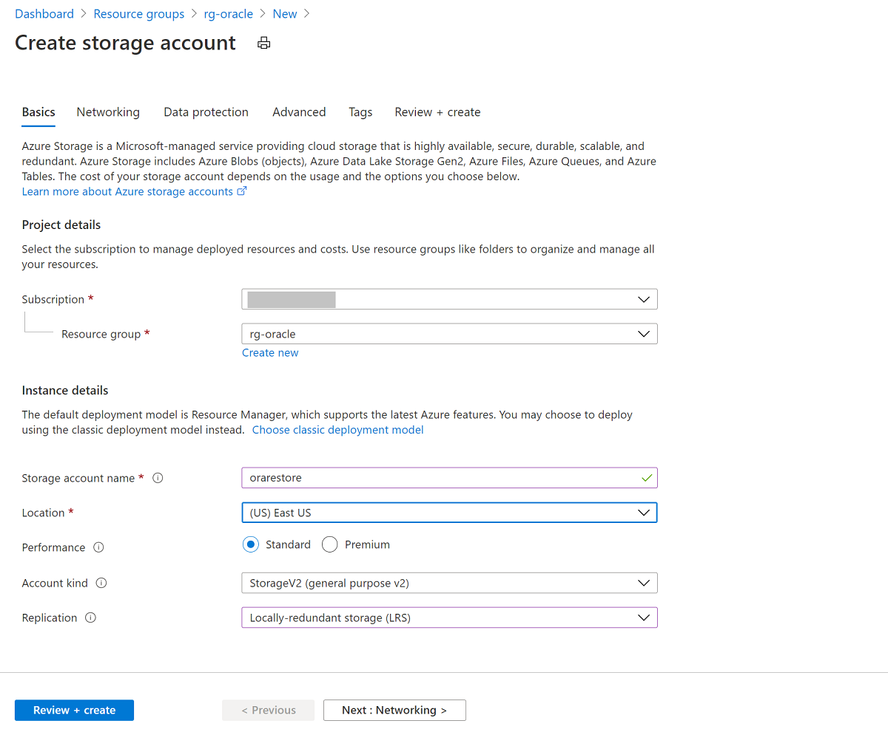

   1. Select **Review + Create**, and then select **Create**.

1. In the Azure portal, search for the **myVault** Recovery Services vault and select it.

    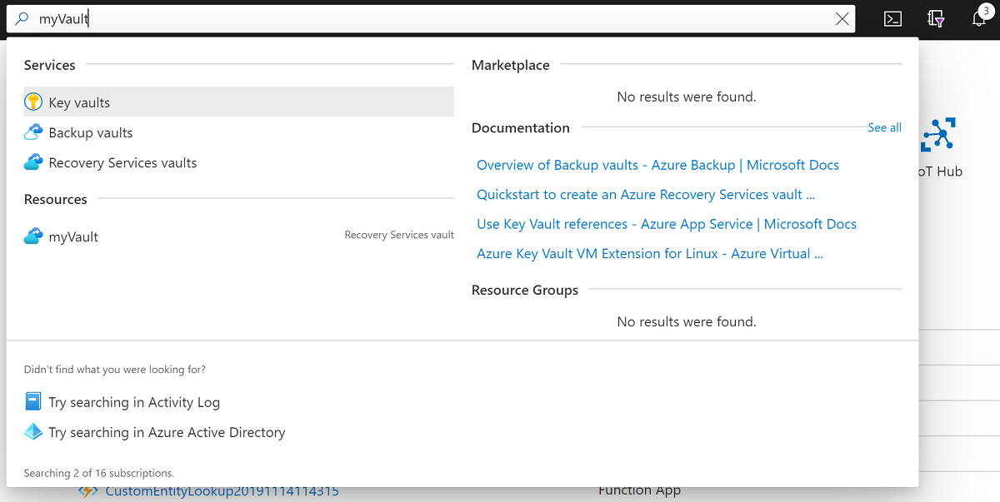

1. On the **Overview** pane, select **Backup items**. Then select **Azure Virtual Machine**, which should have a nonzero number for **BACKUP ITEM COUNT**.

    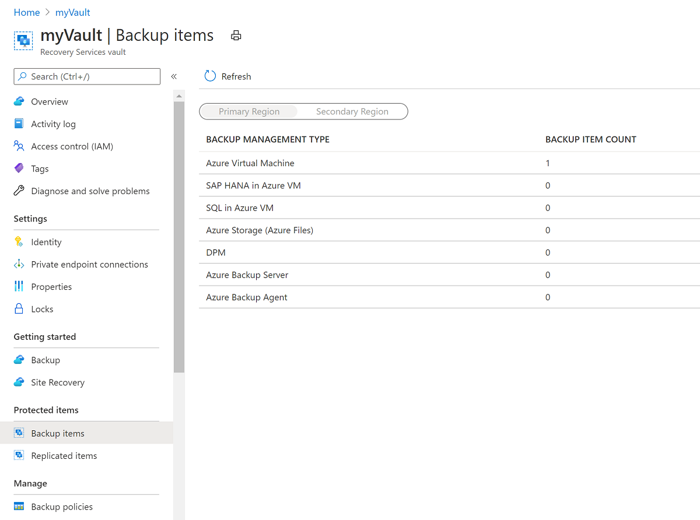

1. On the **Backups Items (Azure Virtual Machine)** pane, select the **vmoracle19c** VM.

    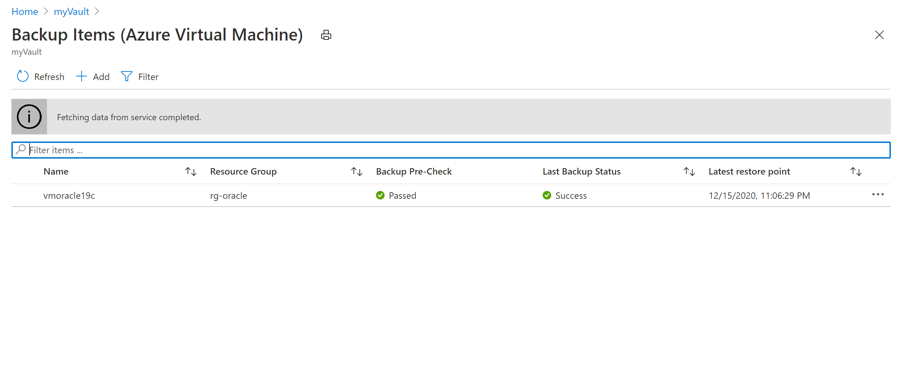

1. On the **vmoracle19c** pane, choose a restore point that has a consistency type of **Application Consistent**. Select the ellipsis (**...**), and then select **Restore VM**.

    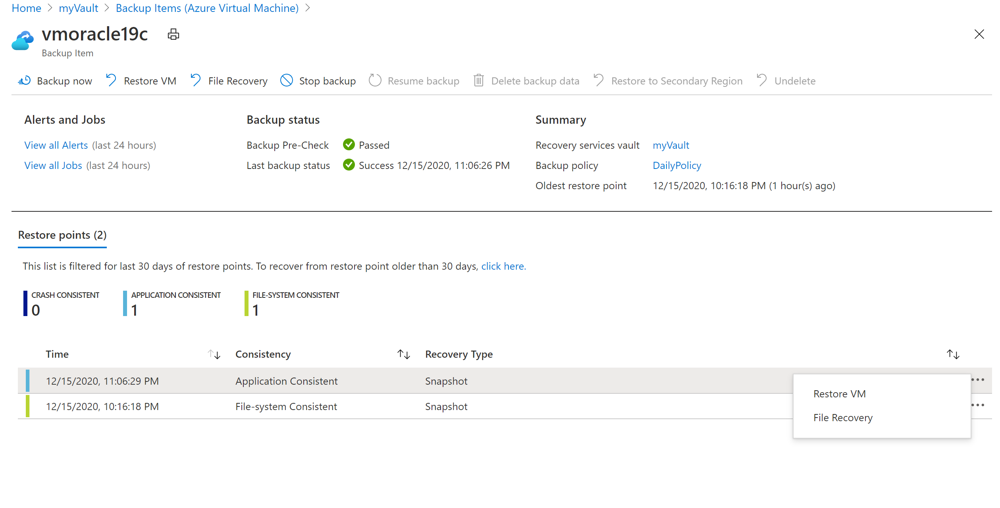

1. On the **Restore Virtual Machine** pane:
   1. Select **Create New**.
   1. For **Restore Type**, select **Create new virtual machine**.
   1. For **Virtual machine name**, enter **vmoracle19c**.
   1. For **Virtual network**, select **vmoracle19cVNET**.

      The subnet is automatically populated based on your selection for the virtual network.
   1. For **Staging Location**, the process of restoring a VM requires an Azure storage account in the same resource group and region. You can choose a storage account or a restore task that you set up earlier.

   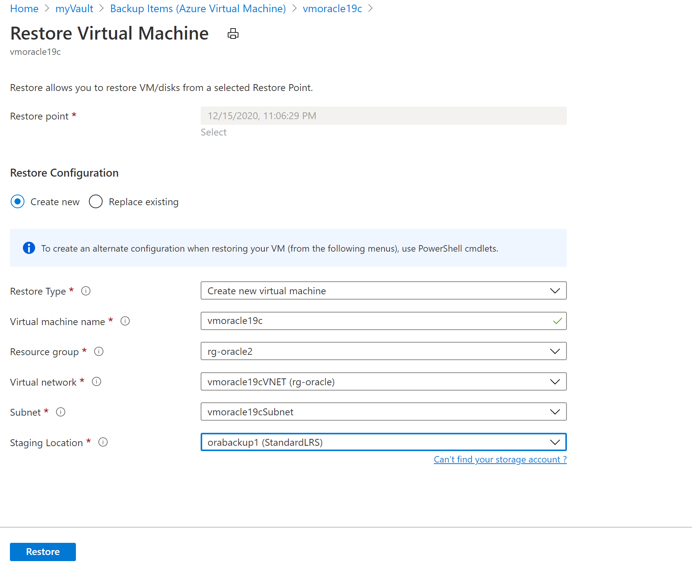

1. To restore the VM, select the **Restore** button.

1. To view the status of the restore process, select **Jobs**, and then select **Backup Jobs**.

    

    Select the **In Progress** restore operation to show details about the status of the restore process.

    

# [Azure CLI](#tab/azure-cli)

To set up your storage account and file share, run the following commands in the Azure CLI:

1. Create the storage account in the same resource group and location as your VM:

   ```azurecli
   az storage account create -n orarestore -g rg-oracle -l eastus --sku Standard_LRS
   ```

1. Retrieve the list of available recovery points:

   ```azurecli
   az backup recoverypoint list \
      --resource-group rg-oracle \
      --vault-name myVault \
      --backup-management-type AzureIaasVM \
      --container-name vmoracle19c \
      --item-name vmoracle19c \
      --query [0].name \
      --output tsv
   ```

1. Restore the recovery point to the storage account. Substitute `<myRecoveryPointName>` with a recovery point from the list generated in the previous step.

   ```azurecli
   az backup restore restore-disks \
      --resource-group rg-oracle \
      --vault-name myVault \
      --container-name vmoracle19c \
      --item-name vmoracle19c \
      --storage-account orarestore \
      --rp-name <myRecoveryPointName> \
      --target-resource-group rg-oracle
   ```

1. Retrieve the restore job details. The following command gets more details for the triggered restore job, including its name. The name is needed to retrieve the template URI.

   ```azurecli
   az backup job list \
       --resource-group rg-oracle \
       --vault-name myVault \
       --output table
   ```

   The output looks similar to the following example. Note down the name of the restore job.

   ```output
   Name                                  Operation        Status     Item Name    Start Time UTC                    Duration
   ------------------------------------  ---------------  ---------  -----------  --------------------------------  --------------
   c009747a-0d2e-4ac9-9632-f695bf874693  Restore          Completed  vmoracle19c  2021-01-10T21:46:07.506223+00:00  0:03:06.634177
   6b779c98-f57a-4db1-b829-9e8eab454a52  Backup           Completed  vmoracle19c  2021-01-07T10:11:15.784531+00:00  0:21:13.220616
   502bc7ae-d429-4f0f-b78e-51d41b7582fc  ConfigureBackup  Completed  vmoracle19c  2021-01-07T09:43:55.298755+00:00  0:00:30.839674
   ```

1. Retrieve the details of the URI to use for re-creating the VM. Substitute `<RestoreJobName>` with the restore job name from the previous step.

    ```azurecli
      az backup job show \
        -v myVault \
        -g rg-oracle \
        -n <RestoreJobName> \
        --query properties.extendedInfo.propertyBag
    ```

   The output is similar to this example:

   ```output
   {
   "Config Blob Container Name": "vmoracle19c-75aefd4b34c64dd39fdcd3db579783f2",
   "Config Blob Name": "config-vmoracle19c-c009747a-0d2e-4ac9-9632-f695bf874693.json",
   "Config Blob Uri": "https://orarestore.blob.core.windows.net/vmoracle19c-75aefd4b34c64dd39fdcd3db579783f2/config-vmoracle19c-c009747a-0d2e-4ac9-9632-f695bf874693.json",
   "Job Type": "Recover disks",
   "Recovery point time ": "1/7/2021 10:11:19 AM",
   "Target Storage Account Name": "orarestore",
   "Target resource group": "rg-oracle",
   "Template Blob Uri": "https://orarestore.blob.core.windows.net/vmoracle19c-75aefd4b34c64dd39fdcd3db579783f2/azuredeployc009747a-0d2e-4ac9-9632-f695bf874693.json"
   }
   ```

   The output lists:

   * The blob container name, at the end of `Config Blob Container Name`. In this example, it's `vmoracle19c-75aefd4b34c64dd39fdcd3db579783f2`.
   * The template name, at the end of `Template Blob Uri`. In this example, it's `azuredeployc009747a-0d2e-4ac9-9632-f695bf874693.json`.

1. Use the values from the preceding step in the following command to assign variables in preparation for creating the VM. A shared access signature (SAS) key is generated for the storage container with a 30-minute duration.  

   ```azurecli
   expiretime=$(date -u -d "30 minutes" '+%Y-%m-%dT%H:%MZ')
   connection=$(az storage account show-connection-string \
    --resource-group rg-oracle \
    --name orarestore \
    --query connectionString)
   token=$(az storage blob generate-sas \
    --container-name <ContainerName> \
    --name <TemplateName> \
    --expiry $expiretime \
    --permissions r \
    --output tsv \
    --connection-string $connection)
   url=$(az storage blob url \
    --container-name <ContainerName> \
    --name <TemplateName> \
    --connection-string $connection \
    --output tsv)
   ```

1. Deploy the template to create the VM:

   ```azurecli
   az deployment group create \
      --resource-group rg-oracle \
      --template-uri $url?$token
   ```

   You're prompted to provide a name for the VM.

---

### Set the public IP address

After the VM is restored, you should reassign the original IP address to the new VM.

# [Portal](#tab/azure-portal)

1. In the Azure portal, go to your virtual machine named **vmoracle19c**. It has been assigned a new public IP and NIC similar to **vmoracle19c-nic-XXXXXXXXXXXX**, but it doesn't have a DNS address. When the original VM was deleted, its public IP and NIC were retained. The next steps reattach them to the new VM.

    

1. Stop the VM.

    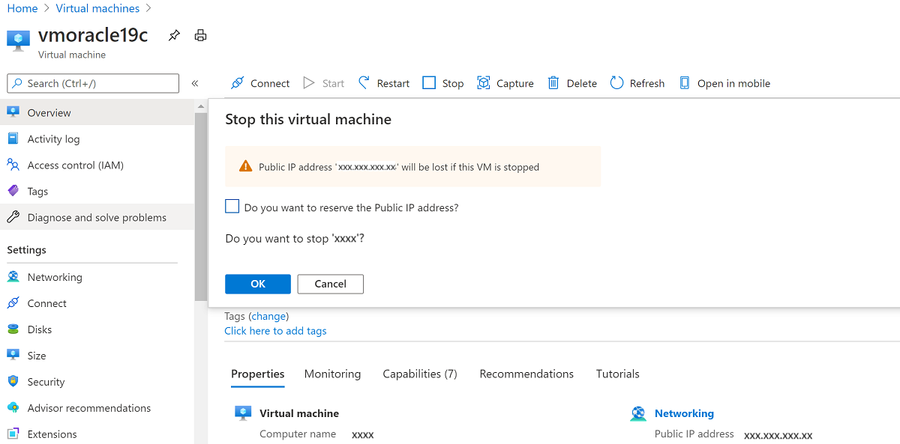

1. Go to **Networking**.

    

1. Select **Attach network interface**. Select the original NIC **vmoracle19cVMNic**, which the original public IP address is still associated with. Then select **OK**.

    

1. Detach the NIC that you created with the VM restore operation, because it's configured as the primary interface. Select **Detach network interface**, select the NIC that's similar to **vmoracle19c-nic-XXXXXXXXXXXX**, and then select **OK**.

    

    Your re-created VM now has the original NIC, which is associated with the original IP address and network security group rules.

    

1. Go back to the **Overview** pane and select **Start**.

# [Azure CLI](#tab/azure-cli)

1. Stop and deallocate the VM:

   ```azurecli
   az vm deallocate --resource-group rg-oracle --name vmoracle19c
   ```

1. List the current, restore-generated VM NIC:

   ```azurecli
   az vm nic list --resource-group rg-oracle --vm-name vmoracle19c
   ```

   The output looks similar to the following example, which lists the restore-generated NIC name as `vmoracle19cRestoredNICc2e8a8a4fc3f47259719d5523cd32dcf`:

   ```output
   {
    "id": "/subscriptions/xxxxxxxx-xxxx-xxxx-xxxx-xxxxxxxx/resourceGroups/rg-oracle/providers/Microsoft.Network/networkInterfaces/vmoracle19cRestoredNICc2e8a8a4fc3f47259719d5523cd32dcf",
    "primary": true,
    "resourceGroup": "rg-oracle"
   }
   ```

1. Attach original NIC, which should have a name of `<VMName>VMNic`. In this case, it's `vmoracle19cVMNic`. The original public IP address is still attached to this NIC and will be restored to the VM when the NIC is reattached.

   ```azurecli
   az vm nic add --nics vmoracle19cVMNic --resource-group rg-oracle --vm-name vmoracle19c
   ```

1. Detach the restore-generated NIC:

   ```azurecli
   az vm nic remove --nics vmoracle19cRestoredNICc2e8a8a4fc3f47259719d5523cd32dcf --resource-group rg-oracle --vm-name vmoracle19c
   ```
  
1. Start the VM:

   ```azurecli
   az vm start --resource-group rg-oracle --name vmoracle19c
   ```

---

### Recover the database

To recover a database after a complete VM restore:

1. Reconnect to the VM:

   ```bash
   ssh azureuser@<publicIpAddress>

   ```

   When the whole VM has been restored, it's important to recover the databases on the VM by performing the following steps on each database.

1. You might find that the instance is running, because the autostart attempted to start the database on VM startup. However, the database requires recovery and is likely to be at the mount stage only. Run a preparatory shutdown before starting the mount stage:

    ```bash
    sudo su - oracle
    sqlplus / as sysdba
    SQL> shutdown immediate
    SQL> startup mount
    ```

1. Perform database recovery.

   It's important to specify the `USING BACKUP CONTROLFILE` syntax to inform the `RECOVER AUTOMATIC DATABASE` command that recovery should not stop at the Oracle system change number (SCN) recorded in the restored database control file.

   The restored database control file was a snapshot, along with the rest of the database. The SCN stored within it is from the point in time of the snapshot. There might be transactions recorded after this point, and you want to recover to the point of the last transaction committed to the database.

   ```bash
   SQL> recover automatic database using backup controlfile until cancel;
   ```

1. When the last available archive log file has been applied, enter `CANCEL` to end recovery.

   When recovery finishes successfully, the message `Media recovery complete` appears.

   However, when you're using the `BACKUP CONTROLFILE` clause, the recover command ignores online log files. It's possible that changes in the current online redo log are required to complete point-in-time recovery. In this situation, you might see messages similar to these examples:

   ```output
   SQL> recover automatic database until cancel using backup controlfile;
   ORA-00279: change 2172930 generated at 04/08/2021 12:27:06 needed for thread 1
   ORA-00289: suggestion :
   /u02/fast_recovery_area/ORATEST1/archivelog/2021_04_08/o1_mf_1_13_%u_.arc
   ORA-00280: change 2172930 for thread 1 is in sequence #13
   ORA-00278: log file
   '/u02/fast_recovery_area/ORATEST1/archivelog/2021_04_08/o1_mf_1_13_%u_.arc' no
   longer needed for this recovery
   ORA-00308: cannot open archived log
   '/u02/fast_recovery_area/ORATEST1/archivelog/2021_04_08/o1_mf_1_13_%u_.arc'
   ORA-27037: unable to obtain file status
   Linux-x86_64 Error: 2: No such file or directory
   Additional information: 7

   Specify log: {<RET>=suggested | filename | AUTO | CANCEL}
   ```

   > [!IMPORTANT]
   > If the current online redo log is lost or corrupted and you can't use it, you might cancel recovery at this point.

   To correct this situation, you can identify which online log wasn't archived and supply the fully qualified file name to the prompt.

1. Open the database.

   The `RESETLOGS` option is required when the `RECOVER` command uses the `USING BACKUP CONTROLFILE` option. `RESETLOGS` creates a new incarnation of the database by resetting the redo history back to the beginning, because there's no way to determine how much of the previous database incarnation was skipped in the recovery.

   ```bash
   SQL> alter database open resetlogs;
   ```

1. Check that the database content was recovered:

   ```bash
   SQL> select * from scott.scott_table;
   ```

The backup and recovery of Oracle Database on an Azure Linux VM are now finished.

You can find more information about Oracle commands and concepts in the Oracle documentation, including:

* [Performing Oracle user-managed backups of the entire database](https://docs.oracle.com/en/database/oracle/oracle-database/19/bradv/user-managed-database-backups.html#GUID-65C5E03A-E906-47EB-92AF-6DC273DBD0A8)
* [Performing complete user-managed database recovery](https://docs.oracle.com/en/database/oracle/oracle-database/19/bradv/user-managed-flashback-dbpitr.html#GUID-66D07694-533F-4E3A-BA83-DD461B68DB56)
* [Oracle STARTUP command](https://docs.oracle.com/en/database/oracle/oracle-database/19/sqpug/STARTUP.html#GUID-275013B7-CAE2-4619-9A0F-40DB71B61FE8)
* [Oracle RECOVER command](https://docs.oracle.com/en/database/oracle/oracle-database/19/bradv/user-managed-flashback-dbpitr.html#GUID-54B59888-8683-4CD9-B144-B0BB68887572)
* [Oracle ALTER DATABASE command](https://docs.oracle.com/en/database/oracle/oracle-database/19/sqlrf/ALTER-DATABASE.html#GUID-8069872F-E680-4511-ADD8-A4E30AF67986)
* [Oracle LOG_ARCHIVE_DEST_n parameter](https://docs.oracle.com/en/database/oracle/oracle-database/19/refrn/LOG_ARCHIVE_DEST_n.html#GUID-10BD97BF-6295-4E85-A1A3-854E15E05A44)
* [Oracle ARCHIVE_LAG_TARGET parameter](https://docs.oracle.com/en/database/oracle/oracle-database/19/refrn/ARCHIVE_LAG_TARGET.html#GUID-405D335F-5549-4E02-AFB9-434A24465F0B)

## Delete the VM

When you no longer need the VM, you can use the following commands to remove the resource group, the VM, and all related resources:

1. Disable soft delete of backups in the vault:

    ```azurecli
    az backup vault backup-properties set --name myVault --resource-group rg-oracle --soft-delete-feature-state disable
    ```

1. Stop protection for the VM and delete backups:

    ```azurecli
    az backup protection disable --resource-group rg-oracle --vault-name myVault --container-name vmoracle19c --item-name vmoracle19c --delete-backup-data true --yes
    ```

1. Remove the resource group, including all resources:

    ```azurecli
    az group delete --name rg-oracle
    ```

## Next steps

[Create highly available VMs](../../linux/create-cli-complete.md)

[Explore Azure CLI samples for VM deployment](https://github.com/Azure-Samples/azure-cli-samples/tree/master/virtual-machine)
