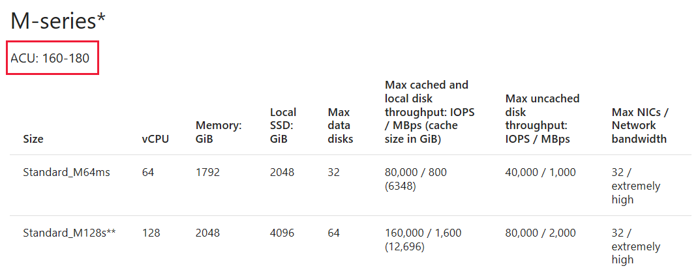
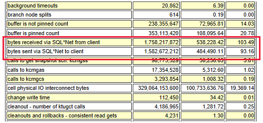
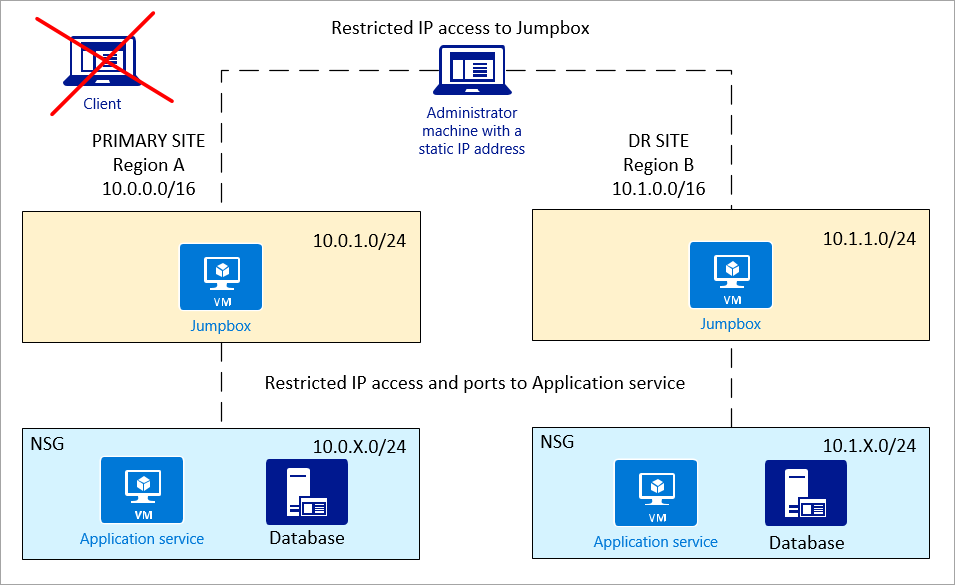

---
title: Design and implement an Oracle database on Azure | Microsoft Docs
description: Design and implement Oracle database in your Azure environment.
services: virtual-machines-linux
documentationcenter: virtual-machines
author: v-shiuma
manager: timlt
editor: 
tags: azure-resource-manager
ms.assetid: 
ms.service: virtual-machines-linux
ms.devlang: na
ms.topic: article
ms.tgt_pltfrm: vm-linux
ms.workload: infrastructure
ms.date: 6/22/2017
ms.author: rclaus
---


# Design and implement an Oracle database on Azure

## Assumptions

- You're planning to migrate on Oracle database from on-premises to Azure
- You have an understanding of the various metrics that are found Oracle AWR reports
- You have a baseline understanding application performance and platform utilization

## Goals

- Understand how to optimize your Oracle deployment on Azure
- Explore performance tuning options for an Oracle database in an Azure environment

### On-premises vs on Azure

Here are some important things to keep in mind when you're migrating on-premises applications to Azure. Unlike on-premises implementations of an Oracle database, resources such as virtual machines, disks, and virtual networks in Azure are shared among other clients. In addition, resources can be throttled based on the requirements. Instead of focusing on avoiding failing (MTBF), the focus in Azure is more on surviving the failure (MTTR).

The following table lists some of the differences between on-premises and Azure implementations of an Oracle database.

> 
> |  | **On-premises implementation** | **Azure implementation** |
> | --- | --- | --- |
> | **Networking** |LAN/WAN  |SDN - Software defined networking|
> | **Security group** |IP/Port restrictions tools |[Network Security Group (NSG)](https://azure.microsoft.com/blog/network-security-groups) |
> | **Resilience** |MTBF (Mean time between failure) |MTTR (Mean Time To Recover)|
> | **Planned maintenance** |Patching/Upgrades|[Availability sets](https://docs.microsoft.com/azure/virtual-machines/windows/infrastructure-availability-sets-guidelines) (patching/upgrades managed by Azure) |
> | **Resource** |Dedicated  |Shared with other clients|
> | **Regions** |Data centers |[Region pairs](https://docs.microsoft.com/azure/virtual-machines/windows/regions-and-availability)|
> | **Storage** |SAN/Physical disks |[Azure-managed storage](https://azure.microsoft.com/pricing/details/managed-disks/?v=17.23h)|
> | **Scale** |Vertical scale |Horizontal scale|


### Requirements

- Determine the database size and growth rate
- Determine the IOPS requirements, which can be estimated based on an Oracle AWR report or reports from other network monitoring tools.

## Configuration options

There are four potential areas that can be tuned to improved performance in Azure environment.

- Virtual machine size
- Network throughput
- Disk types and configurations
- Disk cache settings

### Generate an AWR report

If you have an existing Oracle database and are planning to migrate to Azure. You can run the Oracle AWR report to get the metrics (IOPS, Mbps GiBs etc.), and then choose the VM based on the metrics you collected. You can also contact your infrastructure team to get similar information.

You might consider running your AWR report during tregular and peak workloads, so you can compare the difference. Based on these reports, you can size the VMs based either on  the average workload or at maximum workloads.

Following is an example of how to generate an AWR report:

```bash
$ sqlplus / as sysdba
SQL> EXEC DBMS_WORKLOAD_REPOSITORY.CREATE_SNAPSHOT;
SQL> @?/rdbms/admin/awrrpt.sql
```

### Key metrics

Following are metrics that can be obtained from the AWR report:

- Total number of cores
- CPU clock speed
- Total memory in GB
- CPU utilization
- Peak data transfer rate
- Rate of IO changes (read/write)
- Redo log rate (MBPs)
- Network throughput
- Network latency rate (low/high)
- Database size in GB
- Bytes received via SQL*Net from/to client

### Virtual machine size

#### 1. Initial estimate of VM size is based on CPU/Memory/IO usage from the AWR report

One thing you might look at is the top five timed foreground events that indicate where the system bottlenecks are.

For example, in the diagram below, the log file sync is on the top. This shows the number of waits that's necessary before the LGWR writes the log buffer to the redo log file. These results indicate that better performing storage or disks are required. The number of CPU (cores) and memory are also shown in the diagram.


The following diagram shows the total IO of read and write. There are 59 GB read and 247.3 GB write during the time of the report.


#### 2. Estimate the VM size

Based on the information that you collected from the AWR report, you estimate the size VM you need to meet your requirements. You can find a list of available VMs is listed in  [the virtual machines sizes](https://docs.microsoft.com/azure/virtual-machines/virtual-machines-windows-sizes-memory).

#### 3. Fine-tune the VM sizing with similar VM series based on the ACU

After you have chosen the VMs, pay attention to the ACU for the VMs. You may choose a similar VM based on the ACU value, that could better suit your requirements. For more information, see [the Azure compute unit](https://docs.microsoft.com/azure/virtual-machines/windows/acu).



### Network throughput

The relation between Throughput and IOPS as shown following.


The total network throughput is estimate based on the followings:
- SQL*Net traffic
- MBps x number of servers (Outbound stream such as Data Guard)
- Others, such as application replication



Based on your network bandwidth requirements, there are various gateway types, such as Basic, VpnGw, ExpressRoute are available for you to choose from. More information can be obtained from [VPN Gateway Pricing page](https://azure.microsoft.com/en-us/pricing/details/vpn-gateway/?v=17.23h)

Recommendations

- Network latency is higher compared to an on-premises deployment. Reducing network round trips can greatly improve performance.
- Consolidate applications that, have high transactions or “Chatty” Apps on the same virtual machine to reduce round-trips.

### Disk types and configurations

- Default OS disk: with persistent data and caching. This disk is optimized for OS access at boot up time, it is not designed for either transactional or Data Warehouse (Analytical) workloads

- Unmanaged disks: you manage the storage accounts that you use to store the virtual hard disk (VHD) files that correspond to your VM disks. VHD files are stored as page blobs in Azure storage accounts.

- Managed disks: Azure manages the storage accounts that you use for your VM disks. You specify the disk type (Premium or Standard) and the size of the disk that you need. Azure creates and manages the disk for you.

- Premium storage disks (best suited for production workloads): Premium Storage supports VM disks that can be attached to specific size-series VMs, such as DS, DSv2, GS, F series. The Premium disk comes with different sizes and You have choice of various disk sizes from 32 GB to 4096 GB. Each disk size has its own performance specifications. Depending on your application requirements, you can attach one or more disks to your VM.

When you create a new managed disk from the portal, you can choose the 'Account type' for specified the type of disk you want to use. It is important to know that, not all available disks are shown in the drop-down box. It is because Azure storage is integrated with VMs and where the limits are across SKUs (for example, max number of drives, max IOPs). So once you picked a particular size of VM, it only shows the available premium storage SKUs based of that VM size.


For more information, see [the Azure premium storage](https://docs.microsoft.com/azure/storage/storage-premium-storage).

Once you configured your storage on a VM, you may want to load test the disks prior create a database. Knowing what the IO rate in terms of both latency and throughput could help you determine if the VMs support the expected throughput with latency targets.

There are a number of tools for application load test, such as Oracle Orion, Sysbench, Fio, etc.

Run the load test again after deployed Oracle database, start your regular and peak workloads, the results would show you the based-line of your environment.

It may be more important to size the storage based on the IOPS rate rather than the storage size. For example, if the required IOPS are 5000, but you only need 200 GB. You may still get the P30 class premium disk even it comes with more than 200-GB storage size.

The IOPS rate can be obtained from the AWR report, it is determined by the Redo log, physical reads, and writes rate.


For example: 
The Redo size is 12200000 bytes per second, which is equal to 11.63 MBPs
The IOPS is 12200000 / 2358 = 5174

Once you have a clear picture of IO requirements, you can chose a combination of drives best suited to meet those requirements

Recommendations

- For Data tablespace, spreading I/O workload across a number of disks using managed storage or Oracle ASM
- As the I/O block size increase, for reading and write intensive operations, adding more data disks
- Increase the block size for large sequential process
- Use data compression to reduce IO (for both data and indexes)
- Separate Redo logs, system, temp, and undo TS on separate data disks
- Recommended not to put any application files on default OS disk (/dev/sda). This disk is optimized for fast VM boot time, may not provide good performance for your application.

### Disk Cache settings

There are three options for Host Caching.

- Read Only: All requests cached for future reads. All writes persisted directly to Windows Azure Storage Blobs

- Read Write: This is a “Read Ahead” algorithm. The reads and writes are cached for future reads. Non-write-through writes persisted to local cache first. For SQL Server, writes are persisted to WA storage because it uses Write-through It provides the lowest disk latency for light workloads

- None (disabled): This allows you to bypasses the cache. All the data are transferred to disk and persisted to the Windows Azure Storage. This method gives you the highest I/O rate for I/O intensive workloads. You also need to take “Transaction Cost” into consideration.

Recommendations

To maximize the throughput, it is recommended to start with 'None' for Host Caching. For premium storage, it is important to note that you must disable the "barriers" when you mount the file system with 'ReadOnly' or 'None' options. Update the /etc/fstab file with the UUID to the disks.

For more information, see [Premium Storage for Linux VMs](https://docs.microsoft.com/azure/storage/storage-premium-storage#premium-storage-for-linux-vms).


- For OS disks, use default 'Read/Write' caching
- For SYSTEM, TEMP and UNDO use 'None' for caching
- For DATA use 'None' for caching, but if your database is Read only or Read intensive, use 'Read-only' caching

Once your data disk setting is saved, the host(AFAIK) cache setting cannot change unless you unmount the drive at the OS level and then remount it after changed.


## Security

Once you have setup and configured your Azure environment. The next step is to secure your network. Here are some recommendations:

- NSG policy

NSG can be defined a subnet or NIC.  it's simpler to control access at subnet level both for security and force routing for things like application firewall.

- Jumpbox


For more secure access, administrators should not directly connect to the Application service or database. A jumpbox is used as a media between the administrator machine and Azure resources.

The administrator machine should be IP restricted access to the jumpbox only. The jumpbox then have access to the application/database.

- Private network (subnets)

It is recommended to have the application service and database on separated subnets. So better control can be set by NSG policy.


## Additional readings:

- [Configure Oracle ASM](configure-oracle-asm.md)
- [Configure Oracle Data Guard](configure-oracle-dataguard.md)
- [Configure Oracle Golden Gate](configure-oracle-golden-gate.md)
- [Oracle Backup and Recovery](oracle-backup-recovery.md)

## Next steps

[Tutorial: Create highly available VMs](../../linux/create-cli-complete.md)

[Explore VM deployment Azure CLI samples](../../linux/cli-samples.md)
