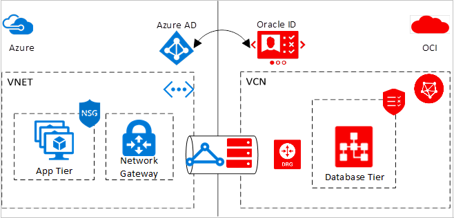

# Oracle application solutions that integrate Microsoft Azure and Oracle Cloud Infrastructure

Microsoft and Oracle have partnered to provide low latency, high throughput cross-cloud connectivity, allowing you to take advantage of the best of both clouds. 

Take advantage of this low latency and secure connectivity between the two clouds to host your application tier on Microsoft Azure and your database tier on Oracle Cloud Infrastructure (OCI). The experience is similar to running the entire solution stack in a single cloud.

## Applications in Microsoft Azure

Cross-cloud connectivity provides one solution for you to run Oracle’s industry leading applications on Microsoft Azure while enjoying the benefits of the Exadata and Autonomous Database services in OCI. These applications include:

* E-Business Suite
* JD Edwards
* PeopleSoft
* Oracle Retail Applications
* Hyperion

The following is a high level overview of the connected solution. See the following sections for more information.

## Networking

Cross-cloud networking is established by connecting an [ExpressRoute](../../../expressroute/expressroute-introduction.md) circuit in Microsoft Azure with a [FastConnect](https://docs.cloud.oracle.com/iaas/Content/Network/Concepts/fastconnectoverview.htm) circuit in OCI. This connectivity is possible where an Azure ExpressRoute peering location is in proximity to or in the same peering location as the OCI FastConnect. This allows for a secure, fast connectivity between the two clouds without the need for an intermediate Service Provider.

Using ExpressRoute and FastConnect, customers are able to peer a virtual network in Azure with a virtual cloud network in OCI, provided that the private IP address space does not overlap. Peering the two networks allows a resource in the virtual network to communicate to a resource in the OCI virtual cloud network as if they were both in the same network.

## Network security

Network security is a crucial component of any enterprise application, and this multi-cloud approach is no exception. Any traffic going over ExpressRoute and FastConnect passes over a private network. This configuration allows for secure communication between a virtual network and a virtual cloud network. You do not need to provide a public IP address to any virtual machines in Azure. Similarly, you do not need an internet gateway in OCI. All communication happens via the private IP address of the machines.

Additionally, you can set up [security lists](https://docs.cloud.oracle.com/iaas/Content/Network/Concepts/securitylists.htm) on your OCI virtual cloud network and  security rules (attached to Azure [network security groups](../../../virtual-network/security-overview.md)) to control the traffic flowing between machines in the virtual networks. Network security rules can be added at a machine level, at a subnet level, as well as at the virtual network level.
 
## Identity

Identity is one of the core pillars of the partnership between Microsoft and Oracle. Significant work has been done to integrate [Oracle Identity Cloud Service](https://docs.oracle.com/en/cloud/paas/identity-cloud/index.html) (IDCS) with [Azure Active Directory](../../../active-directory/index.md) (AAD).
AAD is Microsoft’s cloud-based identity and access management service. It helps your employees and users sign in and access various resources. It also allows you to manage your users and their permissions.

Currently, this integration allows you to manage in one central location, which is Azure Active Directory. AAD synchronizes any changes in the directory with the corresponding Oracle directory.

## Next steps

See the quickstarts to set up an Oracle app in Azure and establish network connectivity and integrate identities with Oracle OCI.
