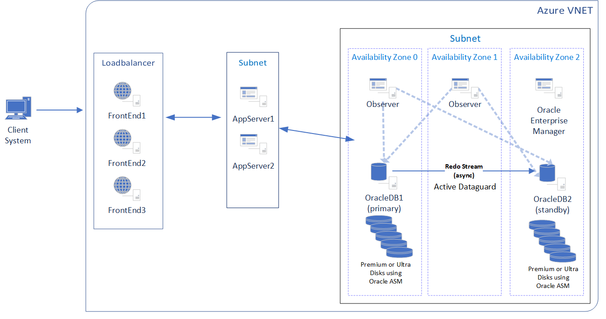
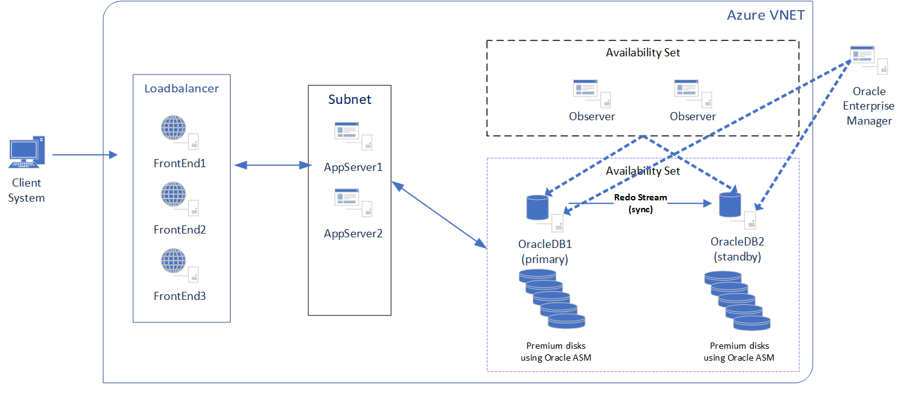
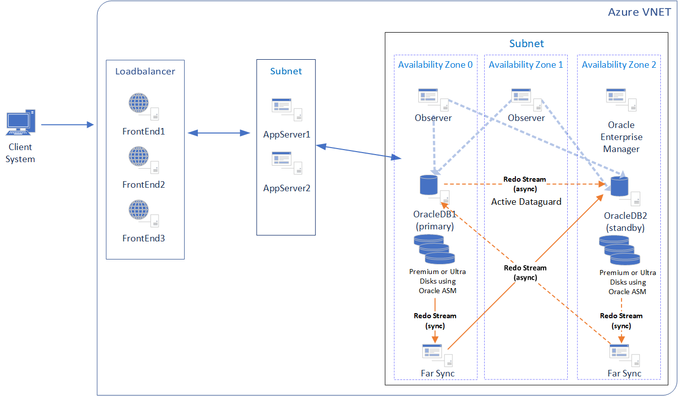
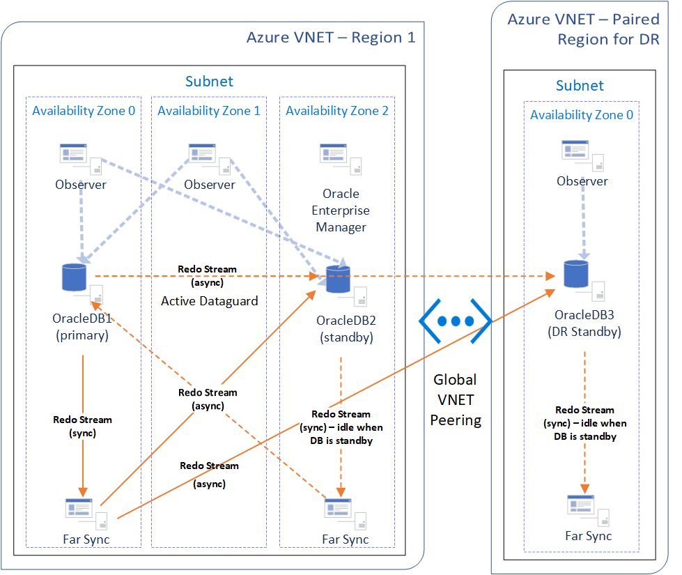
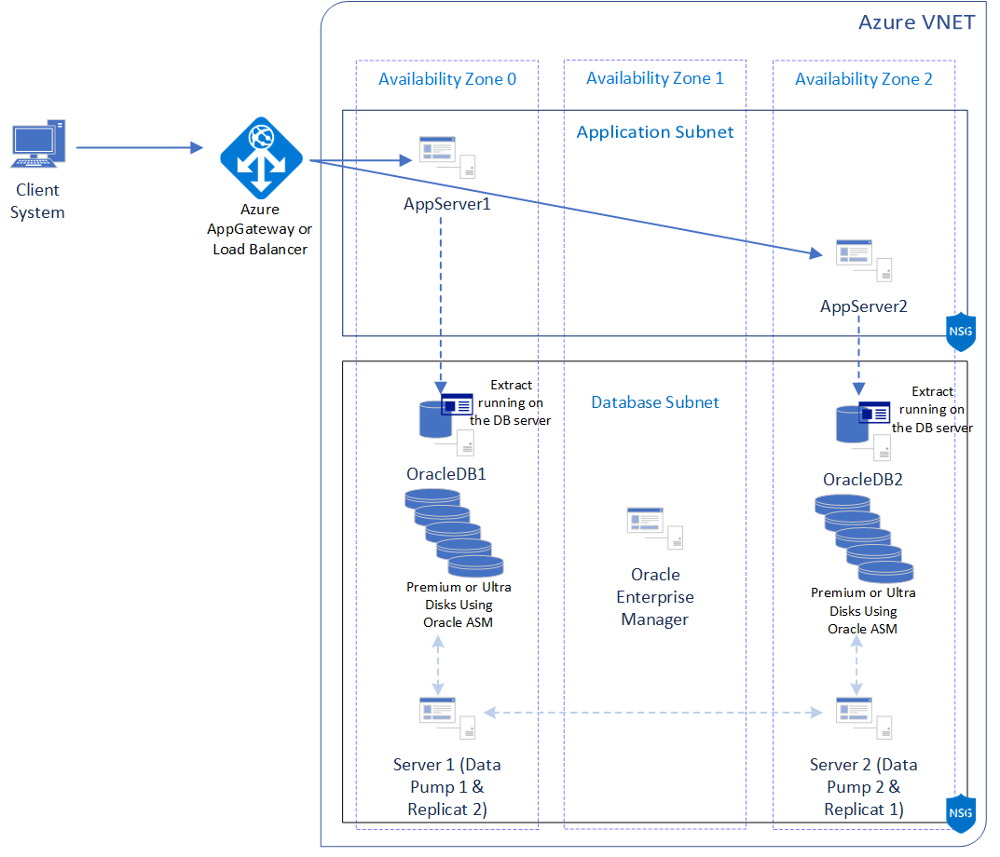
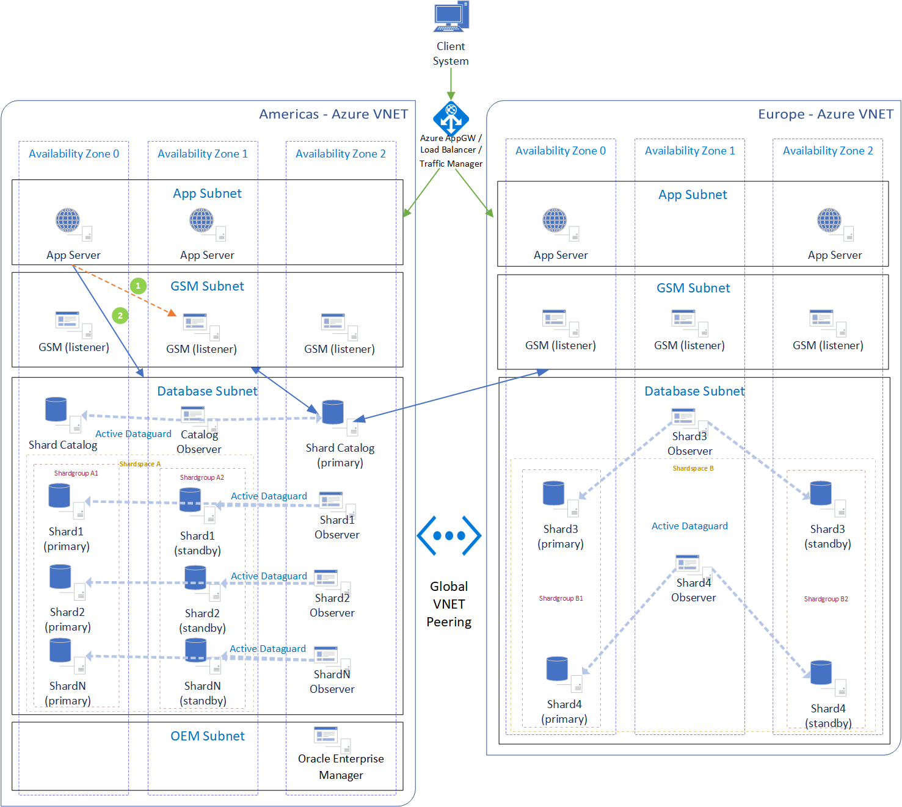
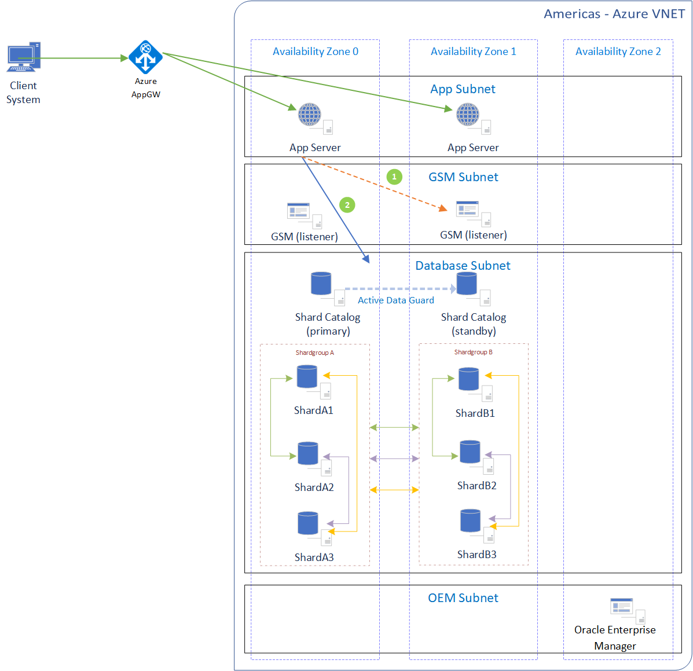

# Reference architectures for Oracle Database Enterprise Edition on Azure

This guide details information on deploying a highly available Oracle database on Azure. In addition, this guide dives into disaster recovery considerations. These architectures have been created based on customer deployments. This guide only applies to Oracle Database Enterprise Edition.

If you're interested in learning more about maximizing the performance of your Oracle database, see [Architect an Oracle DB](oracle-design.md).

## Assumptions

- You have an understanding of the different concepts of Azure such as [availability zones](../../../availability-zones/az-overview.md)
- You're running Oracle Database Enterprise Edition 12c or later
- You're aware of and acknowledge the licensing implications when using the solutions in this article

## High availability for Oracle databases

Achieving high availability in the cloud is an important part of every organization's planning and design. Microsoft Azure offers [availability zones](../../../availability-zones/az-overview.md) and availability sets (to be used in regions where availability zones are unavailable). Read more about [managing availability of your virtual machines](../../availability.md) to design for the cloud.

In addition to cloud-native tools and offerings, Oracle provides solutions for high availability such as [Oracle Data Guard](https://docs.oracle.com/en/database/oracle/oracle-database/18/sbydb/introduction-to-oracle-data-guard-concepts.html#GUID-5E73667D-4A56-445E-911F-1E99092DD8D7), [Data Guard with FSFO](https://docs.oracle.com/en/database/oracle/oracle-database/12.2/dgbkr/index.html), [Sharding](https://docs.oracle.com/en/database/oracle/oracle-database/12.2/admin/sharding-overview.html), and [GoldenGate](https://www.oracle.com/middleware/technologies/goldengate.html) that can be set up on Azure. This guide covers reference architectures for each of these solutions.

Finally, when migrating or creating applications for the cloud, it's important to tweak your application code to add cloud-native patterns such as [retry pattern](/azure/architecture/patterns/retry) and [circuit breaker pattern](/azure/architecture/patterns/circuit-breaker). Additional patterns defined in the [Cloud Design Patterns guide](/azure/architecture/patterns/) could help your application be more resilient.

### Oracle RAC in the cloud

Oracle Real Application Cluster (RAC) is a solution by Oracle to help customers achieve high throughputs by having many instances accessing one database storage (Shared-all architecture pattern). While Oracle RAC can also be used for high availability on-premises, Oracle RAC alone cannot be used for high availability in the cloud as it only protects against instance level failures and not against Rack-level or Data center-level failures. For this reason, Oracle recommends using Oracle Data Guard with your database (whether single instance or RAC) for high availability. Customers generally require a high SLA for running their mission critical applications. Oracle RAC is currently not certified or supported by Oracle on Azure. However, Azure offers features such as Azure offers Availability Zones and planned maintenance windows to help protect against instance-level failures. In addition to this, customers can use technologies such as Oracle Data Guard, Oracle GoldenGate and Oracle Sharding for high performance and resiliency by protecting their databases from rack-level as well as datacenter-level and geo-political failures.

When running Oracle Databases across multiple [availability zones](../../../availability-zones/az-overview.md) in conjunction with Oracle Data Guard or GoldenGate, customers are able to get an uptime SLA of 99.99%. In Azure regions where Availability zones are not yet present, customers can use [Availability Sets](../../avset-overview.md) and achieve an uptime SLA of 99.95%.

>NOTE: You can have a uptime target that is much higher than the uptime SLA provided by Microsoft.

## Disaster recovery for Oracle databases

When hosting your mission-critical applications in the cloud, it's important to design for high availability and disaster recovery.

For Oracle Database Enterprise Edition, Oracle Data Guard is a useful feature for disaster recovery. You can set up a standby database instance in a [paired Azure region](../../../best-practices-availability-paired-regions.md) and set up Data Guard failover for disaster recovery. For zero data loss, it's recommended that you deploy an Oracle Data Guard Far Sync instance in addition to Active Data Guard. 

Consider setting up the Data Guard Far Sync instance in a different availability zone than your Oracle primary database if your application permits the latency (thorough testing is required). Use a **Maximum Availability** mode to set up synchronous transport of your redo files to the Far Sync instance. These files are then transferred asynchronously to the standby database. 

If your application doesn't allow for the performance loss when setting up Far Sync instance in another availability zone in **Maximum Availability** mode (synchronous), you may set up a Far Sync instance in the same availability zone as your primary database. For added availability, consider setting up multiple Far Sync instances close to your primary database and at least one instance close to your standby database (if the role transitions). Read more about Oracle Data Guard Far Sync in this [Oracle Active Data Guard Far Sync whitepaper](https://www.oracle.com/technetwork/database/availability/farsync-2267608.pdf).

When using Oracle Standard Edition databases, there are ISV solutions such as DBVisit Standby that allow you to set up high availability and disaster recovery.

## Reference architectures

### Oracle Data Guard

Oracle Data Guard ensures high availability, data protection, and disaster recovery for enterprise data. Data Guard maintains standby databases as transactionally consistent copies of the primary database. Depending on the distance between the primary and secondary databases and the application tolerance for latency, you can set up synchronous or asynchronous replication. Then, if the primary database is unavailable because of a planned or an unplanned outage, Data Guard can switch any standby database to the primary role, minimizing downtime. 

When using Oracle Data Guard, you may also open your secondary database for read-only purposes. This configuration is called Active Data Guard. Oracle Database 12c introduced a feature called Data Guard Far Sync Instance. This instance allows you to set up a zero data loss configuration of your Oracle database without having to compromise on performance.

> [!NOTE]
> Active Data Guard requires additional licensing. This license is also required to use the Far Sync feature. Please connect with your Oracle representative to discuss the licensing implications.

#### Oracle Data Guard with FSFO
Oracle Data Guard with Fast-Start Failover (FSFO) can provide additional resiliency by setting up the broker on a separate machine. The Data Guard broker and the secondary database both run the observer and observe the primary database for downtime. This allows for redundancy in your Data Guard observer setup as well. 

With Oracle Database version 12.2 and above, it is also possible to configure multiple observers with a single Oracle Data Guard broker configuration. This setup provides additional availability, in case one observer and the secondary database experience downtime. Data Guard Broker is lightweight and can be hosted on a relatively small virtual machine. To learn more about Data Guard Broker and its advantages, visit the [Oracle documentation](https://docs.oracle.com/en/database/oracle/oracle-database/12.2/dgbkr/oracle-data-guard-broker-concepts.html) on this topic.

The following diagram is a recommended architecture for using Oracle Data Guard on Azure with availability zones. This architecture allows you to get a VM uptime SLA of 99.99%.

In the preceding diagram, the client system accesses a custom application with Oracle backend via the web. The web frontend is configured in a load balancer. The web frontend makes a call to the appropriate application server to handle the work. The application server queries the primary Oracle database. The Oracle database has been configured using a hyperthreaded [memory optimized virtual machine](../../sizes-memory.md) with [constrained core vCPUs](../../../virtual-machines/constrained-vcpu.md) to save on licensing costs and maximize performance. Multiple premium or ultra disks (Managed Disks) are used for performance and high availability.

The Oracle databases are placed in multiple availability zones for high availability. Each zone is made up of one or more data centers equipped with independent power, cooling, and networking. To ensure resiliency, a minimum of three separate zones are set up in all enabled regions. The physical separation of availability zones within a region protects the data from data center failures. Additionally, two FSFO observers are set up across two availability zones to initiate and fail over the database to the secondary when an outage occurs. 

You may set up additional observers and/or standby databases in a different availability zone (AZ 1, in this case) than the zone shown in the preceding architecture. Finally, Oracle databases are monitored for uptime and performance by Oracle Enterprise Manager (OEM). OEM also allows you to generate various performance and usage reports.

In regions where availability zones aren't supported, you may use availability sets to deploy your Oracle Database in a highly available manner. Availability sets allow you to achieve a VM uptime of 99.95%. The following diagram is a reference architecture of this use:

> [!NOTE]
> * The Oracle Enterprise Manager VM need not be placed in an availability set as there is only one instances of OEM being deployed.
> * Ultra disks aren't currently supported in an availability set configuration.

#### Oracle Data Guard Far Sync

Oracle Data Guard Far Sync provides zero data loss protection capability for Oracle Databases. This capability allows you to protect against data loss in if your database machine fails. Oracle Data Guard Far Sync needs to be installed on a separate VM. Far Sync is a lightweight Oracle instance that only has a control file, password file, spfile, and standby logs. There are no data files or rego log files. 

For zero data loss protection, there must be synchronous communication between your primary database and the Far Sync instance. The Far Sync instance receives redo from the primary in a synchronous manner and forwards it immediately to all the standby databases in an asynchronous manner. This setup also reduces the overhead on the primary database, because it only has to send the redo to the Far Sync instance rather than all the standby databases. If a Far Sync instance fails, Data Guard automatically uses asynchronous transport to the secondary database from the primary database to maintain near-zero data loss protection. For added resiliency, customers may deploy multiple Far Sync instances per each database instance (primary and secondaries).

The following diagram is a high availability architecture using Oracle Data Guard Far Sync:

In the preceding architecture, there is a Far Sync instance deployed in the same availability zone as the database instance to reduce the latency between the two. In cases where the application is latency sensitive, consider deploying your database and Far Sync instance or instances in a [proximity placement group](../../../virtual-machines/linux/proximity-placement-groups.md).

The following diagram is an architecture utilizing Oracle Data Guard FSFO and Far Sync to achieve high availability and disaster recovery:

### Oracle GoldenGate

GoldenGate enables the exchange and manipulation of data at the transaction level among multiple, heterogeneous platforms across the enterprise. It moves committed transactions with transaction integrity and minimal overhead on your existing infrastructure. Its modular architecture gives you the flexibility to extract and replicate selected data records, transactional changes, and changes to DDL (data definition language) across a variety of topologies.

Oracle GoldenGate allows you to configure your database for high availability by providing bidirectional replication. This allows you to set up a **multi-master** or **active-active configuration**. The following diagram is a recommended architecture for Oracle GoldenGate active-active setup on Azure. In the following architecture, the Oracle database has been configured using a hyperthreaded [memory optimized virtual machine](../../sizes-memory.md) with [constrained core vCPUs](../../../virtual-machines/constrained-vcpu.md) to save on licensing costs and maximize performance. Multiple premium or ultra disks (managed disks) are used for performance and availability.

> [!NOTE]
> A similar architecture can be set up using availability sets in regions where availability zones aren't currently available.

Oracle GoldenGate has processes such as Extract, Pump, and Replicat that help you asynchronously replicate your data from one Oracle database server to another. These processes allow you to set up a bidirectional replication to ensure high availability of your database if there is availability zone-level downtime. In the preceding diagram, the Extract process runs on the same server as your Oracle database, whereas the Data Pump and Replicat processes run on a separate server in the same availability zone. The Replicat process is used to receive data from the database in the other availability zone and commit the data to the Oracle database in its availability zone. Similarly, the Data Pump process sends data that has been extracted by the Extract process to the Replicat process in the other availability zone. 

While the preceding architecture diagram shows the Data Pump and Replicat process configured on a separate server, you may set up all the Oracle GoldenGate processes on the same server, based on the capacity and usage of your server. Always consult your AWR report and the metrics in Azure to understand the usage pattern of your server.

When setting up Oracle GoldenGate bidirectional replication in different availability zones or different regions, it's important to ensure that the latency between the different components is acceptable for your application. The latency between availability zones and regions could vary and depends on multiple factors. It's recommended that you set up performance tests between your application tier and your database tier in different availability zones and/or regions to confirm that it meets your application performance requirements.

The application tier can be set up in its own subnet and the database tier can be separated into its own subnet. When possible, consider using [Azure Application Gateway](../../../application-gateway/overview.md) to load-balance traffic between your application servers. Azure Application Gateway is a robust web traffic load balancer. It provides cookie-based session affinity that keeps a user session on the same server, thus minimizing the conflicts on the database. Alternatives to Application Gateway are [Azure Load Balancer](../../../load-balancer/load-balancer-overview.md) and [Azure Traffic Manager](../../../traffic-manager/traffic-manager-overview.md).

### Oracle Sharding

Sharding is a data tier pattern that was introduced in Oracle 12.2. It allows you to horizontally partition and scale your data across independent databases. It is a share-nothing architecture where each database is hosted on a dedicated virtual machine, which enables high read and write throughput in addition to resiliency and increased availability. This pattern eliminates single points of failure, provides fault isolation, and enables rolling upgrades without downtime. The downtime of one shard or a data center-level failure does not affect the performance or availability of the other shards in other data centers. 

Sharding is suitable for high throughput OLTP applications that can't afford any downtime. All rows with the same sharding key are always guaranteed to be on the same shard, thus increasing performance providing the high consistency. Applications that use sharding must have a well-defined data model and data distribution strategy (consistent hash, range, list, or composite) that primarily accesses data using a sharding key (for example, *customerId* or *accountNum*). Sharding also allows you to store particular sets of data closer to the end customers, thus helping you meet your performance and compliance requirements.

It is recommended that you replicate your shards for high availability and disaster recovery. This setup can be done using Oracle technologies such as Oracle Data Guard or Oracle GoldenGate. A unit of replication can be a shard, a part of a shard, or a group of shards. The availability of a sharded database is not affected by an outage or slowdown of one or more shards. For high availability, the standby shards can be placed in the same availability zone where the primary shards are placed. For disaster recovery, the standby shards can be located in another region. You may also deploy shards in multiple regions to serve traffic in those regions. Read more about configuring high availability and replication of your sharded database in [Oracle Sharding documentation](https://docs.oracle.com/en/database/oracle/oracle-database/19/shard/sharding-high-availability.html).

Oracle Sharding primarily consists of the following components. More information about these components can be found in [Oracle Sharding documentation](https://docs.oracle.com/en/database/oracle/oracle-database/19/shard/sharding-overview.html):

- **Shard catalog** - Special-purpose Oracle database that is a persistent store for all Shard database configuration data. All configuration changes such as adding or removing shards, mapping of the data, and DDLs in a shard database are initiated on the shard catalog. The shard catalog also contains the master copy of all duplicated tables in an SDB. 

  The shard catalog uses materialized views to automatically replicate changes to duplicated tables in all shards. The shard catalog database also acts as a query coordinator used to process multi-shard queries and queries that do not specify a sharding key. 
  
  Using Oracle Data Guard in conjunction with availability zones or availability sets for shard catalog high availability is a recommended best practice. The availability of the shard catalog has no impact on the availability of the sharded database. A downtime in the shard catalog only affects maintenance operations and multishard queries during the brief period that the Data Guard failover completes. Online transactions continue to be routed and executed by the SDB and are unaffected by a catalog outage.

- **Shard directors** - Lightweight services that need to be deployed in each region/availability zone that your shards reside in. Shard Directors are Global Service Managers deployed in the context of Oracle Sharding. For high availability, it is recommended that you deploy at least one shard director in each availability zone that your shards exist in. 

  When connecting to the database initially, the routing information is set up by a shard director and is cached for subsequent requests, bypassing the shard director. Once the session is established with a shard, all SQL queries and DMLs are supported and executed in the scope of the given shard. This routing is fast and is used for all OLTP workloads that perform intra-shard transactions. It's recommended to use direct routing for all OLTP workloads that require the highest performance and availability. The routing cache automatically refreshes when a shard becomes unavailable or changes occur to the sharding topology. 
  
  For high-performance, data-dependent routing, Oracle recommends using a connection pool when accessing data in the sharded database. Oracle connection pools, language-specific libraries, and drivers support Oracle Sharding. Refer to [Oracle Sharding documentation](https://docs.oracle.com/en/database/oracle/oracle-database/19/shard/sharding-overview.html#GUID-3D41F762-BE04-486D-8018-C7A210D809F9) for more details.

- **Global service** - Global service is similar to the regular database service. In addition to all the properties of a database service, a global service has properties for sharded databases such as region affinity between clients and shard and replication lag tolerance. Only one Global service needs to be created to read/write data to/from a sharded database. When using Active Data Guard and setting up read-only replicas of the shards, you can create another gGobal service for read-only workloads. The client can use these Global services to connect to the database.

- **Shard databases** - Shard databases are your Oracle databases. Each database is replicated using Oracle Data Guard in a Broker configuration with Fast-Start Failover (FSFO) enabled. You don't need to set up Data Guard failover and replication on each shard. This is automatically configured and deployed when the shared database is created. If a particular shard fails, Oracle Sharing automatically fails over database connections from the primary to the standby.

You can deploy and manage Oracle sharded databases with two interfaces: Oracle Enterprise Manager Cloud Control GUI and/or the `GDSCTL` command-line utility. You can even monitor the different shards for availability and performance using Cloud control. The `GDSCTL DEPLOY` command automatically creates the shards and their respective listeners. In addition, this command automatically deploys the replication configuration used for shard-level high availability specified by the administrator.

There are different ways to shard a database:

* System-managed sharding - Automatically distributes across shards using partitioning
* User-defined sharding - Allows you to specify the mapping of the data to the shards, which works well when there are regulatory or data-localization requirements)
* Composite sharding - A combination of system-managed and user-defined sharding for different _shardspaces_
* Table subpartitions - Similar to a regular partitioned table.

Read more about the different [sharding methods](https://docs.oracle.com/en/database/oracle/oracle-database/19/shard/sharding-methods.html) in Oracle's documentation.

While a sharded database may look like a single database to applications and developers, when migrating from a non-sharded database onto a sharded database, careful planning is required to determine which tables will be duplicated versus sharded. 

Duplicated tables are stored on all shards, whereas sharded tables are distributed across different shards. The recommendation is to duplicate small and dimensional tables and distribute/shard the fact tables. Data can be loaded into your sharded database using either the shard catalog as the central coordinator or by running Data Pump on each shard. Read more about [migrating data to a sharded database](https://docs.oracle.com/en/database/oracle/oracle-database/19/shard/sharding-loading-data.html) in Oracle's documentation.

#### Oracle Sharding with Data Guard

Oracle Data Guard can be used for sharding with system-managed, user-defined, and composite sharding methods.

The following diagram is a reference architecture for Oracle Sharding with Oracle Data Guard used for high availability of each shard. The architecture diagram shows a _composite sharding method_. The architecture diagram will likely differ for applications with different requirements for data locality, load balancing, high availability, disaster recovery, etc. and may use different method for sharding. Oracle Sharding allows you to meet these requirements and scale horizontally and efficiently by providing these options. A similar architecture can even be deployed using Oracle GoldenGate.

While system-managed sharding is the easiest to configure and manage, user-defined sharding or composite sharding is well suited for scenarios where your data and application are geo-distributed or in scenarios where you need to have control over the replication of each shard. 

In the preceding architecture, composite sharding is used to geo-distribute the data and horizontally scale-out your application tiers. Composite sharding is a combination of system-managed and user-defined sharding and thus provides the benefit of both methods. In the preceding scenario, data is first sharded across multiple shardspaces separated by region. Then, the data is further partitioned by consistent hash across multiple shards in the shardspace. Each shardspace contains multiple shardgroups. Each shardgroup has multiple shards and is a "unit" of replication, in this case. Each shardgroup contains all the data in the shardspace. Shardgroups A1 and B1 are primary shardgroups, while shardgroups A2 and B2 are standbys. You may choose to have individual shards be the unit of replication, rather than a shardgroup.

In the preceding architecture, a GSM/shard director is deployed in every availability zone for high availability. The recommendation is to deploy at least one GSM/shard director per data center/region. Additionally, an instance of the application server is deployed in every availability zone that contains a shardgroup. This setup allows the application to keep the latency between the application server and the database/shardgroup low. If a database fails, the application server in the same zone as the standby database can handle requests once the database role transition happens. Azure Application Gateway and the shard director keep track of the request and response latency and route requests accordingly.

From an application standpoint, the client system makes a request to Azure Application Gateway (or other load-balancing technologies in Azure) which redirects the request to the region closest to the client. Azure Application Gateway also supports sticky sessions, so any requests coming from the same client are routed to the same application server. The application server uses connection pooling in data access drivers. This feature is available in drivers such as JDBC, ODP.NET, OCI, etc. The drivers can recognize sharding keys specified as part of the request. [Oracle Universal Connection Pool (UCP)](https://docs.oracle.com/en/database/oracle/oracle-database/12.2/jjucp/ucp-database-sharding-overview.html) for JDBC clients can enable non-Oracle application clients such as Apache Tomcat and IIS to work with Oracle Sharding. 

During the initial request, the application server connects to the shard director in its region to get routing information for the shard that the request needs to be routed to. Based on the sharding key passed, the director routes the application server to the respective shard. The application server caches this information by building a map, and for subsequent requests, bypasses the shard director and routes requests straight to the shard.

#### Oracle Sharding with GoldenGate

The following diagram is a reference architecture for Oracle Sharding with Oracle GoldenGate for in-region high availability of each shard. As opposed to the preceding architecture, this architecture only portrays high availability within a single Azure region (multiple availability zones). One could deploy a multi-region high availability sharded database (similar to the preceding example) using Oracle GoldenGate.

The preceding reference architecture uses the _system-managed_ sharding method to shard the data. Since Oracle GoldenGate replication is done at a chunk level, half the data replicated to one shard can be replicated to another shard. The other half can be replicated to a different shard. 

The way the data gets replicated depends on the replication factor. With a replication factor of 2, you will have two copies of each chunk of data across your three shards in the shardgroup. Similarly, with a replication factor of 3 and three shards in your shardgroup, all the data in each shard will be replicated to every other shard in the shardgroup. Each shard in the shardgroup can have a different replication factor. This setup helps you define your high availability and disaster recovery design efficiently within a shardgroup and across multiple shardgroups.

In the preceding architecture, shardgroup A and shardgroup B both contain the same data but reside in different availability zones. If both shardgroup A and shardgroup B have the same replication factor of 3, each row/chunk of your sharded table will be replicated 6 times across the two shardgroups. If shardgroup A has a replication factor of 3 and shardgroup B has a replication factor of 2, each row/chunk will be replicated 5 times across the two shardgroups.

This setup prevents data loss if an instance-level or availability zone-level failure occurs. The application layer is able to read from and write to each shard. To minimize conflicts, Oracle Sharding designates a "master chunk" for each range of hash values. This feature ensures that writes requests for a particular chunk are directed to the corresponding chunk. In addition, Oracle GoldenGate provides automatic conflict detection and resolution to handle any conflicts that may arise. For more information and limitations of implementing GoldenGate with Oracle Sharding, see Oracle's documentation on using [Oracle GoldenGate with a sharded database](https://docs.oracle.com/en/database/oracle/oracle-database/19/shard/sharding-high-availability.html#GUID-4FC0AC46-0B8B-4670-BBE4-052228492C72).

In the preceding architecture, a GSM/shard director is deployed in every availability zone for high availability. The recommendation is to deploy at least one GSM/shard director per data center or region. Additionally, an instance of the application server is deployed in every availability zone that contains a shardgroup. This setup allows the application to keep the latency between the application server and the database/shardgroup low. If a database fails, the application server in the same zone as the standby database can handle requests once the database role transitions. Azure Application Gateway and the shard director keep track of the request and response latency and route requests accordingly.

From an application standpoint, the client system makes a request to Azure Application Gateway (or other load-balancing technologies in Azure) which redirects the request to the region closest to the client. Azure Application Gateway also supports sticky sessions, so any requests coming from the same client are routed to the same application server. The application server uses connection pooling in data access drivers. This feature is available in drivers such as JDBC, ODP.NET, OCI, etc. The drivers can recognize sharding keys specified as part of the request. [Oracle Universal Connection Pool (UCP)](https://docs.oracle.com/en/database/oracle/oracle-database/12.2/jjucp/ucp-database-sharding-overview.html) for JDBC clients can enable non-Oracle application clients such as Apache Tomcat and IIS to work with Oracle Sharding. 

During the initial request, the application server connects to the shard director in its region to get routing information for the shard that the request needs to be routed to. Based on the sharding key passed, the director routes the application server to the respective shard. The application server caches this information by building a map, and for subsequent requests, bypasses the shard director and routes requests straight to the shard.

## Patching and maintenance

When deploying your Oracle workloads to Azure, Microsoft takes care of all host OS-level patching. Any planned OS-level maintenance is communicated to customers in advance to allow the customer for this planned maintenance. Two servers from two different Availability Zones are never patched simultaneously. See [Manage the availability of virtual machines](../../availability.md) for more details on VM maintenance and patching. 

Patching your virtual machine operating system can be automated using [Azure Automation Update Management](../../../automation/update-management/overview.md). Patching and maintaining your Oracle database can be automated and scheduled using [Azure Pipelines](/azure/devops/pipelines/get-started/what-is-azure-pipelines) or [Azure Automation Update Management](../../../automation/update-management/overview.md) to minimize downtime. See [Continuous Delivery and Blue/Green Deployments](/azure/devops/learn/what-is-continuous-delivery) to understand how it can be used in the context of your Oracle databases.

## Architecture and design considerations

- Consider using hyperthreaded [memory optimized virtual machine](../../sizes-memory.md) with [constrained core vCPUs](../../../virtual-machines/constrained-vcpu.md) for your Oracle Database VM to save on licensing costs and maximize performance. Use multiple premium or ultra disks (managed disks) for performance and availability.
- When using managed disks, the disk/device name may change on reboots. It's recommended that you use the device UUID instead of the name to ensure your mounts persist across reboots. More information can be found [here](/previous-versions/azure/virtual-machines/linux/configure-raid#add-the-new-file-system-to-etcfstab).
- Use availability zones to achieve high availability in-region.
- Consider using ultra disks (when available) or premium disks for your Oracle database.
- Consider setting up a standby Oracle database in another Azure region using Oracle Data Guard.
- Consider using [proximity placement groups](../../co-location.md#proximity-placement-groups) to reduce the latency between your application and database tier.
- Set up [Oracle Enterprise Manager](https://docs.oracle.com/en/enterprise-manager/) for management, monitoring, and logging.
- Consider using Oracle Automatic Storage Management (ASM) for streamlined storage management for your database.
- Use [Azure Pipelines](/azure/devops/pipelines/get-started/what-is-azure-pipelines) to manage patching and updates to your database without any downtime.
- Tweak your application code to add cloud-native patterns such as [retry pattern](/azure/architecture/patterns/retry), [circuit breaker pattern](/azure/architecture/patterns/circuit-breaker), and other patterns defined in the [Cloud Design Patterns guide](/azure/architecture/patterns/) that may help your application be more resilient.

## Next steps

Review the following Oracle reference articles that apply to your scenario.

- [Introduction to Oracle Data Guard](https://docs.oracle.com/en/database/oracle/oracle-database/18/sbydb/introduction-to-oracle-data-guard-concepts.html#GUID-5E73667D-4A56-445E-911F-1E99092DD8D7)
- [Oracle Data Guard Broker Concepts](https://docs.oracle.com/en/database/oracle/oracle-database/12.2/dgbkr/oracle-data-guard-broker-concepts.html)
- [Configuring Oracle GoldenGate for Active-Active High Availability](https://docs.oracle.com/goldengate/1212/gg-winux/GWUAD/wu_bidirectional.htm#GWUAD282)
- [Overview of Oracle Sharding](https://docs.oracle.com/en/database/oracle/oracle-database/19/shard/sharding-overview.html)
- [Oracle Active Data Guard Far Sync Zero Data Loss at Any Distance](https://www.oracle.com/technetwork/database/availability/farsync-2267608.pdf)
