# Exchange Online Integration for Email-Outbound from SAP NetWeaver

Sending emails from your SAP backend is a standard feature widely distributed for use cases such as alerting for batch jobs, SAP workflow state changes or invoice distribution. Many customers established the setup using [Exchange Server On-Premises](/exchange/exchange-server). With a shift to [Microsoft 365](https://www.microsoft.com/microsoft-365) and [Exchange Online](/exchange/exchange-online) comes a set of cloud-native approaches impacting that setup.

This article describes the setup for **outbound** email-communication from NetWeaver-based SAP systems to Exchange Online.

## Overview

Existing implementations relied on SMTP Auth and elevated trust relationship because the legacy Exchange Server on-premises could live close to the SAP system itself and was governed by customers themselves. With Exchange Online there's a shift in responsibilities and connectivity paradigm. Microsoft supplies Exchange Online as a Software-as-a-Service offering built to be consumed securely and as effectively as possible from anywhere in the world over the public Internet.

Follow our standard [guide](/exchange/mail-flow-best-practices/how-to-set-up-a-multifunction-device-or-application-to-send-email-using-microsoft-365-or-office-365) to understand the general configuration of a "device" that wants to send email via Microsoft 365.

> [!IMPORTANT]
> Microsoft disabled Basic Authentication for Exchange online as of 2020 for newly created Microsoft 365 tenants. In addition to that, the feature gets disabled for existing tenants with no prior usage of Basic Authentication starting October 2020. See our developer [blog](https://devblogs.microsoft.com/microsoft365dev/deferred-end-of-support-date-for-basic-authentication-in-exchange-online/) for reference.

> [!IMPORTANT]
> SMTP Auth was exempted from the Basic Auth feature sunset
process. However, this is a security risk for your estate, so we advise
against it. See the latest [post](https://techcommunity.microsoft.com/t5/exchange-team-blog/basic-authentication-and-exchange-online-september-2021-update/ba-p/2772210)
by our Exchange Team on the matter.

> [!IMPORTANT]
> Current OAuth support for SMTP is described on our [Exchange Server documentation for legacy protocols](/exchange/client-developer/legacy-protocols/how-to-authenticate-an-imap-pop-smtp-application-by-using-oauth).

## Setup considerations

Given the sunset-exception of SMTP Auth there are four different options supported by SAP NetWeaver that we want to describe. The first three correlate with the scenarios described in the [Exchange Online documentation](/exchange/mail-flow-best-practices/how-to-set-up-a-multifunction-device-or-application-to-send-email-using-microsoft-365-or-office-365).

1.  SMTP Authentication Client Submission
2.  SMTP Direct Send
3.  Using Exchange Online SMTP relay connector
4.  Using SMTP relay server as intermediary to Exchange Online

For brevity we'll refer to the [**SAP Connect administration tool**](https://wiki.scn.sap.com/wiki/display/SI/SCOT+-+SAPconnect+Administration) used for the mail server setup only by its transaction code SCOT.

## Option 1: SMTP Authentication Client Submission

Choose this option when you want to send mail to **people inside and outside** your organization.

Connect SAP applications directly to Microsoft 365 using SMTP Auth endpoint **smtp.office365.com** in SCOT.

A valid email address will be required to authenticate with Microsoft 365. The email address of the account that's used to authenticate with Microsoft 365 will appear as the sender of messages from the SAP application.

### Requirements for SMTP AUTH

- **SMTP AUTH**: Needs to be enabled for the mailbox being used. SMTP AUTH is disabled for organizations created after January 2020 but can be enabled per-mailbox. For more information, see [Enable or disable authenticated client SMTP submission (SMTP AUTH) in Exchange Online](/exchange/clients-and-mobile-in-exchange-online/authenticated-client-smtp-submission).
- **Authentication**: Use Basic Authentication (which is simply a username and password) to send email from SAP application. If SMTP AUTH is intentionally disabled for the organization or the mailbox being used, you must use other options listed further in this document.
- **Mailbox**: You must have a licensed Microsoft 365 mailbox to send email from.
- **Transport Layer Security (TLS)**: Your SAP Application must be able to use TLS version 1.2 and above.
- **Port**: Port 587 (recommended) or port 25 is required and must be unblocked on your network. Some network firewalls or ISPs block ports, especially port 25, because that\'s the port that email servers use to send mail.
- **DNS**: Use the DNS name smtp.office365.com. Don't use an IP address for the Microsoft 365 server, as IP Addresses aren't supported.

### How to Enable SMTP auth for mailboxes in Exchange online

There are two ways to enable SMTP AUTH in Exchange online:

1.  For a single account (per mailbox) that overrides the tenant-wide setting or
2.  at organization level.

> Note: if your authentication policy disables basic authentication for SMTP, clients cannot use the SMTP AUTH protocol even if you enable the settings outlined in this article.

The per-mailbox setting to enable SMTP AUTH is available in the [Microsoft 365 Admin Center](https://admin.microsoft.com/) or via [Exchange Online PowerShell](/powershell/exchange/connect-to-exchange-online-powershell).

1. Open the [Microsoft 365 admin center](https://admin.microsoft.com/) and go to **Users** -> **Active users**.

2. Select the user, follow the wizard, click **Mail**.

3. In the **Email apps** section, click **Manage email apps**.

4. Verify the **Authenticated SMTP** setting (unchecked = disabled, checked = enabled)

5. **Save changes**.

This will enable SMTP AUTH for that individual user in Exchange Online that you require for SCOT.

## Configure SMTP Auth with SCOT.

1. Ping or telnet smtp.office365.com on port 587 from your SAP application server to make sure ports are open and accessible.

2. Make sure ICM parameter is set in your instance profile. See below an example:

| parameter | value |
|---|---|
| icm/server_port_1 | PROT=SMTP,PORT=25000,TIMEOUT=180,TLS=1 |

3. Restart ICM service from SMICM transaction and make sure SMTP service is active.

4. Activate SAPConnect service in SICF transaction.

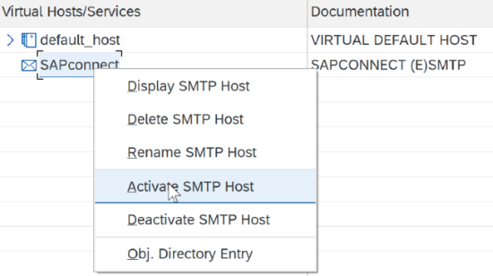

5. Go to SCOT and select SMTP node (double click) as shown below to proceed with configuration:

Add mail host **smtp.office365.com** with port **587**. Check the [Exchange Online docs](/exchange/mail-flow-best-practices/how-to-set-up-a-multifunction-device-or-application-to-send-email-using-microsoft-365-or-office-365#how-to-set-up-smtp-auth-client-submission) for reference.

Click on the "Settings" button (next to the Security field) to add TLS settings and basic authentication details as mentioned in point 2 if required. Make sure your ICM parameter is set accordingly.

Make sure to use a valid Microsoft 365 email ID and password. In addition to that it needs to be the same user that you've enabled for SMTP Auth at the beginning. This email ID will show up as the sender.

Coming back to the previous screen: Click on "Set" button and check "Internet" under "Supported Address Types". Using the wildcard "\*" option will allow to send emails to all domains without restriction.

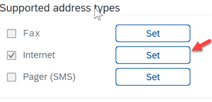

Next Step: set default Domain in SCOT.

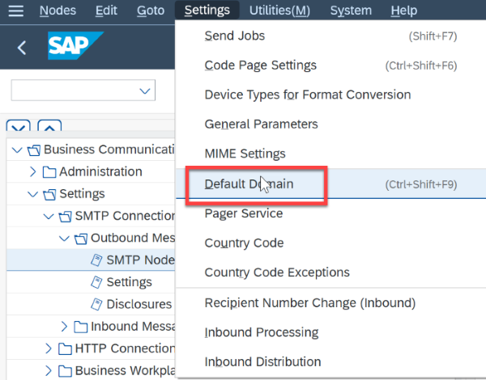

6. Schedule Job to send email to the submission queue. From SCOT select "Send Job":

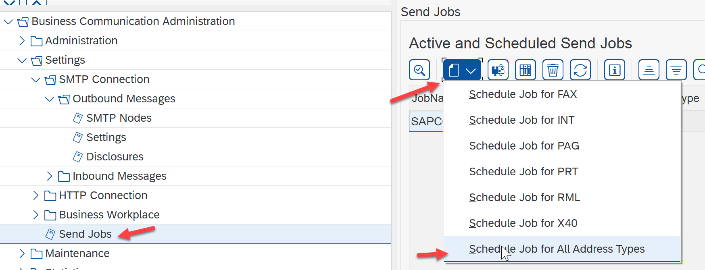

Provide a Job name and variant if appropriate.

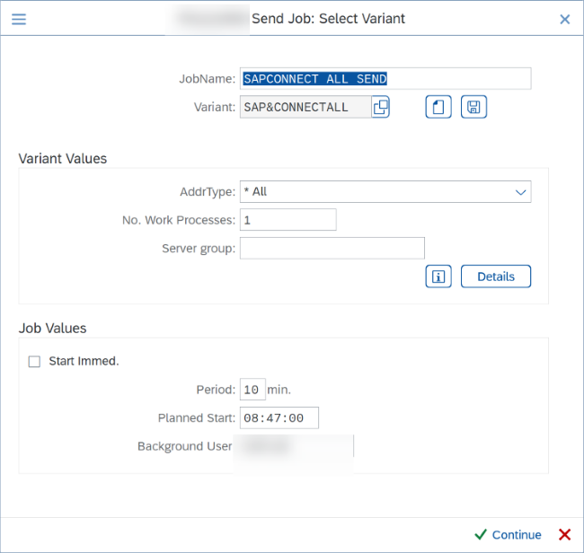

Test mail submission using transaction code SBWP and check the status using SOST transaction.

### Limitations of SMTP AUTH client submission

- SCOT stores login credentials for only one user, so only one Microsoft 365 mailbox can be configured this way. Sending mail via individual SAP users requires to implement the "[Send As permission](/exchange/recipients-in-exchange-online/manage-permissions-for-recipients)" offered by Microsoft 365.
- Microsoft 365 imposes some sending limits. See [Exchange Online limits - Receiving and sending limits](/office365/servicedescriptions/exchange-online-service-description/exchange-online-limits#receiving-and-sending-limits) for more information.

## Option 2: SMTP Direct Send

Microsoft 365 offers the ability to configure [direct send](/exchange/mail-flow-best-practices/how-to-set-up-a-multifunction-device-or-application-to-send-email-using-microsoft-365-or-office-365#option-2-send-mail-directly-from-your-printer-or-application-to-microsoft-365-or-office-365-direct-send) from the SAP application server. This option is limited in that it only permits mail to be routed to addresses in your own Microsoft 365 organization with a valid e-mail address therefore cannot be used for external recipients (e.g., vendors or customers).

## Option 3: Using Microsoft 365 SMTP Relay Connector

Only choose this option when:

-   Your Microsoft 365 environment has SMTP AUTH disabled.
-   SMTP client submission (Option 1) isn't compatible with your business needs or with your SAP Application.
-   You can't use direct send (Option 2) because you must send email to external recipients.

SMTP relay lets Microsoft 365 relay emails on your behalf by using a connector that's configured with your public IP address or a TLS certificate. Compared to the other options, the connector setup increases complexity.

### Requirements for SMTP Relay

- **SAP Parameter**: SAP instance parameter configured and SMTP service are activated as explained in option 1, follow steps 2 to 4 from "Configure SMTP Auth with SCOT" section.
- **Email Address**: Any email address in one of your Microsoft 365 verified domains. This email address doesn't need a mailbox. For example, `noreply@*yourdomain*.com`.
- **Transport Layer Security (TLS)**: SAP application must be able to use TLS version 1.2 and above.
- **Port**: port 25 is required and must be unblocked on your network. Some network firewalls or ISPs block ports, especially port 25 due to the risk of misuse for spamming.
- **MX record**: your MX endpoint, for e.g., yourdomain.mail.protection.outlook.com. Find more information on the next section.
- **Relay Access**: A Public IP address or SSL certificate is required to authenticate against the relay connector. To avoid configuring direct access it's recommended to use Source Network Translation (SNAT) as described in this article. [Use Source Network Address Translation (SNAT) for outbound connections](/azure/load-balancer/load-balancer-outbound-connections).

### Step-by-step configuration instructions for SMTP relay in Microsoft 365

1. Obtain the public (static) IP address of the endpoint which will be sending the mail using one of the methods listed in the [article](/azure/load-balancer/load-balancer-outbound-connections) above. A dynamic IP address isn\'t supported or allowed. You can share your static IP address with other devices and users, but don't share the IP address with anyone outside of your company. Make a note of this IP address for later.

> Find this information on the Azure portal using the Virtual Machine overview of the SAP application server.

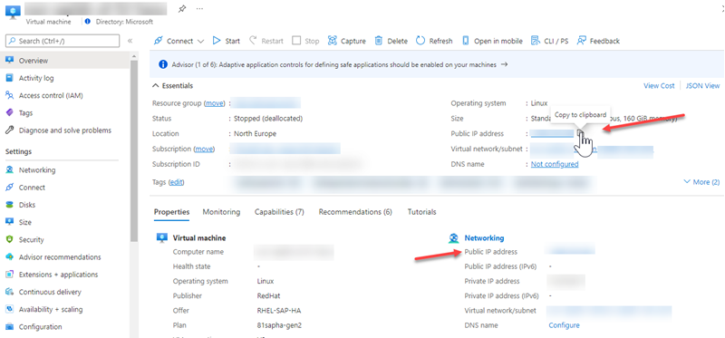

2. Sign in to the [Microsoft 365 Admin Center](https://admin.microsoft.com/).

3. Go to **Settings** -> **Domains**, select your domain (for example, contoso.com), and find the MX record.

The MX record will have data for **Points to address or value** that looks similar to `yourdomain.mail.protection.outlook.com`.

4. Make a note of the data of **Points to address or value** for the MX record, which we refer to as your MX endpoint.

5. In Microsoft 365, select **Admin** and then **Exchange** to go to the new Exchange Admin Center.

6. Choose Mailboxes.

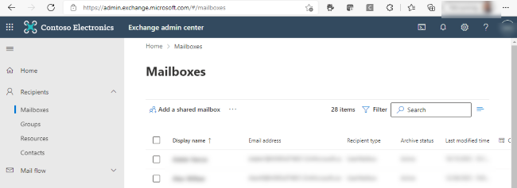

7. In the Exchange Admin Center (EAC), go to **Mail flow** -> **Connectors**. The **Connectors** screen is depicted below. If you are working with the classical EAC follow step 8 as described on our [docs](/exchange/mail-flow-best-practices/how-to-set-up-a-multifunction-device-or-application-to-send-email-using-microsoft-365-or-office-365#step-by-step-configuration-instructions-for-smtp-relay).

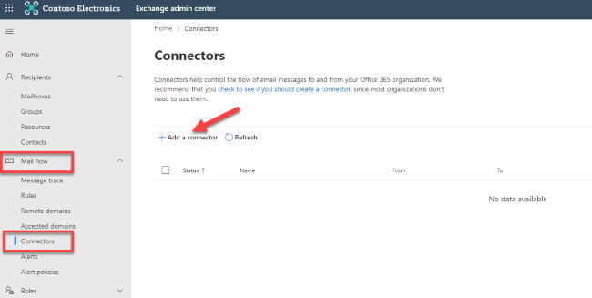

8. Click **Add a connector**

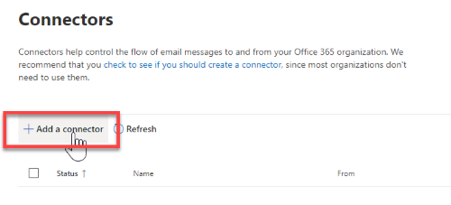

Choose "Your organization's email server".

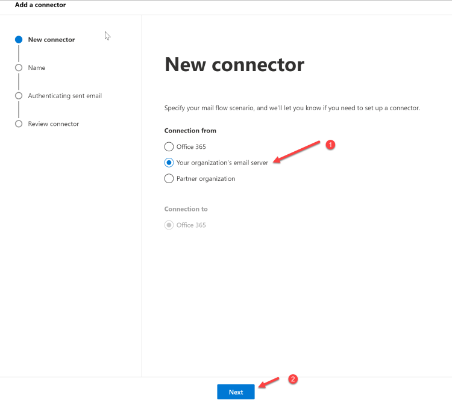

9. Click **Next**. The **Connector name** screen appears.

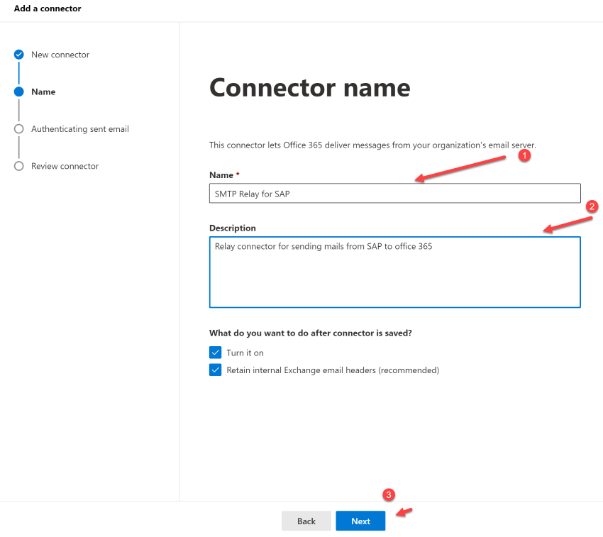

10. Provide a name for the connector and click **Next**. The **Authenticating sent email** screen appears.

Choose *By verifying that the IP address of the sending server matches one of these IP addresses which belong exclusively to your organization* and add the IP address from Step 1 of the **Step-by-step configuration instructions for SMTP relay in Microsoft 365** section.

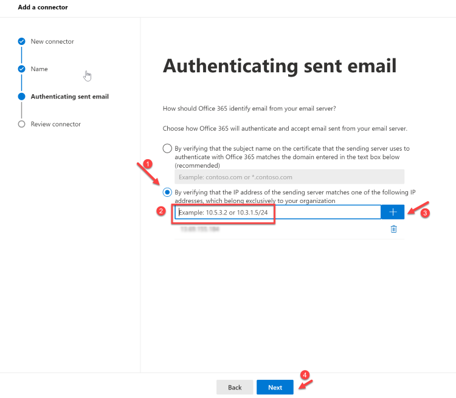

Review and click on **Create connector**.

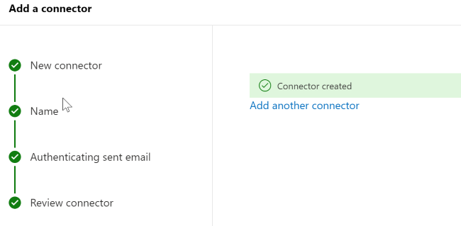

11. Now that you're done with configuring your Microsoft 365 settings, go to your domain registrar's website to update your DNS records. Edit your SPF record. Include the IP address that you noted in step 1. The finished string should look similar to this `v=spf1 ip4:10.5.3.2 include:spf.protection.outlook.com \~all`, where 10.5.3.2 is your public IP address. Skipping this step may cause emails to be flagged as spam and end up in the recipient's Junk Email folder.

### Steps in SAP Application server

1. Make sure SAP ICM Parameter and SMTP service is activated as explained in Option 1 (steps 2-4)
2. Go to SCOT transaction in SMTP node as shown in previous steps of Option 1.
3. Add mail Host as MX record value noted in Step 4 (i.e. yourdomain.mail.protection.outlook.com).

Mail host: yourdomain.mail.protection.outlook.com

Port: 25

4. Click "Settings" next to the Security field and make sure TLS is enabled if possible. Also make sure no prior logon data regarding SMTP AUTH is present. Otherwise delete existing records with the corresponding button underneath.

5. Test the configuration using a test email from your SAP application with transaction SBWP and check the status in SOST transaction.

## Option 4: Using SMTP relay server as intermediary to Exchange Online

Intermediate relay server can be an alternative to a direct connection from the SAP application server to Microsoft 365. This server can be based on any mail server that will allow direct authentication and relay services.

The advantage of this solution is that it can be deployed in the hub of a hub-spoke virtual network within your Azure environment or within a DMZ to protect your SAP application hosts from direct access. It also allows for centralized outbound routing to immediately offload all mail traffic to a central relay when sending from multiple application servers.

The configuration steps are the same as for the Microsoft 365 SMTP Relay Connector (Option 3) with the only differences being that the SCOT configuration should reference the mail host that will perform the relay rather than direct to Microsoft 365. Depending on the mail system that is being used for the relay it will also be configured directly to connect to Microsoft 365 using one of the supported methods and a valid user with password.

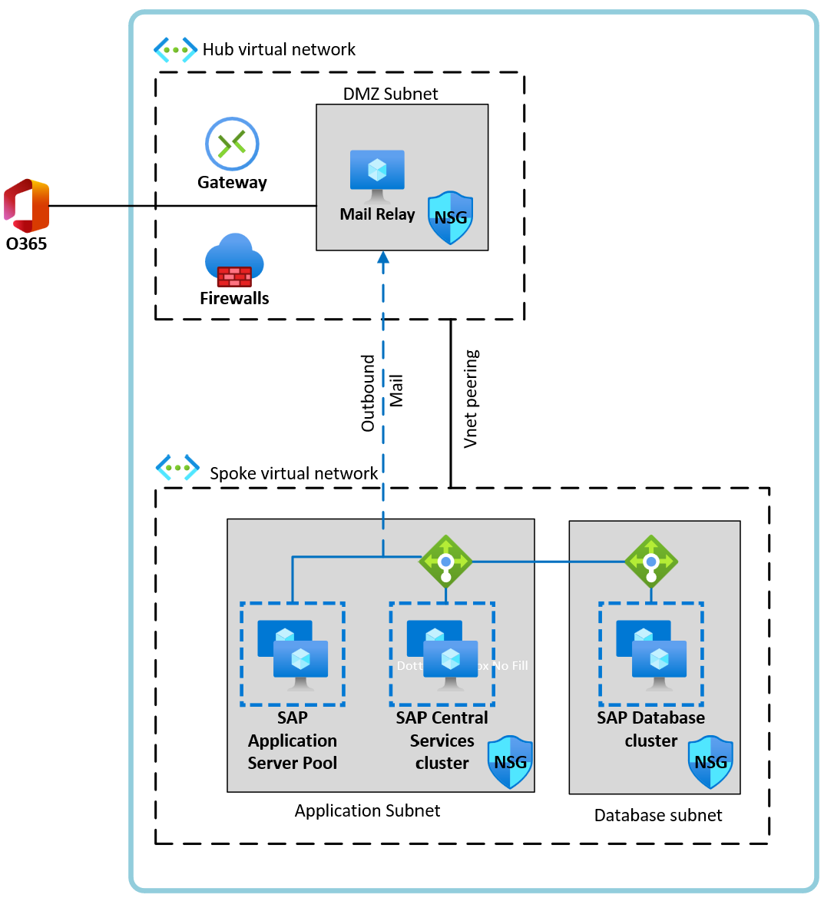

The example architecture shown illustrates multiple SAP application servers with a single mail relay host in the hub. Depending on the volume of mail to be sent it is recommended to follow a detailed sizing guide for the mail vendor to be used as the relay. This may require multiple mail relay hosts which operate with an Azure Load Balancer.

## Next Steps

[Understand mass-mailing with Azure Twilio - SendGrid](https://docs.sendgrid.com/for-developers/partners/microsoft-azure-2021)

[Understand Exchange Online Service limitations (e.g., attachment size, message limits, throttling etc.)](/office365/servicedescriptions/exchange-online-service-description/exchange-online-limits)
