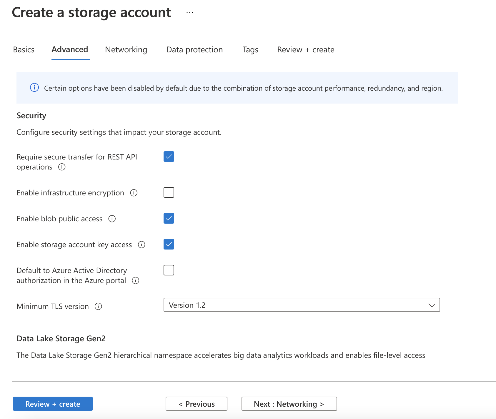
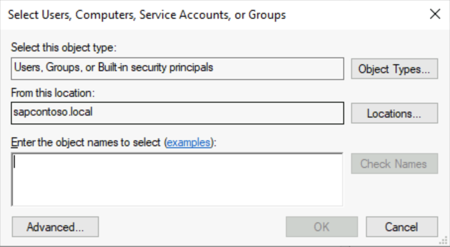
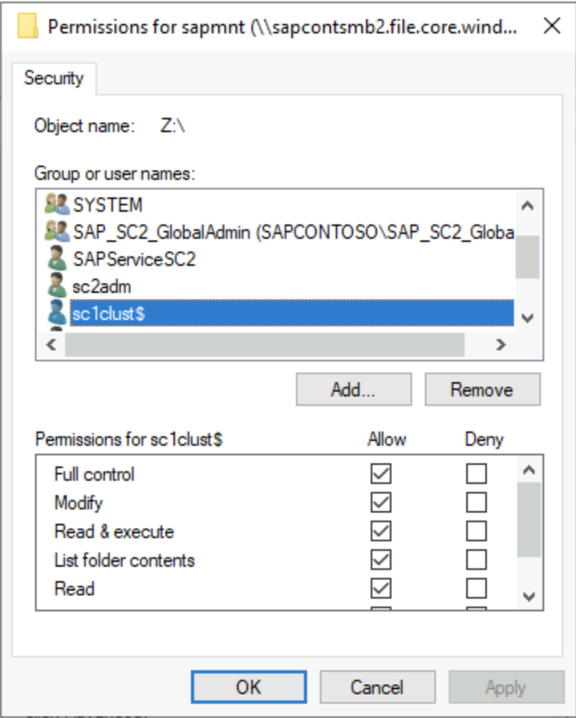

# High availability for SAP NetWeaver on Azure VMs on Windows with Azure Files Premium SMB for SAP applications

[dbms-guide]:dbms-guide.md
[deployment-guide]:deployment-guide.md
[planning-guide]:planning-guide.md
[high-availability-guide]:high-availability-guide.md

[anf-azure-doc]:../../../azure-netapp-files/azure-netapp-files-introduction.md
[anf-avail-matrix]:https://azure.microsoft.com/global-infrastructure/services/?products=storage&regions=all
[anf-register]:https://docs.microsoft.com/azure/azure-netapp-files/azure-netapp-files-register
[anf-sap-applications-azure]:https://www.netapp.com/us/media/tr-4746.pdf

[2205917]:https://launchpad.support.sap.com/#/notes/2205917
[1944799]:https://launchpad.support.sap.com/#/notes/1944799
[1928533]:https://launchpad.support.sap.com/#/notes/1928533
[2015553]:https://launchpad.support.sap.com/#/notes/2015553
[2178632]:https://launchpad.support.sap.com/#/notes/2178632
[2191498]:https://launchpad.support.sap.com/#/notes/2191498
[2243692]:https://launchpad.support.sap.com/#/notes/2243692
[1984787]:https://launchpad.support.sap.com/#/notes/1984787
[1999351]:https://launchpad.support.sap.com/#/notes/1999351
[1410736]:https://launchpad.support.sap.com/#/notes/1410736

[sap-swcenter]:https://support.sap.com/en/my-support/software-downloads.html

[suse-ha-guide]:https://www.suse.com/products/sles-for-sap/resource-library/sap-best-practices/
[suse-drbd-guide]:https://www.suse.com/documentation/sle-ha-12/singlehtml/book_sleha_techguides/book_sleha_techguides.html
[suse-ha-12sp3-relnotes]:https://www.suse.com/releasenotes/x86_64/SLE-HA/12-SP3/

[template-multisid-xscs]:https://portal.azure.com/#create/Microsoft.Template/uri/https%3A%2F%2Fraw.githubusercontent.com%2FAzure%2Fazure-quickstart-templates%2Fmaster%2Fapplication-workloads%2Fsap%2Fsap-3-tier-marketplace-image-multi-sid-xscs-md%2Fazuredeploy.json
[template-converged]:https://portal.azure.com/#create/Microsoft.Template/uri/https%3A%2F%2Fraw.githubusercontent.com%2FAzure%2Fazure-quickstart-templates%2Fmaster%2Fapplication-workloads%2Fsap%2Fsap-3-tier-marketplace-image-converged-md%2Fazuredeploy.json
[template-file-server]:https://portal.azure.com/#create/Microsoft.Template/uri/https%3A%2F%2Fraw.githubusercontent.com%2FAzure%2Fazure-quickstart-templates%2Fmaster%2Fapplication-workloads%2Fsap%2Fsap-file-server-md%2Fazuredeploy.json

[sap-hana-ha]:sap-hana-high-availability.md
[nfs-ha]:high-availability-guide-suse-nfs.md

## Introduction
Azure Files Premium SMB is now fully supported by Microsoft and SAP. **SWPM 1.0 SP32** and **SWPM 2.0 SP09** and above support Azure Files Premium SMB storage.  There are special requirements for sizing Azure Files Premium SMB shares. This documentation contains specific recommendations on how to distribute workload on Azure Files Premium SMB, how to adequately size Azure Files Premium SMB and the minimum installation requirements for Azure Files Premium SMB.

High Availability SAP solutions need a highly available File share for hosting **sapmnt**, **trans** and **interface directories**. Azure Files Premium SMB is a simple Azure PaaS solution for Shared File Systems for SAP on Windows environments. Azure Files Premium SMB can be used in conjunction with Availability Sets and Availability Zones. Azure Files Premium SMB can also be used for Disaster Recovery scenarios to another region.  
 
## Sizing & Distribution of Azure Files Premium SMB for SAP Systems

The following points should be evaluated when planning the deployment of Azure Files Premium SMB:
1. The File share name **sapmnt** can be created once per storage account.  It is possible to create additional SIDs as directories on the same **/sapmnt** share such as - **/sapmnt/\<SID1\>** and **/sapmnt/\<SID2\>** 
2. Choose an appropriate size, IOPS and throughput.  A suggested size for the share is 256GB per SID.  The maximum size for a Share is 5120 GB
3. Azure Files Premium SMB may not perform optimally for very large **sapmnt** shares with more than 1-2 million files per storage account.  Customers that have millions of batch jobs creating millions of job log files should regularly reorganize them as per [SAP Note 16083][16083] If needed, old job logs may be moved/archived to another Azure Files Premium SMB.  If **sapmnt** is expected to be very large then alternate options (such as Azure ANF) should be considered.
4. It is recommended to use a Private Network Endpoint
5. Avoid consolidating too many SIDs to a single storage account and its file share.
6. As general guidance no more than between 2 to 4 non-prod SIDs can be consolidated together.
7. Do not consolidate the entire Development, QAS + Production landscape to one storage account and/or file share.  Failure of the share will lead to downtime of the entire SAP landscape.
8. It is not advisable to consolidate the **sapmnt** and **transport directories** on the same storage account except for very small systems. During the installation of the SAP PAS Instance, SAPInst will request a Transport Hostname.  The FQDN of a different storage account should be entered <storage_account>.file.core.windows.net.
9. Do not consolidate the file system used for Interfaces onto the same storage account as **/sapmnt/\<SID>** 
10. The SAP users/groups must be added to the ‘sapmnt’ share and should have this permission set in the Azure Portal: **Storage File Data SMB Share Elevated Contributor**.

There are important reasons for separating **Transport**, **Interface** and **sapmnt** onto separate storage accounts.  Distributing these components onto separate storage accounts improves throughput, resiliency and simplifies the performance analysis.  If many SIDs and other file systems are consolidated onto a single Azure Files Storage account and the storage account performance is poor due to hitting the throughput limits, it is extremely difficult to identify which SID or application is causing the problem. 

## Planning 
> [!IMPORTANT]
> Installation of SAP High Availability Systems on Azure Files Premium SMB with Active Directory Integration requires cross team collaboration.  It is highly recommended that the Basis Team, the Active Directory Team and the Azure Team work together to complete these tasks: 
>
1. Azure Team – setup and configuration of Storage Account, Script Execution and AD Directory Synchronization.
2. Active Directory Team – Creation of User Accounts and Groups.
3. Basis Team – Run SWPM and set ACLs (if required).

Prerequisites for the installation of SAP NetWeaver High Availability Systems on Azure Files Premium SMB with Active Directory Integration.

1. The SAP servers must be joined to an Active Directory Domain.
2. The Active Directory Domain containing the SAP servers must be replicated to Azure Active Directory using Azure AD connect.
3. It is highly recommended that there is at least one Active Directory Domain controller in the Azure landscape to avoid traversing the Express Route to contact Domain Controllers on-premises.
4. The Azure support team should review the Azure Files SMB with [Active Directory Integration](../../storage/files/storage-files-identity-auth-active-directory-enable#videos) documentation.
5. The user executing the Azure Files PowerShell script must have permission to create objects in Active Directory.
6. **SWPM version 1.0 SP32 and SWPM 2.0 SP09 or higher are required. SAPInst patch must be 749.0.91 or higher.**
7. An up-to-date release of PowerShell should be installed on the Windows Server where the script is executed. 

## Installation Sequence
1. The Active Directory administrator should create in advance 3 Domain users with **Local Administrator** rights and one global group in the **local Windows AD**: **SAPCONT_ADMIN@SAPCONTOSO.local** has Domain Admin rights and is used to run **SAPInst**, **\<sid>adm** and **SAPService\<SID>** as SAP system users and the **SAP_\<SAPSID>_GlobalAdmin** group. The SAP Installation Guide contains the specific details required for these accounts.  **SAP user accounts should not be Domain Administrator**. It is generally recommended **not to use \<sid>adm to run SAPInst**.
2. The Active Directory administrator or Azure Administrator should check **Azure AD Connect** Synchronization Service Manager. By default it takes approximately 30 minutes to replicate to the **Azure Active Directory**. 
3. The Azure administrator should complete the following tasks:
     1. Create a Storage Account with either **Premium ZRS** or **LRS**. Customers with Zonal deployment should choose ZRS. Here the choice between setting up a **Standard** or **Premium Account** needs to be made:
     
     > [!IMPORTANT]
     > For productive use the recommendation is using a **Premium Account**. For non-productive using a **Standard Account** will be sufficient. 
     >
     Here the default settings should be ok.
     In this screen the decision to use a private endpoint is made.
     **Select Private Network Endpoint** for the storage account.
     If required add a DNS A-Record into Windows DNS for the **<storage_account_name>.file.core.windows.net** (this may need to be in a new DNS Zone).  Discuss this topic with the DNS administrator.  The new zone should not update outside of an organization.    
          
     2. Create the **sapmnt** File share with an appropriate size.  The suggested size is 256GB which delivers 650 IOPS, 75 MB/sec Egress and 50 MB/sec Ingress.
      
      
     3. Download the [Azure Files Github](https://docs.microsoft.com/en-us/azure/storage/files/storage-files-identity-ad-ds-enable#download-azfileshybrid-module) content and execute the [script](https://docs.microsoft.com/en-us/azure/storage/files/storage-files-identity-ad-ds-enable#run-join-azstorageaccountforauth).   
     4. This script will create either a Computer Account or Service Account in Active Directory.  The user running the script must have the following properties: 
         * The user running the script must have permission to create objects in the Active Directory Domain containing the SAP servers. Typically, a domain administrator account is used such as **SAPCONT_ADMIN@SAPCONTOSO.local** 
         * Before executing the script confirm that this Active Directory Domain user account is synchronized with Azure Active Directory (AAD).  An example of this would be to open the Azure Portal and navigate to AAD users and check that the user **SAPCONT_ADMIN@SAPCONTOSO.local** exists and verify the AAD user account **SAPCONT_ADMIN@SAPCONTOSO.onmicrosoft.com**.
         * Grant the **Contributor RBAC** role to this Azure Active Directory user account for the Resource Group containing the storage account holding the File Share.  In this example the user **SAPCONT_ADMIN@SAPCONTOSO.onmicrosoft.com** is granted **Contributor Role** to the respective Resource Group 
         * The script should be executed while logged on to a Windows server using an Active Directory Domain user account with the permission as specified above, in this example the account **SAPCONT_ADMIN@SAPCONTOSO.local** would be used.
         >[!IMPORTANT]
         > When executing the PowerShell script command **Connect-AzAccount**, it is highly recommended to enter the Azure Active Directory user account that corresponds and maps to the Active Directory Domain user account used to logon to a Windows Server, in this example this is the user account **SAPCONT_ADMIN@SAPCONTOSO.onmicrosoft.com**
         >
         In this example scenario the Active Directory Administrator would logon to the Windows Server as **SAPCONT_ADMIN@SAPCONTOSO.local** and when using the **PS command Connect-AzAccount** connect as user **SAPCONT_ADMIN@SAPCONTOSO.onmicrosoft.com**.  Ideally the Active Directory Administrator and the Azure Administrator should work together on this task.
   5. Assign SAP users **\<sid>adm**, **SAPService\<SID>** and the **SAP_\<SAPSID>_GlobalAdmin** group to the Azure Files Premium SMB File Share with Role **Storage File Data SMB Share Elevated Contributor** in the Azure Portal 
   6. Check the ACL on the **sapmnt file share** after the installation and add **DOMAIN\CLUSTER_NAME$** account, **DOMAIN\\\<sid>adm**, **DOMAIN\SAPService\<SID>** and the **Group SAP_\<SID>_GlobalAdmin**. These accounts and group **should have full control of sapmnt directory**.

       > [!IMPORTANT]
       > This step must be completed before the SAPInst installation or it will be difficult or impossible to change ACLs after SAPInst has created directories and files on the File Share
       >
       
       The following screenshots show how to add Computer machine accounts by selecting the Object Types -> Computers
       
       The DOMAIN\CLUSTER_NAME$ can be found by selecting “Computers” from the “Object Types”  
       
       
       

   7. [Configure the Azure Standard Load Balancer for the SAP ASCS/ERS Virtual IP(s) with HA Ports](sap-high-availability-infrastructure-wsfc-shared-disk#fe0bd8b5-2b43-45e3-8295-80bee5415716)
   8. If required move the Computer Account created for Azure Files to an Active Directory Container that does not have account expiry.  The name of the Computer Account will be the short name of the storage account 

    

    After correctly running the script the following should appear as “Configured”  
    Storage -> Files Shares “Active Directory: Configured”

    

4. Basis administrator should complete the tasks below:
    1. [Install the Windows Cluster on ASCS/ERS Nodes and add the Cloud witness](sap-high-availability-infrastructure-wsfc-shared-disk.md#0d67f090-7928-43e0-8772-5ccbf8f59aab)
    2. The first Cluster Node installation will ask for the Azure Files SMB storage account name.  Enter the FQDN <storage_account_name>.file.core.windows.net.  If SAPInst does not accept >13 characters then the SWPM version is too old.
    3. [Modify the SAP Profile of the ASCS/SCS Instance](sap-high-availability-installation-wsfc-shared-disk.md#10822f4f-32e7-4871-b63a-9b86c76ce761)
    4. [Update the Probe Port for the SAP \<SID> role in WSFC](sap-high-availability-installation-wsfc-shared-disk.md#10822f4f-32e7-4871-b63a-9b86c76ce761)
    5. Continue with SWPM Installation for the second ASCS/ERS Node. SWPM will only require path of profile directory.  Enter the full UNC path to the profile directory.
    6. Enter the UNC profile path for the DB and PAS/AAS Installation.
    7. PAS Installation will ask for Transport hostname. Provide the FQDN of a separate storage account name for transport directory.
    8. Verify the ACLs on the SID and trans directory.

## Disaster Recovery Setup
Disaster Recovery scenarios or Cross-Region Replication scenarios are supported with Azure Files Premium SMB. All data in Azure Files Premium SMB directories can be continuously synchronized to a DR region storage account using this link. After a Disaster Recovery event and failover of the ASCS instance to the DR region, change the SAPGLOBALHOST profile parameter to the point to Azure Files SMB in the DR region. The same preparation steps should be performed on the DR storage account to join the storage account to Active Directory and assign RBAC roles for SAP users and groups.

## Common Error Messages

## Useful Links & Resources

* SAP Note [2273806][2273806] SAP support for storage or file system related solutions 
* [Install SAP NetWeaver high availability on a Windows failover cluster and file share for SAP ASCS/SCS instances on Azure](./sap-high-availability-installation-wsfc-file-share.md) 
* [Azure Virtual Machines high-availability architecture and scenarios for SAP NetWeaver](./sap-high-availability-architecture-scenarios.md)
* [Add probe port in ASCS cluster configuration](sap-high-availability-installation-wsfc-file-share.md)
* [Installation of an (A)SCS Instance on a Failover Cluster](https://www.sap.com/documents/2017/07/f453332f-c97c-0010-82c7-eda71af511fa.html)

[sap-ha-guide-figure-8007A]:./media/virtual-machines-shared-sap-high-availability-guide/ha-smb-as.png
[16083]:https://launchpad.support.sap.com/#/notes/16083
[2273806]:https://launchpad.support.sap.com/#/notes/2273806
[aad-integration]:../../../azure-netapp-files/azure-netapp-files-introduction.md